# 03-前端工程化

> 前端工程化是指将软件工程的方法论应用于前端开发，通过模块打包、代码分割、依赖管理、质量门禁等工具链，将复杂的前端项目标准化、自动化、可维护化。本文覆盖 Webpack/Vite/Rollup 打包器原理、性能优化策略、包管理体系、代码质量工具及现代前端工具链全貌。

## 相关链接

- 对应面试题：[03-前端工程化面试题](../../02-面试指南/01-前端面试/03-前端工程化面试题.md)
- 前端技术资料目录：[01-前端 README](./)

---

## 目录

1. [模块打包器](#1-模块打包器)
   - 1.1 [Webpack 核心概念](#11-webpack-核心概念)
   - 1.2 [Webpack 构建流程与编译原理](#12-webpack-构建流程与编译原理)
   - 1.3 [Webpack 配置示例](#13-webpack-配置示例)
   - 1.4 [Vite 原理详解](#14-vite-原理详解)
   - 1.5 [Vite vs Webpack 性能对比](#15-vite-vs-webpack-性能对比)
   - 1.6 [Rollup / esbuild / SWC 简介](#16-rollup--esbuild--swc-简介)
2. [性能优化](#2-性能优化)
   - 2.1 [代码分割实战](#21-代码分割实战)
   - 2.2 [Tree Shaking 原理](#22-tree-shaking-原理)
   - 2.3 [资源压缩](#23-资源压缩)
   - 2.4 [缓存策略](#24-缓存策略)
   - 2.5 [Bundle 分析工具](#25-bundle-分析工具)
3. [包管理](#3-包管理)
   - 3.1 [npm / yarn / pnpm 对比](#31-npm--yarn--pnpm-对比)
   - 3.2 [pnpm 硬链接与符号链接机制](#32-pnpm-硬链接与符号链接机制)
   - 3.3 [幽灵依赖问题](#33-幽灵依赖问题)
   - 3.4 [Monorepo 方案对比](#34-monorepo-方案对比)
   - 3.5 [workspace 配置示例](#35-workspace-配置示例)
4. [代码质量](#4-代码质量)
   - 4.1 [ESLint / Prettier 配置](#41-eslint--prettier-配置)
   - 4.2 [TypeScript strict 模式](#42-typescript-strict-模式)
   - 4.3 [Git Hooks 工具链](#43-git-hooks-工具链)
   - 4.4 [CI 质量门禁](#44-ci-质量门禁)
5. [现代前端工具链](#5-现代前端工具链)
   - 5.1 [Babel vs SWC vs esbuild](#51-babel-vs-swc-vs-esbuild)
   - 5.2 [CSS 方案对比](#52-css-方案对比)
   - 5.3 [微前端架构](#53-微前端架构)
6. [2025-2026 构建工具演进](#6-2025-2026-构建工具演进)

---

## 1. 模块打包器

### 1.1 Webpack 核心概念

Webpack 是目前最成熟的 JavaScript 模块打包器，以"一切皆模块"为设计理念。

#### 五大核心概念

| 概念                 | 说明                                                         | 配置键         |
| -------------------- | ------------------------------------------------------------ | -------------- |
| **Entry（入口）**    | 构建依赖图的起点，可以是单入口或多入口                       | `entry`        |
| **Output（输出）**   | 定义打包结果的文件名与存放路径                               | `output`       |
| **Loader（加载器）** | 转换非 JS 文件（CSS/图片/TS 等）为 Webpack 可处理的模块      | `module.rules` |
| **Plugin（插件）**   | 在构建生命周期的特定节点执行更宏观的任务（压缩/注入/分割）   | `plugins`      |
| **Chunk（代码块）**  | Webpack 在内部生成的代码分组单元，最终对应一个或多个输出文件 | —              |

#### Chunk 的三种生成方式

```diagram
1. entry chunk        ─── 由 entry 配置直接产生
2. async chunk        ─── import() 动态导入产生
3. runtime chunk      ─── webpack runtime 代码单独抽出（runtimeChunk: 'single'）
```

#### Loader 执行顺序

Loader 的执行顺序是**从右到左、从下到上**（链式调用）：

```js
// 执行顺序：sass-loader → css-loader → style-loader
module: {
  rules: [
    {
      test: /\.scss$/,
      use: ['style-loader', 'css-loader', 'sass-loader'],
    },
  ],
},
```

#### 常用 Plugin 一览

| Plugin                 | 用途                                              |
| ---------------------- | ------------------------------------------------- |
| `HtmlWebpackPlugin`    | 自动生成 HTML 并注入 script/link 标签             |
| `MiniCssExtractPlugin` | 将 CSS 提取为独立文件（替代 style-loader）        |
| `TerserPlugin`         | JS 代码压缩与混淆                                 |
| `DefinePlugin`         | 在编译期注入全局常量（如 `process.env.NODE_ENV`） |
| `CopyWebpackPlugin`    | 将静态资源原样复制到输出目录                      |
| `BundleAnalyzerPlugin` | 可视化分析 Bundle 组成                            |

---

### 1.2 Webpack 构建流程与编译原理

Webpack 的整个构建流程建立在 **Tapable** 事件流机制上，核心类均继承自 Tapable，通过 `tap` / `tapAsync` / `tapPromise` 注册钩子，实现插件化扩展。

#### Tapable 钩子类型

```diagram
SyncHook          ─ 同步串行，不关心返回值
SyncBailHook      ─ 同步串行，某个返回非 undefined 时停止
SyncWaterfallHook ─ 同步串行，前一个返回值传入下一个
AsyncSeriesHook   ─ 异步串行
AsyncParallelHook ─ 异步并行
```

#### 完整构建流程（ASCII 流程图）

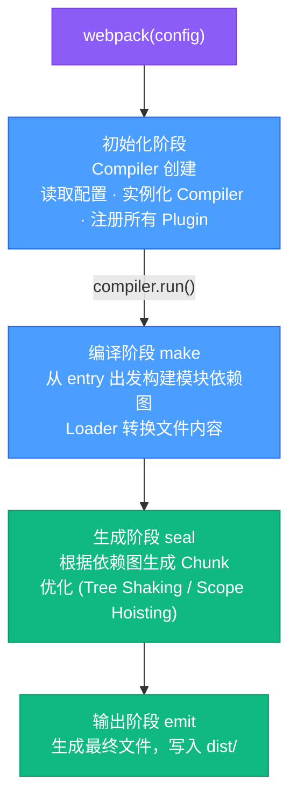

#### 关键钩子时序

```
compiler.hooks.initialize        → 初始化
compiler.hooks.beforeRun         → run 前
compiler.hooks.run               → 开始读取 records
compiler.hooks.beforeCompile     → 编译参数就绪
compiler.hooks.compile           → 创建新 Compilation
compiler.hooks.make              → 从 entry 触发依赖树构建 ★
compilation.hooks.buildModule    → 每个模块开始构建
compilation.hooks.succeedModule  → 模块构建成功
compilation.hooks.finishModules  → 所有模块构建完毕
compilation.hooks.seal           → 开始封装 ★
compilation.hooks.optimizeChunks → Chunk 优化 ★
compiler.hooks.emit              → 写文件前 ★
compiler.hooks.afterEmit         → 写文件后
compiler.hooks.done              → 构建完成
```

---

### 1.3 Webpack 配置示例

#### 生产环境完整配置（含代码分割与懒加载）

```js
// webpack.prod.js
const path = require("path");
const HtmlWebpackPlugin = require("html-webpack-plugin");
const MiniCssExtractPlugin = require("mini-css-extract-plugin");
const TerserPlugin = require("terser-webpack-plugin");
const CssMinimizerPlugin = require("css-minimizer-webpack-plugin");

module.exports = {
  mode: "production",
  entry: {
    main: "./src/index.js",
  },
  output: {
    path: path.resolve(__dirname, "dist"),
    // contenthash：内容不变则 hash 不变，实现长效缓存
    filename: "js/[name].[contenthash:8].js",
    chunkFilename: "js/[name].[contenthash:8].chunk.js",
    clean: true,
  },
  optimization: {
    // 将 webpack runtime 单独抽出，避免污染业务代码 hash
    runtimeChunk: "single",
    splitChunks: {
      chunks: "all", // 对同步+异步 chunk 均生效
      minSize: 20_000, // chunk 最小 20KB 才拆分
      minRemainingSize: 0,
      minChunks: 1, // 被引用至少 1 次才拆分
      maxAsyncRequests: 30,
      maxInitialRequests: 30,
      cacheGroups: {
        // 第三方库单独打包
        vendors: {
          test: /[\\/]node_modules[\\/]/,
          name: "vendors",
          chunks: "all",
          priority: 10,
        },
        // React 相关单独打包
        react: {
          test: /[\\/]node_modules[\\/](react|react-dom|react-router)[\\/]/,
          name: "react-vendor",
          chunks: "all",
          priority: 20,
        },
        // 公共业务代码
        common: {
          minChunks: 2,
          name: "common",
          chunks: "all",
          priority: 5,
          reuseExistingChunk: true,
        },
      },
    },
    minimizer: [
      new TerserPlugin({
        parallel: true, // 多进程并行压缩
        terserOptions: {
          compress: { drop_console: true },
        },
      }),
      new CssMinimizerPlugin(),
    ],
  },
  plugins: [
    new HtmlWebpackPlugin({ template: "./public/index.html" }),
    new MiniCssExtractPlugin({
      filename: "css/[name].[contenthash:8].css",
    }),
  ],
  module: {
    rules: [
      {
        test: /\.[jt]sx?$/,
        exclude: /node_modules/,
        use: {
          loader: "babel-loader",
          options: { cacheDirectory: true },
        },
      },
      {
        test: /\.scss$/,
        use: [MiniCssExtractPlugin.loader, "css-loader", "sass-loader"],
      },
      {
        test: /\.(png|jpg|gif|svg)$/i,
        type: "asset", // webpack5 内置 Asset Modules
        parser: { dataUrlCondition: { maxSize: 8_192 } }, // <8KB 转 base64
      },
    ],
  },
};
```

#### 动态导入（Lazy Loading）示例

```js
// 路由级懒加载（React Router v6）
import { lazy, Suspense } from "react";
import { Routes, Route } from "react-router-dom";

const Dashboard = lazy(
  () => import(/* webpackChunkName: "dashboard" */ "./pages/Dashboard"),
);
const Settings = lazy(
  () => import(/* webpackChunkName: "settings" */ "./pages/Settings"),
);

function App() {
  return (
    <Suspense fallback={<div>Loading...</div>}>
      <Routes>
        <Route path="/dashboard" element={<Dashboard />} />
        <Route path="/settings" element={<Settings />} />
      </Routes>
    </Suspense>
  );
}
```

#### Webpack 5 Module Federation（微前端）

```js
// host app webpack.config.js
const { ModuleFederationPlugin } = require("webpack").container;

new ModuleFederationPlugin({
  name: "host",
  remotes: {
    // 运行时从远程加载
    remoteApp: "remoteApp@https://cdn.example.com/remoteEntry.js",
  },
  shared: {
    react: { singleton: true, requiredVersion: "^18.0.0" },
    "react-dom": { singleton: true, requiredVersion: "^18.0.0" },
  },
});
```

---

### 1.4 Vite 原理详解

Vite 由 Evan You 创建，利用浏览器原生 ES Module 特性彻底改变了开发服务器的工作方式。

#### 架构分层

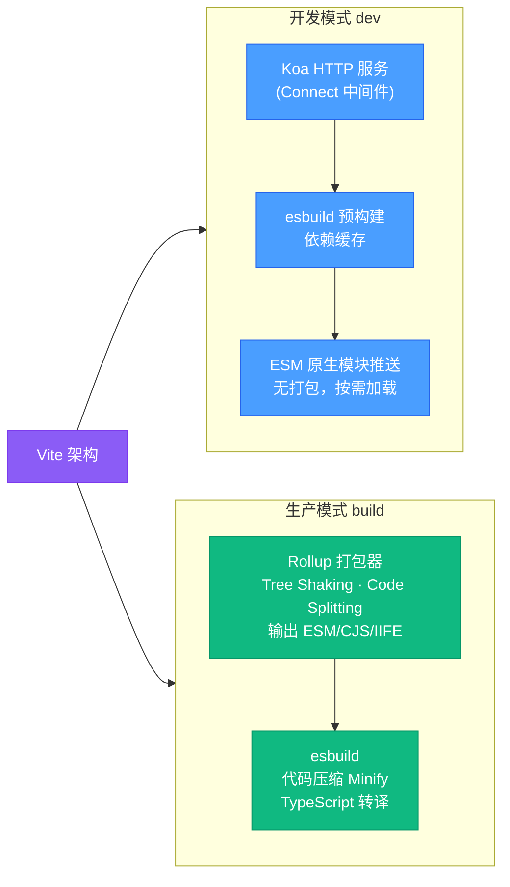

#### 开发模式工作原理

**1. 依赖预构建（Pre-bundling）**

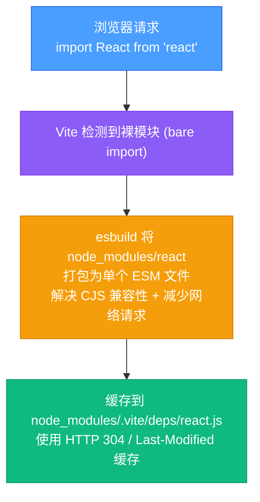

**2. 按需编译（On-demand Compilation）**

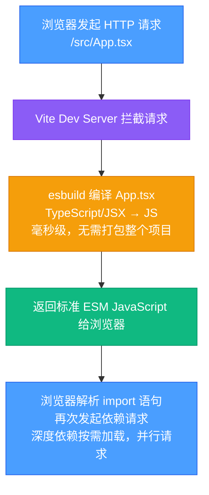

**3. HMR（热模块替换）精确更新**

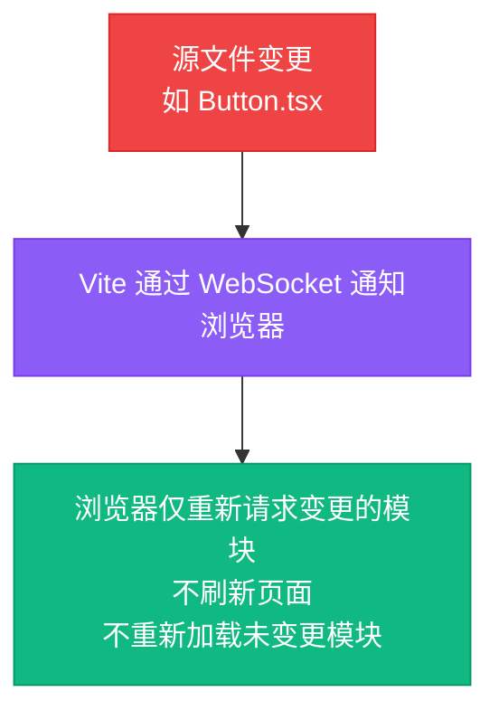

#### Vite 配置示例

```ts
// vite.config.ts
import { defineConfig } from "vite";
import react from "@vitejs/plugin-react";

export default defineConfig({
  plugins: [react()],
  build: {
    rollupOptions: {
      output: {
        manualChunks: {
          "react-vendor": ["react", "react-dom"],
          router: ["react-router-dom"],
        },
      },
    },
    chunkSizeWarningLimit: 500,
  },
  optimizeDeps: {
    // 强制预构建指定依赖
    include: ["lodash-es", "date-fns"],
  },
  server: {
    port: 3000,
    proxy: {
      "/api": {
        target: "http://localhost:8080",
        changeOrigin: true,
      },
    },
  },
});
```

---

### 1.5 Vite vs Webpack 性能对比

| 维度                  | Webpack 5               | Vite 5                                     |
| --------------------- | ----------------------- | ------------------------------------------ |
| **冷启动速度**        | 慢（需完整构建依赖图）  | 极快（仅预构建 node_modules）              |
| **HMR 速度**          | 随项目增大而变慢        | 始终极快（模块级精确更新）                 |
| **生产构建**          | 成熟稳定，生态丰富      | 基于 Rollup，产物更小                      |
| **配置复杂度**        | 高（灵活但复杂）        | 低（约定优于配置）                         |
| **浏览器兼容性**      | 支持 IE11（通过 babel） | 默认不支持 IE（可借助插件）                |
| **生态插件**          | 极丰富（历史沉淀）      | 快速增长（兼容 Rollup 插件）               |
| **SSR 支持**          | 需手动配置              | 内置支持                                   |
| **Module Federation** | 原生支持（webpack 5）   | 需插件（@originjs/vite-plugin-federation） |
| **底层编译器**        | 自身（acorn AST）       | esbuild（Go 实现，10-100x 更快）           |
| **大型项目稳定性**    | ★★★★★                   | ★★★★☆                                      |
| **构建产物精细控制**  | ★★★★★                   | ★★★★☆                                      |

> **选型建议**：新项目、React/Vue SPA 首选 Vite；需要 IE 兼容、Module Federation、高度定制化构建流程的大型企业项目选 Webpack。

---

### 1.6 Rollup / esbuild / SWC 简介

#### Rollup

```
定位：专注于 ES Module 库打包，生成更精简的产物
优势：
  - 天然支持 Tree Shaking（先于 Webpack 实现）
  - 支持多输出格式（ESM / CJS / UMD / IIFE）
  - 产物体积小，无 runtime wrapper
适用场景：
  - 打包工具库、组件库（如 React、Vue 本身用 Rollup 打包）
  - Vite 生产构建底层使用 Rollup
```

#### esbuild

```
定位：用 Go 语言编写的极速 JS/TS 打包与转译工具
速度：比 Webpack 快 10-100 倍
优势：
  - 内置 TypeScript / JSX 支持
  - 支持 Tree Shaking 和 Code Splitting
  - 可作为 Loader 替代 Babel
局限：
  - 不支持部分高级 Babel 插件（如装饰器旧版规范）
  - 代码压缩产物与 Terser 略有差异
适用场景：
  - Vite 开发模式底层编译器
  - CI 构建加速（替代 ts-loader / babel-loader）
```

#### SWC

```
定位：用 Rust 编写的 JS/TS 编译器
速度：比 Babel 快 20-70 倍（单核），并行 70x
功能：
  - 完整的 Babel 转译替代（含装饰器）
  - 内置 Minifier（替代 Terser）
  - 支持 React/TypeScript/JSX
适用场景：
  - Next.js 13+ 默认编译器
  - 替代 Webpack + Babel 中的 babel-loader
```

| 工具    | 语言 | 定位          | 速度       | 生态  |
| ------- | ---- | ------------- | ---------- | ----- |
| Webpack | JS   | 全能打包器    | ★★☆        | ★★★★★ |
| Rollup  | JS   | 库打包器      | ★★★        | ★★★★☆ |
| esbuild | Go   | 极速编译/打包 | ★★★★★      | ★★★☆☆ |
| SWC     | Rust | 极速转译/压缩 | ★★★★★      | ★★★★☆ |
| Vite    | JS   | 开发服务器    | ★★★★★(dev) | ★★★★☆ |

---

## 2. 性能优化

### 2.1 代码分割实战

代码分割（Code Splitting）让浏览器只加载当前页面所需的代码，减少首屏加载时间。

#### 三种方式


#### React.lazy + Suspense 路由懒加载

```tsx
// src/router/index.tsx
import { lazy, Suspense } from "react";
import { createBrowserRouter, RouterProvider } from "react-router-dom";
import LoadingSpinner from "@/components/LoadingSpinner";

// 各路由组件懒加载
const Home = lazy(() => import("@/pages/Home"));
const UserList = lazy(() => import("@/pages/UserList"));
const UserDetail = lazy(() => import("@/pages/UserDetail"));

// 带预加载的懒加载组件
const prefetchDashboard = () => import("@/pages/Dashboard");
const Dashboard = lazy(prefetchDashboard);

// 鼠标悬停时触发预加载
function NavLink() {
  return (
    <a
      href="/dashboard"
      onMouseEnter={prefetchDashboard} // 预加载
    >
      Dashboard
    </a>
  );
}

const router = createBrowserRouter([
  {
    path: "/",
    element: (
      <Suspense fallback={<LoadingSpinner />}>
        <Home />
      </Suspense>
    ),
  },
  {
    path: "/users",
    element: (
      <Suspense fallback={<LoadingSpinner />}>
        <UserList />
      </Suspense>
    ),
  },
]);

export default function App() {
  return <RouterProvider router={router} />;
}
```

#### 动态 import 的 Magic Comments

```js
// webpackChunkName：指定 chunk 名称
const Chart = await import(
  /* webpackChunkName: "chart" */
  /* webpackPrefetch: true */ // 空闲时预加载（link rel="prefetch"）
  "./components/Chart"
);

// webpackPreload：当前路由需要时立即加载（link rel="preload"）
const HeavyLib = await import(
  /* webpackPreload: true */
  "./utils/heavy-computation"
);
```

---

### 2.2 Tree Shaking 原理

Tree Shaking 是"摇树"优化，消除 bundle 中未被引用的"死代码"（dead code）。

#### ESM 静态分析 vs CJS 动态引用


#### 触发 Tree Shaking 的条件

```
1. 使用 ESM 语法（import/export）
2. package.json 中声明 "sideEffects": false
   （或列出有副作用的文件数组）
3. Webpack mode: 'production' 或 optimization.usedExports: true
4. 避免在模块顶层执行有副作用的代码
```

#### sideEffects 配置

```json
// package.json
{
  "sideEffects": [
    "*.css", // CSS 文件有副作用（修改全局样式）
    "*.scss",
    "./src/polyfills.js"
  ]
}
```

```js
// 标记纯函数（no side effects）
export const pure = /*#__PURE__*/ createHelper();
// Webpack/Rollup 会将未引用的 pure 调用移除
```

---

### 2.3 资源压缩

#### JavaScript 压缩（Terser）

```js
// webpack.config.js
const TerserPlugin = require('terser-webpack-plugin');

optimization: {
  minimizer: [
    new TerserPlugin({
      parallel: true,
      terserOptions: {
        compress: {
          drop_console: true,     // 删除 console.*
          drop_debugger: true,    // 删除 debugger
          pure_funcs: ['console.info', 'console.debug'],
          passes: 2,              // 多轮压缩（更小但更慢）
        },
        mangle: { safari10: true },
        format: { comments: false },
      },
      extractComments: false,
    }),
  ],
},
```

#### 图片优化策略

| 格式     | 适用场景                     | 压缩建议                         |
| -------- | ---------------------------- | -------------------------------- |
| **WebP** | 通用图片（替代 JPEG/PNG）    | 比 JPEG 小 25-35%                |
| **AVIF** | 新型格式，压缩率最高         | 比 WebP 小 50%                   |
| **SVG**  | 图标/矢量图                  | 使用 svgo 压缩                   |
| **PNG**  | 透明背景                     | pngquant（有损）/ oxipng（无损） |
| **GIF**  | 动画（考虑替换为 WebP/AVIF） | 转 WebP 动画                     |

```html
<!-- 现代图片格式降级策略 -->
<picture>
  <source srcset="image.avif" type="image/avif" />
  <source srcset="image.webp" type="image/webp" />
  
</picture>
```

---

### 2.4 缓存策略

#### Content Hash 长效缓存

```
文件内容不变 → hash 不变 → 浏览器使用缓存
文件内容改变 → hash 改变 → 浏览器重新下载

输出文件示例：
  main.a3f8c1d2.js        ← 业务代码（频繁变化）
  vendors.b2e7f9a1.js     ← 第三方库（稳定）
  react-vendor.c9d4e5b3.js ← React（很少变化）
  runtime.d1e2f3a4.js     ← Webpack runtime（很小）
```

#### HTTP 缓存配置（Nginx）

```nginx
# 带 hash 的静态资源：永久缓存
location ~* \.(js|css|png|jpg|gif|ico|woff2)$ {
    if ($uri ~* "\.[0-9a-f]{8}\.") {
        expires 1y;
        add_header Cache-Control "public, immutable";
    }
}

# HTML 文件：不缓存（确保总是获取最新入口）
location ~* \.html$ {
    expires -1;
    add_header Cache-Control "no-cache, no-store, must-revalidate";
}
```

#### CDN 缓存策略

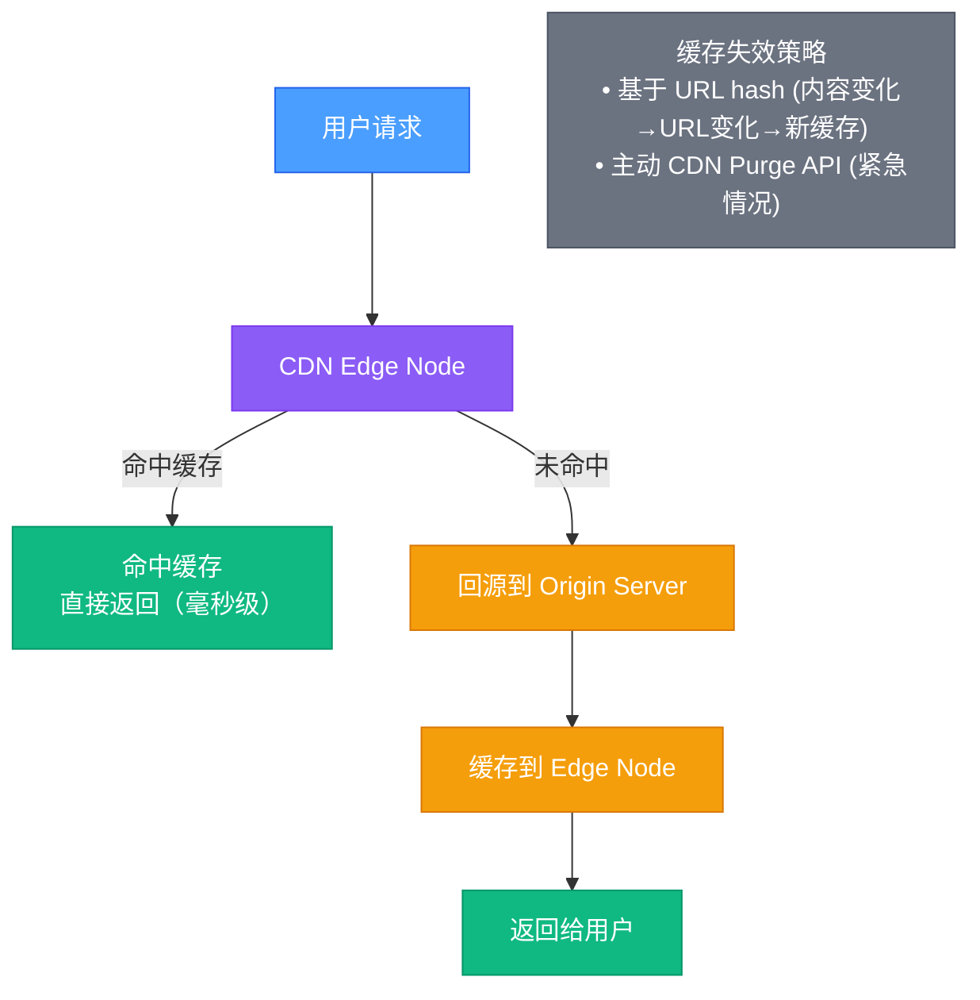

---

### 2.5 Bundle 分析工具

#### webpack-bundle-analyzer

```js
// webpack.config.js
const { BundleAnalyzerPlugin } = require('webpack-bundle-analyzer');

plugins: [
  new BundleAnalyzerPlugin({
    analyzerMode: process.env.ANALYZE ? 'server' : 'disabled',
    reportFilename: 'bundle-report.html',
    openAnalyzer: true,
  }),
],
```

```bash
# 启动分析
ANALYZE=true npm run build
# 在浏览器打开可视化 treemap，识别大包
```

#### 常见问题定位

```
问题：vendors chunk 过大（> 1MB gzipped）
解法：
  1. 检查是否引入了完整的 lodash（应使用 lodash-es 或按需引入）
  2. 将大型库（echarts/antd）配置到单独 cacheGroup
  3. 使用 moment.js → day.js 替代（缩小 80%）

问题：重复模块
解法：
  - 使用 npm dedupe / yarn dedupe 消除重复安装
  - webpack ModuleConcatenationPlugin（作用域提升）

问题：Source Map 泄露
解法：
  - 生产环境使用 hidden-source-map（不在 JS 中引用）
  - 将 source map 上传到 Sentry，不对外暴露
```

---

## 3. 包管理

### 3.1 npm / yarn / pnpm 对比

| 特性          | npm v8+           | Yarn Berry (v3+)     | pnpm v8            |
| ------------- | ----------------- | -------------------- | ------------------ |
| **安装速度**  | 中                | 快（PnP 模式极快）   | 最快（硬链接复用） |
| **磁盘占用**  | 大（每项目独立）  | 中（ZIP 缓存）       | 最小（全局硬链接） |
| **幽灵依赖**  | 存在              | PnP 模式解决         | 严格解决           |
| **lockfile**  | package-lock.json | yarn.lock            | pnpm-lock.yaml     |
| **workspace** | 支持              | 支持（更完善）       | 支持（最完善）     |
| **安全性**    | 一般              | 高（PnP 隔离）       | 高（符号链接隔离） |
| **兼容性**    | 最佳              | 需配置（PnP 模式）   | 好                 |
| **Monorepo**  | 支持但弱          | 强（workspace 协议） | 最强（过滤执行）   |

---

### 3.2 pnpm 硬链接与符号链接机制

pnpm 通过**全局内容寻址存储（CAS）+ 硬链接 + 符号链接**，在保证隔离性的同时最大化复用磁盘空间。

#### 存储架构（ASCII 图解）


#### 关键机制说明

```
硬链接（Hard Link）：
  - 同一文件系统中指向相同 inode 的多个目录项
  - react 18.2.0 的 index.js 在100个项目中安装，磁盘只存一份
  - 删除任意一个硬链接，文件依然存在

符号链接（Symbolic Link）：
  - 指向另一个路径的快捷方式
  - node_modules/react → .pnpm/react@18.2.0/node_modules/react
  - Node.js 解析模块时会跟随符号链接

严格隔离优势：
  - 未在 dependencies 声明的包不会出现在顶层 node_modules
  - 彻底解决幽灵依赖问题
  - 不同版本的同一包可以同时存在（react@17 和 react@18）
```

---

### 3.3 幽灵依赖问题

**幽灵依赖（Phantom Dependency）** 是指在代码中使用了未在 `package.json` 中声明的依赖包。

#### 问题复现（npm/yarn 扁平化布局）

```diagram
package.json dependencies:
  "express": "^4.18.0"

npm install 后 node_modules/ 结构（扁平化）：
  node_modules/
  ├── express/
  ├── body-parser/    ← express 的依赖，被提升到顶层！
  ├── accepts/        ← 幽灵依赖
  └── mime-types/     ← 幽灵依赖

// 开发者错误地直接使用了这些包
import bodyParser from 'body-parser';  // ✗ 未在 package.json 声明
// 某天 express 升级，不再依赖 body-parser → 代码崩溃
```

#### pnpm 的解决方式

```diagram
pnpm install 后 node_modules/ 结构（严格模式）：
  node_modules/
  ├── express  → .pnpm/express@4.18.0/node_modules/express（符号链接）
  └── .pnpm/
      ├── express@4.18.0/node_modules/
      │   ├── express/          ← 真实包
      │   ├── body-parser/      ← 只在此处可见
      │   └── accepts/
      └── ...

import bodyParser from 'body-parser';  // ✗ 报错！找不到包
// 强制开发者显式声明依赖 → 构建更可靠
```

---

### 3.4 Monorepo 方案对比

| 特性         | Turborepo               | Nx                        | Lerna v7   |
| ------------ | ----------------------- | ------------------------- | ---------- |
| **构建缓存** | 本地+远程缓存（Vercel） | 本地+远程缓存（Nx Cloud） | 无内置缓存 |
| **任务并行** | ✓ 智能拓扑排序          | ✓ 依赖感知                | ✓ 基础支持 |
| **增量构建** | ✓（基于文件 hash）      | ✓（Affected 命令）        | ✗          |
| **代码生成** | ✗                       | ✓（generators）           | ✗          |
| **框架无关** | ✓                       | 偏向 Angular/React        | ✓          |
| **学习曲线** | 低                      | 高                        | 低         |
| **适用规模** | 中小                    | 大型企业                  | 中小       |

---

### 3.5 workspace 配置示例

#### pnpm workspace 配置

```yaml
# pnpm-workspace.yaml
packages:
  - "packages/*"
  - "apps/*"
  - "!**/__tests__/**"
```

```json
// packages/ui/package.json
{
  "name": "@myorg/ui",
  "version": "1.0.0",
  "main": "./dist/index.js",
  "exports": {
    ".": {
      "import": "./dist/index.esm.js",
      "require": "./dist/index.cjs.js"
    }
  }
}
```

```json
// apps/web/package.json
{
  "name": "@myorg/web",
  "dependencies": {
    "@myorg/ui": "workspace:*" // workspace 协议：引用本地包
  }
}
```

#### Turborepo 配置

```json
// turbo.json
{
  "$schema": "https://turbo.build/schema.json",
  "pipeline": {
    "build": {
      "dependsOn": ["^build"], // 先构建所有依赖包
      "outputs": ["dist/**", ".next/**"],
      "cache": true
    },
    "test": {
      "dependsOn": ["build"],
      "outputs": ["coverage/**"],
      "cache": true
    },
    "lint": {
      "outputs": [],
      "cache": true
    },
    "dev": {
      "cache": false,
      "persistent": true
    }
  }
}
```

```bash
# 只构建受影响的包
turbo run build --filter=...[HEAD^1]

# 并行运行所有包的 test
turbo run test --parallel

# 远程缓存（Vercel）
turbo login
turbo link
```

---

## 4. 代码质量

### 4.1 ESLint / Prettier 配置

#### ESLint 扁平配置（ESLint v9 新格式）

```js
// eslint.config.js
import js from "@eslint/js";
import tsPlugin from "@typescript-eslint/eslint-plugin";
import tsParser from "@typescript-eslint/parser";
import reactPlugin from "eslint-plugin-react";
import reactHooksPlugin from "eslint-plugin-react-hooks";
import importPlugin from "eslint-plugin-import";

export default [
  js.configs.recommended,
  {
    files: ["**/*.{ts,tsx}"],
    languageOptions: {
      parser: tsParser,
      parserOptions: {
        project: "./tsconfig.json",
        ecmaFeatures: { jsx: true },
      },
    },
    plugins: {
      "@typescript-eslint": tsPlugin,
      react: reactPlugin,
      "react-hooks": reactHooksPlugin,
      import: importPlugin,
    },
    rules: {
      // TypeScript
      "@typescript-eslint/no-explicit-any": "warn",
      "@typescript-eslint/explicit-function-return-type": "off",
      "@typescript-eslint/no-unused-vars": [
        "error",
        { argsIgnorePattern: "^_" },
      ],
      // React
      "react-hooks/rules-of-hooks": "error",
      "react-hooks/exhaustive-deps": "warn",
      // Import 顺序
      "import/order": [
        "error",
        {
          groups: ["builtin", "external", "internal", "parent", "sibling"],
          "newlines-between": "always",
        },
      ],
    },
  },
  {
    ignores: ["dist/**", "node_modules/**", "*.min.js"],
  },
];
```

#### Prettier 配置

```json
// .prettierrc
{
  "semi": true,
  "singleQuote": true,
  "printWidth": 100,
  "tabWidth": 2,
  "trailingComma": "es5",
  "bracketSpacing": true,
  "arrowParens": "avoid",
  "endOfLine": "lf"
}
```

```json
// .prettierignore
dist
node_modules
*.min.js
pnpm-lock.yaml
```

---

### 4.2 TypeScript strict 模式

```json
// tsconfig.json
{
  "compilerOptions": {
    // strict 等效于开启以下所有选项
    "strict": true,
    // strict 包含的选项（显式列出便于理解）：
    "strictNullChecks": true, // null/undefined 不能赋给其他类型
    "strictFunctionTypes": true, // 函数参数逆变检查
    "strictBindCallApply": true, // bind/call/apply 严格类型检查
    "strictPropertyInitialization": true, // 类属性必须在构造函数中初始化
    "noImplicitAny": true, // 禁止隐式 any
    "noImplicitThis": true, // 禁止隐式 this
    "alwaysStrict": true, // 每个文件注入 "use strict"
    "useUnknownInCatchVariables": true, // catch 变量默认为 unknown

    // 额外推荐开启
    "noUncheckedIndexedAccess": true, // 数组/对象索引访问返回 T | undefined
    "exactOptionalPropertyTypes": true, // 可选属性不允许显式赋 undefined
    "noImplicitReturns": true, // 所有代码路径必须有返回值
    "noFallthroughCasesInSwitch": true, // switch case 禁止 fallthrough

    "target": "ES2022",
    "module": "ESNext",
    "moduleResolution": "bundler",
    "jsx": "react-jsx",
    "baseUrl": ".",
    "paths": {
      "@/*": ["src/*"]
    }
  }
}
```

---

### 4.3 Git Hooks 工具链

#### 工具链架构

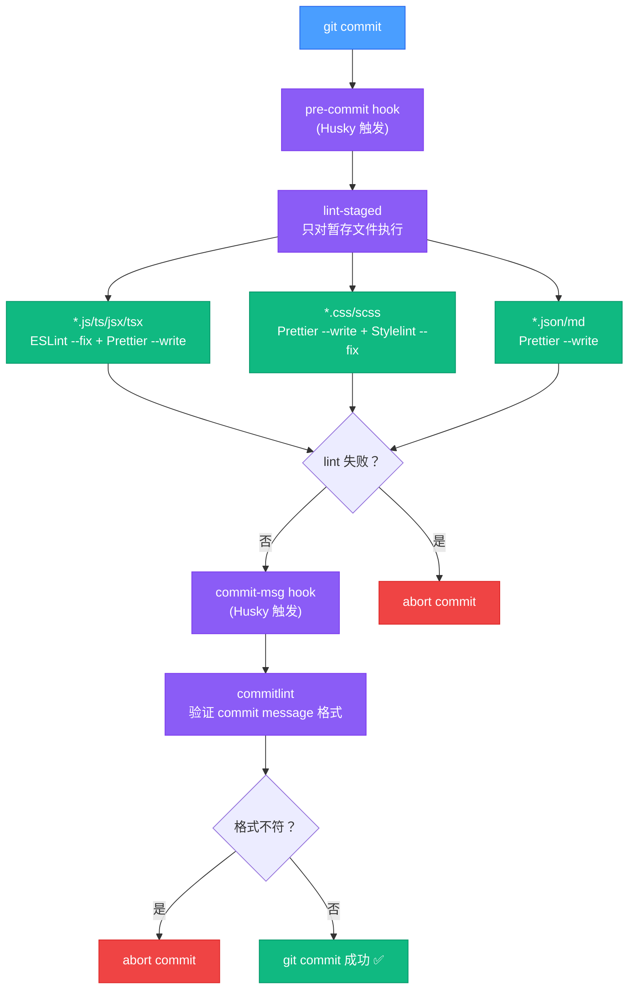

#### 完整配置

```bash
# 安装依赖
pnpm add -D husky lint-staged @commitlint/cli @commitlint/config-conventional
npx husky init
```

```json
// package.json
{
  "scripts": {
    "prepare": "husky"
  },
  "lint-staged": {
    "*.{js,jsx,ts,tsx}": ["eslint --fix --max-warnings=0", "prettier --write"],
    "*.{css,scss,less}": ["prettier --write"],
    "*.{json,md,yaml,yml}": ["prettier --write"]
  }
}
```

```js
// commitlint.config.js
export default {
  extends: ["@commitlint/config-conventional"],
  rules: {
    "type-enum": [
      2,
      "always",
      [
        "feat", // 新功能
        "fix", // 修复 bug
        "docs", // 文档变更
        "style", // 代码格式（不影响功能）
        "refactor", // 重构
        "perf", // 性能优化
        "test", // 测试
        "chore", // 构建/依赖更新
        "revert", // 回滚
        "ci", // CI 配置
      ],
    ],
    "subject-max-length": [2, "always", 72],
    "subject-case": [0], // 不限制大小写
  },
};
```

```bash
# .husky/pre-commit
#!/bin/sh
. "$(dirname "$0")/_/husky.sh"
npx lint-staged

# .husky/commit-msg
#!/bin/sh
. "$(dirname "$0")/_/husky.sh"
npx --no-install commitlint --edit "$1"
```

---

### 4.4 CI 质量门禁

```yaml
# .github/workflows/quality-gate.yml
name: Quality Gate

on:
  pull_request:
    branches: [main, develop]
  push:
    branches: [main]

jobs:
  quality:
    runs-on: ubuntu-latest
    steps:
      - uses: actions/checkout@v4
        with:
          fetch-depth: 0 # 完整历史，用于 SonarQube

      - uses: pnpm/action-setup@v4
        with:
          version: 9

      - uses: actions/setup-node@v4
        with:
          node-version: 20
          cache: "pnpm"

      - name: Install dependencies
        run: pnpm install --frozen-lockfile

      - name: TypeScript type check
        run: pnpm tsc --noEmit

      - name: ESLint
        run: pnpm eslint . --max-warnings=0

      - name: Unit tests with coverage
        run: pnpm test --coverage --reporter=lcov

      - name: Coverage threshold check
        run: |
          # 要求 80% 行覆盖率
          COVERAGE=$(cat coverage/lcov-report/index.html | grep -o '[0-9.]*%' | head -1)
          echo "Coverage: $COVERAGE"

      - name: Build check
        run: pnpm build

      - name: Bundle size check
        run: pnpm build && npx bundlesize
        # bundlesize.config.json 中定义每个 chunk 的大小限制
```

```json
// bundlesize.config.json
{
  "files": [
    {
      "path": "./dist/js/main.*.js",
      "maxSize": "200 kB" // gzip 后不超过 200KB
    },
    {
      "path": "./dist/js/vendors.*.js",
      "maxSize": "300 kB"
    }
  ]
}
```

---

## 5. 现代前端工具链

### 5.1 Babel vs SWC vs esbuild

#### 转译对比

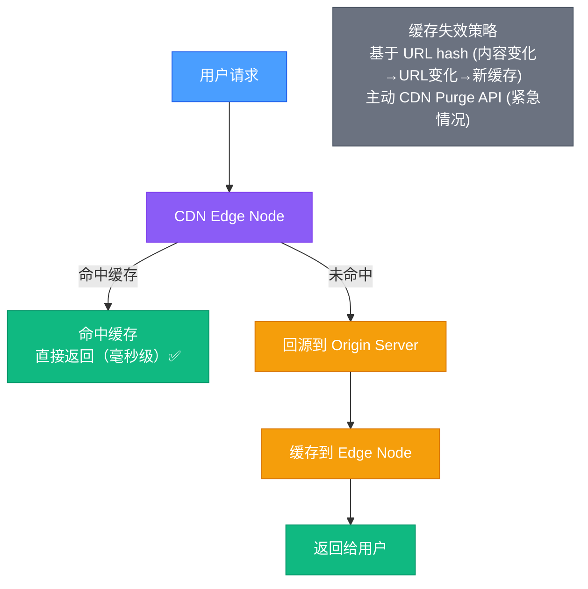

| 能力           | Babel                | SWC            | esbuild         |
| -------------- | -------------------- | -------------- | --------------- |
| TypeScript     | ✓（仅类型擦除）      | ✓              | ✓（仅类型擦除） |
| JSX            | ✓                    | ✓              | ✓               |
| 装饰器（旧版） | ✓                    | ✓              | 部分支持        |
| 提案阶段语法   | ✓（插件丰富）        | ✓              | 有限            |
| Polyfill 注入  | ✓（@babel/polyfill） | 需配合 core-js | ✗               |
| 代码压缩       | 需 terser            | 内置 ✓         | 内置 ✓          |
| 插件生态       | 最丰富               | 增长中         | 有限            |
| 在 Next.js 中  | v12 前               | v13+ 默认      | —               |
| 在 Vite 中     | 可选                 | 可选           | 默认            |

#### SWC 配置示例

```json
// .swcrc
{
  "jsc": {
    "parser": {
      "syntax": "typescript",
      "tsx": true,
      "decorators": true
    },
    "transform": {
      "react": {
        "runtime": "automatic"
      }
    },
    "target": "es2015",
    "minify": {
      "compress": { "drop_console": true },
      "mangle": true
    }
  },
  "module": {
    "type": "es6"
  }
}
```

---

### 5.2 CSS 方案对比

| 方案             | 代表工具                    | 优点                           | 缺点                          | 适用场景           |
| ---------------- | --------------------------- | ------------------------------ | ----------------------------- | ------------------ |
| **CSS 预处理器** | Sass / Less / Stylus        | 变量/嵌套/Mixin，接近原生 CSS  | 全局命名冲突，需 BEM 规范     | 传统项目、设计系统 |
| **CSS Modules**  | `*.module.css`              | 本地作用域，无冲突，零运行时   | 动态样式写法繁琐              | React/Vue 组件     |
| **CSS-in-JS**    | styled-components / Emotion | 动态样式简单，完整 TS 支持     | 运行时开销，SSR 复杂          | React 复杂动态 UI  |
| **原子化 CSS**   | Tailwind CSS / UnoCSS       | 极小体积（PurgeCSS），一致性强 | 类名冗长，学习曲线            | 新项目，设计系统   |
| **CSS 变量**     | 原生 `var()`                | 零依赖，运行时动态             | 无嵌套（原生 CSS 嵌套已到来） | 主题切换           |

#### CSS Modules 示例

```tsx
// Button.module.css
.button {
  padding: 8px 16px;
  border-radius: 4px;
}
.button.primary {
  background: var(--color-primary);
  color: white;
}

// Button.tsx
import styles from './Button.module.css';
import clsx from 'clsx';

interface ButtonProps {
  variant?: 'primary' | 'secondary';
  children: React.ReactNode;
}

export function Button({ variant = 'secondary', children }: ButtonProps) {
  return (
    <button className={clsx(styles.button, variant === 'primary' && styles.primary)}>
      {children}
    </button>
  );
}
```

#### Tailwind CSS 配置

```js
// tailwind.config.js
/** @type {import('tailwindcss').Config} */
export default {
  content: ["./src/**/*.{js,ts,jsx,tsx}"],
  theme: {
    extend: {
      colors: {
        primary: {
          50: "#eff6ff",
          500: "#3b82f6",
          900: "#1e3a5f",
        },
      },
      fontFamily: {
        sans: ["Inter", "system-ui", "sans-serif"],
      },
    },
  },
  plugins: [require("@tailwindcss/forms"), require("@tailwindcss/typography")],
};
```

---

### 5.3 微前端架构

微前端将大型前端应用拆分为多个可独立开发、部署的小应用，各团队可以独立选择技术栈。

#### 主流方案对比

| 方案                  | 隔离方式           | 通信机制               | 优点                       | 缺点             |
| --------------------- | ------------------ | ---------------------- | -------------------------- | ---------------- |
| **Module Federation** | JS 沙箱（可选）    | CustomEvent / 共享状态 | Webpack 原生支持，共享依赖 | 需 Webpack 5     |
| **qiankun**           | JS 沙箱 + CSS 隔离 | 全局状态管理           | 基于 single-spa，接入简单  | 沙箱开销         |
| **iframe**            | 天然强隔离         | postMessage            | 最强隔离性                 | 通信复杂，体验差 |
| **Web Components**    | Shadow DOM         | CustomEvent            | 标准化，框架无关           | 兼容性，学习曲线 |

#### Webpack Module Federation 架构

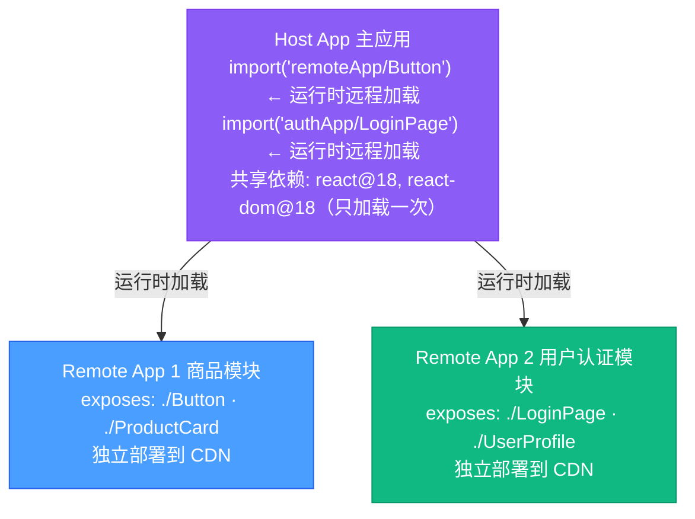

#### Module Federation 配置示例

```js
// remote-app/webpack.config.js
const { ModuleFederationPlugin } = require("webpack").container;

new ModuleFederationPlugin({
  name: "remoteApp",
  filename: "remoteEntry.js", // 暴露的入口文件
  exposes: {
    "./Button": "./src/components/Button",
    "./ProductCard": "./src/components/ProductCard",
  },
  shared: {
    react: {
      singleton: true, // 确保只加载一个 react 实例
      requiredVersion: "^18.0.0",
    },
    "react-dom": {
      singleton: true,
      requiredVersion: "^18.0.0",
    },
  },
});
```

```js
// host-app/webpack.config.js
new ModuleFederationPlugin({
  name: "host",
  remotes: {
    // 支持运行时动态设置 URL（适合多环境）
    remoteApp: `promise new Promise(resolve => {
      const url = window.__REMOTE_URLS__?.remoteApp || 
                  'https://cdn.example.com/remote/remoteEntry.js';
      const script = document.createElement('script');
      script.src = url;
      script.onload = () => resolve(window.remoteApp);
      document.head.appendChild(script);
    })`,
  },
  shared: {
    react: { singleton: true, requiredVersion: "^18.0.0" },
    "react-dom": { singleton: true, requiredVersion: "^18.0.0" },
  },
});
```

#### qiankun 主应用接入示例

```ts
// main-app/src/main.ts
import { registerMicroApps, start, initGlobalState } from "qiankun";

// 全局状态管理
const { onGlobalStateChange, setGlobalState } = initGlobalState({
  user: null,
  token: "",
});

onGlobalStateChange((state, prev) => {
  console.log("[Main] state changed:", state);
});

registerMicroApps([
  {
    name: "vue-app",
    entry: "//localhost:8080",
    container: "#micro-container",
    activeRule: "/vue",
    props: {
      routerBase: "/vue",
      getGlobalState: () => window.__QIANKUN_STATE__,
    },
  },
  {
    name: "react-app",
    entry: "//localhost:3000",
    container: "#micro-container",
    activeRule: "/react",
  },
]);

start({
  prefetch: "all", // 预加载所有微应用
  sandbox: {
    strictStyleIsolation: true, // Shadow DOM 隔离
    experimentalStyleIsolation: true,
  },
});
```

---

## 6. 2025-2026 构建工具演进

### 为什么关注这个

前端构建工具正在经历一场**从 JavaScript 到 Rust/Zig 的语言迁移**。Webpack（2014年发布，JavaScript 实现）统治了整整十年，但随着项目规模膨胀，其 JavaScript 单线程架构的性能天花板暴露无遗。2024-2026 年，Rspack、Turbopack、Biome 等 Rust 实现的工具以 10-100 倍的性能提升快速侵蚀 Webpack/ESLint/Prettier 的生态位。

> **类比**：这就像城市交通从"人力调度"升级到"自动化信号灯"——同样的交通规则（Webpack API 兼容），但底层换成了更高效的执行引擎。

### 6.1 Rspack——Rust 实现的 Webpack 兼容打包器

[Rspack](https://rspack.dev/) 由字节跳动开源，目标是成为 Webpack 的**无痛替代品**：API 和配置与 Webpack 5 高度兼容，但底层用 Rust 重写获得数量级的速度提升。

#### 为什么不直接用 Vite？

Vite 在开发环境表现出色（ESM + 按需编译），但生产构建依赖 Rollup，且与 Webpack 生态不兼容。对于**已有大量 Webpack 配置和自定义 Loader/Plugin 的存量项目**，迁移到 Vite 成本巨大。Rspack 的价值在于：**改一行配置就能获得 5-10 倍速度提升**。

```javascript
// rspack.config.js —— 几乎等同于 webpack.config.js
const rspack = require("@rspack/core");

module.exports = {
  entry: "./src/index.tsx",
  output: { filename: "[name].[contenthash].js" },
  module: {
    rules: [
      {
        test: /\.tsx?$/,
        use: {
          loader: "builtin:swc-loader", // Rspack 内置 SWC loader
          options: {
            jsc: { parser: { syntax: "typescript", tsx: true } },
          },
        },
      },
    ],
  },
  plugins: [new rspack.HtmlRspackPlugin({ template: "./index.html" })],
  optimization: { splitChunks: { chunks: "all" } }, // 同 Webpack API
};
```

#### 性能对比（大型项目, 5000+ 模块）

| 指标          | Webpack 5 | Rspack     |
| ------------- | --------- | ---------- |
| 冷启动（dev） | 30-60s    | 2-5s       |
| HMR 更新      | 500ms-2s  | 50-200ms   |
| 生产构建      | 60-120s   | 8-15s      |
| 内存占用      | 1-2 GB    | 300-500 MB |

#### 从 Webpack 迁移

```bash
# 1. 安装
npm install @rspack/core @rspack/cli -D

# 2. 重命名配置
mv webpack.config.js rspack.config.js

# 3. 替换导入
# const webpack = require('webpack') → const rspack = require('@rspack/core')
# 内置 Loader 替换：babel-loader → builtin:swc-loader, css-loader → 内置 CSS 模块

# 4. 修改 scripts
# "build": "webpack" → "build": "rspack build"
# "dev": "webpack serve" → "dev": "rspack serve"
```

> **兼容性**：2026 年 Rspack 已支持约 80% 的 Webpack Plugin 生态（包括 MiniCssExtractPlugin 替代品、CopyPlugin 等），少数深度依赖 Webpack 内部 API 的 Plugin 需要适配。

### 6.2 Turbopack——Vercel 的下一代打包器

Turbopack 由 Webpack 作者 Tobias Koppers 在 Vercel 主导开发，用 Rust 从零实现，目标是成为 Next.js 的默认打包器。

#### 核心架构

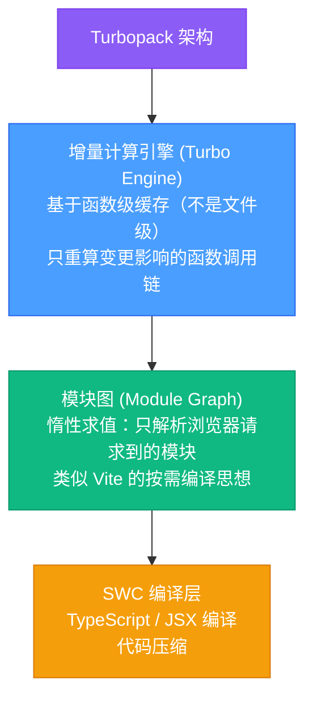

#### 2026 年状态

| 维度                     | 状态                                                   |
| ------------------------ | ------------------------------------------------------ |
| Next.js 开发模式         | ✅ 默认启用（`next dev --turbopack`）                  |
| Next.js 生产构建         | ✅ 稳定（`next build --turbopack`，2025 年底进入稳定） |
| 独立使用（脱离 Next.js） | ⚠️ 尚不支持独立使用                                    |
| Webpack Loader 兼容      | 部分兼容（通过 `turbopack.rules` 配置）                |

> **关键区别**：Rspack 追求 Webpack API 兼容，适合存量项目迁移；Turbopack 是全新架构，深度绑定 Next.js 生态。

### 6.3 Biome——Rust 实现的 ESLint + Prettier 统一替代

[Biome](https://biomejs.dev/) 是一个统一的代码格式化器 + 代码检查器，用 Rust 编写，旨在替代 ESLint + Prettier 的组合。

#### 为什么要替代 ESLint + Prettier？

```
传统工具链的问题：
1. ESLint（JS 实现）+ Prettier（JS 实现）= 两个独立工具
2. 配置冲突：ESLint 格式规则与 Prettier 冲突 → 需要 eslint-config-prettier
3. 速度慢：大型项目 lint 需要 10-30 秒
4. 配置碎片化：.eslintrc + .prettierrc + .editorconfig + eslint-plugin-xxx...
```

```json
// biome.json —— 一个文件搞定 lint + format
{
  "$schema": "https://biomejs.dev/schemas/1.9.0/schema.json",
  "organizeImports": { "enabled": true },
  "formatter": {
    "indentStyle": "space",
    "indentWidth": 2,
    "lineWidth": 100
  },
  "linter": {
    "enabled": true,
    "rules": {
      "recommended": true,
      "complexity": {
        "noExcessiveCognitiveComplexity": {
          "level": "warn",
          "options": { "maxAllowedComplexity": 15 }
        }
      },
      "suspicious": {
        "noExplicitAny": "warn"
      }
    }
  },
  "javascript": {
    "formatter": {
      "quoteStyle": "single",
      "trailingCommas": "all",
      "semicolons": "always"
    }
  }
}
```

```bash
# 使用
biome check .              # lint + format 检查
biome check --write .      # 自动修复
biome format --write .     # 仅格式化
biome lint .               # 仅 lint

# 从 ESLint/Prettier 迁移
biome migrate eslint       # 读取 .eslintrc 生成 biome.json
biome migrate prettier     # 读取 .prettierrc 合并配置
```

#### 性能对比

| 工具              | 格式化 1000 文件 | Lint 1000 文件 | 语言       |
| ----------------- | ---------------- | -------------- | ---------- |
| Prettier + ESLint | ~12s             | ~25s           | JavaScript |
| Biome             | ~0.3s            | ~0.5s          | Rust       |
| **提速**          | **~40x**         | **~50x**       | —          |

### 6.4 Vite 6 Environment API

Vite 6（2025 年发布）引入了 **Environment API**，将原本只区分"客户端 vs SSR"的模型扩展为可配置的多环境体系。

```javascript
// vite.config.ts —— Vite 6 环境配置
import { defineConfig } from "vite";

export default defineConfig({
  environments: {
    // 客户端环境（默认）
    client: {
      build: {
        outDir: "dist/client",
        rollupOptions: {
          /* 客户端特定配置 */
        },
      },
    },
    // SSR 环境
    ssr: {
      build: {
        outDir: "dist/server",
        ssr: true,
      },
    },
    // Edge Runtime 环境（Cloudflare Workers / Vercel Edge）
    edge: {
      build: {
        outDir: "dist/edge",
        ssr: true,
      },
      resolve: {
        conditions: ["edge-light", "worker"], // Edge Runtime 特有的模块解析条件
      },
    },
  },
});
```

**核心价值**：

- **一套代码，多环境构建**：React Server Components 需要同时为客户端、服务端、Edge 分别构建
- **框架作者受益最大**：Remix、Nuxt、SolidStart 等框架可以用 Vite 6 的 Environment API 统一管理不同运行环境
- **模块解析隔离**：不同环境可以有不同的 `resolve.conditions`（例如 Edge 不支持 `fs` 模块）

### 6.5 2026 前端构建工具选型指南

| 维度         | Webpack 5              | Vite 6                        | Rspack                 | Turbopack               |
| ------------ | ---------------------- | ----------------------------- | ---------------------- | ----------------------- |
| **实现语言** | JavaScript             | JS + Rollup(JS) + esbuild(Go) | Rust                   | Rust                    |
| **开发体验** | 慢启动（Bundle-based） | 极快启动（ESM-based）         | 快启动（Bundle-based） | 极快启动（Lazy + 增量） |
| **生产构建** | 成熟但慢               | Rollup（稳定）                | 快且兼容 Webpack       | 快（仅 Next.js）        |
| **生态兼容** | 最丰富                 | 独立生态                      | 兼容 Webpack           | 部分兼容 Webpack        |
| **适合场景** | 遗留项目维护           | 新项目首选                    | Webpack 项目加速       | Next.js 项目            |
| **学习成本** | 高（配置复杂）         | 低（约定大于配置）            | 低（Webpack 知识复用） | 低（Next.js 内置）      |

**决策树**：

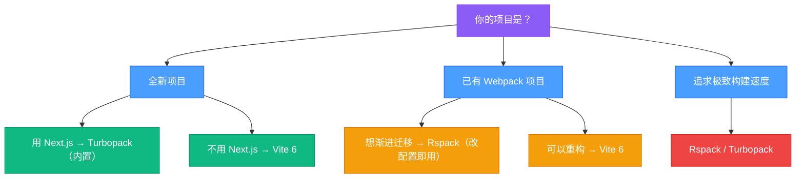

---

## 总结

前端工程化的演进路线：

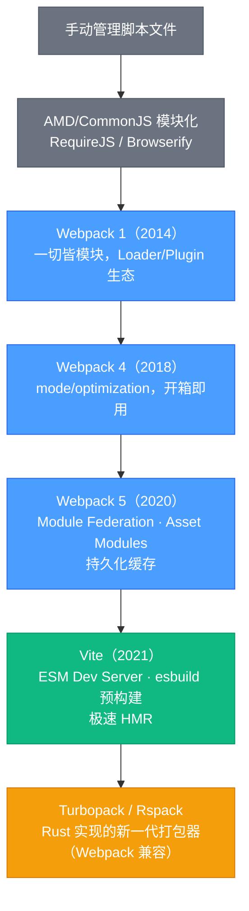

工程化的核心目标始终是：**提升开发效率、保障代码质量、优化用户体验**。选择工具时应综合考虑团队规模、项目复杂度、浏览器兼容需求和生态成熟度。
