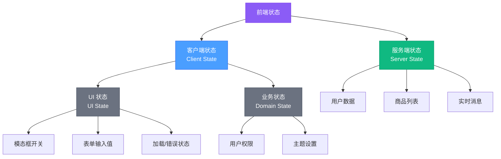
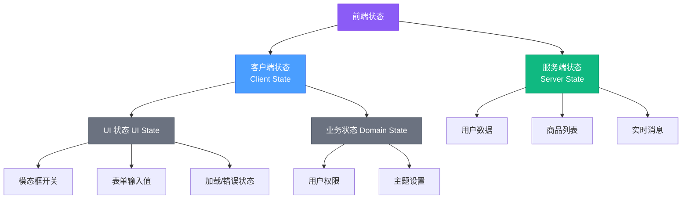
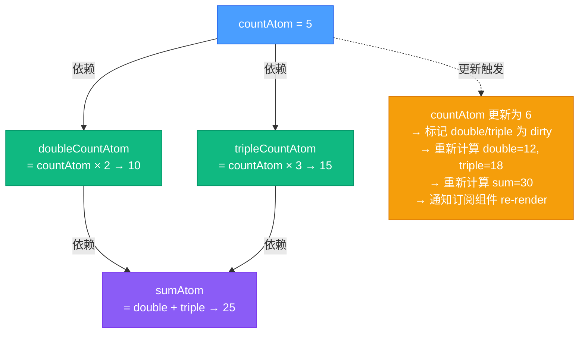
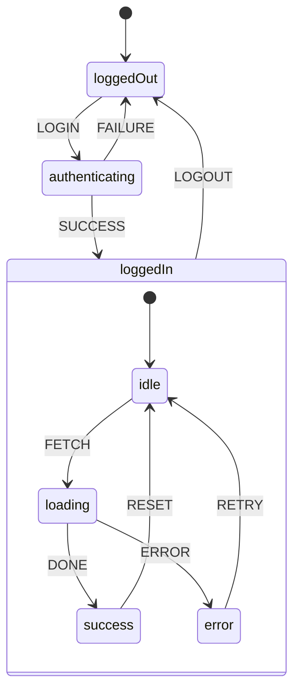
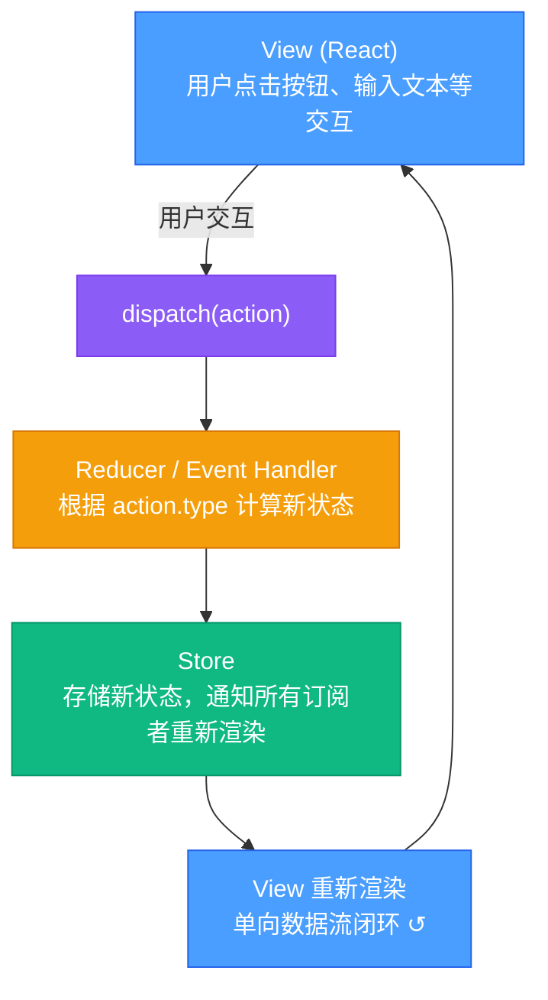

# 状态管理与数据流

> 深度解析前端应用状态管理架构，涵盖 Redux/Redux Toolkit/RTK Query、Zustand、Jotai、Recoil、TanStack Query、MobX、Context API 优化、XState 状态机等主流方案的原理与实践。

## 相关链接

- 对应面试题：[状态管理面试题](../../02-面试指南/01-前端面试/07-状态管理面试题.md)
- 相关技术资料：[React 核心原理](./01-React核心原理.md)

## 目录

1. [为什么需要状态管理](#1-为什么需要状态管理)
2. [状态管理核心概念](#2-状态管理核心概念)
3. [Redux 与 Redux Toolkit](#3-redux-与-redux-toolkit)
4. [服务端状态管理：RTK Query 与 TanStack Query](#4-服务端状态管理rtk-query-与-tanstack-query)
5. [原子化状态管理：Zustand、Jotai、Recoil](#5-原子化状态管理zustandjotairecoil)
6. [响应式状态管理：MobX](#6-响应式状态管理mobx)
7. [状态机：XState](#7-状态机xstate)
8. [Context API 优化策略](#8-context-api-优化策略)
9. [状态管理选型决策](#9-状态管理选型决策)
10. [实践案例](#10-实践案例)

---

## 1. 为什么需要状态管理

### 1.1 动机与问题背景

在现代前端应用开发中，我们经常遇到以下场景：

**场景 1：跨组件状态共享**

```tsx
// ❌ 问题：深层 Prop Drilling
function App() {
  const [user, setUser] = useState(null);
  return <Layout user={user} setUser={setUser} />;
}

function Layout({ user, setUser }) {
  return <Sidebar user={user} setUser={setUser} />;
}

function Sidebar({ user, setUser }) {
  return <UserProfile user={user} setUser={setUser} />;
}

function UserProfile({ user, setUser }) {
  // 实际使用 user 的组件在 5 层嵌套之后...
}
```

**场景 2：服务端数据缓存与同步**

```tsx
// ❌ 问题：重复请求、缓存不一致
function UserList() {
  const [users, setUsers] = useState([]);

  useEffect(() => {
    fetch('/api/users').then(res => setUsers(res.json()));
  }, []);

  return users.map(user => <UserCard key={user.id} user={user} />);
}

function UserDetail({ userId }) {
  const [user, setUser] = useState(null);

  useEffect(() => {
    // 同一个用户数据可能被重复请求多次
    fetch(`/api/users/${userId}`).then(res => setUser(res.json()));
  }, [userId]);
}
```

**场景 3：复杂的状态依赖与派生**

```tsx
// ❌ 问题：派生状态同步困难
function ShoppingCart() {
  const [items, setItems] = useState([]);
  const [total, setTotal] = useState(0);
  const [taxAmount, setTaxAmount] = useState(0);
  const [finalPrice, setFinalPrice] = useState(0);

  // 需要在多个地方手动同步派生状态
  const addItem = (item) => {
    const newItems = [...items, item];
    setItems(newItems);
    const newTotal = calculateTotal(newItems);
    setTotal(newTotal);
    const newTax = newTotal * 0.1;
    setTaxAmount(newTax);
    setFinalPrice(newTotal + newTax);
  };
}
```

### 1.2 类比理解：图书馆的资源管理

可以将状态管理比作图书馆的资源管理系统：

| 图书馆场景 | 状态管理场景 |
|------------|------------|
| 图书总目录（单一数据源） | 全局 Store（Single Source of Truth） |
| 借书规则（只能通过管理员办理） | 单向数据流（只能通过 Dispatch Action） |
| 借阅记录（可追溯） | State History（Time Travel Debugging） |
| 图书分类索引（快速查找） | Selector/Computed（派生状态） |
| 新书到馆通知（订阅机制） | Subscribe/Watch（变更通知） |

没有状态管理库，就像图书馆没有统一目录系统——每个读者需要自己在各个书架上寻找，可能找到过期的书籍（stale data），也无法知道同一本书被借出的状态（状态不一致）。

---

## 2. 状态管理核心概念

### 2.1 状态的分类



**关键差异**：

- **客户端状态**：完全由前端控制，同步更新
- **服务端状态**：后端为单一数据源，需要异步获取，可能过期（stale），需要缓存、重新验证、乐观更新

### 2.2 核心模式

#### 单向数据流（Unidirectional Data Flow）



#### 不可变性（Immutability）

```tsx
// ❌ 可变更新（直接修改原对象）
function badReducer(state, action) {
  state.count++; // 直接修改原对象，无法触发 React 重渲染
  return state;
}

// ✅ 不可变更新（创建新对象）
function goodReducer(state, action) {
  return { ...state, count: state.count + 1 };
}
```

**为什么需要不可变性**：
1. **高效的变更检测**：React 使用 `Object.is` 浅比较判断状态是否变化
2. **Time Travel Debugging**：Redux DevTools 可以回溯到任意历史状态
3. **避免副作用**：防止意外修改导致的 Bug

### 2.3 派生状态（Derived State）

派生状态是从原始状态通过计算得出的结果，类似数据库视图（View）：

```tsx
// 原始状态
const state = {
  todos: [
    { id: 1, text: 'Learn Redux', completed: true },
    { id: 2, text: 'Build App', completed: false }
  ]
};

// 派生状态（通过 Selector 计算）
const completedTodos = todos.filter(todo => todo.completed); // [{ id: 1, ... }]
const todoCount = todos.length; // 2
const progress = completedTodos.length / todoCount; // 0.5
```

**最佳实践**：永远不要在 state 中存储派生值，而是通过 selector/computed 动态计算。

---

## 3. Redux 与 Redux Toolkit

### 3.1 Redux 核心原理

Redux 基于 Flux 架构，由三个核心概念组成：

```tsx
// 1. Store：应用的唯一状态容器
import { createStore } from 'redux';

const store = createStore(reducer);

// Store 内部结构（简化版）
class Store {
  constructor(reducer) {
    this.state = undefined;
    this.reducer = reducer;
    this.listeners = [];

    // 初始化状态
    this.state = this.reducer(this.state, { type: '@@INIT' });
  }

  getState() {
    return this.state;
  }

  dispatch(action) {
    // 计算新状态
    this.state = this.reducer(this.state, action);

    // 通知所有订阅者
    this.listeners.forEach(listener => listener());
  }

  subscribe(listener) {
    this.listeners.push(listener);

    // 返回取消订阅函数
    return () => {
      this.listeners = this.listeners.filter(l => l !== listener);
    };
  }
}
```

```tsx
// 2. Action：描述"发生了什么"的普通对象
const addTodoAction = {
  type: 'todos/add',
  payload: {
    id: 3,
    text: 'Write Documentation'
  }
};

// Action Creator：生成 action 的函数
function addTodo(text) {
  return {
    type: 'todos/add',
    payload: { id: Date.now(), text }
  };
}
```

```tsx
// 3. Reducer：纯函数，描述"如何更新状态"
function todosReducer(state = [], action) {
  switch (action.type) {
    case 'todos/add':
      return [...state, action.payload];

    case 'todos/toggle':
      return state.map(todo =>
        todo.id === action.payload.id
          ? { ...todo, completed: !todo.completed }
          : todo
      );

    default:
      return state;
  }
}
```

### 3.2 Redux Toolkit（RTK）：现代 Redux 最佳实践

Redux Toolkit 通过 **Immer** 实现看似"可变"的写法，内部自动生成不可变更新：

```tsx
// 传统 Redux：手动处理不可变更新（繁琐易错）
function todosReducer(state = [], action) {
  switch (action.type) {
    case 'todos/update':
      return state.map(todo =>
        todo.id === action.payload.id
          ? { ...todo, ...action.payload.changes }
          : todo
      );
    default:
      return state;
  }
}

// Redux Toolkit：使用 createSlice（简洁安全）
import { createSlice } from '@reduxjs/toolkit';

const todosSlice = createSlice({
  name: 'todos',
  initialState: [],
  reducers: {
    addTodo(state, action) {
      // 看似"直接修改"，Immer 会自动生成不可变副本
      state.push(action.payload);
    },
    toggleTodo(state, action) {
      const todo = state.find(t => t.id === action.payload.id);
      if (todo) {
        todo.completed = !todo.completed;
      }
    }
  }
});

export const { addTodo, toggleTodo } = todosSlice.actions;
export default todosSlice.reducer;
```

#### Immer 原理简化解释

```tsx
import produce from 'immer';

const state = { count: 0, nested: { value: 1 } };

const nextState = produce(state, draft => {
  draft.count++; // 在草稿（draft）上"直接修改"
  draft.nested.value = 2;
});

// Immer 自动生成：
// nextState = { count: 1, nested: { value: 2 } }
// state !== nextState（新对象）
// state.nested !== nextState.nested（新对象）
```

**Immer 工作流程**：

```
1. 创建 Proxy 草稿（Draft）包装原状态
2. 追踪所有修改操作（记录到 Copy-on-Write 集合）
3. 根据修改记录，生成新的不可变对象树
4. 未修改的部分复用原对象（结构共享）
```

### 3.3 异步处理：createAsyncThunk

```tsx
import { createSlice, createAsyncThunk } from '@reduxjs/toolkit';

// createAsyncThunk 自动生成三个 action：
// - fetchUser.pending
// - fetchUser.fulfilled
// - fetchUser.rejected
export const fetchUser = createAsyncThunk(
  'user/fetch',
  async (userId, { rejectWithValue }) => {
    try {
      const response = await fetch(`/api/users/${userId}`);
      if (!response.ok) throw new Error('Failed to fetch');
      return await response.json();
    } catch (error) {
      return rejectWithValue(error.message);
    }
  }
);

const userSlice = createSlice({
  name: 'user',
  initialState: { data: null, status: 'idle', error: null },
  reducers: {},
  extraReducers: (builder) => {
    builder
      .addCase(fetchUser.pending, (state) => {
        state.status = 'loading';
      })
      .addCase(fetchUser.fulfilled, (state, action) => {
        state.status = 'succeeded';
        state.data = action.payload;
      })
      .addCase(fetchUser.rejected, (state, action) => {
        state.status = 'failed';
        state.error = action.payload;
      });
  }
});
```

**使用**：

```tsx
import { useDispatch, useSelector } from 'react-redux';

function UserProfile({ userId }) {
  const dispatch = useDispatch();
  const { data, status, error } = useSelector(state => state.user);

  useEffect(() => {
    dispatch(fetchUser(userId));
  }, [userId]);

  if (status === 'loading') return <Spinner />;
  if (status === 'failed') return <Error message={error} />;
  return <div>{data.name}</div>;
}
```

### 3.4 Selector 与 Reselect 性能优化

```tsx
import { createSelector } from '@reduxjs/toolkit';

// ❌ 问题：每次渲染都创建新数组，导致无用的 re-render
function BadComponent() {
  const completedTodos = useSelector(state =>
    state.todos.filter(todo => todo.completed)
  );
  // completedTodos 引用每次都变化，即使内容相同
}

// ✅ 解决：使用 memoized selector
const selectCompletedTodos = createSelector(
  [state => state.todos], // 依赖项
  (todos) => todos.filter(todo => todo.completed) // 计算函数
);

function GoodComponent() {
  const completedTodos = useSelector(selectCompletedTodos);
  // 只有 state.todos 变化时才重新计算
}
```

**Reselect 缓存机制**：

```
第一次调用：
  输入：state.todos = [...]
  计算：filter(...) → result1
  缓存：{ inputs: [...], result: result1 }

第二次调用：
  输入：state.todos = [...] (同一个引用)
  命中缓存 → 直接返回 result1

第三次调用：
  输入：state.todos = [...新数组...]
  缓存未命中 → 重新计算 → result2
  更新缓存：{ inputs: [...新数组...], result: result2 }
```

---

## 4. 服务端状态管理：RTK Query 与 TanStack Query

### 4.1 服务端状态的特殊性

服务端状态与客户端状态有本质区别：

| 特性 | 客户端状态 | 服务端状态 |
|------|-----------|-----------|
| 数据源 | 前端唯一控制 | 后端为 Single Source of Truth |
| 同步性 | 同步更新 | 异步获取 |
| 时效性 | 永久有效 | 可能过期（stale） |
| 持久化 | localStorage | 后端数据库 |
| 并发控制 | 无需处理 | 需要处理乐观更新、竞态条件 |

### 4.2 RTK Query：Redux 官方数据获取方案

```tsx
import { createApi, fetchBaseQuery } from '@reduxjs/toolkit/query/react';

// 定义 API Slice
export const apiSlice = createApi({
  reducerPath: 'api',
  baseQuery: fetchBaseQuery({ baseUrl: '/api' }),
  tagTypes: ['User', 'Post'],
  endpoints: (builder) => ({
    // 查询端点（GET）
    getUsers: builder.query<User[], void>({
      query: () => '/users',
      providesTags: ['User']
    }),

    getUserById: builder.query<User, string>({
      query: (id) => `/users/${id}`,
      providesTags: (result, error, id) => [{ type: 'User', id }]
    }),

    // 变更端点（POST/PUT/DELETE）
    addUser: builder.mutation<User, Partial<User>>({
      query: (user) => ({
        url: '/users',
        method: 'POST',
        body: user
      }),
      invalidatesTags: ['User'] // 执行后自动重新获取用户列表
    }),

    updateUser: builder.mutation<User, { id: string; updates: Partial<User> }>({
      query: ({ id, updates }) => ({
        url: `/users/${id}`,
        method: 'PATCH',
        body: updates
      }),
      // 乐观更新
      async onQueryStarted({ id, updates }, { dispatch, queryFulfilled }) {
        const patchResult = dispatch(
          apiSlice.util.updateQueryData('getUserById', id, (draft) => {
            Object.assign(draft, updates);
          })
        );

        try {
          await queryFulfilled;
        } catch {
          patchResult.undo(); // 失败时回滚
        }
      },
      invalidatesTags: (result, error, { id }) => [{ type: 'User', id }]
    })
  })
});

export const {
  useGetUsersQuery,
  useGetUserByIdQuery,
  useAddUserMutation,
  useUpdateUserMutation
} = apiSlice;
```

**使用 RTK Query Hook**：

```tsx
function UserList() {
  const { data: users, isLoading, isError, error, refetch } = useGetUsersQuery();
  const [addUser] = useAddUserMutation();

  if (isLoading) return <Spinner />;
  if (isError) return <Error message={error.message} />;

  return (
    <div>
      {users.map(user => <UserCard key={user.id} user={user} />)}
      <button onClick={() => addUser({ name: 'New User' })}>
        Add User
      </button>
    </div>
  );
}

function UserDetail({ userId }) {
  // 自动缓存：如果 UserList 已经获取过此用户，直接返回缓存
  const { data: user } = useGetUserByIdQuery(userId);

  return <div>{user?.name}</div>;
}
```

**RTK Query 自动缓存流程**：

```
第一次调用 useGetUsersQuery():
  → 发起 /api/users 请求
  → 缓存到 state.api.queries['getUsers(undefined)']
  → 返回 { data: [...], isLoading: false }

第二次调用 useGetUsersQuery()（其他组件）:
  → 检查缓存，命中
  → 直接返回缓存数据，不发起新请求
  → 根据 refetchOnMountOrArgChange 决定是否后台重新验证

调用 addUser():
  → 执行 POST /api/users
  → 触发 invalidatesTags: ['User']
  → 自动重新获取所有 providesTags 包含 'User' 的查询
  → useGetUsersQuery 自动刷新
```

### 4.3 TanStack Query（原 React Query）：更灵活的服务端状态方案

```tsx
import { useQuery, useMutation, useQueryClient } from '@tanstack/react-query';

// 查询（GET）
function useUsers() {
  return useQuery({
    queryKey: ['users'],
    queryFn: async () => {
      const response = await fetch('/api/users');
      if (!response.ok) throw new Error('Failed to fetch');
      return response.json();
    },
    staleTime: 5 * 60 * 1000, // 5 分钟内认为数据新鲜
    gcTime: 10 * 60 * 1000, // 10 分钟后清除缓存（原 cacheTime）
    refetchOnWindowFocus: true // 窗口重新聚焦时刷新
  });
}

// 变更（POST/PUT/DELETE）
function useAddUser() {
  const queryClient = useQueryClient();

  return useMutation({
    mutationFn: async (newUser: Partial<User>) => {
      const response = await fetch('/api/users', {
        method: 'POST',
        headers: { 'Content-Type': 'application/json' },
        body: JSON.stringify(newUser)
      });
      return response.json();
    },

    // 乐观更新
    onMutate: async (newUser) => {
      await queryClient.cancelQueries({ queryKey: ['users'] });

      const previousUsers = queryClient.getQueryData(['users']);

      queryClient.setQueryData(['users'], (old: User[]) => [
        ...old,
        { id: 'temp-id', ...newUser }
      ]);

      return { previousUsers };
    },

    onError: (err, newUser, context) => {
      // 失败时回滚
      queryClient.setQueryData(['users'], context?.previousUsers);
    },

    onSettled: () => {
      queryClient.invalidateQueries({ queryKey: ['users'] });
    }
  });
}
```

**使用**：

```tsx
function UserList() {
  const { data: users, isLoading, error } = useUsers();
  const addUserMutation = useAddUser();

  if (isLoading) return <Spinner />;
  if (error) return <Error message={error.message} />;

  return (
    <div>
      {users.map(user => <UserCard key={user.id} user={user} />)}
      <button
        onClick={() => addUserMutation.mutate({ name: 'New User' })}
        disabled={addUserMutation.isPending}
      >
        {addUserMutation.isPending ? 'Adding...' : 'Add User'}
      </button>
    </div>
  );
}
```

### 4.4 RTK Query vs TanStack Query 对比

| 特性 | RTK Query | TanStack Query |
|------|-----------|----------------|
| 依赖 | 必须使用 Redux | 独立库，无需 Redux |
| API 风格 | 声明式 endpoints | 命令式 hooks |
| 缓存粒度 | 基于 tag 的自动失效 | 基于 queryKey 的手动失效 |
| 类型推导 | TypeScript 自动推导响应类型 | 需要手动指定泛型 |
| Bundle 大小 | 较大（包含 Redux） | 较小 |
| 学习曲线 | 需要理解 Redux 概念 | 更直观 |
| 适用场景 | 已使用 Redux 的项目 | 新项目、或只需数据获取 |

---

## 5. 原子化状态管理：Zustand、Jotai、Recoil

### 5.1 Zustand：极简的状态管理

**核心思想**：直接修改状态，无需 Reducer/Action 的心智负担。

```tsx
import create from 'zustand';
import { devtools, persist } from 'zustand/middleware';

// 创建 Store（支持 TypeScript）
interface BearStore {
  bears: number;
  increasePopulation: () => void;
  removeAllBears: () => void;
  updateBears: (newBears: number) => void;
}

const useBearStore = create<BearStore>()(
  devtools(
    persist(
      (set, get) => ({
        bears: 0,
        increasePopulation: () => set(state => ({ bears: state.bears + 1 })),
        removeAllBears: () => set({ bears: 0 }),
        updateBears: (newBears) => set({ bears: newBears })
      }),
      { name: 'bear-storage' } // LocalStorage key
    )
  )
);

// 使用（无需 Provider）
function BearCounter() {
  const bears = useBearStore(state => state.bears);
  return <h1>{bears} around here...</h1>;
}

function Controls() {
  const increasePopulation = useBearStore(state => state.increasePopulation);
  return <button onClick={increasePopulation}>Add Bear</button>;
}
```

**Zustand 实现原理简化**：

```tsx
// Zustand 内部简化版
function create(createState) {
  let state;
  const listeners = new Set();

  const setState = (partial) => {
    const nextState = typeof partial === 'function'
      ? partial(state)
      : partial;

    if (nextState !== state) {
      state = { ...state, ...nextState };
      listeners.forEach(listener => listener(state));
    }
  };

  const getState = () => state;

  const subscribe = (listener) => {
    listeners.add(listener);
    return () => listeners.delete(listener);
  };

  state = createState(setState, getState);

  // React Hook
  const useStore = (selector = getState) => {
    const [, forceUpdate] = useReducer(c => c + 1, 0);

    useEffect(() => {
      return subscribe(() => forceUpdate());
    }, []);

    return selector(state);
  };

  return useStore;
}
```

**Zustand 的性能优化**：

```tsx
// ❌ 问题：订阅整个 state，任何字段变化都会 re-render
function BadComponent() {
  const state = useBearStore(); // 订阅整个 store
  return <div>{state.bears}</div>;
}

// ✅ 优化：只订阅需要的字段
function GoodComponent() {
  const bears = useBearStore(state => state.bears); // 只订阅 bears
  return <div>{bears}</div>;
}

// Zustand 使用 Object.is 浅比较 selector 结果
// bears 变化时才触发 re-render
```

### 5.2 Jotai：原子化的自下而上状态管理

**核心思想**：将状态拆分为最小的"原子"（atom），组件只订阅需要的原子。

```tsx
import { atom, useAtom, useAtomValue, useSetAtom } from 'jotai';

// 定义原子
const countAtom = atom(0);
const doubleCountAtom = atom(get => get(countAtom) * 2); // 派生原子

// 异步原子
const userAtom = atom(async (get) => {
  const userId = get(userIdAtom);
  const response = await fetch(`/api/users/${userId}`);
  return response.json();
});

// 可写派生原子
const uppercaseAtom = atom(
  get => get(textAtom).toUpperCase(), // 读
  (get, set, newText: string) => set(textAtom, newText) // 写
);

// 使用原子
function Counter() {
  const [count, setCount] = useAtom(countAtom);
  const doubleCount = useAtomValue(doubleCountAtom);

  return (
    <div>
      <p>Count: {count}</p>
      <p>Double: {doubleCount}</p>
      <button onClick={() => setCount(c => c + 1)}>+1</button>
    </div>
  );
}

function AnotherComponent() {
  const setCount = useSetAtom(countAtom); // 只需要 setter
  return <button onClick={() => setCount(0)}>Reset</button>;
}
```

**Jotai 的依赖追踪**：



**Jotai 实战：表单状态管理**：

```tsx
import { atom, useAtom } from 'jotai';
import { atomWithStorage } from 'jotai/utils';

// 原子化表单字段
const nameAtom = atom('');
const emailAtom = atom('');
const ageAtom = atom(0);

// 派生验证状态
const emailValidAtom = atom(get => {
  const email = get(emailAtom);
  return /^[^\s@]+@[^\s@]+\.[^\s@]+$/.test(email);
});

const formValidAtom = atom(get => {
  return get(nameAtom).length > 0 && get(emailValidAtom) && get(ageAtom) >= 18;
});

// 持久化表单草稿
const formDraftAtom = atomWithStorage('form-draft', {
  name: '',
  email: '',
  age: 0
});

function FormField({ label, atom }) {
  const [value, setValue] = useAtom(atom);
  return (
    <label>
      {label}
      <input value={value} onChange={e => setValue(e.target.value)} />
    </label>
  );
}

function Form() {
  const [name, setName] = useAtom(nameAtom);
  const [email, setEmail] = useAtom(emailAtom);
  const emailValid = useAtomValue(emailValidAtom);
  const formValid = useAtomValue(formValidAtom);

  return (
    <form>
      <FormField label="Name" atom={nameAtom} />
      <FormField label="Email" atom={emailAtom} />
      {!emailValid && <span>Invalid email</span>}
      <button disabled={!formValid}>Submit</button>
    </form>
  );
}
```

### 5.3 Recoil：Facebook 的状态管理方案

**核心概念**：Atom（原子）+ Selector（派生状态）。

```tsx
import { atom, selector, useRecoilState, useRecoilValue } from 'recoil';

// Atom
const todoListState = atom({
  key: 'todoListState', // 全局唯一 ID
  default: []
});

const todoListFilterState = atom({
  key: 'todoListFilterState',
  default: 'Show All'
});

// Selector（派生状态）
const filteredTodoListState = selector({
  key: 'filteredTodoListState',
  get: ({ get }) => {
    const filter = get(todoListFilterState);
    const list = get(todoListState);

    switch (filter) {
      case 'Show Completed':
        return list.filter(item => item.isComplete);
      case 'Show Uncompleted':
        return list.filter(item => !item.isComplete);
      default:
        return list;
    }
  }
});

const todoListStatsState = selector({
  key: 'todoListStatsState',
  get: ({ get }) => {
    const todoList = get(todoListState);
    const totalNum = todoList.length;
    const completedNum = todoList.filter(item => item.isComplete).length;
    const uncompletedNum = totalNum - completedNum;
    const percentCompleted = totalNum === 0 ? 0 : completedNum / totalNum * 100;

    return {
      totalNum,
      completedNum,
      uncompletedNum,
      percentCompleted
    };
  }
});

// 使用
function TodoList() {
  const todoList = useRecoilValue(filteredTodoListState);
  const stats = useRecoilValue(todoListStatsState);

  return (
    <div>
      <p>Total: {stats.totalNum}, Completed: {stats.percentCompleted}%</p>
      {todoList.map(todo => <TodoItem key={todo.id} item={todo} />)}
    </div>
  );
}
```

**Recoil 的异步 Selector**：

```tsx
const currentUserIDState = atom({
  key: 'currentUserIDState',
  default: 1
});

// 异步 Selector
const currentUserNameState = selector({
  key: 'currentUserNameState',
  get: async ({ get }) => {
    const userId = get(currentUserIDState);
    const response = await fetch(`/api/users/${userId}`);
    const userData = await response.json();
    return userData.name;
  }
});

function UserInfo() {
  const userName = useRecoilValue(currentUserNameState);
  // Recoil 会自动处理 Suspense
  return <div>{userName}</div>;
}

function App() {
  return (
    <RecoilRoot>
      <Suspense fallback={<Spinner />}>
        <UserInfo />
      </Suspense>
    </RecoilRoot>
  );
}
```

### 5.4 三者对比

| 特性 | Zustand | Jotai | Recoil |
|------|---------|-------|--------|
| 心智模型 | 中心化 Store | 原子化（自下而上） | 原子化（自下而上） |
| 是否需要 Provider | ❌ 不需要 | ✅ 需要（推荐） | ✅ 必须 |
| TypeScript 支持 | 优秀 | 优秀 | 良好 |
| Bundle 大小 | 1.2 KB | 3.0 KB | 14 KB |
| 学习曲线 | 平缓 | 中等 | 中等 |
| DevTools | 需要中间件 | 第三方插件 | 官方支持 |
| 适用场景 | 小中型应用全局状态 | 复杂派生状态 | 复杂异步依赖 |

---

## 6. 响应式状态管理：MobX

### 6.1 MobX 核心概念

MobX 基于 **观察者模式** + **Proxy 响应式系统**，自动追踪依赖：

```tsx
import { makeObservable, observable, action, computed } from 'mobx';
import { observer } from 'mobx-react-lite';

class TodoStore {
  todos = [];
  filter = 'all';

  constructor() {
    makeObservable(this, {
      todos: observable,
      filter: observable,
      addTodo: action,
      toggleTodo: action,
      filteredTodos: computed
    });
  }

  addTodo(text) {
    this.todos.push({ id: Date.now(), text, completed: false });
  }

  toggleTodo(id) {
    const todo = this.todos.find(t => t.id === id);
    if (todo) todo.completed = !todo.completed;
  }

  get filteredTodos() {
    switch (this.filter) {
      case 'completed':
        return this.todos.filter(t => t.completed);
      case 'active':
        return this.todos.filter(t => !t.completed);
      default:
        return this.todos;
    }
  }
}

const todoStore = new TodoStore();

// observer 包装组件，自动追踪依赖
const TodoList = observer(() => {
  const { filteredTodos, addTodo } = todoStore;

  return (
    <div>
      {filteredTodos.map(todo => (
        <TodoItem key={todo.id} todo={todo} />
      ))}
      <button onClick={() => addTodo('New Task')}>Add</button>
    </div>
  );
});
```

**MobX 自动追踪原理**：

```
1. makeObservable(this, { todos: observable })
   → 将 todos 转换为 Proxy 对象

2. observer(Component)
   → 在组件渲染时开启依赖追踪

3. 组件访问 todoStore.filteredTodos
   → filteredTodos 访问 this.todos
   → MobX 记录：Component 依赖 todos

4. 执行 todoStore.addTodo()
   → action 修改 this.todos
   → MobX 通知所有依赖 todos 的组件 re-render
```

### 6.2 MobX 6 新特性：无需装饰器

```tsx
import { makeAutoObservable } from 'mobx';

class CounterStore {
  count = 0;

  constructor() {
    makeAutoObservable(this); // 自动推断所有字段
  }

  increment() {
    this.count++;
  }

  get double() {
    return this.count * 2;
  }
}

const counterStore = new CounterStore();
```

### 6.3 MobX vs Redux 对比

| 特性 | MobX | Redux |
|------|------|-------|
| 数据流 | 响应式（自动追踪） | 单向数据流（手动订阅） |
| 更新方式 | 直接修改（Proxy） | 不可变更新 |
| 心智负担 | 低（像 Vue/Angular） | 高（需要理解 Action/Reducer） |
| 可预测性 | 低（隐式依赖） | 高（显式 dispatch） |
| 调试 | 需要 mobx-devtools | Redux DevTools 强大 |
| 适用场景 | 快速原型、复杂 UI 交互 | 大型应用、时间旅行调试 |

---

## 7. 状态机：XState

### 7.1 为什么需要状态机

传统布尔标志位方式管理状态容易导致**非法状态**：

```tsx
// ❌ 问题：布尔地狱
const [isLoading, setIsLoading] = useState(false);
const [isError, setIsError] = useState(false);
const [data, setData] = useState(null);

// 可能出现非法状态：
// isLoading=true && isError=true
// data !== null && isError=true
```

**状态机**确保状态互斥：

```
空闲（idle）
  ↓ fetch
加载中（loading）
  ↓ success    ↓ error
成功（success） 失败（error）
```

### 7.2 XState 基础

```tsx
import { createMachine, assign } from 'xstate';
import { useMachine } from '@xstate/react';

const fetchMachine = createMachine({
  id: 'fetch',
  initial: 'idle',
  context: {
    data: null,
    error: null
  },
  states: {
    idle: {
      on: {
        FETCH: 'loading'
      }
    },
    loading: {
      invoke: {
        src: 'fetchData',
        onDone: {
          target: 'success',
          actions: assign({
            data: (context, event) => event.data
          })
        },
        onError: {
          target: 'error',
          actions: assign({
            error: (context, event) => event.data
          })
        }
      }
    },
    success: {
      on: {
        FETCH: 'loading'
      }
    },
    error: {
      on: {
        RETRY: 'loading'
      }
    }
  }
});

function DataFetcher() {
  const [state, send] = useMachine(fetchMachine, {
    services: {
      fetchData: async () => {
        const response = await fetch('/api/data');
        return response.json();
      }
    }
  });

  return (
    <div>
      {state.matches('idle') && <button onClick={() => send('FETCH')}>Fetch</button>}
      {state.matches('loading') && <Spinner />}
      {state.matches('success') && <div>{state.context.data}</div>}
      {state.matches('error') && (
        <div>
          <Error message={state.context.error} />
          <button onClick={() => send('RETRY')}>Retry</button>
        </div>
      )}
    </div>
  );
}
```

### 7.3 复杂状态机：嵌套状态

```tsx
const authMachine = createMachine({
  id: 'auth',
  initial: 'loggedOut',
  states: {
    loggedOut: {
      on: {
        LOGIN: 'authenticating'
      }
    },
    authenticating: {
      invoke: {
        src: 'login',
        onDone: 'loggedIn',
        onError: 'loggedOut'
      }
    },
    loggedIn: {
      initial: 'idle',
      states: {
        idle: {
          on: {
            FETCH_PROFILE: 'loading'
          }
        },
        loading: {
          invoke: {
            src: 'fetchProfile',
            onDone: 'success',
            onError: 'error'
          }
        },
        success: {},
        error: {
          on: {
            RETRY: 'loading'
          }
        }
      },
      on: {
        LOGOUT: 'loggedOut'
      }
    }
  }
});
```

**状态层级**：



### 7.4 XState 可视化

XState 提供官方 [Visualizer](https://stately.ai/viz)，可将状态机转为状态图：

```
[loggedOut] --LOGIN--> [authenticating] --onDone--> [loggedIn]
                            |
                          onError
                            ↓
                        [loggedOut]
```

---

## 8. Context API 优化策略

### 8.1 Context 的性能问题

```tsx
// ❌ 问题：Context 变化导致所有消费者 re-render
const AppContext = React.createContext();

function App() {
  const [user, setUser] = useState(null);
  const [theme, setTheme] = useState('light');

  return (
    <AppContext.Provider value={{ user, setUser, theme, setTheme }}>
      <Header />
      <Content />
    </AppContext.Provider>
  );
}

function Header() {
  const { theme } = useContext(AppContext);
  // user 变化时，Header 也会 re-render（即使只用了 theme）
  return <div className={theme}>Header</div>;
}
```

**原因**：`{ user, setUser, theme, setTheme }` 每次渲染都创建新对象，导致 Context 消费者全部 re-render。

### 8.2 优化方案 1：拆分 Context

```tsx
const UserContext = React.createContext();
const ThemeContext = React.createContext();

function App() {
  const [user, setUser] = useState(null);
  const [theme, setTheme] = useState('light');

  const userValue = useMemo(() => ({ user, setUser }), [user]);
  const themeValue = useMemo(() => ({ theme, setTheme }), [theme]);

  return (
    <UserContext.Provider value={userValue}>
      <ThemeContext.Provider value={themeValue}>
        <Header />
        <Content />
      </ThemeContext.Provider>
    </UserContext.Provider>
  );
}

function Header() {
  const { theme } = useContext(ThemeContext);
  // 只订阅 ThemeContext，user 变化不影响
  return <div className={theme}>Header</div>;
}
```

### 8.3 优化方案 2：使用 use-context-selector

```tsx
import { createContext, useContextSelector } from 'use-context-selector';

const AppContext = createContext();

function App() {
  const [state, setState] = useState({ user: null, theme: 'light' });

  return (
    <AppContext.Provider value={state}>
      <Header />
      <Content />
    </AppContext.Provider>
  );
}

function Header() {
  // 只订阅 theme 字段
  const theme = useContextSelector(AppContext, state => state.theme);
  return <div className={theme}>Header</div>;
}
```

### 8.4 优化方案 3：Context + Reducer 模式

```tsx
const StateContext = React.createContext();
const DispatchContext = React.createContext();

function appReducer(state, action) {
  switch (action.type) {
    case 'SET_USER':
      return { ...state, user: action.payload };
    case 'SET_THEME':
      return { ...state, theme: action.payload };
    default:
      return state;
  }
}

function AppProvider({ children }) {
  const [state, dispatch] = useReducer(appReducer, {
    user: null,
    theme: 'light'
  });

  return (
    <StateContext.Provider value={state}>
      <DispatchContext.Provider value={dispatch}>
        {children}
      </DispatchContext.Provider>
    </StateContext.Provider>
  );
}

function Header() {
  const { theme } = useContext(StateContext);
  const dispatch = useContext(DispatchContext);

  // dispatch 永远不变，可以安全传递给子组件
  return (
    <div className={theme}>
      <button onClick={() => dispatch({ type: 'SET_THEME', payload: 'dark' })}>
        Toggle Theme
      </button>
    </div>
  );
}
```

---

## 9. 状态管理选型决策

### 9.1 决策树



### 9.2 场景推荐

| 场景 | 推荐方案 | 理由 |
|------|----------|------|
| 小型应用（< 10 页面） | Zustand / Context | 简单直接，无需额外概念 |
| 中型应用（10-50 页面） | Redux Toolkit + RTK Query | 工具链成熟，DevTools 强大 |
| 大型应用（50+ 页面） | Redux Toolkit + TanStack Query | 分离服务端/客户端状态，更灵活 |
| 表单密集型应用 | Jotai + React Hook Form | 细粒度更新，避免全表单 re-render |
| 实时协作应用 | MobX + WebSocket | 响应式自动同步 |
| 复杂状态机逻辑 | XState | 可视化状态转换，防止非法状态 |
| 已有 Redux 项目 | 逐步引入 Zustand 管理局部状态 | 渐进式迁移 |

### 9.3 Bundle Size 对比（Gzipped）

```
Zustand:     1.2 KB
Jotai:       3.0 KB
Redux Toolkit: 12 KB
Recoil:     14 KB
MobX:       16 KB
XState:     22 KB
TanStack Query: 13 KB
```

---

## 10. 实践案例

### 10.1 案例 1：电商购物车（Redux Toolkit + RTK Query）

```tsx
// features/api/apiSlice.ts
import { createApi, fetchBaseQuery } from '@reduxjs/toolkit/query/react';

export const apiSlice = createApi({
  reducerPath: 'api',
  baseQuery: fetchBaseQuery({ baseUrl: '/api' }),
  tagTypes: ['Product'],
  endpoints: (builder) => ({
    getProducts: builder.query({
      query: () => '/products',
      providesTags: ['Product']
    })
  })
});

export const { useGetProductsQuery } = apiSlice;

// features/cart/cartSlice.ts
import { createSlice, PayloadAction } from '@reduxjs/toolkit';

interface CartItem {
  productId: string;
  quantity: number;
  price: number;
}

interface CartState {
  items: CartItem[];
}

const cartSlice = createSlice({
  name: 'cart',
  initialState: { items: [] } as CartState,
  reducers: {
    addToCart(state, action: PayloadAction<CartItem>) {
      const existingItem = state.items.find(
        item => item.productId === action.payload.productId
      );

      if (existingItem) {
        existingItem.quantity += action.payload.quantity;
      } else {
        state.items.push(action.payload);
      }
    },
    removeFromCart(state, action: PayloadAction<string>) {
      state.items = state.items.filter(
        item => item.productId !== action.payload
      );
    },
    updateQuantity(state, action: PayloadAction<{ id: string; quantity: number }>) {
      const item = state.items.find(item => item.productId === action.payload.id);
      if (item) {
        item.quantity = action.payload.quantity;
      }
    }
  }
});

export const { addToCart, removeFromCart, updateQuantity } = cartSlice.actions;
export default cartSlice.reducer;

// 派生状态：购物车总价
export const selectCartTotal = createSelector(
  [state => state.cart.items],
  (items) => items.reduce((total, item) => total + item.price * item.quantity, 0)
);

// store.ts
import { configureStore } from '@reduxjs/toolkit';
import cartReducer from './features/cart/cartSlice';
import { apiSlice } from './features/api/apiSlice';

export const store = configureStore({
  reducer: {
    cart: cartReducer,
    [apiSlice.reducerPath]: apiSlice.reducer
  },
  middleware: (getDefaultMiddleware) =>
    getDefaultMiddleware().concat(apiSlice.middleware)
});

// ProductList.tsx
function ProductList() {
  const { data: products, isLoading } = useGetProductsQuery();
  const dispatch = useDispatch();

  if (isLoading) return <Spinner />;

  return (
    <div>
      {products.map(product => (
        <ProductCard
          key={product.id}
          product={product}
          onAddToCart={() =>
            dispatch(addToCart({
              productId: product.id,
              quantity: 1,
              price: product.price
            }))
          }
        />
      ))}
    </div>
  );
}

// Cart.tsx
function Cart() {
  const items = useSelector(state => state.cart.items);
  const total = useSelector(selectCartTotal);
  const dispatch = useDispatch();

  return (
    <div>
      {items.map(item => (
        <CartItem
          key={item.productId}
          item={item}
          onRemove={() => dispatch(removeFromCart(item.productId))}
          onUpdateQuantity={(qty) =>
            dispatch(updateQuantity({ id: item.productId, quantity: qty }))
          }
        />
      ))}
      <div>Total: ${total.toFixed(2)}</div>
      <button>Checkout</button>
    </div>
  );
}
```

### 10.2 案例 2：实时协作编辑器（Zustand + Y.js）

```tsx
import create from 'zustand';
import * as Y from 'yjs';
import { WebsocketProvider } from 'y-websocket';

interface EditorStore {
  ydoc: Y.Doc;
  provider: WebsocketProvider | null;
  users: Map<number, { name: string; color: string }>;
  connect: (roomId: string) => void;
  disconnect: () => void;
}

const useEditorStore = create<EditorStore>((set, get) => ({
  ydoc: new Y.Doc(),
  provider: null,
  users: new Map(),

  connect: (roomId) => {
    const { ydoc } = get();

    const provider = new WebsocketProvider(
      'ws://localhost:1234',
      roomId,
      ydoc
    );

    provider.awareness.on('change', () => {
      const states = Array.from(provider.awareness.getStates().entries());
      const users = new Map(
        states.map(([clientId, state]) => [clientId, state.user])
      );
      set({ users });
    });

    set({ provider });
  },

  disconnect: () => {
    const { provider } = get();
    provider?.destroy();
    set({ provider: null, users: new Map() });
  }
}));

function Editor({ roomId }) {
  const { ydoc, connect, disconnect, users } = useEditorStore();
  const editorRef = useRef(null);

  useEffect(() => {
    connect(roomId);

    // 绑定编辑器到 Y.js
    const ytext = ydoc.getText('content');
    const binding = new QuillBinding(ytext, editorRef.current);

    return () => {
      disconnect();
      binding.destroy();
    };
  }, [roomId]);

  return (
    <div>
      <UserList users={Array.from(users.values())} />
      <QuillEditor ref={editorRef} />
    </div>
  );
}
```

### 10.3 案例 3：多步骤表单（XState + React Hook Form）

```tsx
import { createMachine, assign } from 'xstate';
import { useMachine } from '@xstate/react';
import { useForm } from 'react-hook-form';

const formMachine = createMachine({
  id: 'multiStepForm',
  initial: 'step1',
  context: {
    formData: {
      personalInfo: {},
      addressInfo: {},
      paymentInfo: {}
    }
  },
  states: {
    step1: {
      on: {
        NEXT: {
          target: 'step2',
          actions: assign({
            formData: (context, event) => ({
              ...context.formData,
              personalInfo: event.data
            })
          })
        }
      }
    },
    step2: {
      on: {
        NEXT: {
          target: 'step3',
          actions: assign({
            formData: (context, event) => ({
              ...context.formData,
              addressInfo: event.data
            })
          })
        },
        BACK: 'step1'
      }
    },
    step3: {
      on: {
        SUBMIT: 'submitting',
        BACK: 'step2'
      }
    },
    submitting: {
      invoke: {
        src: 'submitForm',
        onDone: 'success',
        onError: 'error'
      }
    },
    success: {
      type: 'final'
    },
    error: {
      on: {
        RETRY: 'submitting'
      }
    }
  }
});

function MultiStepForm() {
  const [state, send] = useMachine(formMachine, {
    services: {
      submitForm: async (context) => {
        const response = await fetch('/api/submit', {
          method: 'POST',
          body: JSON.stringify(context.formData)
        });
        if (!response.ok) throw new Error('Submission failed');
        return response.json();
      }
    }
  });

  const { register, handleSubmit, formState: { errors } } = useForm();

  const onStep1Submit = (data) => {
    send({ type: 'NEXT', data });
  };

  return (
    <div>
      {state.matches('step1') && (
        <form onSubmit={handleSubmit(onStep1Submit)}>
          <input {...register('name', { required: true })} />
          {errors.name && <span>Name is required</span>}
          <button type="submit">Next</button>
        </form>
      )}

      {state.matches('step2') && (
        <form onSubmit={handleSubmit(data => send({ type: 'NEXT', data }))}>
          <input {...register('address', { required: true })} />
          <button type="button" onClick={() => send('BACK')}>Back</button>
          <button type="submit">Next</button>
        </form>
      )}

      {state.matches('step3') && (
        <div>
          <pre>{JSON.stringify(state.context.formData, null, 2)}</pre>
          <button onClick={() => send('BACK')}>Back</button>
          <button onClick={() => send('SUBMIT')}>Submit</button>
        </div>
      )}

      {state.matches('submitting') && <Spinner />}
      {state.matches('success') && <Success />}
      {state.matches('error') && (
        <div>
          <Error />
          <button onClick={() => send('RETRY')}>Retry</button>
        </div>
      )}
    </div>
  );
}
```

### 10.4 案例 4：无限滚动列表（TanStack Query + Intersection Observer）

```tsx
import { useInfiniteQuery } from '@tanstack/react-query';
import { useInView } from 'react-intersection-observer';

async function fetchProjects({ pageParam = 0 }) {
  const response = await fetch(`/api/projects?cursor=${pageParam}&limit=10`);
  return response.json();
}

function InfiniteList() {
  const {
    data,
    error,
    fetchNextPage,
    hasNextPage,
    isFetching,
    isFetchingNextPage
  } = useInfiniteQuery({
    queryKey: ['projects'],
    queryFn: fetchProjects,
    getNextPageParam: (lastPage) => lastPage.nextCursor
  });

  const { ref, inView } = useInView();

  useEffect(() => {
    if (inView && hasNextPage) {
      fetchNextPage();
    }
  }, [inView, hasNextPage]);

  if (error) return <Error message={error.message} />;

  return (
    <div>
      {data?.pages.map((page, i) => (
        <React.Fragment key={i}>
          {page.projects.map(project => (
            <ProjectCard key={project.id} project={project} />
          ))}
        </React.Fragment>
      ))}

      <div ref={ref}>
        {isFetchingNextPage && <Spinner />}
      </div>

      {!hasNextPage && <div>No more projects</div>}
    </div>
  );
}
```

---

## 11. 常见陷阱与最佳实践

### 11.1 陷阱 1：在 Reducer 中执行副作用

```tsx
// ❌ 错误：Reducer 必须是纯函数
function badReducer(state, action) {
  switch (action.type) {
    case 'FETCH_SUCCESS':
      localStorage.setItem('data', JSON.stringify(action.payload)); // 副作用！
      return { ...state, data: action.payload };
  }
}

// ✅ 正确：在 Middleware 或 useEffect 中执行副作用
const persistMiddleware = store => next => action => {
  const result = next(action);

  if (action.type === 'FETCH_SUCCESS') {
    localStorage.setItem('data', JSON.stringify(store.getState().data));
  }

  return result;
};
```

### 11.2 陷阱 2：过度使用全局状态

```tsx
// ❌ 所有状态都放到全局
const globalState = {
  modalOpen: false,
  searchQuery: '',
  formDraft: {},
  // ...
};

// ✅ 优先使用本地状态
function SearchBar() {
  const [query, setQuery] = useState(''); // 局部状态
  const debouncedQuery = useDebounce(query, 300);

  const { data } = useQuery(['search', debouncedQuery], () =>
    fetch(`/api/search?q=${debouncedQuery}`)
  );
}
```

### 11.3 陷阱 3：忘记清理订阅

```tsx
// ❌ 内存泄漏
function BadComponent() {
  useEffect(() => {
    const unsubscribe = store.subscribe(() => {
      console.log('State changed');
    });
    // 忘记返回清理函数
  }, []);
}

// ✅ 正确清理
function GoodComponent() {
  useEffect(() => {
    const unsubscribe = store.subscribe(() => {
      console.log('State changed');
    });

    return () => unsubscribe();
  }, []);
}
```

### 11.4 最佳实践总结

| 实践 | 说明 |
|------|------|
| 优先使用本地状态 | 只有需要跨组件共享的状态才放到全局 |
| 分离服务端/客户端状态 | 使用专门的数据获取库（RTK Query/TanStack Query） |
| 使用派生状态 | 避免在 state 中存储可计算的值 |
| 保持 Reducer 纯净 | 副作用放到 Middleware/Thunk/Effect 中 |
| 使用 TypeScript | 类型安全防止运行时错误 |
| 启用严格模式 | 在开发环境中启用 Redux DevTools/Immer strict mode |
| 代码分割 | 按页面懒加载 Reducer（RTK 的 injectReducer） |

---

## 12. 总结

### 12.1 核心要点回顾

1. **状态分类**：客户端状态（UI/业务逻辑）vs 服务端状态（API 数据）
2. **单向数据流**：View → Action → Reducer → Store → View
3. **不可变性**：React 性能优化的基础，Time Travel 调试的前提
4. **派生状态**：通过 Selector/Computed 动态计算，避免冗余存储
5. **选型原则**：根据项目规模、团队偏好、性能需求选择合适方案

### 12.2 学习路径建议

```
初学者：
  1. 理解 React 本地状态（useState/useReducer）
  2. 学习 Context API 基础用法
  3. 掌握 Zustand（最简单的全局状态方案）

进阶：
  4. 深入 Redux Toolkit（理解单向数据流）
  5. 学习 TanStack Query（服务端状态管理）
  6. 探索 Jotai/Recoil（原子化状态）

高级：
  7. XState 状态机（复杂状态转换）
  8. MobX 响应式系统（对比不可变范式）
  9. 阅读源码（理解实现原理）
```

### 12.3 延伸阅读

- [Redux 官方文档：Style Guide](https://redux.js.org/style-guide/)
- [TanStack Query：Practical React Query](https://tkdodo.eu/blog/practical-react-query)
- [Zustand：GitHub README](https://github.com/pmndrs/zustand)
- [XState：Visualizer](https://stately.ai/viz)
- [Jotai：Learn Tutorial](https://jotai.org/docs/guides/core-atom)

---

**文档版本**：v1.0.0
**最后更新**：2026-03-20
**字数统计**：约 15,000 字
