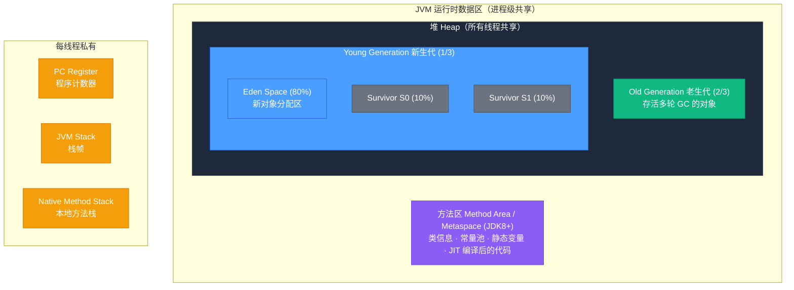
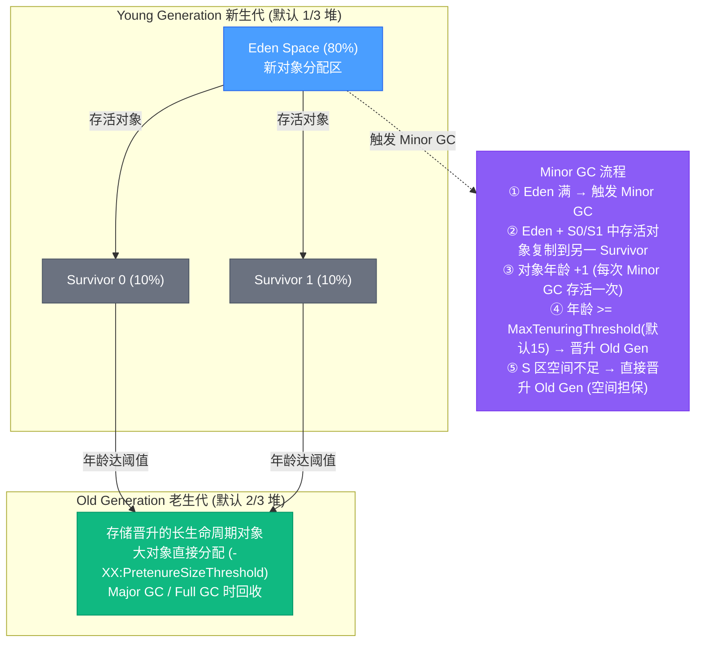
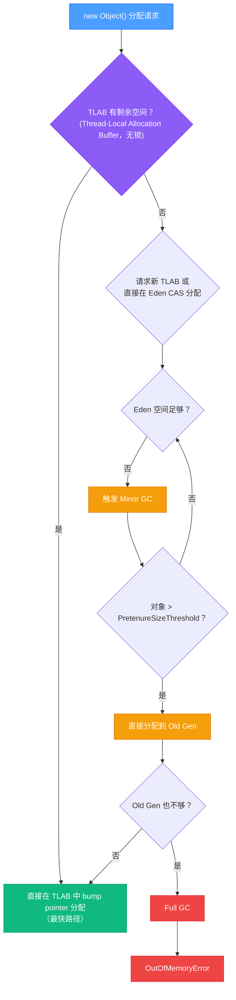
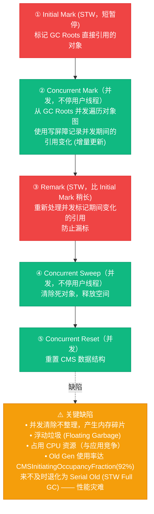
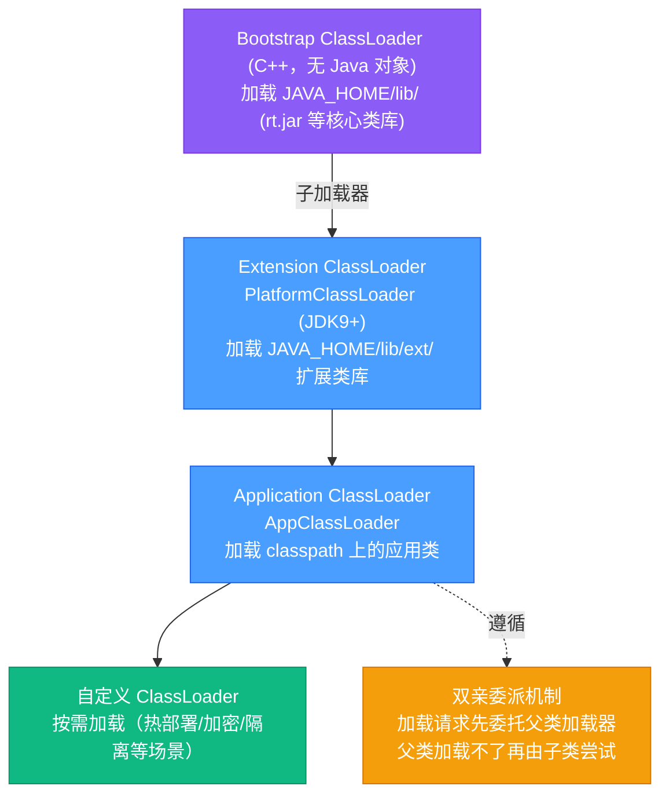
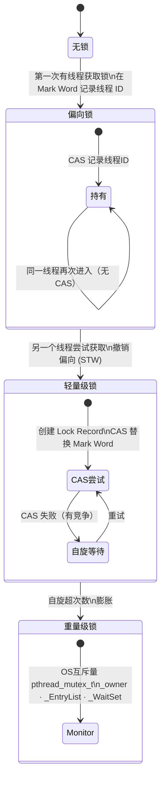
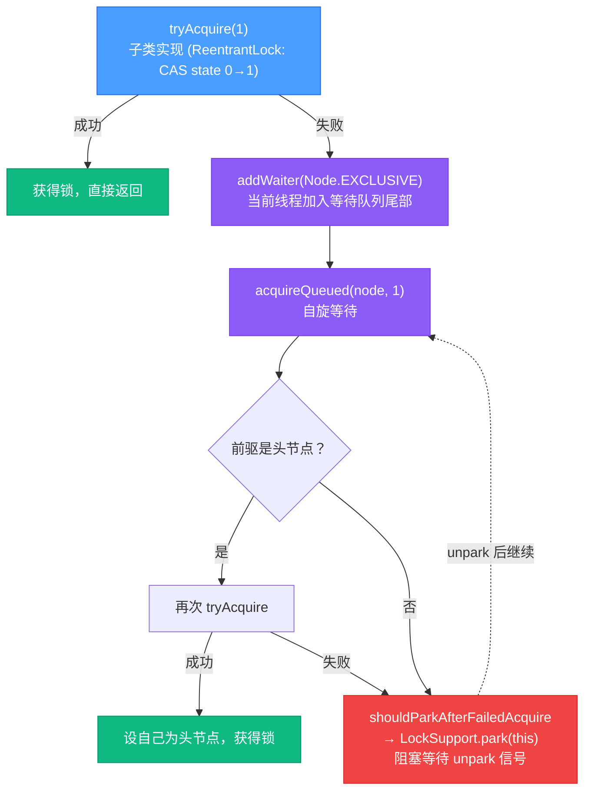
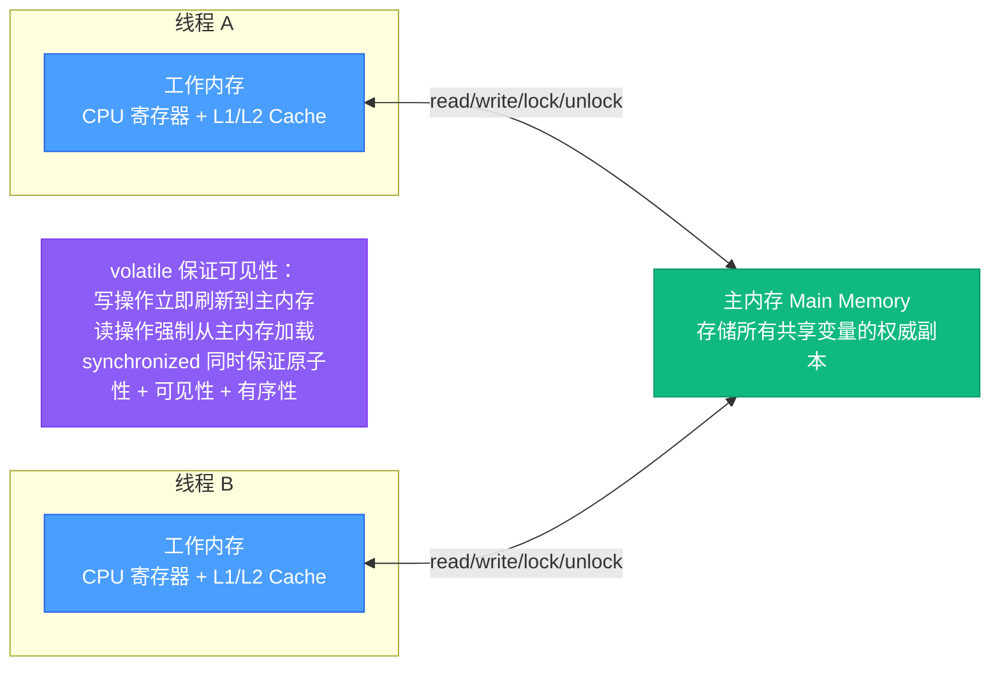

# Java 核心与 JVM 深度解析

> Java 的核心竞争力在于 JVM——理解它的内存模型、垃圾收集机制、类加载系统和并发原语，是写出高性能、高并发 Java 程序的基础。本文从 JVM 源码（OpenJDK HotSpot）出发，深度剖析这些核心机制的底层实现。

## 相关链接

- 对应面试题：[Java 核心面试题](../../../02-面试指南/02-后端面试/01-Java核心面试题.md)

## 目录

1. [JVM 内存模型](#1-jvm-内存模型)
   - 1.1 [运行时数据区](#11-运行时数据区)
   - 1.2 [堆内存分区](#12-堆内存分区)
   - 1.3 [Metaspace 元空间](#13-metaspace-元空间)
2. [垃圾收集器](#2-垃圾收集器)
   - 2.1 [GC 基础算法](#21-gc-基础算法)
   - 2.2 [CMS 收集器](#22-cms-收集器)
   - 2.3 [G1 收集器](#23-g1-收集器)
   - 2.4 [ZGC 收集器](#24-zgc-收集器)
   - 2.5 [收集器对比](#25-收集器对比)
3. [类加载机制](#3-类加载机制)
   - 3.1 [类加载流程](#31-类加载流程)
   - 3.2 [双亲委派模型](#32-双亲委派模型)
   - 3.3 [自定义类加载器](#33-自定义类加载器)
4. [并发编程底层实现](#4-并发编程底层实现)
   - 4.1 [synchronized 实现原理](#41-synchronized-实现原理)
   - 4.2 [volatile 内存语义](#42-volatile-内存语义)
   - 4.3 [CAS 与 Unsafe](#43-cas-与-unsafe)
   - 4.4 [AQS 框架](#44-aqs-框架)
   - 4.5 [ReentrantLock vs synchronized](#45-reentrantlock-vs-synchronized)
5. [Java 内存模型（JMM）](#5-java-内存模型jmm)
   - 5.1 [主内存与工作内存](#51-主内存与工作内存)
   - 5.2 [happens-before 规则](#52-happens-before-规则)
   - 5.3 [内存屏障](#53-内存屏障)
6. [JDK 21+ 新特性（2026 更新）](#6-jdk-21-新特性2026-更新)
   - 6.1 [Virtual Threads（虚拟线程）](#61-virtual-threads虚拟线程--project-loom)
   - 6.2 [Pattern Matching 增强](#62-pattern-matching-增强)
   - 6.3 [Sequenced Collections](#63-sequenced-collectionsjava-21)
   - 6.4 [String Templates](#64-string-templatespreview)

---

## 1. JVM 内存模型

### 1.1 运行时数据区

JVM 规范（JSR 133）定义的运行时数据区，HotSpot 实现如下：



**注意：** 程序计数器是 JVM 规范中**唯一不会发生 OOM 的区域**。虚拟机栈抛 `StackOverflowError`（递归太深）或 `OutOfMemoryError`（无法扩展时）。

### 1.2 堆内存分区

HotSpot 的堆基于**分代假说（Generational Hypothesis）**：大多数对象"朝生夕死"，少数对象存活很长时间。



**对象分配流程：**



### 1.3 Metaspace 元空间

JDK 8 将**永久代（PermGen）改为 Metaspace（元空间）**，主要区别：

|              | PermGen（JDK 7-）              | Metaspace（JDK 8+）       |
| ------------ | ------------------------------ | ------------------------- |
| 存储位置     | JVM 堆内（受 -Xmx 限制）       | 本地内存（Native Memory） |
| 默认大小限制 | 有上限（-XX:MaxPermSize=256m） | 无（受系统内存限制）      |
| GC 策略      | Full GC 时回收                 | Full GC 时回收            |
| OOM 原因     | 加载类太多                     | 加载类太多（但更难触发）  |

**Metaspace 存储内容：**

- 类的结构信息（字段、方法签名）
- 运行时常量池（Runtime Constant Pool）
- 方法字节码（字节码由 Code Cache 管理）
- JIT 编译产生的代码存储在 **Code Cache**（非 Metaspace）

---

## 2. 垃圾收集器

### 2.1 GC 基础算法

**标记-清除（Mark-Sweep）：**

- 标记所有可达对象 → 清除未标记对象
- 缺点：产生内存碎片

**标记-复制（Mark-Copy）：**

- 将存活对象复制到新区域，清空原区域
- 优点：无碎片；缺点：需要双倍内存
- 应用：Young Gen（Eden + Survivor）

**标记-整理（Mark-Compact）：**

- 标记存活对象 → 向一端移动 → 清除边界外内存
- 优点：无碎片；缺点：移动对象代价高
- 应用：CMS Full GC、G1 Old Region

**三色标记（Tri-color Marking）：**
用于并发 GC，解决标记过程中对象引用变化的问题：

- **白色**：未访问（GC 结束时为白色 → 需回收）
- **灰色**：已标记但其引用未全部处理
- **黑色**：自身及所有引用都已处理

### 2.2 CMS 收集器

CMS（Concurrent Mark Sweep）是 JDK 9 之前广泛使用的低延迟收集器，针对 Old Gen。



### 2.3 G1 收集器

G1（Garbage First）是 JDK 9+ 的默认收集器，可预测停顿时间。

**Region 化内存布局：**

```diagram
G1 堆内存（Region 划分，每个 Region 1-32MB，默认 2048 个）:

┌──┬──┬──┬──┬──┬──┬──┬──┬──┬──┬──┬──┬──┬──┬──┬──┐
│E │E │S │S │O │O │E │H │H │O │E │O │O │E │S │O │
└──┴──┴──┴──┴──┴──┴──┴──┴──┴──┴──┴──┴──┴──┴──┴──┘
 E=Eden  S=Survivor  O=Old  H=Humongous(大对象，>= Region/2)

特点：
- 不再要求物理连续的 Young/Old 区
- Region 可以动态成为任意角色
- 大对象直接分配到 Humongous Region（跨多个连续 Region）
```

**G1 GC 类型：**

```
1. Young GC（纯新生代 GC，STW）
   - 只回收 Eden + Survivor Region
   - 存活对象复制到新的 Survivor/Old Region
   - 控制停顿时间在 MaxGCPauseMillis（默认 200ms）内

2. Mixed GC（混合 GC，STW 但分批）
   - 当 Old Region 占比超过 InitiatingHeapOccupancyPercent（默认 45%）
   - 同时回收 Young Region + 部分 Old Region
   - 优先回收垃圾最多的 Region（"Garbage First" 得名由此）

3. Full GC（兜底，单线程 STW，尽量避免）
   - Evacuation Failure 时触发（复制对象时内存不足）
```

**G1 关键数据结构：**

```java
// Remembered Set (RSet): 记录其他 Region 对本 Region 的引用
// 避免扫描整个堆来找跨 Region 引用（每个 Region 维护自己的 RSet）
// 写屏障（Post Write Barrier）维护 RSet 更新

// Card Table: 堆被分割成 512 字节的 Card，
// 被修改的 Card 标记为 dirty，用于找出跨 Region 引用
```

### 2.4 ZGC 收集器

ZGC（Z Garbage Collector，JDK 15+ 生产就绪）目标：在任意大小堆上保持 **< 10ms 的最大停顿时间**。

**ZGC 核心技术：**

**1. 染色指针（Colored Pointers）：**

```
64位指针（低42位为实际地址，高位用于元数据）：

Bit 63-46: 未使用
Bit 45:    Finalizable（对象只有 finalizer 引用）
Bit 44:    Remapped（指针已更新到新地址）
Bit 43:    Marked1   （GC 标记位，两个用于区分 GC 轮次）
Bit 42:    Marked0
Bit 41-0:  实际对象地址（4TB 地址空间）
```

**2. 读屏障（Load Barrier）：** 每次读取对象引用时，JIT 插入检查代码：

```java
// 伪代码：ZGC 读屏障
Object ref = *(address);  // 读取引用
if (ref 的颜色位 != 当前期望颜色) {
    ref = ZBarrier::load_barrier_on_oop_field_preloaded(addr, ref);
    // 自愈：更新指针颜色，必要时重定位对象
}
```

**3. 并发重定位：** 对象被移动时，不需要立即更新所有引用，而是通过读屏障懒惰修复。

**ZGC GC 阶段：**

```
Pause Mark Start    (STW, ~1ms) — 标记 GC Roots
Concurrent Mark     (并发)      — 遍历对象图，标记存活对象
Pause Mark End      (STW, ~1ms) — 处理弱引用
Concurrent Relocate (并发)      — 将存活对象复制到新 Region
（所有引用修复通过读屏障懒惰完成）
```

### 2.5 收集器对比

| 收集器            | 目标          | Young GC 算法  | Old GC 算法         | 最大停顿             | JDK 版本    |
| ----------------- | ------------- | -------------- | ------------------- | -------------------- | ----------- |
| Serial            | 单线程简单    | 复制           | 标记-整理           | 高                   | 全版本      |
| Parallel Scavenge | 高吞吐        | 复制（多线程） | 标记-整理（多线程） | 中                   | JDK 1.4+    |
| CMS               | 低延迟（Old） | 复制           | 标记-清除           | 低（但有碎片）       | JDK 1.5-9   |
| G1                | 可预测停顿    | 复制           | 标记-复制           | 可配置（默认 200ms） | JDK 9+默认  |
| ZGC               | 超低延迟      | 复制           | 并发复制            | < 10ms               | JDK 15+生产 |
| Shenandoah        | 超低延迟      | 复制           | 并发复制            | < 10ms               | JDK 12+     |

---

## 3. 类加载机制

### 3.1 类加载流程

一个 `.class` 文件被 JVM 使用前，需经过以下阶段：

```
加载（Loading）
  → 通过类名找到 .class 字节流（classpath / 网络 / 动态生成）
  → 在方法区创建 java.lang.Class 对象作为访问入口

链接（Linking）:
  验证（Verification）
    → 验证字节码格式正确（魔数 CAFEBABE / 版本号 / 字节码语义）
    → 防止恶意字节码
  准备（Preparation）
    → 在方法区为静态变量分配内存，赋零值（非初始值）
    → static int x = 5; 此阶段 x = 0（不是 5）
  解析（Resolution）
    → 将常量池中的符号引用替换为直接引用（内存地址）
    → 类/接口/字段/方法的符号引用 → 指针/偏移量

初始化（Initialization）
  → 执行类的 <clinit>() 方法
  → 静态变量赋初始值（x = 5）、执行 static{} 块
  → 父类先于子类初始化
  → JVM 保证 <clinit> 线程安全（多线程初始化时只执行一次）
```

**类的主动引用（触发初始化的 6 种情况）：**

1. `new` 实例化对象
2. 读/写类的静态字段（非常量）
3. 调用类的静态方法
4. 反射调用（`Class.forName()`）
5. 子类初始化时，父类先初始化
6. JVM 启动时的主类

### 3.2 双亲委派模型



**委派流程（`ClassLoader.loadClass()` 源码）：**

```java
// java.lang.ClassLoader
protected Class<?> loadClass(String name, boolean resolve)
    throws ClassNotFoundException
{
    synchronized (getClassLoadingLock(name)) {
        // 1. 检查是否已加载（缓存命中）
        Class<?> c = findLoadedClass(name);
        if (c == null) {
            try {
                // 2. 委托父加载器（递归）
                if (parent != null) {
                    c = parent.loadClass(name, false);
                } else {
                    // 父加载器为 null 表示 Bootstrap ClassLoader
                    c = findBootstrapClassOrNull(name);
                }
            } catch (ClassNotFoundException e) {
                // 父加载器找不到，继续
            }

            if (c == null) {
                // 3. 父加载器都找不到，自己尝试加载
                c = findClass(name);
            }
        }
        if (resolve) resolveClass(c);
        return c;
    }
}
```

**双亲委派的意义：**

- 防止核心类被替换（`java.lang.Object` 永远由 Bootstrap 加载）
- 相同类路径的类只加载一次（类的唯一性）

**打破双亲委派的场景：**

- SPI 机制（`java.util.ServiceLoader`）：需要 Bootstrap 加载的接口，由 AppClassLoader 加载实现
- OSGi / Tomcat：每个模块/WebApp 有独立类加载器，实现类隔离
- 热部署：丢弃旧类加载器，创建新的加载更新后的类

### 3.3 自定义类加载器

```java
public class EncryptedClassLoader extends ClassLoader {
    private String classDir;

    @Override
    protected Class<?> findClass(String name) throws ClassNotFoundException {
        // 读取加密的 .class 文件
        byte[] classBytes = loadEncryptedClassBytes(name);
        // 解密
        byte[] decrypted = decrypt(classBytes);
        // 转换为 Class 对象
        return defineClass(name, decrypted, 0, decrypted.length);
    }

    private byte[] loadEncryptedClassBytes(String name) {
        String path = classDir + name.replace('.', '/') + ".clazz";
        try (FileInputStream fis = new FileInputStream(path)) {
            return fis.readAllBytes();
        } catch (IOException e) {
            throw new RuntimeException(e);
        }
    }
}
```

---

## 4. 并发编程底层实现

### 4.1 synchronized 实现原理

`synchronized` 基于 JVM 对象头的 **Mark Word** 实现锁，经历了四种状态（锁升级）：

```diagram
Object Header (64-bit JVM):

Mark Word (8 bytes):
┌──────────────────────────────────────────────────────────────┐
│ 无锁:     [对象hashCode(31)|0|分代年龄(4)|偏向锁位(0)|01]     │
│ 偏向锁:   [线程ID(54)|Epoch(2)|分代年龄(4)|偏向锁位(1)|01]   │
│ 轻量级锁: [指向线程栈帧中Lock Record的指针(62)            |00]│
│ 重量级锁: [指向堆中Monitor对象的指针(62)                  |10]│
│ GC标记:   [                                               |11]│
└──────────────────────────────────────────────────────────────┘
Klass Pointer (8 bytes，指向方法区的 Class 对象，启用压缩指针时 4 bytes)
```

**锁升级过程：**



**`synchronized` 字节码：**

```java
// synchronized(obj) { ... }
// 编译为:
MONITORENTER  // → 尝试获取 obj 的 Monitor
... // 同步代码块
MONITOREXIT   // → 释放 Monitor
// 字节码中还有异常处理的 MONITOREXIT（确保一定释放）
```

### 4.2 volatile 内存语义

`volatile` 保证：

1. **可见性**：写操作立即刷新到主内存，读操作从主内存读取
2. **有序性**：禁止特定类型的指令重排序（通过内存屏障实现）

**不保证原子性**（`i++` 仍非原子）。

```java
// DCL 双重检查锁 (Double-Checked Locking)
public class Singleton {
    // volatile 是必须的！
    private static volatile Singleton instance;

    public static Singleton getInstance() {
        if (instance == null) {           // Check 1（无锁）
            synchronized (Singleton.class) {
                if (instance == null) {   // Check 2（有锁）
                    instance = new Singleton();
                    // new Singleton() 底层分三步：
                    // 1. 分配内存
                    // 2. 初始化对象
                    // 3. 将引用指向内存地址
                    // 步骤 2、3 可能被重排序！
                    // 若不加 volatile，另一线程可能拿到未初始化的对象
                }
            }
        }
        return instance;
    }
}
```

### 4.3 CAS 与 Unsafe

CAS（Compare-And-Swap）是实现无锁并发的核心原语：

```java
// sun.misc.Unsafe 提供 CAS 操作（直接映射到 CPU 的 cmpxchg 指令）
public final native boolean compareAndSwapInt(
    Object obj,     // 目标对象
    long offset,    // 字段偏移量
    int expected,   // 期望的当前值
    int update      // 要设置的新值
);

// AtomicInteger 的 incrementAndGet() 实现：
public final int incrementAndGet() {
    return U.getAndAddInt(this, VALUE, 1) + 1;
}

// Unsafe.getAndAddInt:
public final int getAndAddInt(Object o, long offset, int delta) {
    int v;
    do {
        v = getIntVolatile(o, offset);          // 读取当前值（volatile 读）
    } while (!weakCompareAndSetInt(o, offset, v, v + delta)); // CAS 失败则重试
    return v;
}
```

**CAS 的 ABA 问题：** 值从 A → B → A，CAS 认为未变化但实际有过变化。

解决方案：`AtomicStampedReference`（带版本号的原子引用）：

```java
AtomicStampedReference<String> ref =
    new AtomicStampedReference<>("A", 0); // 初始值, 初始版本

// CAS 时同时比较版本号
ref.compareAndSet("A", "B", 0, 1); // 期望值A, 新值B, 期望版本0, 新版本1
```

### 4.4 AQS 框架

AQS（AbstractQueuedSynchronizer）是 `ReentrantLock`, `Semaphore`, `CountDownLatch`, `ReentrantReadWriteLock` 等的共同基础。

**核心数据结构：**

```java
// java.util.concurrent.locks.AbstractQueuedSynchronizer
public abstract class AbstractQueuedSynchronizer {
    // 同步状态（volatile，CAS 修改）
    // ReentrantLock 中：0=未锁，1=锁定，>1=重入次数
    private volatile int state;

    // 等待队列头节点（Sentinel Node）
    private transient volatile Node head;
    // 等待队列尾节点
    private transient volatile Node tail;

    // 等待队列节点
    static final class Node {
        volatile int waitStatus; // CANCELLED/SIGNAL/CONDITION/PROPAGATE/0
        volatile Node prev;
        volatile Node next;
        volatile Thread thread; // 等待的线程
        Node nextWaiter;        // Condition 队列中的下一个节点
    }
}
```

**AQS 独占模式获取锁流程（`lock()` → `acquire(1)`）：**



### 4.5 ReentrantLock vs synchronized

| 特性           | synchronized                 | ReentrantLock                            |
| -------------- | ---------------------------- | ---------------------------------------- |
| 实现层次       | JVM 内置，字节码层面         | Java API（AQS）                          |
| 锁释放         | 自动（出作用域）             | 必须手动 unlock()（finally 块）          |
| 可中断等待     | 不支持                       | `lockInterruptibly()` 支持               |
| 超时尝试       | 不支持                       | `tryLock(timeout, unit)` 支持            |
| 公平锁         | 非公平                       | 可选（`new ReentrantLock(true)`）        |
| Condition      | `Object.wait/notify`（一个） | 多个 Condition（`newCondition()`）       |
| 读写分离       | 不支持                       | `ReentrantReadWriteLock`                 |
| 性能（JDK 8+） | 相当                         | 相当（JVM 对 synchronized 做了大量优化） |

---

## 5. Java 内存模型（JMM）

### 5.1 主内存与工作内存

JMM 是 Java 对底层硬件内存模型的抽象，定义了线程如何访问共享变量：



JMM 定义了 8 种原子操作（lock/unlock/read/load/use/assign/store/write），确保每个操作的语义清晰，以及它们之间的次序规则。

### 5.2 happens-before 规则

happens-before 是 JMM 保证有序性的核心规则——如果操作 A happens-before 操作 B，则 A 的结果对 B 可见。

**8 条天然的 happens-before 关系：**

1. **程序顺序规则**：单线程内，前面的代码 happens-before 后面的代码
2. **Monitor 锁规则**：unlock happens-before 之后同一个锁的 lock
3. **volatile 规则**：对 volatile 字段的写 happens-before 之后对该字段的读
4. **线程启动规则**：`Thread.start()` happens-before 被启动线程的任何操作
5. **线程终止规则**：线程所有操作 happens-before `Thread.join()` 返回
6. **线程中断规则**：`interrupt()` happens-before 被中断线程检测到中断
7. **对象终结规则**：构造函数结束 happens-before `finalize()` 开始
8. **传递性**：A hb B，B hb C → A hb C

### 5.3 内存屏障

JMM 在底层通过**内存屏障（Memory Barrier）**实现 happens-before 语义：

| 屏障类型   | 作用                                                                        | 场景                    |
| ---------- | --------------------------------------------------------------------------- | ----------------------- |
| LoadLoad   | Load1; **LoadLoad**; Load2 — 确保 Load1 在 Load2 前完成                     | volatile 读后           |
| StoreStore | Store1; **StoreStore**; Store2 — 确保 Store1 在 Store2 前对外可见           | volatile 写前           |
| LoadStore  | Load1; **LoadStore**; Store2 — 确保 Load1 在 Store2 前完成                  | volatile 读后           |
| StoreLoad  | Store1; **StoreLoad**; Load2 — 确保 Store1 对所有处理器可见后，再执行 Load2 | volatile 写后（最昂贵） |

**volatile 写-读的屏障插入（JIT 编译后）：**

```
volatile 写（x = 1）:
  StoreStore 屏障  ← 禁止之前的普通写与 volatile 写重排
  写 x = 1
  StoreLoad 屏障   ← 确保 volatile 写对所有线程可见（最重的屏障，x86 上等于 mfence）

volatile 读（int y = x）:
  读 x
  LoadLoad 屏障    ← 禁止 volatile 读与之后的普通读重排
  LoadStore 屏障   ← 禁止 volatile 读与之后的普通写重排
```

**x86 平台特殊说明：** x86 是 TSO（Total Store Order）内存模型，天然保证写-写有序和读-读有序，StoreLoad 是唯一需要显式插入的屏障（对应 `lock; addl $0,0(%rsp)` 或 `mfence` 指令）。

---

## 6. JDK 21+ 新特性（2026 更新）

> **为什么关注？** JDK 21 是继 JDK 17 之后的下一个 LTS（Long-Term Support）版本，2023 年 9 月正式发布。其中的**虚拟线程（Virtual Threads）**被认为是自 Java 8 Lambda 以来最大的变革——它彻底改变了 Java 的高并发编程范式。2025-2026 年的 Spring Boot 3.2+ 已经全面拥抱虚拟线程，正在成为生产标配。

### 6.1 Virtual Threads（虚拟线程 / Project Loom）

**类比：** 传统平台线程像**出租车**——每辆车需要一个专业司机（OS 线程），成本高，数量有限（通常几千个）。虚拟线程像**共享单车**——极其轻量，按需取用，可以同时投放百万辆而成本极低。

**核心思想：** 将线程从操作系统资源解放为 JVM 管理的轻量级对象。虚拟线程运行在少量平台线程（载体线程）之上，当虚拟线程执行阻塞 I/O 时，JVM 自动将其从载体线程卸载，让载体线程执行其他虚拟线程。

```java
// 创建虚拟线程的三种方式

// 1. Thread.ofVirtual()
Thread vt = Thread.ofVirtual().name("worker-", 0).start(() -> {
    System.out.println("Running on: " + Thread.currentThread());
});

// 2. Executors.newVirtualThreadPerTaskExecutor()
try (var executor = Executors.newVirtualThreadPerTaskExecutor()) {
    // 提交 100,000 个任务，每个任务一个虚拟线程
    IntStream.range(0, 100_000).forEach(i -> {
        executor.submit(() -> {
            Thread.sleep(Duration.ofSeconds(1)); // 模拟 I/O 阻塞
            return i;
        });
    });
} // try-with-resources 自动等待所有任务完成

// 3. Thread.startVirtualThread() 快捷方式
Thread.startVirtualThread(() -> System.out.println("Hello from virtual thread!"));
```

**Structured Concurrency（结构化并发，Preview）：** 用 `StructuredTaskScope` 管理子任务生命周期，确保父任务结束时所有子任务都已完成或取消：

```java
// JDK 21 Preview: 结构化并发
try (var scope = new StructuredTaskScope.ShutdownOnFailure()) {
    // 并发执行两个子任务
    Subtask<String> user  = scope.fork(() -> fetchUser(userId));
    Subtask<Order>  order = scope.fork(() -> fetchOrder(orderId));

    scope.join();           // 等待所有子任务完成
    scope.throwIfFailed();  // 任一子任务失败则抛异常

    // 两个任务都成功，安全获取结果
    return new UserOrder(user.get(), order.get());
}
// scope 关闭时，未完成的子任务自动取消
```

**Spring Boot 3.2+ 集成：**

```yaml
# application.yml —— 一行配置开启虚拟线程
spring:
  threads:
    virtual:
      enabled: true
# Tomcat 将为每个请求分配虚拟线程，而非平台线程池
# 不再需要调整 server.tomcat.threads.max
```

**⚠️ 不适用场景：**

| 场景                            | 原因                                                                                        |
| ------------------------------- | ------------------------------------------------------------------------------------------- |
| CPU 密集型计算                  | 虚拟线程优势在于 I/O 等待时释放载体线程，CPU 密集任务无等待可释放                           |
| `synchronized` 代码块           | 虚拟线程进入 `synchronized` 时会**"钉住"（pin）**载体线程，无法卸载。应改用 `ReentrantLock` |
| 大量线程局部变量（ThreadLocal） | 百万虚拟线程 × 每线程 ThreadLocal 数据 = 巨大内存开销。应改用 Scoped Values（Preview）      |

**完整示例：虚拟线程 HTTP 服务器处理 10 万并发连接**

```java
// 虚拟线程驱动的高并发 HTTP 服务器
public class VirtualThreadHttpServer {
    public static void main(String[] args) throws Exception {
        var server = HttpServer.create(new InetSocketAddress(8080), 0);
        // 关键：使用虚拟线程执行器替代默认线程池
        server.setExecutor(Executors.newVirtualThreadPerTaskExecutor());
        server.createContext("/api", exchange -> {
            // 每个请求一个虚拟线程，阻塞 I/O 不影响吞吐
            String result = callExternalService(); // 模拟 100ms 网络 I/O
            byte[] response = result.getBytes();
            exchange.sendResponseHeaders(200, response.length);
            exchange.getResponseBody().write(response);
            exchange.close();
        });
        server.start();
        System.out.println("Server started on :8080 with virtual threads");
    }
}
```

**性能对比：Virtual Threads vs Platform Threads**

| 指标             | Platform Threads（200 线程池） | Virtual Threads           |
| ---------------- | ------------------------------ | ------------------------- |
| 最大并发连接     | ~200（受线程池限制）           | 100,000+（受内存限制）    |
| 每连接内存开销   | ~1MB（线程栈）                 | ~几 KB                    |
| 100ms I/O 的吞吐 | ~2,000 req/s                   | ~100,000+ req/s           |
| 上下文切换       | 内核态，~1-10μs                | 用户态，~100ns 级         |
| 适用场景         | CPU 密集 / 遗留代码            | I/O 密集（HTTP、DB、RPC） |

### 6.2 Pattern Matching 增强

**switch 模式匹配（Java 21 正式特性）：**

```java
// 传统写法：类型检查 + 强转 + 条件判断
Object obj = getResult();

// Java 21: switch 模式匹配 + guard clause (when)
String formatted = switch (obj) {
    case Integer i when i > 0  -> "正整数: " + i;
    case Integer i             -> "非正整数: " + i;
    case String s when s.length() > 10 -> "长字符串: " + s.substring(0, 10) + "...";
    case String s              -> "字符串: " + s;
    case null                  -> "空值";
    default                    -> "未知类型: " + obj.getClass();
};
```

**Record 模式（Java 21 正式特性）：**

```java
record Point(int x, int y) {}
record Circle(Point center, int radius) {}

// 嵌套 Record 解构
static String describe(Object shape) {
    return switch (shape) {
        case Circle(Point(int x, int y), int r) when r > 100
            -> "大圆，圆心: (" + x + "," + y + ")";
        case Circle(Point(int x, int y), int r)
            -> "圆，半径=" + r;
        default -> "未知形状";
    };
}
```

### 6.3 Sequenced Collections（Java 21）

Java 21 引入了 `SequencedCollection`、`SequencedSet`、`SequencedMap` 接口，解决了长期以来集合"无法统一访问首尾元素"的痛点。

```java
// 之前：不同集合访问首尾元素方式不一致
list.get(0);              // List
set.iterator().next();     // SortedSet
deque.getFirst();          // Deque

// Java 21: 统一的 SequencedCollection 接口
SequencedCollection<String> seq = new ArrayList<>(List.of("A", "B", "C"));
seq.getFirst();  // "A"
seq.getLast();   // "C"
seq.reversed();  // [C, B, A]（返回反转视图，不复制数据）

seq.addFirst("Z");  // [Z, A, B, C]
seq.addLast("D");   // [Z, A, B, C, D]

// SequencedMap
SequencedMap<String, Integer> map = new LinkedHashMap<>();
map.put("one", 1); map.put("two", 2); map.put("three", 3);
map.firstEntry();  // one=1
map.lastEntry();   // three=3
map.pollLastEntry(); // 移除并返回 three=3
```

### 6.4 String Templates（Preview）

```java
// JDK 21 Preview: 字符串模板（替代字符串拼接 / String.format）
String name = "World";
int year = 2026;

// STR 模板处理器（自动调用 toString）
String msg = STR."Hello \{name}, year=\{year}";
// → "Hello World, year=2026"

// 支持任意表达式
String info = STR."2 + 3 = \{2 + 3}, upper = \{name.toUpperCase()}";

// FMT 模板处理器（支持格式化）
double price = 19.99;
String formatted = FMT."价格: ¥%.2f\{price}";  // → "价格: ¥19.99"
```

> **注意：** String Templates 在 JDK 21 是 Preview 特性，JDK 23 中被撤回重新设计。生产代码暂不推荐直接依赖，但其设计理念（防注入的模板化字符串）值得关注。

---

## 常用 JVM 调优参数速查

```bash
# 堆大小
-Xms4g -Xmx4g           # 初始/最大堆（生产环境设相同值，避免动态扩容）
-Xmn1g                   # Young Gen 大小
-XX:NewRatio=2           # Old:Young = 2:1（Young=1/3 堆）

# GC 选择
-XX:+UseG1GC             # G1（JDK 9+ 默认）
-XX:MaxGCPauseMillis=200 # G1 目标停顿时间
-XX:+UseZGC              # ZGC（JDK 15+）

# GC 日志（JDK 9+ 格式）
-Xlog:gc*:file=gc.log:time,uptime,level,tags:filecount=5,filesize=100m

# Metaspace
-XX:MetaspaceSize=256m   # 触发第一次 Full GC 的 Metaspace 大小
-XX:MaxMetaspaceSize=512m

# 线程栈
-Xss256k                 # 每个线程栈大小（默认 512k，降低可支持更多线程）

# 故障诊断
-XX:+HeapDumpOnOutOfMemoryError
-XX:HeapDumpPath=/tmp/java_heapdump.hprof
-XX:+PrintFlagsFinal     # 打印所有 JVM 参数最终值
```
