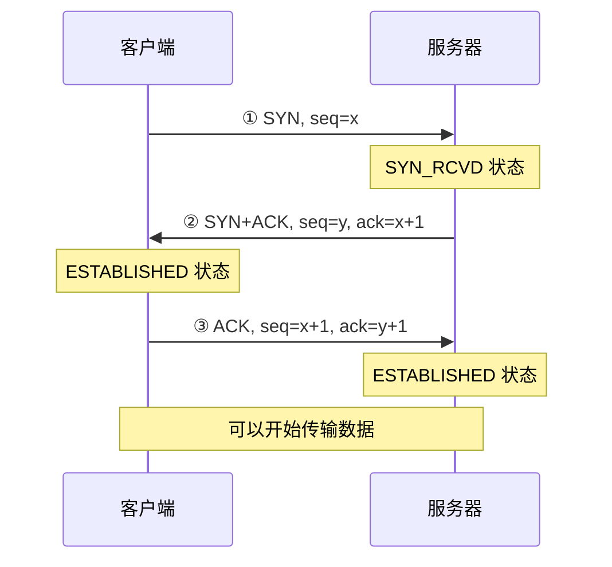
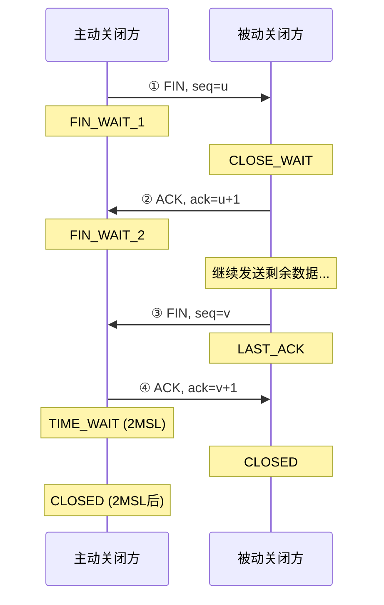
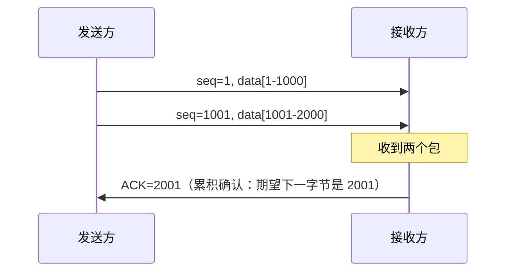
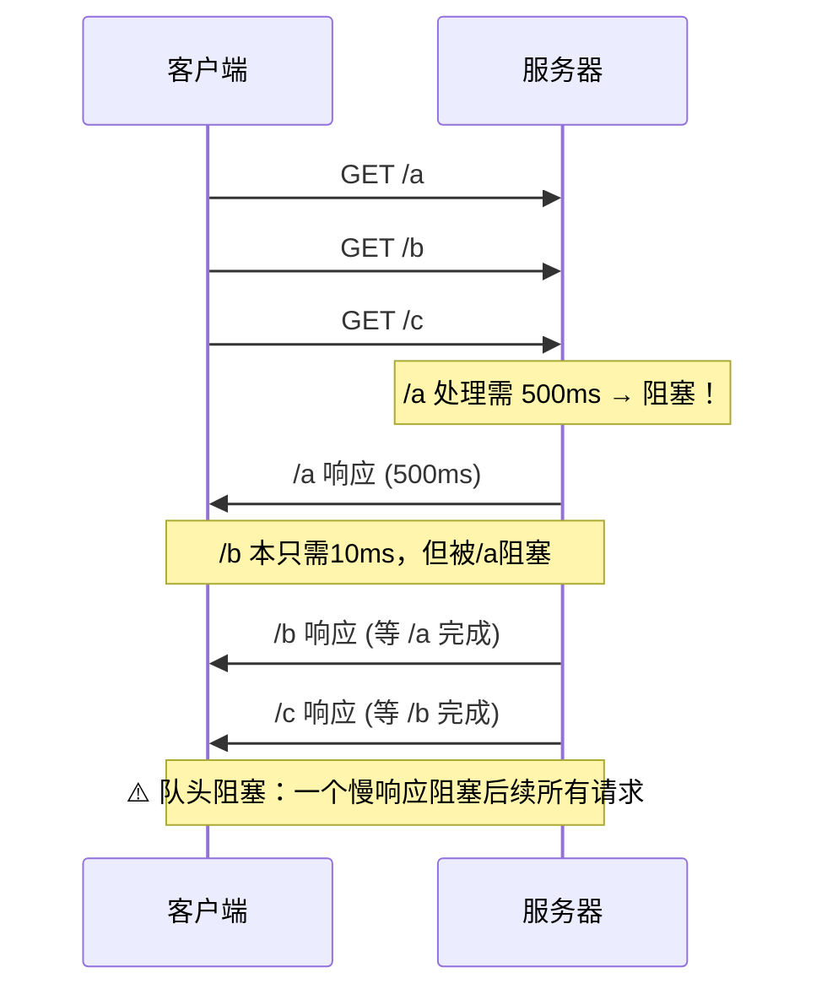
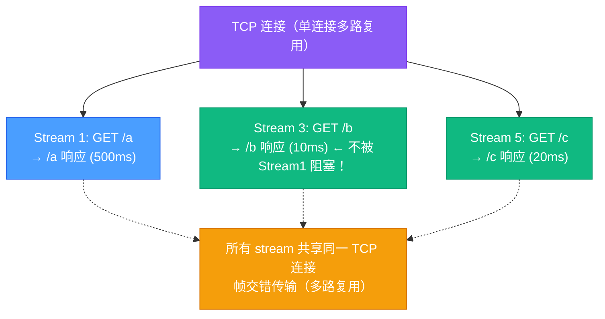
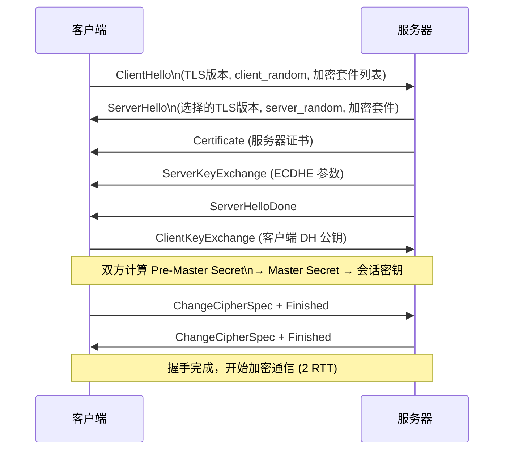
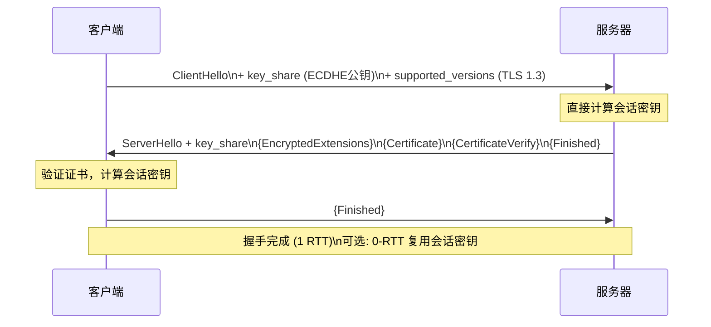
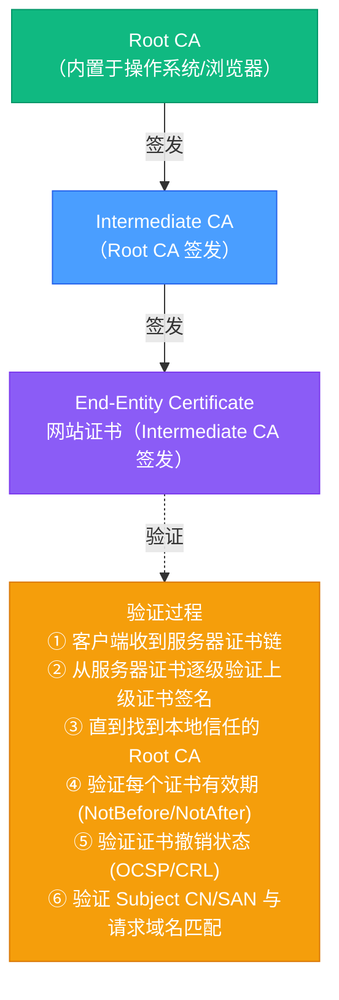

# 网络协议与 HTTP 深度解析

> 网络协议栈是所有分布式系统的基础——理解 TCP 的可靠传输机制、HTTP 各版本的演进逻辑、TLS 握手的密码学原理，以及 WebSocket 如何在 HTTP 之上实现全双工通信，是构建高性能后端服务的必备知识。

## 相关链接

- 对应面试题：[网络协议面试题](../../../02-面试指南/02-后端面试/03-网络协议面试题.md)

## 目录

1. [TCP/IP 核心机制](#1-tcpip-核心机制)
   - 1.1 [三次握手](#11-三次握手)
   - 1.2 [四次挥手](#12-四次挥手)
   - 1.3 [可靠传输机制](#13-可靠传输机制)
   - 1.4 [拥塞控制](#14-拥塞控制)
   - 1.5 [TCP 常见问题](#15-tcp-常见问题)
2. [HTTP 协议演进](#2-http-协议演进)
   - 2.1 [HTTP/1.0 vs HTTP/1.1](#21-http10-vs-http11)
   - 2.2 [HTTP/2 核心特性](#22-http2-核心特性)
   - 2.3 [HTTP/3 与 QUIC](#23-http3-与-quic)
   - 2.4 [协议对比](#24-协议对比)
3. [HTTPS 与 TLS](#3-https-与-tls)
   - 3.1 [TLS 1.2 握手流程](#31-tls-12-握手流程)
   - 3.2 [TLS 1.3 握手优化](#32-tls-13-握手优化)
   - 3.3 [证书链验证](#33-证书链验证)
   - 3.4 [常见加密套件](#34-常见加密套件)
4. [WebSocket 协议](#4-websocket-协议)
   - 4.1 [协议升级握手](#41-协议升级握手)
   - 4.2 [帧格式](#42-帧格式)
   - 4.3 [WebSocket vs SSE vs 长轮询](#43-websocket-vs-sse-vs-长轮询)
5. [HTTP/3 与 QUIC 生产实践（2026）](#5-http3-与-quic-生产实践2026)
   - 5.1 [HTTP/3 采用现状](#51-http3-采用现状2026)
   - 5.2 [nginx QUIC 配置实战](#52-nginx-quic-配置实战)
   - 5.3 [客户端测试与调试](#53-客户端测试与调试)
   - 5.4 [0-RTT 安全考量](#54-0-rtt-恢复的安全考量)
   - 5.5 [连接迁移的真实收益](#55-连接迁移的真实收益)
   - 5.6 [gRPC over HTTP/3](#56-grpc-over-http3)
   - 5.7 [生产环境性能数据](#57-生产环境性能数据)

---

## 1. TCP/IP 核心机制

### 1.1 三次握手

TCP 三次握手建立连接，确保双方都有发送和接收能力：



**TCP 头部关键字段（RFC 793）：**

```
TCP Header:
 0                   1                   2                   3
 0 1 2 3 4 5 6 7 8 9 0 1 2 3 4 5 6 7 8 9 0 1 2 3 4 5 6 7 8 9 0 1
+-+-+-+-+-+-+-+-+-+-+-+-+-+-+-+-+-+-+-+-+-+-+-+-+-+-+-+-+-+-+-+-+
|          Source Port          |       Destination Port        |
+-+-+-+-+-+-+-+-+-+-+-+-+-+-+-+-+-+-+-+-+-+-+-+-+-+-+-+-+-+-+-+-+
|                        Sequence Number                        |
+-+-+-+-+-+-+-+-+-+-+-+-+-+-+-+-+-+-+-+-+-+-+-+-+-+-+-+-+-+-+-+-+
|                    Acknowledgment Number                      |
+-+-+-+-+-+-+-+-+-+-+-+-+-+-+-+-+-+-+-+-+-+-+-+-+-+-+-+-+-+-+-+-+
|  Data |           |U|A|P|R|S|F|                               |
| Offset| Reserved  |R|C|S|S|Y|I|            Window             |
|       |           |G|K|H|T|N|N|                               |
+-+-+-+-+-+-+-+-+-+-+-+-+-+-+-+-+-+-+-+-+-+-+-+-+-+-+-+-+-+-+-+-+
|           Checksum            |         Urgent Pointer        |
+-+-+-+-+-+-+-+-+-+-+-+-+-+-+-+-+-+-+-+-+-+-+-+-+-+-+-+-+-+-+-+-+
|                    Options                    |    Padding    |
+-+-+-+-+-+-+-+-+-+-+-+-+-+-+-+-+-+-+-+-+-+-+-+-+-+-+-+-+-+-+-+-+
|                             data                              |
+-+-+-+-+-+-+-+-+-+-+-+-+-+-+-+-+-+-+-+-+-+-+-+-+-+-+-+-+-+-+-+-+
```

**为什么是三次而不是两次？**

- 两次握手无法确认**客户端能接收服务器数据**（服务器不知道第二次握手客户端是否收到）
- 更关键：防止**历史连接**（之前因网络延迟而滞留的 SYN）被服务器错误建立连接。两次握手时，旧 SYN 到达服务器，服务器立即建立连接，资源浪费；三次握手时，客户端会用 RST 拒绝已过期的连接请求。

**SYN Flood 攻击：** 攻击者发送大量 SYN 包但不完成握手，耗尽服务器 SYN Queue。对策：`SYN Cookies`（服务器在 SYN+ACK 中携带 cookie，收到 ACK 时验证，不需要为半开连接存储状态）。

### 1.2 四次挥手

TCP 连接是全双工的，关闭需要双方各自关闭：



**TIME_WAIT 的作用（2MSL = 2 × Maximum Segment Lifetime，通常 60s-120s）：**

1. 确保最后的 ACK 能到达对方（若 ACK 丢失，对方重发 FIN，TIME_WAIT 状态可以响应）
2. 让本次连接的所有报文在网络中消失，避免被新连接误接收

**TIME_WAIT 过多的问题：** 高并发短连接时（如 HTTP/1.0），客户端会积累大量 TIME_WAIT 连接，耗尽端口。

解决方案：

```bash
# 允许 TIME_WAIT 状态的 socket 被新连接复用（需要序列号和时间戳支持）
sysctl -w net.ipv4.tcp_tw_reuse=1

# 减少 MSL 时间
sysctl -w net.ipv4.tcp_fin_timeout=30

# 增加端口范围
sysctl -w net.ipv4.ip_local_port_range="1024 65535"
```

**为什么是四次而不是三次？**

- 收到 FIN 后，服务器可能还有数据要发送，所以 ACK 和 FIN 分开发送
- 如果服务器没有数据要发，可以合并为三次（FIN+ACK 合并，即三次挥手）

### 1.3 可靠传输机制

**序列号（Sequence Number）与确认号（ACK）：**



**滑动窗口（Sliding Window）：**

```diagram
发送缓冲区：
          ←───已发送已确认──→←──已发送未确认──→←──可发送──→←──暂不可发送──→
         |     (released)    |   (in flight)   | (window) |   (blocked)   |
                              ↑                             ↑
                         SND.UNA (最早未确认)        SND.UNA + window

接收窗口（rwnd）= 接收方缓冲区剩余空间
拥塞窗口（cwnd）= 拥塞控制算法计算的限制

实际发送窗口 = min(rwnd, cwnd)
```

**超时重传（RTO）：** 发送方维护 RTT 估算值，`RTO = SRTT + 4 * RTTVAR`。若超时未收到 ACK，重传并将 RTO 翻倍（指数退避）。

**快速重传（Fast Retransmit）：** 收到 3 个重复 ACK 时，立即重传丢失的报文，无需等待超时（3-dup-ACK 表示后续包已到达，只有一个包丢失）。

**SACK（Selective ACK）：** 允许接收方通告哪些非连续的数据块已收到，发送方只需重传真正丢失的包（而非重传丢失点之后的所有包）。

### 1.4 拥塞控制

TCP 拥塞控制防止网络过载，四个核心算法（RFC 5681）：

```diagram
cwnd（拥塞窗口）变化曲线：

cwnd
 │         ╱╲ 拥塞发生
 │        ╱  ╲
 │       ╱    └─ 拥塞避免（线性增长 +1 MSS/RTT）
 │      ╱
 │─────╱──────────────────── ssthresh（慢启动阈值）
 │  ╱ 慢启动（指数增长，实际很快）
 │╱
 └─────────────────────────────────────→ time
   连接         检测到                 再次
   开始         拥塞                  增长
```

**四个阶段：**

| 阶段                             | 触发条件              | cwnd 变化                                   |
| -------------------------------- | --------------------- | ------------------------------------------- |
| 慢启动（Slow Start）             | 连接初始化 / RTO 超时 | 每个 ACK +1 MSS（指数增长）                 |
| 拥塞避免（Congestion Avoidance） | cwnd >= ssthresh      | 每 RTT +1 MSS（线性增长）                   |
| 快速恢复（Fast Recovery）        | 3 个重复 ACK（Reno）  | ssthresh = cwnd/2, cwnd = ssthresh + 3      |
| RTO 超时                         | 超时重传触发          | ssthresh = cwnd/2, cwnd = 1 MSS，重新慢启动 |

**CUBIC（Linux 默认，RFC 8312）：** 拥塞避免阶段使用三次方函数而非线性，在高带宽高延迟网络中更激进地利用带宽，同时碰到拥塞后更平稳。

**BBR（Bottleneck Bandwidth and RTT，Google）：** 不依赖丢包信号，而是测量带宽（BtlBW）和往返时间（RTprop），主动控制在最优工作点，在高丢包率网络（卫星链路）性能远优于 CUBIC。

### 1.5 TCP 常见问题

**粘包与拆包：** TCP 是字节流协议，没有消息边界。解决方案：

1. 定长消息（简单但浪费）
2. 分隔符（如 HTTP 的 `\r\n\r\n`）
3. 长度前缀（先读 N 字节长度，再读 N 字节数据）

**Keep-Alive：** TCP 层的 keep-alive 探测空闲连接是否存活（`tcp_keepalive_time=7200s`），与 HTTP Keep-Alive（连接复用）不同。

**Nagle 算法：** 小数据累积后一起发送，减少小包数量。副作用：交互式应用（SSH/游戏）延迟增加 → `TCP_NODELAY` 禁用 Nagle。

---

## 2. HTTP 协议演进

### 2.1 HTTP/1.0 vs HTTP/1.1

**HTTP/1.0 的问题：** 每个请求都需要新建 TCP 连接，频繁三次握手代价高。

**HTTP/1.1 改进：**

```
HTTP/1.0: 一个请求 一个连接
  连接建立 → GET /index.html → 响应 → 连接关闭
  连接建立 → GET /style.css  → 响应 → 连接关闭
  连接建立 → GET /script.js  → 响应 → 连接关闭

HTTP/1.1: 持久连接（Connection: keep-alive，默认开启）
  连接建立 → GET /index.html → 响应
           → GET /style.css  → 响应   （复用同一连接）
           → GET /script.js  → 响应
           → Connection: close → 连接关闭
```

**HTTP/1.1 的队头阻塞（Head-of-Line Blocking）：**



### 2.2 HTTP/2 核心特性

HTTP/2（RFC 7540）基于 SPDY，彻底解决了 HTTP/1.1 的性能问题。

**1. 二进制分帧（Binary Framing）：**

```diagram
HTTP/1.1 是文本协议:
  GET /index.html HTTP/1.1\r\n
  Host: example.com\r\n
  \r\n

HTTP/2 是二进制帧:
  ┌──────────────────────────────────────────┐
  │  Length (24 bits) │ Type (8) │ Flags (8) │
  │  Stream Identifier (31 bits)             │
  │  Frame Payload (Length bytes)            │
  └──────────────────────────────────────────┘
  Type: DATA(0x0) / HEADERS(0x1) / SETTINGS(0x4) / PUSH_PROMISE(0x5) / ...
```

**2. 多路复用（Multiplexing）：** 单条 TCP 连接上并行传输多个请求/响应（每个请求有独立的 Stream ID），真正解决 HTTP 层的队头阻塞：



**3. 头部压缩（HPACK）：** 使用静态表 + 动态表压缩 HTTP 头部：

```
静态表（61个常见头部字段，如 :method GET = 2, :status 200 = 8）
动态表（运行时添加，LRU 淘汰）

例如 Authorization: Bearer xxx 首次发送需完整字段（+ 加入动态表）
第二次发送：仅发送动态表索引（1-2 字节 vs 原来数十字节）
```

**4. 服务器推送（Server Push）：** 服务器可以主动推送客户端可能需要的资源（如 HTML 引用的 CSS/JS），减少往返时间。

**5. 流量控制与优先级：** 每个 Stream 和整个连接都有独立的流量控制窗口，支持 Stream 优先级（权重 1-256 + 依赖关系树）。

**HTTP/2 的残留问题：TCP 层队头阻塞**

```diagram
HTTP/2 解决了 HTTP 层的队头阻塞，但 TCP 层仍存在:

TCP 连接上的丢包:
  ─── Frame(Stream1) Frame(Stream3) Frame(Stream5) ──→
  若 Frame(Stream3) 丢失，TCP 会阻塞所有后续帧的交付，
  直到 Stream3 的帧重传成功为止
  → Stream1 和 Stream5 的数据虽已到达，也要等待
```

### 2.3 HTTP/3 与 QUIC

HTTP/3（RFC 9114）将传输层从 TCP 换为 **QUIC**（Quick UDP Internet Connections），在 UDP 之上实现可靠传输，根本解决 TCP 层队头阻塞。

**QUIC 核心特性：**

**1. 独立 Stream 可靠传输：** QUIC 实现了 Stream 层的丢包重传，丢包只影响对应 Stream，其他 Stream 继续传输：

```
QUIC 连接上的丢包:
  Stream 1 的 Packet 丢失
    → 只有 Stream 1 暂停，等待重传
    → Stream 3 和 Stream 5 继续传输不受影响！
```

**2. 0-RTT 连接建立：** QUIC 将握手与 TLS 合并，首次连接 1-RTT，再次连接 0-RTT：

```
HTTP/1.1 + TLS 1.2 新连接: TCP SYN + TCP SYN-ACK + TCP ACK + TLS ClientHello + ...
                            = 3-RTT before data

HTTP/2 + TLS 1.3:           TCP SYN + TCP ACK + QUIC/TLS handshake
                            = 1-RTT before data

HTTP/3 + QUIC（再次连接）:  直接发送带数据的 QUIC 包（使用缓存的会话票据）
                            = 0-RTT before data
```

**3. 连接迁移（Connection Migration）：** QUIC 用 Connection ID 标识连接（而非 IP:Port 四元组），网络切换（WiFi → 4G）时连接不中断。

**4. 用户态实现：** QUIC 在应用层（UDP + TLS 1.3），无需内核支持，更新更灵活。

**QUIC 数据包格式（简化）：**

```diagram
QUIC Long Header Packet:
┌──────────────────────────────────────────────┐
│ Header Form (1) │ Fixed Bit (1) │ ...        │
│ Version (32 bits)                            │
│ Destination Connection ID Length (8)         │
│ Destination Connection ID (0-20 bytes)       │
│ Source Connection ID Length (8)              │
│ Source Connection ID (0-20 bytes)            │
│ [Packet Type Specific Fields]                │
│ Payload (QUIC Frames, TLS-encrypted)         │
└──────────────────────────────────────────────┘
```

### 2.4 协议对比

| 特性       | HTTP/1.1                    | HTTP/2          | HTTP/3                  |
| ---------- | --------------------------- | --------------- | ----------------------- |
| 传输层     | TCP                         | TCP             | QUIC (UDP)              |
| 连接数     | 6-8个并行连接（浏览器限制） | 1个连接         | 1个连接                 |
| 头部       | 文本，重复发送              | HPACK 压缩      | QPACK 压缩              |
| 多路复用   | ✗（管道化有缺陷）           | ✓（HTTP 层）    | ✓（Stream 级别）        |
| 队头阻塞   | HTTP 层 + TCP 层            | TCP 层          | 无                      |
| 握手延迟   | 1 RTT (TLS 2 RTT)           | 同 1.1          | 1 RTT（0 RTT 再次连接） |
| 服务器推送 | ✗                           | ✓               | ✓（但浏览器支持有限）   |
| 连接迁移   | ✗                           | ✗               | ✓（QUIC Connection ID） |
| 标准发布   | RFC 7230 (1997/1999)        | RFC 7540 (2015) | RFC 9114 (2022)         |

---

## 3. HTTPS 与 TLS

### 3.1 TLS 1.2 握手流程



**密钥派生过程：**

```
Pre-Master Secret = ECDH(client_private, server_public)
                  = ECDH(server_private, client_public)  (相同结果)

Master Secret = PRF(Pre-Master Secret, "master secret",
                    client_random + server_random, 48 bytes)

从 Master Secret 派生:
  client_write_key (对称加密密钥)
  server_write_key
  client_write_MAC_key (消息认证码密钥)
  server_write_MAC_key
  client_write_IV (初始向量)
  server_write_IV
```

**TLS 1.2 握手需要 2 个 RTT**（ClientHello → ServerHello/Cert/Done → ClientKey/Finished → Finished）。

### 3.2 TLS 1.3 握手优化

TLS 1.3（RFC 8446）大幅简化握手，只需 **1 RTT**（甚至 0 RTT）：



**TLS 1.3 的主要变化：**

1. **精简密码套件：** 只支持 5 种（AEAD 加密，如 AES-128-GCM），移除 RC4/3DES/RSA 密钥交换等弱算法
2. **强制前向保密（PFS）：** 移除静态 RSA 和 DH 密钥交换，只允许临时 ECDHE，历史会话记录无法被解密
3. **0-RTT 恢复：** 基于 PSK（Pre-Shared Key / Session Ticket），客户端在第一个消息就携带应用数据，代价是失去对重放攻击的防护（仅用于幂等操作）

### 3.3 证书链验证



**证书透明度（Certificate Transparency, CT）：** 所有受信任的 CA 必须将签发的证书记录到公开的 CT Log（Merkle 树结构），浏览器检查 SCT（Signed Certificate Timestamp），防止 CA 伪造证书。

### 3.4 常见加密套件

**TLS 1.3 支持的加密套件（5种）：**

| 套件                         | 说明                                      |
| ---------------------------- | ----------------------------------------- |
| TLS_AES_128_GCM_SHA256       | AES-128 GCM 加密 + SHA256                 |
| TLS_AES_256_GCM_SHA384       | AES-256 GCM 加密 + SHA384                 |
| TLS_CHACHA20_POLY1305_SHA256 | ChaCha20-Poly1305（移动设备友好）+ SHA256 |
| TLS_AES_128_CCM_SHA256       | AES-128 CCM（IoT 设备）                   |
| TLS_AES_128_CCM_8_SHA256     | AES-128 CCM-8                             |

**TLS 1.2 套件命名规范（ECDHE_RSA_AES_256_GCM_SHA384）：**

- 密钥交换算法：ECDHE（椭圆曲线 Diffie-Hellman 临时）
- 身份认证算法：RSA（用服务器 RSA 证书签名 DH 参数）
- 对称加密算法：AES_256_GCM（256位 AES，GCM 模式，AEAD）
- 散列算法（PRF）：SHA384

---

## 4. WebSocket 协议

### 4.1 协议升级握手

WebSocket 在 HTTP 基础上升级，复用现有 HTTP 基础设施（端口 80/443、代理等）：

```
客户端 → 服务器（HTTP Upgrade 请求）:

GET /chat HTTP/1.1
Host: server.example.com
Upgrade: websocket                        ← 申请升级到 WebSocket
Connection: Upgrade
Sec-WebSocket-Key: dGhlIHNhbXBsZSBub25jZQ==  ← 16 字节随机值（Base64）
Sec-WebSocket-Version: 13
Origin: http://example.com
[空行]

---

服务器 → 客户端（HTTP 101 Switching Protocols）:

HTTP/1.1 101 Switching Protocols
Upgrade: websocket
Connection: Upgrade
Sec-WebSocket-Accept: s3pPLMBiTxaQ9kYGzzhZRbK+xOo=   ← 握手验证
[空行]

握手完成后，双方可以在 TCP 连接上进行全双工 WebSocket 通信
```

**Sec-WebSocket-Accept 计算：**

```python
import hashlib, base64
magic = "258EAFA5-E914-47DA-95CA-C5AB0DC85B11"  # RFC 规定的魔法字符串
key = "dGhlIHNhbXBsZSBub25jZQ=="  # 客户端发来的 key
combined = key + magic
accept = base64.b64encode(hashlib.sha1(combined.encode()).digest()).decode()
# accept = "s3pPLMBiTxaQ9kYGzzhZRbK+xOo="
```

### 4.2 帧格式

WebSocket 数据以**帧（Frame）**传输（RFC 6455）：

```
WebSocket Frame:

 0                   1                   2                   3
 0 1 2 3 4 5 6 7 8 9 0 1 2 3 4 5 6 7 8 9 0 1 2 3 4 5 6 7 8 9 0 1
+-+-+-+-+-------+-+-------------+-------------------------------+
|F|R|R|R| opcode|M| Payload len |    Extended payload length    |
|I|S|S|S|  (4)  |A|     (7)    |             (16/64)           |
|N|V|V|V|       |S|             |   (if payload len==126/127)   |
| |1|2|3|       |K|             |                               |
+-+-+-+-+-------+-+-------------+ - - - - - - - - - - - - - - -+
|     Extended payload length continued, if payload len == 127  |
+ - - - - - - - - - - - - - - -+-------------------------------+
|                               |Masking-key, if MASK set to 1  |
+-------------------------------+-------------------------------+
| Masking-key (continued)       |          Payload Data         |
+-------------------------------- - - - - - - - - - - - - - - -+
:                     Payload Data continued ...                :
+ - - - - - - - - - - - - - - - - - - - - - - - - - - - - - - +
|                     Payload Data continued ...                |
+---------------------------------------------------------------+
```

**关键字段：**

| 字段            | 说明                                                               |
| --------------- | ------------------------------------------------------------------ |
| FIN (1 bit)     | 1 = 最后一个分片；0 = 还有后续分片                                 |
| RSV1-3 (3 bits) | 保留，扩展用（如 permessage-deflate 压缩使用 RSV1）                |
| Opcode (4 bits) | 0x0=继续帧, 0x1=文本帧, 0x2=二进制帧, 0x8=关闭, 0x9=Ping, 0xA=Pong |
| MASK (1 bit)    | 1 = 客户端到服务器的帧必须掩码（防止缓存污染攻击）                 |
| Payload len     | 7 bits（< 126）/ 16 bits（126）/ 64 bits（127）                    |
| Masking-key     | 4 字节随机掩码，XOR 每个 payload 字节                              |

**心跳机制（Ping/Pong）：**

```python
# 服务器发送 Ping 帧（opcode=0x9）
# 客户端必须回复 Pong 帧（opcode=0xA），携带相同 payload
# 用于检测连接是否存活、维持 NAT 映射
```

### 4.3 WebSocket vs SSE vs 长轮询

|             | 长轮询（Long Polling） | SSE（Server-Sent Events） | WebSocket               |
| ----------- | ---------------------- | ------------------------- | ----------------------- |
| 方向        | 双向（但效率低）       | 服务器→客户端（单向）     | 全双工                  |
| 协议        | HTTP                   | HTTP（持久连接）          | 自定义协议（HTTP 升级） |
| 实时性      | 中等（有延迟）         | 高                        | 极高                    |
| 服务器推送  | 间接（轮询）           | ✓                         | ✓                       |
| 自动重连    | 客户端实现             | 浏览器自动重连            | 需客户端实现            |
| 防火墙/代理 | 无问题                 | 无问题                    | 偶有问题（80/443 OK）   |
| 消息格式    | 自定义                 | text/event-stream         | 二进制/文本帧           |
| 适用场景    | 简单实时通知           | 实时 Feed/通知（单向）    | 聊天/游戏/协作编辑      |

**SSE 格式示例（`text/event-stream`）：**

```
HTTP/1.1 200 OK
Content-Type: text/event-stream
Cache-Control: no-cache
Connection: keep-alive

event: message
data: {"type": "update", "value": 42}

event: heartbeat
data: ping

: 这是注释行，可用于 keep-alive

retry: 3000    ← 断线重连间隔（毫秒）
id: 1234       ← 事件 ID（Last-Event-ID 头重连时发送）
data: ...
```

---

## 5. HTTP/3 与 QUIC 生产实践（2026）

> **为什么关注？** 截至 2026 年，HTTP/3 已经从"实验性技术"变成了"生产标配"。全球 Top 1000 网站中超过 75% 支持 HTTP/3，主流 CDN（Cloudflare、Akamai、AWS CloudFront）全面支持，nginx 官方 QUIC 模块已进入 stable 分支。对于后端工程师而言，理解 HTTP/3 的生产部署和调优已经是必修课。

### 5.1 HTTP/3 采用现状（2026）

```
HTTP/3 生态成熟度（2026）:

CDN / 云厂商:
  ✅ Cloudflare     — 2022 年起默认开启，全球最大 HTTP/3 部署
  ✅ Akamai         — 2023 年全面 GA
  ✅ AWS CloudFront — 2024 年 GA，支持 0-RTT
  ✅ Google Cloud CDN — 默认开启
  ✅ Azure CDN      — 2024 年 GA

Web 服务器:
  ✅ nginx 1.25+    — 原生 QUIC 模块（--with-http_v3_module）
  ✅ Caddy 2.x      — 默认支持 HTTP/3
  ✅ LiteSpeed      — 最早支持的商业服务器
  ⚠️ Apache         — 通过 mod_h3 实验性支持

编程语言 / 框架:
  ✅ Go net/http    — Go 1.24+ 通过 quic-go 支持
  ✅ Node.js 22+    — 实验性 HTTP/3 支持
  ✅ curl 8.x       — --http3 flag
  ⚠️ Java           — Jetty 12 支持，Spring Boot 评估中

浏览器:
  ✅ Chrome / Edge / Firefox / Safari — 全部默认启用
```

### 5.2 nginx QUIC 配置实战

```nginx
# nginx 1.25+: HTTP/3 配置
http {
    server {
        # HTTP/3 (QUIC) — 监听 UDP 443 端口
        listen 443 quic reuseport;
        # HTTP/2 — 仍保留作为降级方案
        listen 443 ssl;

        ssl_certificate     /etc/ssl/certs/example.com.pem;
        ssl_certificate_key /etc/ssl/private/example.com.key;

        # TLS 1.3 是 HTTP/3 的硬性要求
        ssl_protocols TLSv1.3;

        # 通告 HTTP/3 可用（Alt-Svc header）
        # 浏览器首次用 HTTP/2 连接后，通过此头发现 HTTP/3 支持
        add_header Alt-Svc 'h3=":443"; ma=86400';

        # QUIC 特有配置
        quic_retry on;           # 启用地址验证（防 DDoS）
        ssl_early_data on;       # 启用 0-RTT（注意安全考量）

        location / {
            proxy_pass http://backend;
            # 将连接信息传递给后端
            proxy_set_header X-Forwarded-Proto $scheme;
        }
    }
}
```

### 5.3 客户端测试与调试

```bash
# curl 测试 HTTP/3（curl 8.x + 使用 HTTP/3 库编译）
curl --http3 -I https://example.com
# HTTP/3 200
# alt-svc: h3=":443"; ma=86400

# 强制使用 HTTP/3（不降级）
curl --http3-only https://example.com

# Chrome 查看连接协议
# DevTools → Network → Protocol 列 显示 "h3"

# Wireshark 抓 QUIC 包
# 过滤器: udp.port == 443
# QUIC 包默认加密，需要设置 SSLKEYLOGFILE 才能解密
# export SSLKEYLOGFILE=~/quic_keys.log
```

### 5.4 0-RTT 恢复的安全考量

HTTP/3 支持 0-RTT 连接恢复（客户端重连时无需等待握手即可发送数据），但存在**重放攻击（Replay Attack）**风险：

```diagram
0-RTT 安全风险:

  客户端 ──[0-RTT: GET /transfer?amount=100]──→ 服务器
                       ↑
             攻击者截获并重放这个包
  攻击者  ──[0-RTT: GET /transfer?amount=100]──→ 服务器
              ⚠️ 服务器可能会执行两次转账！

安全最佳实践:
  ✅ 幂等请求（GET / HEAD）可以开启 0-RTT
  ❌ 非幂等请求（POST / PUT / DELETE）不应在 0-RTT 中发送
  ✅ 服务端使用 anti-replay 机制（单次令牌、时间窗口）
  ✅ nginx: ssl_early_data on + proxy_set_header Early-Data $ssl_early_data
     后端检查 Early-Data: 1 头部，对敏感操作拒绝 0-RTT 数据
```

### 5.5 连接迁移的真实收益

QUIC 基于**连接 ID**（而非 TCP 的四元组）标识连接，实现了无感知的连接迁移：

```diagram
场景：用户在地铁中从 WiFi 切换到 4G

TCP/HTTP/2:
  WiFi IP: 192.168.1.100 ──[TCP 连接]──→ 服务器
  切换 4G → IP 变为 10.0.0.50
  ❌ TCP 连接断开（四元组变了）
  ❌ 需要重新握手（1-2 RTT）
  ❌ 应用层需要重试未完成的请求

QUIC/HTTP/3:
  WiFi IP: 192.168.1.100 ──[QUIC 连接, CID=abc123]──→ 服务器
  切换 4G → IP 变为 10.0.0.50
  ✅ QUIC 通过 Connection ID 识别连接（不依赖 IP）
  ✅ 连接无缝迁移，0 RTT 延迟
  ✅ 正在传输的数据不受影响
```

**实测数据（移动网络场景）：** 网络切换时的请求完成率从 TCP 的 ~60% 提升到 QUIC 的 ~99%，用户感知延迟降低 200-500ms。

### 5.6 gRPC over HTTP/3

gRPC 官方从 2024 年开始支持基于 HTTP/3 的传输（实验性），主要面向移动端和弱网环境：

```
gRPC over HTTP/3 适用场景:
  ✅ 移动 App ↔ 后端（利用连接迁移和 0-RTT）
  ✅ 跨区域微服务调用（高延迟网络减少握手开销）
  ⚠️ 数据中心内部 RPC — 收益有限（延迟已经很低）

状态更新:
  - grpc-go: 通过 quic-go 实验性支持
  - grpc-java / grpc-c++: 计划中
  - Envoy proxy: 支持 HTTP/3 上游和下游
```

### 5.7 生产环境性能数据

| 场景                | HTTP/2 (TCP)        | HTTP/3 (QUIC)         | 改善幅度       |
| ------------------- | ------------------- | --------------------- | -------------- |
| 首次连接（冷启动）  | 2-3 RTT             | 1 RTT（TLS 1.3 融合） | -50% 延迟      |
| 重连（会话恢复）    | 1 RTT               | 0 RTT                 | -100% 延迟     |
| 弱网丢包 2%         | 吞吐下降 30-40%     | 吞吐下降 5-10%        | 消除队头阻塞   |
| 弱网丢包 5%         | 吞吐下降 60-70%     | 吞吐下降 15-20%       | 流级别独立恢复 |
| 网络切换（WiFi→4G） | 连接断开，重建 1-2s | 无感知迁移，<50ms     | 用户体验质变   |

---

## 性能调优与最佳实践

### Linux 内核网络参数

```bash
# 增大连接队列（高并发服务器）
sysctl -w net.core.somaxconn=65535
sysctl -w net.ipv4.tcp_max_syn_backlog=65535

# TCP Buffer 大小（高带宽高延迟网络，BDP = bandwidth * RTT）
sysctl -w net.ipv4.tcp_rmem="4096 87380 67108864"
sysctl -w net.ipv4.tcp_wmem="4096 65536 67108864"

# 启用 BBR 拥塞控制（Linux 4.9+）
sysctl -w net.core.default_qdisc=fq
sysctl -w net.ipv4.tcp_congestion_control=bbr

# TIME_WAIT 优化
sysctl -w net.ipv4.tcp_tw_reuse=1
sysctl -w net.ipv4.tcp_fin_timeout=30
sysctl -w net.ipv4.tcp_max_tw_buckets=5000

# 端口范围
sysctl -w net.ipv4.ip_local_port_range="1024 65535"
```

### HTTP 性能优化要点

```
连接管理:
  - HTTP/2 + TLS 1.3（1 RTT 握手）
  - 启用 HSTS（HTTP Strict Transport Security）避免 HTTP→HTTPS 重定向
  - Connection pooling（连接池）复用 TCP 连接

缓存策略:
  - Cache-Control: max-age, s-maxage, stale-while-revalidate
  - ETag / Last-Modified（条件请求）
  - Vary（根据请求头区分缓存）

压缩:
  - Content-Encoding: gzip（通用）/ br（Brotli，更高压缩率，现代浏览器支持）
  - HTTP/2 HPACK / HTTP/3 QPACK 头部压缩

CDN:
  - 将静态资源分发到边缘节点，减少物理距离延迟
  - HTTP/2 Server Push 预推送关键资源
```
