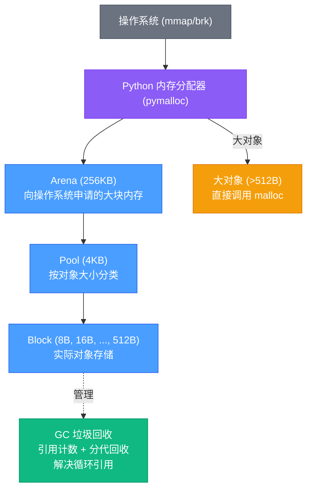
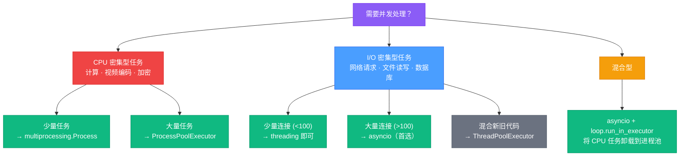
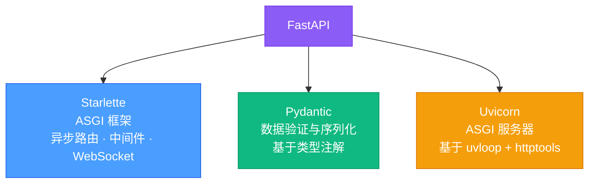

# Python 核心与异步编程

> 从 GIL 原理到 asyncio 事件循环，从内存模型到性能优化，深入理解 Python 运行时机制。AI Agent 全栈开发的基石语言。

## 相关链接

- 对应面试题：[Python面试题](../../02-面试指南/02-后端面试/04-Python面试题.md)
- 相关技术资料：[AI Agent全栈开发](../07-AI-Agent全栈开发/)

## 目录

1. [为什么深入理解 Python 运行时](#1-为什么深入理解-python-运行时)
2. [Python 对象模型](#2-python-对象模型)
3. [GIL（全局解释器锁）](#3-gil全局解释器锁)
4. [内存管理与垃圾回收](#4-内存管理与垃圾回收)
5. [迭代器与生成器](#5-迭代器与生成器)
6. [装饰器与描述符](#6-装饰器与描述符)
7. [asyncio 异步编程](#7-asyncio-异步编程)
8. [并发模型对比](#8-并发模型对比)
9. [FastAPI 与现代 Python Web](#9-fastapi-与现代-python-web)
10. [Python 3.12+ 新特性（2025-2026）](#10-python-312-新特性2025-2026)
11. [性能优化与最佳实践](#11-性能优化与最佳实践)

---

## 1. 为什么深入理解 Python 运行时

### Python 在 AI 时代的核心地位

Python 已经成为 AI 全栈开发的"通用语言"。从 PyTorch、TensorFlow 等训练框架，到 vLLM、TGI 等推理引擎，再到 LangChain、CrewAI 等 Agent 框架，几乎所有核心 AI 基础设施都以 Python 作为主要接口语言。2025 年 Stack Overflow 调查显示，Python 连续多年蝉联最受欢迎语言榜首。

但 Python 也常被诟病"太慢"。那么问题来了：

- 如果 Python 真的慢，为什么 AI 领域首选它？
- "慢"的根本原因到底是什么？是语言本身，还是用法不当？

答案在于 **Python 的定位是"胶水语言"**——它的价值不在于自己做计算，而在于高效地调度底层 C/C++/CUDA 库。NumPy 的矩阵运算、PyTorch 的张量计算、aiohttp 的网络 I/O，这些真正耗时的操作都发生在 C 层。Python 只负责"编排"。

> **类比**：Python 像一位交响乐指挥家。指挥家自己不演奏任何乐器（计算不快），但他决定了整个乐团何时、以何种方式演奏（调度 C/CUDA 库高效执行）。一位优秀的指挥家可以让同一支乐团的表现天差地别——这就是为什么理解 Python 运行时如此重要。

理解 Python 的运行时机制（GIL、内存管理、异步模型），可以帮助你：

1. 在 AI 工程中做出正确的并发决策（何时用多进程、何时用 asyncio）
2. 避免内存泄漏和性能陷阱
3. 构建高吞吐的 AI 服务端应用

---

## 2. Python 对象模型

### 2.1 一切皆对象

在 CPython 中，**所有东西都是对象**——整数、字符串、函数、类、甚至模块本身。Python 层面的每个对象对应 C 层的一个 `PyObject` 结构体：

```c
// CPython 源码简化版
typedef struct {
    Py_ssize_t ob_refcnt;   // 引用计数
    PyTypeObject *ob_type;   // 类型指针
} PyObject;
```

这意味着：

- 每个对象都**自带引用计数**（`ob_refcnt`），用于垃圾回收
- 每个对象都**知道自己的类型**（`ob_type`），支持运行时自省

> **类比**：Python 对象像"带标签的盒子"。每个盒子上有两个标签——引用计数标签（记录有多少人在用它）和类型标签（记录盒子里装的是什么类型的东西）。

```python
# 一切皆对象
def greet(name):
    return f"Hello, {name}"

print(type(greet))        # <class 'function'>
print(greet.__class__)     # <class 'function'>
print(id(greet))          # 函数也有内存地址

# 类本身也是对象
print(type(int))           # <class 'type'>
print(type(type))          # <class 'type'>  — type 是自己的实例
```

### 2.2 可变 vs 不可变

| 不可变 (Immutable)                                   | 可变 (Mutable)                     |
| ---------------------------------------------------- | ---------------------------------- |
| `int`, `float`, `str`, `tuple`, `frozenset`, `bytes` | `list`, `dict`, `set`, `bytearray` |
| 修改 = 创建新对象                                    | 修改 = 原地修改                    |
| 可以作为 dict 的 key                                 | 不能作为 dict 的 key               |
| 天然线程安全                                         | 需要加锁保护                       |

### 2.3 `is` vs `==`

```python
# is 检查 identity（同一个对象）
# == 检查 equality（值相等）

a = [1, 2, 3]
b = [1, 2, 3]
print(a == b)   # True  — 值相等
print(a is b)   # False — 不同对象

c = a
print(a is c)   # True  — 同一个对象
```

### 2.4 小整数缓存

CPython 对 **-5 到 256** 范围内的整数做了缓存（interning），这些整数在解释器启动时预先创建，复用同一对象：

```python
# 小整数缓存陷阱
a = 256
b = 256
print(a is b)  # True — 缓存范围内，同一个对象

c = 257
d = 257
print(c is d)  # False — 超出缓存范围（交互模式下），不同对象

# 注意：在 .py 脚本中，编译器可能对同文件的常量做额外优化
# 因此 c is d 在脚本中可能为 True（编译期常量折叠）
```

### 2.5 `__slots__` 优化内存

默认情况下，Python 类的实例使用 `__dict__` 存储属性，这是一个完整的字典（hash table），内存开销很大。使用 `__slots__` 可以告诉 Python 使用更紧凑的固定属性存储：

```python
import sys

class PointDict:
    def __init__(self, x, y):
        self.x = x
        self.y = y

class PointSlots:
    __slots__ = ('x', 'y')
    def __init__(self, x, y):
        self.x = x
        self.y = y

p1 = PointDict(1, 2)
p2 = PointSlots(1, 2)

print(sys.getsizeof(p1.__dict__))  # 104 字节（字典开销）
# p2 没有 __dict__，不能动态添加属性
# p2.z = 3  # AttributeError!

# 百万对象时差别巨大
# PointDict: ~160 bytes/obj → 160MB
# PointSlots: ~56 bytes/obj  → 56MB
```

---

## 3. GIL（全局解释器锁）

### 3.1 GIL 是什么？

**GIL (Global Interpreter Lock)** 是 CPython 解释器中的一把全局互斥锁。它确保**同一时刻只有一个线程执行 Python 字节码**，即使在多核 CPU 上也是如此。

> **类比**：GIL 像"单人厕所的钥匙"。公司有 8 个员工（8 核 CPU），但厕所只有一间，钥匙只有一把。想上厕所（执行 Python 字节码）必须先拿到钥匙。即使有 8 个人排队，同一时刻也只有 1 人在"使用"（执行）。

### 3.2 为什么 CPython 需要 GIL？

根本原因：**引用计数的线程安全**。

CPython 使用引用计数进行内存管理。每个对象的 `ob_refcnt` 需要在每次赋值、传参、删除时更新。如果多个线程同时修改同一个对象的引用计数，会导致：

- 计数过低 → 提前释放 → 悬挂指针 → 段错误
- 计数过高 → 内存泄漏

加 GIL 是最简单的保护方式——但代价是多线程无法真正并行执行 Python 代码。

### 3.3 GIL 的具体行为

```
线程1: [执行字节码] → 释放GIL → [等待] → 获取GIL → [执行字节码]
线程2: [等待]       → 获取GIL → [执行字节码] → 释放GIL → [等待]
```

- Python 3.2+ 使用**基于时间的切换**：默认每 **5ms** 释放一次 GIL
- 释放时机：
  1. 执行若干字节码后主动检查
  2. 执行 I/O 操作时（read / write / sleep）自动释放
  3. 调用 C 扩展且显式释放时（如 NumPy）

```python
import sys
print(sys.getswitchinterval())  # 0.005 (5ms)

# 可以调整（仅用于调试/测试）
# sys.setswitchinterval(0.001)
```

### 3.4 I/O 密集 vs CPU 密集

| 场景                                       | GIL 影响           | 多线程效果     | 推荐方案                |
| ------------------------------------------ | ------------------ | -------------- | ----------------------- |
| **I/O 密集**（网络请求、文件读写、数据库） | 低——I/O 时释放 GIL | 有效加速       | threading / asyncio     |
| **CPU 密集**（数学计算、图像处理）         | 高——GIL 串行化执行 | 无加速甚至更慢 | multiprocessing / C扩展 |

### 3.5 绕过 GIL 的方法

**方法一：multiprocessing（进程隔离）**

每个进程有自己的 Python 解释器和 GIL，真正利用多核：

```python
from multiprocessing import Pool

def heavy_compute(n):
    return sum(i * i for i in range(n))

# 使用进程池
with Pool(4) as pool:
    results = pool.map(heavy_compute, [10**7] * 4)
```

**方法二：C 扩展释放 GIL**

NumPy、Pandas 等库在 C 层调用时释放 GIL，允许真正并行：

```python
import numpy as np
# NumPy 的矩阵运算在 C 层释放 GIL
# 多线程调用 NumPy 可以真正并行
a = np.random.rand(10000, 10000)
result = a @ a  # 底层 BLAS 库多线程执行
```

**方法三：asyncio（协程）**

协程在单线程内通过事件循环调度，不需要真并行，GIL 完全不影响：

```python
import asyncio

async def fetch_data(url):
    # 等待 I/O 时，事件循环切换到其他协程
    async with aiohttp.ClientSession() as session:
        async with session.get(url) as resp:
            return await resp.json()
```

**方法四：PEP 703 Free-threaded Python (3.13+)**

Python 3.13 引入实验性的 `--disable-gil` 编译选项，彻底移除 GIL（详见第 10 节）。

### 3.6 代码对比：CPU 密集任务

```python
import time
import threading
import multiprocessing

def cpu_bound(n):
    """CPU 密集：计算斐波那契"""
    a, b = 0, 1
    for _ in range(n):
        a, b = b, a + b
    return a

# ---- 单线程 ----
start = time.time()
cpu_bound(500_000)
cpu_bound(500_000)
print(f"单线程: {time.time() - start:.2f}s")

# ---- 多线程（受 GIL 限制，不会更快） ----
start = time.time()
t1 = threading.Thread(target=cpu_bound, args=(500_000,))
t2 = threading.Thread(target=cpu_bound, args=(500_000,))
t1.start(); t2.start()
t1.join(); t2.join()
print(f"多线程: {time.time() - start:.2f}s")  # ≈ 单线程，甚至更慢

# ---- 多进程（真并行） ----
start = time.time()
p1 = multiprocessing.Process(target=cpu_bound, args=(500_000,))
p2 = multiprocessing.Process(target=cpu_bound, args=(500_000,))
p1.start(); p2.start()
p1.join(); p2.join()
print(f"多进程: {time.time() - start:.2f}s")  # ≈ 单线程的一半

# 典型输出:
# 单线程: 2.10s
# 多线程: 2.15s   ← GIL 导致无加速
# 多进程: 1.12s   ← 真正利用双核
```

关键结论：**CPU 密集任务下，多线程 ≈ 单线程（因为 GIL），多进程 ≈ 线性加速**。

---

## 4. 内存管理与垃圾回收

### 4.1 引用计数 (Reference Counting)

Python 的主要内存回收机制是**引用计数**。每个对象维护一个计数器 `ob_refcnt`，记录有多少变量引用它：

```python
import sys

a = [1, 2, 3]
print(sys.getrefcount(a))  # 2（a 本身 + getrefcount 参数）

b = a               # refcnt → 3
c = a               # refcnt → 4
del b               # refcnt → 3
c = None            # refcnt → 2
# 当 refcnt 降到 0 时，立即释放内存
```

优点：**实时回收，延迟低**。大部分对象在引用归零时立刻释放，不需要等待 GC 运行。

缺点：**无法处理循环引用**。

### 4.2 循环引用检测 (Generational GC)

```python
# 循环引用：引用计数永远不会归零
a = []
b = []
a.append(b)  # a → b
b.append(a)  # b → a
del a, b     # 引用计数仍为 1，无法回收！
```

为此 Python 引入了**分代垃圾回收器** (Generational Garbage Collector)：

| 代           | 触发频率 | 说明                               |
| ------------ | -------- | ---------------------------------- |
| Generation 0 | 最频繁   | 新创建的对象，存活后晋升到 Gen 1   |
| Generation 1 | 较低频率 | 经过一次 Gen 0 回收后存活的对象    |
| Generation 2 | 最低频率 | 长期存活的对象（如模块、全局变量） |

> **类比**：引用计数 = 图书馆借阅卡（借完即还，实时回收）。分代 GC = 图书馆定期盘点（检查有没有借阅卡和实际数量对不上的"遗漏图书"，即循环引用）。新书区（Gen 0）每天盘点，老书区（Gen 2）每月盘点。

```python
import gc

# 查看分代 GC 阈值
print(gc.get_threshold())  # (700, 10, 10)
# 含义：Gen 0 中 700 次分配后触发 Gen 0 回收
#       Gen 0 回收 10 次后触发 Gen 1 回收
#       Gen 1 回收 10 次后触发 Gen 2 回收

# 手动触发 GC（通常不需要）
gc.collect()

# 禁用分代 GC（特殊场景，如已知无循环引用）
gc.disable()
```

### 4.3 weakref 弱引用

弱引用不增加引用计数，适用于缓存场景，避免循环引用：

```python
import weakref

class ExpensiveObject:
    def __init__(self, name):
        self.name = name
    def __del__(self):
        print(f"{self.name} 被回收")

obj = ExpensiveObject("data")
weak = weakref.ref(obj)

print(weak())       # <ExpensiveObject object>
del obj
print(weak())       # None（对象已回收）

# WeakValueDictionary 实现缓存
cache = weakref.WeakValueDictionary()
```

### 4.4 内存池：pymalloc

CPython 使用 **pymalloc** 小对象分配器优化频繁的小内存分配（≤ 512 字节）：



小于 512 字节的对象从 pymalloc 池中分配（快速），超过 512 字节直接调用系统 `malloc`。

### 4.5 tracemalloc 内存追踪

```python
import tracemalloc

tracemalloc.start()

# 执行可能泄漏内存的代码
data = [list(range(1000)) for _ in range(10000)]

snapshot = tracemalloc.take_snapshot()
top_stats = snapshot.statistics('lineno')

print("[ Top 5 内存分配 ]")
for stat in top_stats[:5]:
    print(stat)
```

---

## 5. 迭代器与生成器

### 5.1 迭代协议

Python 的 `for` 循环基于**迭代协议**——任何实现了 `__iter__()` 和 `__next__()` 方法的对象都是迭代器：

```python
class Countdown:
    """手写迭代器：从 n 倒数到 1"""
    def __init__(self, n):
        self.n = n

    def __iter__(self):
        return self

    def __next__(self):
        if self.n <= 0:
            raise StopIteration
        self.n -= 1
        return self.n + 1

for num in Countdown(5):
    print(num)  # 5, 4, 3, 2, 1

# for 循环等价于：
it = iter(Countdown(5))  # 调用 __iter__
while True:
    try:
        num = next(it)    # 调用 __next__
        print(num)
    except StopIteration:
        break
```

### 5.2 生成器函数

生成器是**用 `yield` 关键字定义的函数**，它返回一个迭代器，但写法远比手动实现迭代协议简洁。每次调用 `next()` 时，函数从上次 `yield` 的位置恢复执行：

> **类比**：生成器像"自动售货机"——每次按一下按钮弹出一个商品，而不是一次把所有商品全倒出来。你不需要提前准备所有商品（不需要占用大量内存），需要时再生产。

```python
def fibonacci():
    """无限斐波那契数列"""
    a, b = 0, 1
    while True:
        yield a
        a, b = b, a + b

# 取前 10 个
from itertools import islice
print(list(islice(fibonacci(), 10)))  # [0, 1, 1, 2, 3, 5, 8, 13, 21, 34]
```

### 5.3 生成器表达式 vs 列表推导式

```python
# 列表推导式 — 立即生成全部，占用内存
squares_list = [x**2 for x in range(10_000_000)]  # ~80MB 内存

# 生成器表达式 — 惰性求值，内存恒定
squares_gen = (x**2 for x in range(10_000_000))   # ~120 bytes 内存

# 适用于只遍历一次的场景
total = sum(x**2 for x in range(10_000_000))  # 直接传给 sum，不额外分配
```

### 5.4 yield from 委托

`yield from` 将一个子生成器的值"透传"给外层调用者：

```python
def sub_generator():
    yield 1
    yield 2
    yield 3

def main_generator():
    yield 'start'
    yield from sub_generator()  # 委托给子生成器
    yield 'end'

list(main_generator())  # ['start', 1, 2, 3, 'end']
```

### 5.5 实战：大文件处理管道

```python
# 生成器：惰性处理大文件
def read_large_file(file_path):
    """逐行读取，内存占用恒定"""
    with open(file_path) as f:
        for line in f:
            if line.strip():
                yield line.strip()

# 生成器管道：像 Unix pipe
def grep(pattern, lines):
    for line in lines:
        if pattern in line:
            yield line

def to_upper(lines):
    for line in lines:
        yield line.upper()

# 组合使用 — 整个管道都是惰性的
lines = read_large_file("server.log")
errors = grep("ERROR", lines)
results = to_upper(errors)
for r in results:  # 此时才开始执行，内存占用极低
    print(r)
```

---

## 6. 装饰器与描述符

### 6.1 装饰器原理

装饰器本质上是**接收函数并返回函数的高阶函数**。`@decorator` 只是语法糖：

```python
# @decorator 等价于 func = decorator(func)

def timer(func):
    """计时装饰器"""
    import functools, time
    @functools.wraps(func)
    def wrapper(*args, **kwargs):
        start = time.perf_counter()
        result = func(*args, **kwargs)
        elapsed = time.perf_counter() - start
        print(f"{func.__name__} 耗时 {elapsed:.4f}s")
        return result
    return wrapper

@timer
def slow_function():
    import time
    time.sleep(1)

slow_function()  # → slow_function 耗时 1.0012s
```

### 6.2 带参数的装饰器

带参数的装饰器需要**三层嵌套**：外层接收参数 → 中层接收函数 → 内层执行包装：

```python
import functools
import time

def retry(max_retries=3, delay=1):
    """带参数的重试装饰器"""
    def decorator(func):
        @functools.wraps(func)
        def wrapper(*args, **kwargs):
            for attempt in range(max_retries):
                try:
                    return func(*args, **kwargs)
                except Exception as e:
                    if attempt == max_retries - 1:
                        raise
                    print(f"Retry {attempt + 1}/{max_retries}: {e}")
                    time.sleep(delay * (2 ** attempt))  # 指数退避
        return wrapper
    return decorator

@retry(max_retries=3, delay=0.5)
def call_api(url):
    """可能失败的 API 调用"""
    import random
    if random.random() < 0.7:
        raise ConnectionError("Connection refused")
    return {"status": "ok"}
```

### 6.3 `functools.wraps` 的必要性

不使用 `@functools.wraps`，装饰后的函数会失去原来的元信息：

```python
def bad_decorator(func):
    def wrapper(*args, **kwargs):
        return func(*args, **kwargs)
    return wrapper

@bad_decorator
def my_func():
    """这是我的函数"""
    pass

print(my_func.__name__)  # 'wrapper' ← 元信息丢失！
print(my_func.__doc__)   # None

# 使用 @functools.wraps(func) 可以保留 __name__, __doc__, __module__ 等
```

### 6.4 类装饰器

装饰器不一定是函数，也可以是类（只要实现 `__call__` 方法）：

```python
class CacheDecorator:
    """基于类的缓存装饰器"""
    def __init__(self, func):
        self.func = func
        self.cache = {}
        functools.update_wrapper(self, func)

    def __call__(self, *args):
        if args not in self.cache:
            self.cache[args] = self.func(*args)
        return self.cache[args]

@CacheDecorator
def expensive_compute(n):
    print(f"Computing {n}...")
    return sum(range(n))

expensive_compute(1000)  # Computing 1000... → 499500
expensive_compute(1000)  # 直接返回缓存 → 499500
```

### 6.5 描述符协议

描述符是实现了 `__get__`、`__set__`、`__delete__` 中任意一个方法的对象，用来控制属性的访问行为。**`property`、`classmethod`、`staticmethod` 的底层都是描述符**：

```python
class Validator:
    """数据验证描述符"""
    def __init__(self, min_val, max_val):
        self.min_val = min_val
        self.max_val = max_val

    def __set_name__(self, owner, name):
        self.name = name

    def __get__(self, obj, objtype=None):
        if obj is None:
            return self
        return getattr(obj, f'_{self.name}', None)

    def __set__(self, obj, value):
        if not self.min_val <= value <= self.max_val:
            raise ValueError(f"{self.name} must be between {self.min_val} and {self.max_val}")
        setattr(obj, f'_{self.name}', value)

class Product:
    price = Validator(0, 10000)
    quantity = Validator(0, 999)

    def __init__(self, name, price, quantity):
        self.name = name
        self.price = price        # 触发 Validator.__set__
        self.quantity = quantity

p = Product("Widget", 29.99, 10)
# p.price = -1  # ValueError: price must be between 0 and 10000
```

### 6.6 property 的底层实现

`property` 就是一个内置的描述符类。手动实现大致如下：

```python
class MyProperty:
    def __init__(self, fget=None, fset=None, fdel=None, doc=None):
        self.fget = fget
        self.fset = fset
        self.fdel = fdel
        self.__doc__ = doc

    def __get__(self, obj, objtype=None):
        if obj is None:
            return self
        if self.fget is None:
            raise AttributeError("unreadable attribute")
        return self.fget(obj)

    def __set__(self, obj, value):
        if self.fset is None:
            raise AttributeError("can't set attribute")
        self.fset(obj, value)

    def setter(self, fset):
        return type(self)(self.fget, fset, self.fdel, self.__doc__)
```

---

## 7. asyncio 异步编程

> **这是本文的核心章节**。在 AI Agent 服务端开发中，asyncio 是处理并发 I/O 的首选方案。

### 7.1 为什么需要异步

传统同步代码在等待 I/O 时**阻塞**整个线程：

```
同步（5个请求，每个1秒）：
请求1 [====] → 请求2 [====] → 请求3 [====] → 请求4 [====] → 请求5 [====]
总耗时: 5秒

异步（5个请求并发）：
请求1 [====]
请求2 [====]
请求3 [====]
请求4 [====]
请求5 [====]
总耗时: ~1秒
```

### 7.2 事件循环 (Event Loop)

事件循环是 asyncio 的核心——一个在单线程中运行的无限循环，不断检查哪些 I/O 操作已就绪，然后恢复对应的协程执行：

> **类比**：事件循环像"餐厅服务员"。服务员不会在每桌等菜（阻塞等待 I/O），而是点完菜后去服务其他桌，等厨房做好了再回来上菜。一位高效的服务员可以同时服务几十桌——这就是 asyncio 在单线程中处理数千并发连接的原理。

```
事件循环工作原理:

while True:
    1. 检查就绪的 I/O 事件（epoll/kqueue/IOCP）
    2. 执行所有就绪的回调/协程
    3. 等待新的 I/O 事件
```

### 7.3 核心概念：Coroutine / Task / Future

| 概念          | 说明                                     | 创建方式                       |
| ------------- | ---------------------------------------- | ------------------------------ |
| **Coroutine** | `async def` 定义的函数调用后返回协程对象 | `coro = async_func()`          |
| **Task**      | 包装协程，让它在事件循环中调度执行       | `asyncio.create_task(coro)`    |
| **Future**    | 表示一个尚未完成的异步操作的结果         | 通常由底层创建，用户很少直接用 |

```python
import asyncio

async def say_hello(name, delay):
    """协程函数"""
    await asyncio.sleep(delay)  # 非阻塞等待
    print(f"Hello, {name}!")
    return name

async def main():
    # 创建 Task — 协程开始在事件循环中调度
    task1 = asyncio.create_task(say_hello("Alice", 2))
    task2 = asyncio.create_task(say_hello("Bob", 1))

    # await 等待结果
    result1 = await task1  # "Alice"
    result2 = await task2  # "Bob"
    print(f"Done: {result1}, {result2}")

asyncio.run(main())  # 创建事件循环并运行
# 输出：
# Hello, Bob!    (1秒后)
# Hello, Alice!  (2秒后)
# Done: Alice, Bob
```

### 7.4 asyncio.gather vs TaskGroup

**`asyncio.gather`**（传统方式）：

```python
async def main():
    results = await asyncio.gather(
        fetch("url1"),
        fetch("url2"),
        fetch("url3"),
        return_exceptions=True  # 异常不会取消其他任务
    )
    # results = [result1, result2, result3]
```

**`TaskGroup`**（Python 3.11+，推荐）：

```python
async def main():
    async with asyncio.TaskGroup() as tg:
        task1 = tg.create_task(fetch("url1"))
        task2 = tg.create_task(fetch("url2"))
        task3 = tg.create_task(fetch("url3"))

    # 所有任务完成后才退出 with 块
    # 任何任务异常 → 自动取消其他任务 → 抛出 ExceptionGroup
    results = [task1.result(), task2.result(), task3.result()]
```

TaskGroup 的优势：

- **结构化并发**：任务生命周期与 `with` 块绑定，不会"泄漏"
- **异常安全**：一个任务失败会取消所有其他任务
- **更好的错误追踪**：异常栈更清晰

### 7.5 Semaphore 控制并发数

并发太多会压垮下游服务。使用 `asyncio.Semaphore` 限制同时执行的协程数：

```python
import asyncio
import aiohttp

async def fetch(session, url):
    async with session.get(url) as resp:
        return await resp.json()

async def main():
    urls = [f"https://api.example.com/item/{i}" for i in range(100)]

    # 限制并发数为 10
    semaphore = asyncio.Semaphore(10)

    async def bounded_fetch(session, url):
        async with semaphore:  # 最多 10 个协程同时进入
            return await fetch(session, url)

    async with aiohttp.ClientSession() as session:
        async with asyncio.TaskGroup() as tg:
            tasks = [tg.create_task(bounded_fetch(session, url)) for url in urls]

        results = [t.result() for t in tasks]
        print(f"Fetched {len(results)} items")

asyncio.run(main())
```

### 7.6 异步上下文管理器和异步迭代器

```python
# 异步上下文管理器
class AsyncDBConnection:
    async def __aenter__(self):
        self.conn = await create_connection()
        return self.conn

    async def __aexit__(self, exc_type, exc_val, exc_tb):
        await self.conn.close()

async with AsyncDBConnection() as conn:
    result = await conn.execute("SELECT ...")

# 异步迭代器
class AsyncLineReader:
    def __init__(self, file_path):
        self.file_path = file_path

    def __aiter__(self):
        return self

    async def __anext__(self):
        line = await self.reader.readline()
        if not line:
            raise StopAsyncIteration
        return line

# async for 遍历
async for line in AsyncLineReader("data.txt"):
    process(line)
```

### 7.7 常见陷阱

```python
# ❌ 错误：在异步代码中使用阻塞调用
async def bad_example():
    import requests
    resp = requests.get("https://api.example.com")  # 阻塞！冻结事件循环
    return resp.json()

# ✅ 正确：使用异步 HTTP 库
async def good_example():
    async with aiohttp.ClientSession() as session:
        async with session.get("https://api.example.com") as resp:
            return await resp.json()

# ❌ 错误：忘记 await
async def another_bad():
    result = some_coroutine()  # 只是创建了协程对象，没有执行！
    # RuntimeWarning: coroutine was never awaited

# ✅ 正确
async def another_good():
    result = await some_coroutine()
```

---

## 8. 并发模型对比

### 8.1 四种并发方案

| 维度         | threading            | multiprocessing       | asyncio            | concurrent.futures |
| ------------ | -------------------- | --------------------- | ------------------ | ------------------ |
| **并发类型** | 多线程               | 多进程                | 协程               | 线程池/进程池      |
| **GIL 影响** | 受限（CPU 密集无效） | 不受限（独立 GIL）    | 无影响（单线程）   | 取决于 Executor    |
| **内存开销** | 中（~8MB/线程栈）    | 高（完整进程副本）    | 极低（~KB/协程）   | 中                 |
| **适合任务** | I/O 密集             | CPU 密集              | 大量 I/O 密集      | 混合型             |
| **共享状态** | 容易（但需要锁）     | 困难（需 Queue/Pipe） | 天然安全（单线程） | 隔离               |
| **调试难度** | 高（死锁、竞争）     | 中                    | 低（确定性调度）   | 中                 |
| **启动成本** | 低                   | 高（fork/spawn）      | 极低               | 中                 |

### 8.2 选择指南



```python
import asyncio
from concurrent.futures import ProcessPoolExecutor

def cpu_heavy(data):
    """CPU 密集任务"""
    return sum(x**2 for x in data)

async def main():
    loop = asyncio.get_event_loop()

    # 在异步代码中调用 CPU 密集函数 → 卸载到进程池
    with ProcessPoolExecutor() as pool:
        result = await loop.run_in_executor(
            pool, cpu_heavy, list(range(10_000_000))
        )
    print(result)

asyncio.run(main())
```

---

## 9. FastAPI 与现代 Python Web

### 9.1 FastAPI 架构

FastAPI 构建在三大核心之上：



**ASGI vs WSGI**：

- WSGI (Flask/Django)：同步协议，一个请求占一个线程
- ASGI (FastAPI/Starlette)：异步协议，一个线程处理数千请求

### 9.2 完整 CRUD 示例

```python
from fastapi import FastAPI, HTTPException, Depends
from pydantic import BaseModel, Field
from typing import Annotated

app = FastAPI(title="Item API", version="1.0.0")

# ---- 数据模型 ----
class ItemCreate(BaseModel):
    name: str = Field(..., min_length=1, max_length=100)
    price: float = Field(..., gt=0)
    description: str | None = None

class ItemResponse(ItemCreate):
    id: int

# ---- 模拟数据库 ----
fake_db: dict[int, dict] = {}
next_id = 1

# ---- 依赖注入 ----
async def get_db():
    """模拟数据库连接的依赖注入"""
    # 实际项目中：db = AsyncSession(); yield db; await db.close()
    yield fake_db

DB = Annotated[dict, Depends(get_db)]

# ---- 路由 ----
@app.post("/items/", response_model=ItemResponse, status_code=201)
async def create_item(item: ItemCreate, db: DB):
    global next_id
    item_dict = {"id": next_id, **item.model_dump()}
    db[next_id] = item_dict
    next_id += 1
    return item_dict

@app.get("/items/{item_id}", response_model=ItemResponse)
async def read_item(item_id: int, db: DB):
    if item_id not in db:
        raise HTTPException(status_code=404, detail="Item not found")
    return db[item_id]

@app.get("/items/", response_model=list[ItemResponse])
async def list_items(db: DB, skip: int = 0, limit: int = 10):
    items = list(db.values())
    return items[skip : skip + limit]

@app.delete("/items/{item_id}", status_code=204)
async def delete_item(item_id: int, db: DB):
    if item_id not in db:
        raise HTTPException(status_code=404, detail="Item not found")
    del db[item_id]
```

### 9.3 WebSocket 与流式响应

AI Agent 中 LLM 的流式输出常用 SSE 或 WebSocket：

```python
from fastapi import WebSocket
from fastapi.responses import StreamingResponse

@app.websocket("/ws/chat")
async def chat_websocket(websocket: WebSocket):
    await websocket.accept()
    while True:
        user_msg = await websocket.receive_text()
        # 流式返回 LLM 响应
        async for token in llm.stream(user_msg):
            await websocket.send_text(token)

@app.get("/stream")
async def stream_response():
    async def generate():
        for i in range(10):
            yield f"data: chunk {i}\n\n"
            await asyncio.sleep(0.1)
    return StreamingResponse(generate(), media_type="text/event-stream")
```

### 9.4 OpenAPI 自动文档

FastAPI 根据类型注解自动生成 OpenAPI（Swagger）文档：

- `/docs` — Swagger UI 交互式文档
- `/redoc` — ReDoc 文档
- `/openapi.json` — OpenAPI 规范 JSON

这使得 AI Agent 的工具调用（Function Calling）可以直接复用 FastAPI 的 API 定义。

---

## 10. Python 3.12+ 新特性（2025-2026）

### 10.1 版本特性对比

| 版本     | 发布日期 | 关键特性                                                     |
| -------- | -------- | ------------------------------------------------------------ |
| **3.12** | 2023.10  | Per-interpreter GIL / f-string 嵌套 / `type` 语法 / 更快 15% |
| **3.13** | 2024.10  | Free-threaded (no GIL) 实验 / JIT 编译器 (copy-and-patch)    |
| **3.14** | 2025.10  | 模板字符串 (PEP 750) / 更快的 JIT / 延迟注解 (PEP 649)       |

### 10.2 Python 3.12: Per-interpreter GIL

在 3.12 之前，一个进程中的所有子解释器共享一个 GIL。3.12 让每个子解释器（sub-interpreter）有自己独立的 GIL，为真正并行执行 Python 代码铺路:

```python
# 3.12 新语法：TypeVar
type Point = tuple[float, float]  # 替代 TypeAlias
type Matrix[T] = list[list[T]]    # 替代 TypeVar

# 3.12 f-string 改进：支持嵌套引号和表达式
name = "world"
print(f"{"Hello"} {name}")  # 3.12+ 合法
```

### 10.3 Python 3.13: Free-threaded 模式

Python 3.13 带来了实验性的 **Free-threaded (no-GIL)** 模式（PEP 703）：

```bash
# 编译时启用
./configure --disable-gil
python3.13t  # t = threaded

# 或使用环境变量
PYTHON_GIL=0 python3.13t script.py
```

引用计数的线程安全通过以下技术替代 GIL：

- **偏向引用计数 (Biased Reference Counting)**：本线程引用不加锁
- **延迟引用计数 (Deferred Reference Counting)**：全局对象的引用计数推迟处理
- **无锁数据结构**：dict、list 等内置类型使用细粒度锁

影响：

- C 扩展需要适配（numpy 等大库已在适配中）
- 性能在单线程场景下略有退化（~5-10%）
- 多线程 CPU 密集任务获得真正线性加速

### 10.4 Python 3.13: JIT 编译器

Python 3.13 引入了 **copy-and-patch JIT**——一种轻量级 JIT 编译器：

- **原理**：将频繁执行的字节码编译为机器码，使用预编译的"模板"（stencil）进行拼接
- **目标**：作为未来更激进优化的基础设施
- **当前效果**：小幅提升（~5%），但为后续版本的大幅优化奠定基础

### 10.5 Python 3.14+

```python
# PEP 750 模板字符串 (Template Strings)
from string import Template
template = t"Hello, {name}!"  # t-string，可以拦截和处理插值
# 用途：安全的 SQL/HTML 模板，避免注入攻击

# PEP 649 延迟注解
# 类型注解不再在定义时求值，避免循环引用问题
class Node:
    left: Node | None   # 3.14+ 不再需要 from __future__ import annotations
    right: Node | None
```

---

## 11. 性能优化与最佳实践

### 11.1 选择正确的数据结构

| 操作              | list       | deque      | set      | dict     |
| ----------------- | ---------- | ---------- | -------- | -------- |
| 随机访问 `a[i]`   | O(1)       | O(n)       | —        | O(1)     |
| 头部插入/删除     | O(n)       | **O(1)**   | —        | —        |
| 尾部插入/删除     | O(1)       | O(1)       | —        | —        |
| 成员检测 `x in a` | O(n)       | O(n)       | **O(1)** | **O(1)** |
| 排序              | O(n log n) | O(n log n) | —        | —        |

**规则**：

- 需要频繁 `in` 检测 → 用 `set` 代替 `list`
- 需要双端队列 → 用 `collections.deque`
- 需要有序字典 → Python 3.7+ `dict` 已保持插入顺序

### 11.2 Profile 工具

```python
# 1. cProfile — 内置，函数级性能分析
import cProfile
cProfile.run('main()', sort='cumulative')

# 2. line_profiler — 逐行分析
# pip install line_profiler
# @profile
# def my_func(): ...
# kernprof -l -v script.py

# 3. py-spy — 采样分析，不侵入代码
# pip install py-spy
# py-spy top --pid 12345
# py-spy record -o profile.svg -- python script.py

# 4. scalene — CPU + 内存 + GPU 综合分析
# pip install scalene
# scalene script.py

# 5. tracemalloc — 内存分析（见第 4 节）
```

### 11.3 Top 5 性能优化建议

1. **先 Profile，再优化**——不要凭感觉，用数据定位瓶颈
2. **选对数据结构**——`set` 替代 `list` 做成员检测可以从 O(n) 变 O(1)
3. **避免全局变量访问**——局部变量查找比全局快
4. **使用生成器处理大数据**——惰性求值避免内存爆炸
5. **CPU 密集用 C 扩展或多进程**——不要和 GIL 硬碰硬

```python
# 优化前：O(n) 成员检测
allowed_list = [1, 2, 3, ..., 100000]
if user_id in allowed_list:  # 最坏 100000 次比较
    pass

# 优化后：O(1) 成员检测
allowed_set = {1, 2, 3, ..., 100000}
if user_id in allowed_set:  # 平均 1 次哈希查找
    pass
```

### 11.4 `__slots__` 的实际效果

```python
import sys

class RegularUser:
    def __init__(self, name, age, email):
        self.name = name
        self.age = age
        self.email = email

class SlottedUser:
    __slots__ = ('name', 'age', 'email')
    def __init__(self, name, age, email):
        self.name = name
        self.age = age
        self.email = email

r = RegularUser("Alice", 30, "alice@example.com")
s = SlottedUser("Alice", 30, "alice@example.com")

# 内存对比
print(sys.getsizeof(r) + sys.getsizeof(r.__dict__))  # ~200 bytes
print(sys.getsizeof(s))                                # ~64 bytes

# 创建 100 万对象时：
# RegularUser: ~200MB
# SlottedUser: ~64MB  — 节省 68% 内存
```

---

## 总结

| 主题     | 核心要点                                                            |
| -------- | ------------------------------------------------------------------- |
| 对象模型 | 一切皆对象（PyObject），`is` 检查 identity，`==` 检查 equality      |
| GIL      | 同一时刻只有一个线程执行字节码；绕过：multiprocessing/C扩展/asyncio |
| 内存管理 | 引用计数(实时) + 分代GC(循环引用) + pymalloc(小对象池)              |
| 生成器   | yield 惰性求值，省内存，适合流式处理                                |
| 装饰器   | 闭包 + 高阶函数，@语法糖 = func(wrapper)                            |
| asyncio  | 事件循环 + 协程，单线程处理大量 I/O（AI 服务端首选）                |
| FastAPI  | ASGI + Pydantic，现代 Python Web 框架                               |
| 3.13+    | Free-threaded(无 GIL) + JIT 编译器                                  |
