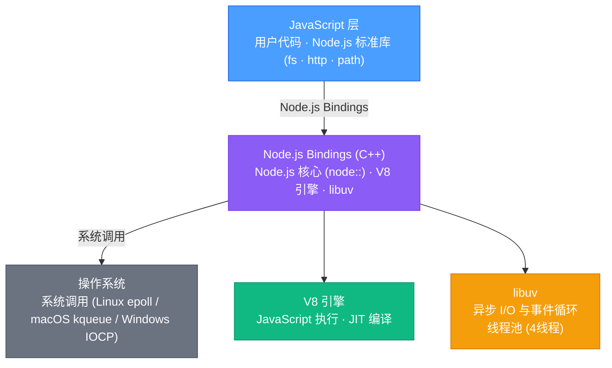
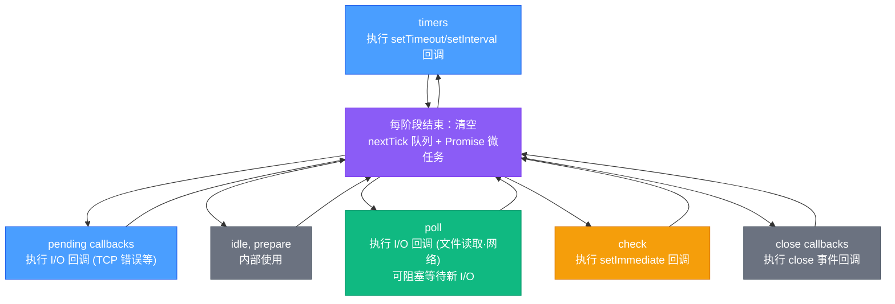
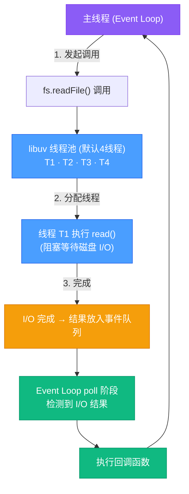
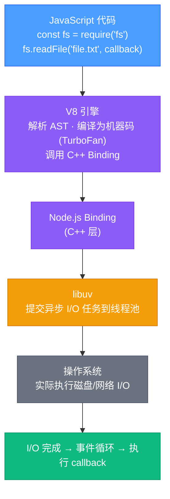
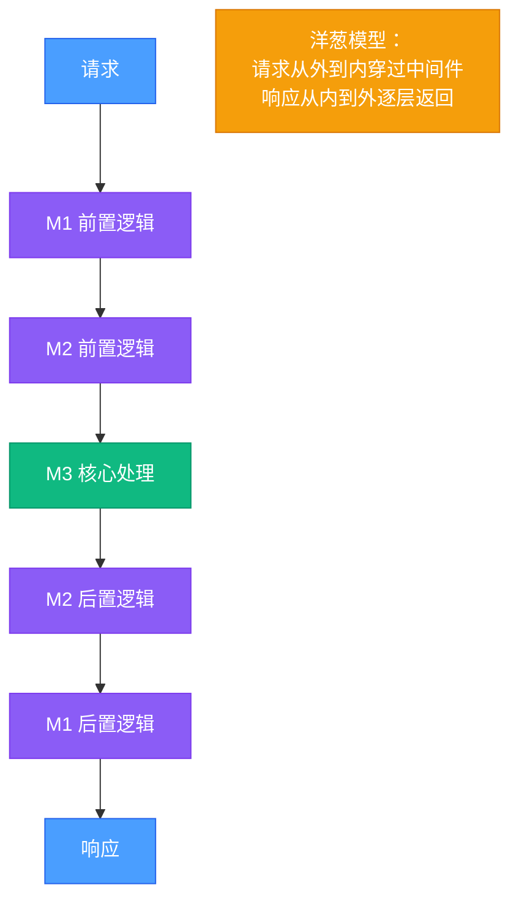
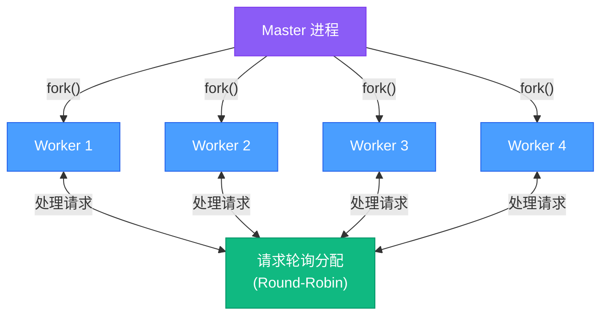

# Node.js 核心与 Web 框架

> 从事件循环到 libuv 架构,从 V8 引擎到异步编程,从 Express.js 到 NestJS,深入理解 Node.js 运行时机制与现代 Web 框架设计模式。

## 相关链接

- 对应面试题:[Node.js 面试题](../../02-面试指南/02-后端面试/06-Node.js面试题.md)
- 相关技术资料:[JavaScript核心与ES6+](../01-前端/02-JavaScript核心与ES6+.md)

## 目录

1. [为什么学习 Node.js 深层原理](#1-为什么学习-nodejs-深层原理)
2. [Node.js 架构全景](#2-nodejs-架构全景)
3. [事件循环深度解析](#3-事件循环深度解析)
4. [libuv 异步 I/O 架构](#4-libuv-异步-io-架构)
5. [V8 引擎集成](#5-v8-引擎集成)
6. [异步编程模式](#6-异步编程模式)
7. [Express.js 中间件模式](#7-expressjs-中间件模式)
8. [Koa.js 与洋葱模型](#8-koajs-与洋葱模型)
9. [NestJS 企业级架构](#9-nestjs-企业级架构)
10. [Worker Threads 与多线程](#10-worker-threads-与多线程)
11. [Cluster 集群模式](#11-cluster-集群模式)
12. [Stream 流处理](#12-stream-流处理)
13. [错误处理最佳实践](#13-错误处理最佳实践)
14. [性能优化策略](#14-性能优化策略)

---

## 1. 为什么学习 Node.js 深层原理

### Node.js 在现代后端的地位

Node.js 自 2009 年由 Ryan Dahl 创建以来,已成为现代后端开发的核心技术之一。截至 2026 年,Node.js 驱动着:

- **Netflix**、**LinkedIn**、**Uber**、**PayPal** 等大型企业的核心服务
- **全栈开发**:前后端统一语言,提升开发效率
- **微服务架构**:轻量级、高并发特性适合微服务场景
- **实时应用**:WebSocket、SSE 等实时通信场景的首选
- **工具链**:Webpack、Vite、ESLint 等前端工具都基于 Node.js

但许多开发者对 Node.js 存在误解:

- **误解 1**:"Node.js 是单线程,不适合 CPU 密集型任务"
  - **真相**:libuv 线程池处理 I/O,Worker Threads 处理 CPU 密集任务
- **误解 2**:"async/await 会阻塞事件循环"
  - **真相**:async/await 是语法糖,底层仍是非阻塞的 Promise
- **误解 3**:"Express.js 和 Koa.js 只是语法区别"
  - **真相**:中间件执行模型完全不同(线性 vs 洋葱)

> **类比**:Node.js 事件循环就像餐厅服务员轮流照顾每桌客人。服务员不会在一桌等菜上桌(阻塞 I/O),而是记下订单交给厨房(异步委托),然后立即去服务下一桌。当厨房做好菜(I/O 完成),服务员再回来上菜(执行回调)。一个服务员可以同时服务多桌客人,但每个时刻只能做一件事(单线程)。

理解 Node.js 底层机制可以帮助你:

1. **选择正确的并发模型**:何时用异步 I/O,何时用 Worker Threads
2. **避免事件循环阻塞**:识别同步代码陷阱
3. **设计高效 API**:选择合适的 Web 框架和架构模式
4. **排查性能瓶颈**:理解事件循环阶段和调用栈

---

## 2. Node.js 架构全景

### 2.1 三层架构

Node.js 是一个基于 **Chrome V8 引擎**的 JavaScript 运行时,其架构可以分为三层:



### 2.2 核心组件

| 组件         | 职责                                                                 |
| ------------ | -------------------------------------------------------------------- |
| **V8 引擎**  | 执行 JavaScript 代码,提供 JIT 编译、垃圾回收                         |
| **libuv**    | 跨平台异步 I/O 库,实现事件循环、线程池、网络/文件 I/O               |
| **Node.js C++ Core** | 将 V8 和 libuv 粘合,提供 JavaScript API(如 `fs.readFile`) |
| **标准库**   | 纯 JavaScript 实现的模块(如 `http`、`stream`)                        |

### 2.3 为什么选择 V8 + libuv 组合?

- **V8**:Google 为 Chrome 开发的高性能 JavaScript 引擎,支持:
  - **JIT 编译**:运行时优化代码为机器码
  - **隐藏类**:优化对象属性访问
  - **增量 GC**:减少垃圾回收停顿
- **libuv**:跨平台抽象层,统一了不同操作系统的异步 I/O API:
  - Linux:`epoll`
  - macOS:`kqueue`
  - Windows:`IOCP`(I/O Completion Ports)

> **类比**:V8 是"大脑"(执行 JavaScript),libuv 是"神经系统"(处理外部刺激并通知大脑)。大脑只需专注逻辑,神经系统负责感知世界(网络、文件)。

---

## 3. 事件循环深度解析

### 3.1 事件循环是什么?

事件循环是 Node.js 异步非阻塞的核心机制。它的工作原理:

1. **执行同步代码**:执行主线程上的 JavaScript
2. **检查任务队列**:查看是否有待处理的回调
3. **执行回调**:执行队列中的回调函数
4. **重复**:循环往复

但实际上,事件循环并非"一个队列",而是由 **6 个阶段**组成的循环:

### 3.2 六阶段模型



### 3.3 各阶段详解

#### 1. Timers 阶段

执行 `setTimeout()` 和 `setInterval()` 的回调。注意:**并非精确时间**。

```javascript
setTimeout(() => {
  console.log('timeout');
}, 0);

// 即使延迟 0ms,也要等到 timers 阶段才执行
```

**原理**:libuv 使用最小堆管理定时器,每次循环检查是否到期。

#### 2. Pending Callbacks 阶段

执行某些系统操作的回调,如 TCP 连接错误。

#### 3. Poll 阶段(最核心)

**核心职责**:

1. **执行 I/O 回调**(如 `fs.readFile` 完成)
2. **等待新事件**:如果队列为空,会阻塞在这里等待

**两种情况**:

- **队列不为空**:执行回调,直到队列清空或达到系统限制
- **队列为空**:
  - 如果有 `setImmediate`,跳转到 check 阶段
  - 如果有 timer 到期,跳转到 timers 阶段
  - 否则,阻塞等待新 I/O 事件

> **类比**:Poll 阶段像机场安检口。如果有乘客排队(I/O 回调),就快速处理;如果没人,就等待新乘客到来。但如果广播通知有航班要起飞(setImmediate/timer),就立即离开去处理。

#### 4. Check 阶段

执行 `setImmediate()` 回调。这是唯一可以保证在 I/O 回调之后立即执行的方式。

#### 5. Close Callbacks 阶段

执行关闭回调,如 `socket.on('close', ...)`。

### 3.4 Microtask 队列(微任务)

除了 6 个阶段,还有两个特殊队列在**每个阶段结束后**执行:

1. **process.nextTick() 队列**:最高优先级
2. **Promise 微任务队列**:次高优先级

```javascript
Promise.resolve().then(() => console.log('promise'));
process.nextTick(() => console.log('nextTick'));
setTimeout(() => console.log('timeout'), 0);
setImmediate(() => console.log('immediate'));

// 输出顺序: nextTick -> promise -> timeout -> immediate
```

**执行时机**:

```
每个阶段结束后:
1. 清空 nextTick 队列
2. 清空 Promise 微任务队列
3. 进入下一阶段
```

> **注意**:过多的 `process.nextTick()` 会饥饿事件循环,因为它会在每个阶段后无限递归执行,导致其他阶段得不到执行。

### 3.5 完整示例

```javascript
const fs = require('fs');

console.log('1: 同步代码开始');

setTimeout(() => {
  console.log('2: setTimeout 0ms');
  process.nextTick(() => console.log('3: nextTick in setTimeout'));
}, 0);

setImmediate(() => {
  console.log('4: setImmediate');
});

fs.readFile(__filename, () => {
  console.log('5: fs.readFile 回调');
  setTimeout(() => console.log('6: setTimeout in readFile'), 0);
  setImmediate(() => console.log('7: setImmediate in readFile'));
});

process.nextTick(() => {
  console.log('8: nextTick');
});

Promise.resolve().then(() => {
  console.log('9: Promise');
});

console.log('10: 同步代码结束');

/*
输出顺序分析:
1: 同步代码开始         (主线程同步代码)
10: 同步代码结束        (主线程同步代码)
8: nextTick            (同步代码后,清空 nextTick 队列)
9: Promise             (清空 Promise 微任务队列)
2: setTimeout 0ms      (timers 阶段)
3: nextTick in setTimeout (timers 阶段后清空 nextTick)
4: setImmediate        (check 阶段)
5: fs.readFile 回调    (poll 阶段)
7: setImmediate in readFile (check 阶段)
6: setTimeout in readFile   (下一轮 timers 阶段)
*/
```

### 3.6 `setImmediate` vs `setTimeout(fn, 0)`

**关键区别**:

- **在主模块中**:顺序不确定(取决于进程性能)
- **在 I/O 回调中**:`setImmediate` 始终先于 `setTimeout`

```javascript
// 在 I/O 回调中
fs.readFile(__filename, () => {
  setTimeout(() => console.log('timeout'), 0);
  setImmediate(() => console.log('immediate'));
});
// 输出: immediate -> timeout (确定顺序)
```

**原因**:I/O 回调在 poll 阶段执行,poll 阶段结束后立即进入 check 阶段(执行 setImmediate),而 setTimeout 需要等到下一轮循环的 timers 阶段。

---

## 4. libuv 异步 I/O 架构

### 4.1 libuv 是什么?

libuv 是一个跨平台的异步 I/O 库,为 Node.js 提供:

- 事件循环
- 线程池
- 网络 I/O(TCP/UDP)
- 文件 I/O
- 子进程管理

> **类比**:libuv 像一个"任务调度中心"。你(JavaScript 代码)提交任务(读文件、网络请求),调度中心分配给合适的"工人"(线程池/系统调用),完成后通知你(回调)。

### 4.2 两种异步 I/O 模型

libuv 针对不同操作使用不同策略:

| 操作类型                              | 实现方式                   | 原因                                 |
| ------------------------------------- | -------------------------- | ------------------------------------ |
| **网络 I/O**(TCP/UDP)                 | 非阻塞 I/O + epoll/kqueue  | 操作系统原生支持高效异步             |
| **文件 I/O**(fs.readFile)             | 线程池模拟异步             | 文件系统调用本质上是阻塞的           |
| **DNS 查询**(dns.lookup)              | 线程池(`getaddrinfo`)      | `getaddrinfo` 是阻塞调用             |
| **加密操作**(crypto)                  | 线程池                     | CPU 密集型,避免阻塞事件循环          |
| **压缩**(zlib)                        | 线程池                     | CPU 密集型                           |

### 4.3 线程池详解

libuv 默认创建 **4 个线程**的线程池,可以通过环境变量调整:

```bash
export UV_THREADPOOL_SIZE=8  # 设置为 8 个线程
```

**工作流程**:



**代码示例**:

```javascript
const fs = require('fs');

// 同时发起 5 个文件读取请求
for (let i = 0; i < 5; i++) {
  fs.readFile(__filename, () => {
    console.log(`文件 ${i} 读取完成`);
  });
}

/*
因为线程池只有 4 个线程,前 4 个请求并行执行,第 5 个等待
输出顺序可能是: 0,1,2,3,4 或 1,0,3,2,4 等
*/
```

**如何增大线程池?**

```javascript
// 在代码开头设置
process.env.UV_THREADPOOL_SIZE = 8;

// 或在启动时设置环境变量
// UV_THREADPOOL_SIZE=8 node app.js
```

### 4.4 网络 I/O:非阻塞 + epoll/kqueue

网络操作(如 HTTP 请求)使用**非阻塞 I/O + I/O 多路复用**:

**Linux (epoll) 示例**:

```c
// libuv 底层实现(简化)
int epfd = epoll_create1(0);

// 1. 创建 socket,设置为非阻塞
int sock = socket(AF_INET, SOCK_STREAM | SOCK_NONBLOCK, 0);

// 2. 注册到 epoll
struct epoll_event ev;
ev.events = EPOLLIN;  // 监听可读事件
ev.data.fd = sock;
epoll_ctl(epfd, EPOLL_CTL_ADD, sock, &ev);

// 3. 事件循环中等待
struct epoll_event events[MAX_EVENTS];
int nfds = epoll_wait(epfd, events, MAX_EVENTS, timeout);

// 4. 有数据到达,触发回调
for (int i = 0; i < nfds; i++) {
  // 执行 JavaScript 回调
}
```

**关键优势**:一个线程可以同时监听数千个连接,无需阻塞等待。

> **类比**:传统阻塞 I/O 像银行柜台,一个柜员只能服务一个客户,其他人排队等待。epoll 像取号机,一个工作人员同时管理所有客户,谁的号到了(有数据)就处理谁。

### 4.5 为什么文件 I/O 要用线程池?

**核心原因**:操作系统对文件 I/O 的异步支持不完善:

- **Linux**:`io_uring`(2019 年引入)才真正支持异步文件 I/O,但 Node.js 尚未切换
- **传统方式**:`read()`/`write()` 是阻塞调用,即使设置 `O_NONBLOCK` 也不能完全避免阻塞(如磁盘 seek)

所以 libuv 采用"**线程池模拟异步**":将阻塞操作放在后台线程,主线程不等待。

---

## 5. V8 引擎集成

### 5.1 V8 的角色

V8 是 Node.js 的"JavaScript 执行引擎",负责:

- **解析**:将 JavaScript 代码转换为 AST(抽象语法树)
- **编译**:通过 JIT(Just-In-Time)编译为机器码
- **执行**:运行机器码
- **垃圾回收**:管理内存

### 5.2 V8 + Node.js 集成架构



### 5.3 V8 Isolate 与 Context

- **Isolate**:V8 的独立实例,拥有独立的堆内存。一个 Node.js 进程通常只有一个 Isolate。
- **Context**:执行环境,包含全局对象(`global`、`console`、`setTimeout` 等)。

**代码示例**:

```javascript
// Node.js 使用 V8 的 Isolate 和 Context
const vm = require('vm');

// 创建新的 Context(沙箱环境)
const sandbox = { x: 1 };
vm.createContext(sandbox);

// 在沙箱中执行代码
vm.runInContext('x += 1; y = 2;', sandbox);
console.log(sandbox); // { x: 2, y: 2 }
```

### 5.4 V8 Snapshot(快照)

为了加速启动,Node.js 使用 V8 的 **Snapshot** 功能,将内置模块预编译:

```bash
# Node.js 启动流程
1. 加载 V8 Snapshot(包含内置模块的机器码)
2. 初始化 libuv 事件循环
3. 执行用户代码
```

这使得 Node.js 启动时间从几秒降低到几十毫秒。

### 5.5 垃圾回收

V8 的 GC 分为两代:

- **新生代(Young Generation)**:小对象,使用 Scavenger 算法(快速复制)
- **老生代(Old Generation)**:长期存活对象,使用 Mark-Sweep-Compact

**对 Node.js 的影响**:

```javascript
// 避免内存泄漏
let cache = {};

function addToCache(key, value) {
  cache[key] = value; // 如果 cache 无限增长,会导致内存泄漏
}

// 正确做法:使用 LRU Cache
const LRU = require('lru-cache');
const cache = new LRU({ max: 500 });
```

---

## 6. 异步编程模式

### 6.1 回调地狱(Callback Hell)

**问题**:多层嵌套导致代码难以维护:

```javascript
fs.readFile('file1.txt', (err, data1) => {
  if (err) throw err;
  fs.readFile('file2.txt', (err, data2) => {
    if (err) throw err;
    fs.writeFile('output.txt', data1 + data2, (err) => {
      if (err) throw err;
      console.log('Done');
    });
  });
});
```

### 6.2 Promise 链式调用

```javascript
const fs = require('fs').promises;

fs.readFile('file1.txt', 'utf8')
  .then(data1 => fs.readFile('file2.txt', 'utf8').then(data2 => [data1, data2]))
  .then(([data1, data2]) => fs.writeFile('output.txt', data1 + data2))
  .then(() => console.log('Done'))
  .catch(err => console.error(err));
```

### 6.3 async/await(推荐)

```javascript
const fs = require('fs').promises;

async function processFiles() {
  try {
    const data1 = await fs.readFile('file1.txt', 'utf8');
    const data2 = await fs.readFile('file2.txt', 'utf8');
    await fs.writeFile('output.txt', data1 + data2);
    console.log('Done');
  } catch (err) {
    console.error(err);
  }
}

processFiles();
```

### 6.4 async/await 错误处理最佳实践

**问题 1:未捕获的异步错误**

```javascript
async function riskyOperation() {
  throw new Error('Something went wrong');
}

// ❌ 错误:未捕获错误,导致 UnhandledPromiseRejection
riskyOperation();

// ✅ 正确:添加 try-catch
async function safeOperation() {
  try {
    await riskyOperation();
  } catch (err) {
    console.error('Caught:', err.message);
  }
}
```

**问题 2:并行 vs 串行**

```javascript
// ❌ 串行执行(慢)
const result1 = await fetchData1();
const result2 = await fetchData2(); // 等待 result1 完成

// ✅ 并行执行(快)
const [result1, result2] = await Promise.all([
  fetchData1(),
  fetchData2()
]);
```

**问题 3:循环中的 async/await**

```javascript
const files = ['file1.txt', 'file2.txt', 'file3.txt'];

// ❌ 串行执行
for (const file of files) {
  await fs.readFile(file); // 每次等待
}

// ✅ 并行执行
await Promise.all(files.map(file => fs.readFile(file)));
```

### 6.5 错误优先回调(Error-First Callback)

Node.js 的回调约定:第一个参数是错误对象,第二个是结果。

```javascript
fs.readFile('file.txt', (err, data) => {
  if (err) {
    console.error('Error:', err);
    return;
  }
  console.log('Data:', data);
});
```

### 6.6 EventEmitter 模式

适用于多次触发的事件:

```javascript
const EventEmitter = require('events');

class MyEmitter extends EventEmitter {}
const myEmitter = new MyEmitter();

// 监听事件
myEmitter.on('event', (data) => {
  console.log('Event occurred:', data);
});

// 触发事件
myEmitter.emit('event', { message: 'Hello' });
```

**常见陷阱:内存泄漏**

```javascript
// ❌ 错误:未移除监听器
function createServer() {
  const server = http.createServer();
  setInterval(() => {
    server.on('request', handler); // 每秒添加新监听器
  }, 1000);
}

// ✅ 正确:使用 once 或手动移除
server.once('request', handler); // 只触发一次
// 或
server.on('request', handler);
server.removeListener('request', handler);
```

---

## 7. Express.js 中间件模式

### 7.1 Express.js 简介

Express.js 是 Node.js 最流行的 Web 框架,以其简洁的 API 和灵活的中间件系统著称。

**核心特性**:

- 路由系统
- 中间件栈
- 模板引擎集成
- 静态文件服务

### 7.2 中间件是什么?

中间件是一个函数,接收三个参数:

```javascript
function middleware(req, res, next) {
  // 1. 处理请求(req)
  // 2. 修改响应(res)
  // 3. 调用 next() 传递给下一个中间件
}
```

**执行流程**:

```
请求 → 中间件1 → 中间件2 → 路由处理器 → 响应
         ↓          ↓            ↓
       next()    next()      res.send()
```

### 7.3 中间件类型

```javascript
const express = require('express');
const app = express();

// 1. 应用级中间件(所有请求)
app.use((req, res, next) => {
  console.log('Time:', Date.now());
  next();
});

// 2. 路由级中间件(特定路径)
app.use('/user', (req, res, next) => {
  console.log('User route');
  next();
});

// 3. 错误处理中间件(4个参数)
app.use((err, req, res, next) => {
  console.error(err.stack);
  res.status(500).send('Something broke!');
});

// 4. 内置中间件
app.use(express.json()); // 解析 JSON 请求体
app.use(express.static('public')); // 静态文件服务

// 5. 第三方中间件
const morgan = require('morgan');
app.use(morgan('dev')); // 日志记录
```

### 7.4 中间件执行顺序

```javascript
const express = require('express');
const app = express();

app.use((req, res, next) => {
  console.log('1: 全局中间件');
  next();
});

app.get('/test',
  (req, res, next) => {
    console.log('2: 路由中间件1');
    next();
  },
  (req, res, next) => {
    console.log('3: 路由中间件2');
    next();
  },
  (req, res) => {
    console.log('4: 路由处理器');
    res.send('Done');
  }
);

app.use((req, res, next) => {
  console.log('5: 404 处理器(不会执行)');
  res.status(404).send('Not Found');
});

/*
访问 /test 输出:
1: 全局中间件
2: 路由中间件1
3: 路由中间件2
4: 路由处理器
*/
```

### 7.5 错误处理中间件

**核心原则**:错误处理中间件必须有 4 个参数。

```javascript
// ❌ 错误:3 个参数,不会捕获错误
app.use((req, res, next) => {
  console.error('This won\'t catch errors');
});

// ✅ 正确:4 个参数
app.use((err, req, res, next) => {
  console.error(err.stack);
  res.status(500).json({ error: err.message });
});
```

**异步错误处理**:

```javascript
// ❌ 错误:async 函数的错误不会被捕获
app.get('/user/:id', async (req, res) => {
  const user = await User.findById(req.params.id); // 如果抛出错误,崩溃
  res.json(user);
});

// ✅ 正确:使用 try-catch 或包装器
app.get('/user/:id', async (req, res, next) => {
  try {
    const user = await User.findById(req.params.id);
    res.json(user);
  } catch (err) {
    next(err); // 传递给错误处理中间件
  }
});

// 或使用包装器(推荐)
const asyncHandler = fn => (req, res, next) => {
  Promise.resolve(fn(req, res, next)).catch(next);
};

app.get('/user/:id', asyncHandler(async (req, res) => {
  const user = await User.findById(req.params.id);
  res.json(user);
}));
```

### 7.6 Express.js 完整示例

```javascript
const express = require('express');
const app = express();

// 1. 全局中间件
app.use(express.json());
app.use((req, res, next) => {
  req.startTime = Date.now();
  next();
});

// 2. 路由
app.get('/api/users', async (req, res, next) => {
  try {
    const users = await db.getUsers();
    res.json(users);
  } catch (err) {
    next(err);
  }
});

app.post('/api/users', async (req, res, next) => {
  try {
    const user = await db.createUser(req.body);
    res.status(201).json(user);
  } catch (err) {
    next(err);
  }
});

// 3. 404 处理
app.use((req, res) => {
  res.status(404).json({ error: 'Not Found' });
});

// 4. 错误处理
app.use((err, req, res, next) => {
  console.error(err.stack);
  res.status(500).json({ error: err.message });
});

// 5. 启动服务器
app.listen(3000, () => {
  console.log('Server running on port 3000');
});
```

---

## 8. Koa.js 与洋葱模型

### 8.1 Koa.js 简介

Koa.js 是 Express.js 原班人马(TJ Holowaychuk)开发的下一代 Web 框架,核心特点:

- **基于 async/await**:摒弃回调
- **洋葱模型**:中间件执行流程更清晰
- **轻量级**:核心库极简,功能通过中间件扩展

### 8.2 洋葱模型(Onion Model)

**Express.js(线性模型)**:

```
请求 → M1 → M2 → M3 → 响应
```

**Koa.js(洋葱模型)**:



### 8.3 洋葱模型代码示例

```javascript
const Koa = require('koa');
const app = new Koa();

// 中间件1
app.use(async (ctx, next) => {
  console.log('1: 进入中间件1');
  await next(); // 调用下一个中间件
  console.log('6: 离开中间件1');
});

// 中间件2
app.use(async (ctx, next) => {
  console.log('2: 进入中间件2');
  await next();
  console.log('5: 离开中间件2');
});

// 中间件3(路由处理)
app.use(async (ctx) => {
  console.log('3: 处理请求');
  ctx.body = 'Hello Koa';
  console.log('4: 响应设置完成');
});

app.listen(3000);

/*
访问任意路径输出:
1: 进入中间件1
2: 进入中间件2
3: 处理请求
4: 响应设置完成
5: 离开中间件2
6: 离开中间件1
*/
```

**关键点**:`await next()` 会等待后续中间件执行完毕,然后返回继续执行后置逻辑。

### 8.4 Context 对象

Koa 将 `req` 和 `res` 封装为 `ctx`:

```javascript
app.use(async (ctx) => {
  // 请求相关
  ctx.request.url        // 请求 URL
  ctx.request.method     // 请求方法
  ctx.request.header     // 请求头
  ctx.request.body       // 请求体(需要 koa-bodyparser)

  // 响应相关
  ctx.response.status = 200
  ctx.response.body = { message: 'Hello' }
  ctx.response.set('Content-Type', 'application/json')

  // 便捷访问(代理)
  ctx.url === ctx.request.url
  ctx.body = { message: 'Hello' } // 等价于 ctx.response.body
  ctx.status = 200 // 等价于 ctx.response.status
});
```

### 8.5 Koa.js 错误处理

**全局错误处理**:

```javascript
app.use(async (ctx, next) => {
  try {
    await next();
  } catch (err) {
    ctx.status = err.status || 500;
    ctx.body = { error: err.message };
    ctx.app.emit('error', err, ctx); // 触发 error 事件
  }
});

// 监听错误事件
app.on('error', (err, ctx) => {
  console.error('Server error:', err);
});
```

### 8.6 Koa.js vs Express.js

| 特性         | Express.js                      | Koa.js                          |
| ------------ | ------------------------------- | ------------------------------- |
| **中间件模型** | 线性(next() 只是传递)           | 洋葱模型(await next() 等待返回) |
| **异步支持** | 回调(需手动处理 Promise)        | 原生 async/await                |
| **内置功能** | 路由、模板、静态文件            | 极简,需插件(如 koa-router)      |
| **错误处理** | 需 4 参数中间件                 | try-catch + 事件                |
| **性能**     | 良好                            | 稍优(更现代的设计)              |
| **生态**     | 成熟,插件丰富                   | 轻量,插件较少                   |

### 8.7 Koa.js 完整示例

```javascript
const Koa = require('koa');
const Router = require('@koa/router');
const bodyParser = require('koa-bodyparser');

const app = new Koa();
const router = new Router();

// 1. 全局错误处理
app.use(async (ctx, next) => {
  try {
    await next();
  } catch (err) {
    ctx.status = err.status || 500;
    ctx.body = { error: err.message };
  }
});

// 2. 日志中间件
app.use(async (ctx, next) => {
  const start = Date.now();
  await next();
  const ms = Date.now() - start;
  console.log(`${ctx.method} ${ctx.url} - ${ms}ms`);
});

// 3. 解析请求体
app.use(bodyParser());

// 4. 路由
router.get('/api/users', async (ctx) => {
  const users = await db.getUsers();
  ctx.body = users;
});

router.post('/api/users', async (ctx) => {
  const user = await db.createUser(ctx.request.body);
  ctx.status = 201;
  ctx.body = user;
});

// 5. 注册路由
app.use(router.routes());
app.use(router.allowedMethods());

// 6. 启动服务器
app.listen(3000, () => {
  console.log('Server running on port 3000');
});
```

---

## 9. NestJS 企业级架构

### 9.1 NestJS 简介

NestJS 是一个基于 TypeScript 的企业级 Node.js 框架,借鉴 Angular 的设计理念:

- **模块化**:清晰的模块划分
- **依赖注入**:IoC 容器管理对象生命周期
- **装饰器**:声明式编程
- **内置支持**:TypeORM、GraphQL、微服务、WebSocket

> **类比**:如果 Express 是"组装自行车"(灵活但需要自己搭建),NestJS 就是"购买整车"(开箱即用,但需学习框架约定)。

### 9.2 核心概念

#### 1. 模块(Module)

```typescript
// user.module.ts
import { Module } from '@nestjs/common';
import { UserController } from './user.controller';
import { UserService } from './user.service';

@Module({
  controllers: [UserController],
  providers: [UserService],
  exports: [UserService], // 导出供其他模块使用
})
export class UserModule {}
```

#### 2. 控制器(Controller)

```typescript
// user.controller.ts
import { Controller, Get, Post, Body, Param } from '@nestjs/common';
import { UserService } from './user.service';

@Controller('users')
export class UserController {
  constructor(private readonly userService: UserService) {}

  @Get()
  findAll() {
    return this.userService.findAll();
  }

  @Get(':id')
  findOne(@Param('id') id: string) {
    return this.userService.findOne(id);
  }

  @Post()
  create(@Body() createUserDto: CreateUserDto) {
    return this.userService.create(createUserDto);
  }
}
```

#### 3. 服务(Service/Provider)

```typescript
// user.service.ts
import { Injectable } from '@nestjs/common';

@Injectable()
export class UserService {
  private users = [];

  findAll() {
    return this.users;
  }

  findOne(id: string) {
    return this.users.find(user => user.id === id);
  }

  create(user: any) {
    this.users.push(user);
    return user;
  }
}
```

### 9.3 依赖注入(Dependency Injection)

NestJS 的 IoC 容器自动管理对象创建和依赖关系:

```typescript
// ❌ 传统方式(手动创建依赖)
const userService = new UserService();
const userController = new UserController(userService);

// ✅ NestJS 方式(自动注入)
@Controller('users')
export class UserController {
  constructor(private readonly userService: UserService) {}
  // NestJS 自动创建 UserService 实例并注入
}
```

**依赖注入的好处**:

1. **解耦**:组件不关心依赖如何创建
2. **测试**:可以轻松替换为 Mock 对象
3. **单例管理**:同一依赖在全局只创建一次

### 9.4 中间件(Middleware)

```typescript
// logger.middleware.ts
import { Injectable, NestMiddleware } from '@nestjs/common';
import { Request, Response, NextFunction } from 'express';

@Injectable()
export class LoggerMiddleware implements NestMiddleware {
  use(req: Request, res: Response, next: NextFunction) {
    console.log(`${req.method} ${req.url}`);
    next();
  }
}

// 注册中间件
@Module({})
export class AppModule implements NestModule {
  configure(consumer: MiddlewareConsumer) {
    consumer
      .apply(LoggerMiddleware)
      .forRoutes('*'); // 应用到所有路由
  }
}
```

### 9.5 守卫(Guard)

用于授权和认证:

```typescript
// auth.guard.ts
import { Injectable, CanActivate, ExecutionContext } from '@nestjs/common';

@Injectable()
export class AuthGuard implements CanActivate {
  canActivate(context: ExecutionContext): boolean {
    const request = context.switchToHttp().getRequest();
    const token = request.headers.authorization;
    return this.validateToken(token);
  }

  private validateToken(token: string): boolean {
    // 验证 JWT token
    return true;
  }
}

// 使用守卫
@Controller('users')
@UseGuards(AuthGuard)
export class UserController {}
```

### 9.6 拦截器(Interceptor)

用于日志、缓存、转换响应:

```typescript
// logging.interceptor.ts
import { Injectable, NestInterceptor, ExecutionContext, CallHandler } from '@nestjs/common';
import { Observable } from 'rxjs';
import { tap } from 'rxjs/operators';

@Injectable()
export class LoggingInterceptor implements NestInterceptor {
  intercept(context: ExecutionContext, next: CallHandler): Observable<any> {
    const now = Date.now();
    return next
      .handle()
      .pipe(
        tap(() => console.log(`Request took ${Date.now() - now}ms`))
      );
  }
}

// 全局使用
app.useGlobalInterceptors(new LoggingInterceptor());
```

### 9.7 管道(Pipe)

用于验证和转换输入:

```typescript
// validation.pipe.ts
import { PipeTransform, Injectable, BadRequestException } from '@nestjs/common';

@Injectable()
export class ValidationPipe implements PipeTransform {
  transform(value: any) {
    if (!value.email) {
      throw new BadRequestException('Email is required');
    }
    return value;
  }
}

// 使用管道
@Post()
create(@Body(ValidationPipe) createUserDto: CreateUserDto) {
  return this.userService.create(createUserDto);
}
```

### 9.8 NestJS 完整项目结构

```diagram
src/
├── app.module.ts              # 根模块
├── main.ts                    # 入口文件
├── users/
│   ├── user.module.ts
│   ├── user.controller.ts
│   ├── user.service.ts
│   ├── dto/
│   │   ├── create-user.dto.ts
│   │   └── update-user.dto.ts
│   └── entities/
│       └── user.entity.ts
├── auth/
│   ├── auth.module.ts
│   ├── auth.service.ts
│   ├── auth.controller.ts
│   └── guards/
│       └── jwt-auth.guard.ts
└── common/
    ├── filters/
    │   └── http-exception.filter.ts
    ├── interceptors/
    │   └── logging.interceptor.ts
    └── pipes/
        └── validation.pipe.ts
```

---

## 10. Worker Threads 与多线程

### 10.1 为什么需要 Worker Threads?

Node.js 是单线程的,如果执行 CPU 密集型任务,会阻塞事件循环:

```javascript
// ❌ CPU 密集型任务阻塞事件循环
function fibonacci(n) {
  if (n <= 1) return n;
  return fibonacci(n - 1) + fibonacci(n - 2);
}

app.get('/fib/:n', (req, res) => {
  const result = fibonacci(req.params.n); // 阻塞!
  res.send(String(result));
});
```

**解决方案**:Worker Threads 将任务分配到独立线程。

### 10.2 Worker Threads 基础

```javascript
// worker.js
const { parentPort } = require('worker_threads');

parentPort.on('message', (n) => {
  const result = fibonacci(n);
  parentPort.postMessage(result);
});

function fibonacci(n) {
  if (n <= 1) return n;
  return fibonacci(n - 1) + fibonacci(n - 2);
}
```

```javascript
// main.js
const { Worker } = require('worker_threads');

function runWorker(n) {
  return new Promise((resolve, reject) => {
    const worker = new Worker('./worker.js');
    worker.on('message', resolve);
    worker.on('error', reject);
    worker.postMessage(n);
  });
}

app.get('/fib/:n', async (req, res) => {
  const result = await runWorker(req.params.n);
  res.send(String(result));
});
```

### 10.3 Worker Threads 高级特性

#### 1. 共享内存(SharedArrayBuffer)

```javascript
// 主线程
const { Worker } = require('worker_threads');

const sharedBuffer = new SharedArrayBuffer(4);
const sharedArray = new Int32Array(sharedBuffer);
sharedArray[0] = 0;

const worker = new Worker('./worker.js', { workerData: { sharedBuffer } });

setInterval(() => {
  console.log('Main:', Atomics.load(sharedArray, 0));
}, 1000);
```

```javascript
// worker.js
const { workerData } = require('worker_threads');
const sharedArray = new Int32Array(workerData.sharedBuffer);

setInterval(() => {
  Atomics.add(sharedArray, 0, 1); // 原子操作
}, 500);
```

#### 2. Worker Pool(线程池)

```javascript
class WorkerPool {
  constructor(workerPath, poolSize) {
    this.workerPath = workerPath;
    this.workers = [];
    this.queue = [];

    for (let i = 0; i < poolSize; i++) {
      const worker = new Worker(workerPath);
      worker.on('message', (result) => {
        const { resolve } = this.queue.shift();
        resolve(result);
        this.workers.push(worker); // 归还 worker
      });
      this.workers.push(worker);
    }
  }

  async run(data) {
    return new Promise((resolve, reject) => {
      if (this.workers.length > 0) {
        const worker = this.workers.pop();
        worker.postMessage(data);
        this.queue.push({ resolve, reject });
      } else {
        this.queue.push({ resolve, reject, data });
      }
    });
  }
}

// 使用
const pool = new WorkerPool('./worker.js', 4);
const result = await pool.run(40);
```

### 10.4 何时使用 Worker Threads?

| 场景                    | 适用                      | 不适用                  |
| ----------------------- | ------------------------- | ----------------------- |
| **CPU 密集型**          | ✅ 图片处理、加密、压缩   | ❌ I/O 操作(用异步 I/O) |
| **任务耗时**            | ✅ 耗时 > 10ms            | ❌ 耗时 < 10ms(开销大)  |
| **并发需求**            | ✅ 需要真正并行执行       | ❌ 单一任务             |

---

## 11. Cluster 集群模式

### 11.1 为什么需要 Cluster?

即使有 Worker Threads,Node.js 进程仍然只能利用一个 CPU 核心。为了充分利用多核 CPU,需要 **Cluster 模块**。

> **类比**:Worker Threads 是"公司内部多个部门"(共享公司资源),Cluster 是"开多家分店"(每家独立运营)。

### 11.2 Cluster 工作原理

```javascript
const cluster = require('cluster');
const http = require('http');
const numCPUs = require('os').cpus().length;

if (cluster.isMaster) {
  console.log(`Master ${process.pid} is running`);

  // Fork workers
  for (let i = 0; i < numCPUs; i++) {
    cluster.fork();
  }

  cluster.on('exit', (worker, code, signal) => {
    console.log(`Worker ${worker.process.pid} died`);
    cluster.fork(); // 重启死亡的 worker
  });
} else {
  // Workers 共享 TCP 端口
  http.createServer((req, res) => {
    res.writeHead(200);
    res.end(`Worker ${process.pid} handled request\n`);
  }).listen(8000);

  console.log(`Worker ${process.pid} started`);
}
```

**工作流程**:



### 11.3 负载均衡策略

Node.js 提供两种策略:

1. **Round-Robin**(默认,非 Windows):轮流分配请求
2. **操作系统调度**(Windows):由 OS 决定

```javascript
cluster.schedulingPolicy = cluster.SCHED_RR; // Round-Robin
```

### 11.4 进程间通信(IPC)

```javascript
// Master
cluster.on('message', (worker, message) => {
  console.log(`Message from worker ${worker.id}:`, message);
});

// Worker
process.send({ msg: 'Hello from worker' });
```

### 11.5 Cluster vs Worker Threads

| 特性       | Cluster              | Worker Threads       |
| ---------- | -------------------- | -------------------- |
| **隔离性** | 完全隔离(独立进程)   | 共享内存             |
| **开销**   | 大(每个进程独立 V8)  | 小(共享 V8 Isolate)  |
| **适用**   | 提升服务器吞吐量     | CPU 密集型任务       |
| **故障**   | 一个进程崩溃不影响其他 | Worker 崩溃影响主线程 |

### 11.6 使用 PM2 管理集群

PM2 是流行的 Node.js 进程管理器,内置 Cluster 支持:

```bash
# 启动 4 个实例
pm2 start app.js -i 4

# 启动 CPU 核心数个实例
pm2 start app.js -i max

# 零停机重启
pm2 reload app.js
```

---

## 12. Stream 流处理

### 12.1 为什么使用 Stream?

传统方式处理大文件会耗尽内存:

```javascript
// ❌ 错误:读取整个文件到内存
const fs = require('fs');
const data = fs.readFileSync('large-file.txt'); // 10GB 文件 = OOM
console.log(data);
```

**Stream 的优势**:

- **内存效率**:分块处理,不占用大量内存
- **时间效率**:边读边处理,不等全部数据
- **管道组合**:链式处理数据流

> **类比**:Stream 像"水管"。传统方式是"用水桶装满水再运走"(readFileSync),Stream 是"铺设水管直接流动"(边读边写)。

### 12.2 四种 Stream 类型

| 类型           | 说明                        | 示例                         |
| -------------- | --------------------------- | ---------------------------- |
| **Readable**   | 只读流                      | `fs.createReadStream()`      |
| **Writable**   | 只写流                      | `fs.createWriteStream()`     |
| **Duplex**     | 双向流(可读可写)            | `net.Socket`                 |
| **Transform**  | 转换流(读取→处理→写入)      | `zlib.createGzip()`          |

### 12.3 Readable Stream

```javascript
const fs = require('fs');

const readStream = fs.createReadStream('input.txt', {
  highWaterMark: 64 * 1024 // 每次读取 64KB
});

readStream.on('data', (chunk) => {
  console.log(`Received ${chunk.length} bytes`);
});

readStream.on('end', () => {
  console.log('No more data');
});

readStream.on('error', (err) => {
  console.error('Error:', err);
});
```

### 12.4 Writable Stream

```javascript
const fs = require('fs');

const writeStream = fs.createWriteStream('output.txt');

writeStream.write('Hello\n');
writeStream.write('World\n');
writeStream.end(); // 关闭流

writeStream.on('finish', () => {
  console.log('All writes are complete');
});
```

### 12.5 管道(Pipe)

将 Readable 流连接到 Writable 流:

```javascript
const fs = require('fs');

// 复制文件
fs.createReadStream('input.txt')
  .pipe(fs.createWriteStream('output.txt'));

// 压缩文件
const zlib = require('zlib');
fs.createReadStream('input.txt')
  .pipe(zlib.createGzip())
  .pipe(fs.createWriteStream('input.txt.gz'));
```

### 12.6 Transform Stream

```javascript
const { Transform } = require('stream');

// 自定义转换流:转大写
const upperCaseTransform = new Transform({
  transform(chunk, encoding, callback) {
    this.push(chunk.toString().toUpperCase());
    callback();
  }
});

process.stdin
  .pipe(upperCaseTransform)
  .pipe(process.stdout);
```

### 12.7 背压(Backpressure)

当写入速度跟不上读取速度时,需要处理背压:

```javascript
const fs = require('fs');

const readStream = fs.createReadStream('input.txt');
const writeStream = fs.createWriteStream('output.txt');

readStream.on('data', (chunk) => {
  const canWrite = writeStream.write(chunk);
  if (!canWrite) {
    readStream.pause(); // 暂停读取
  }
});

writeStream.on('drain', () => {
  readStream.resume(); // 恢复读取
});
```

**使用 `pipe()` 自动处理背压**:

```javascript
// ✅ pipe() 自动处理背压
readStream.pipe(writeStream);
```

### 12.8 Stream 实战:HTTP 文件上传

```javascript
const http = require('http');
const fs = require('fs');

http.createServer((req, res) => {
  if (req.method === 'POST' && req.url === '/upload') {
    const writeStream = fs.createWriteStream('uploaded-file.txt');
    req.pipe(writeStream);

    writeStream.on('finish', () => {
      res.writeHead(200);
      res.end('Upload complete');
    });

    writeStream.on('error', (err) => {
      res.writeHead(500);
      res.end('Upload failed');
    });
  }
}).listen(3000);
```

---

## 13. 错误处理最佳实践

### 13.1 同步错误 vs 异步错误

```javascript
// 同步错误:try-catch 可捕获
try {
  JSON.parse('invalid json');
} catch (err) {
  console.error('Caught:', err.message);
}

// 异步错误:try-catch 无法捕获
try {
  setTimeout(() => {
    throw new Error('Async error');
  }, 100);
} catch (err) {
  console.error('Will not catch'); // 不会执行
}
```

### 13.2 Promise 错误处理

```javascript
// ✅ 使用 .catch()
fs.promises.readFile('file.txt')
  .then(data => console.log(data))
  .catch(err => console.error('Error:', err));

// ✅ 使用 async/await + try-catch
async function readFile() {
  try {
    const data = await fs.promises.readFile('file.txt');
    console.log(data);
  } catch (err) {
    console.error('Error:', err);
  }
}
```

### 13.3 全局错误处理

```javascript
// 捕获未捕获的 Promise 拒绝
process.on('unhandledRejection', (reason, promise) => {
  console.error('Unhandled Rejection at:', promise, 'reason:', reason);
  // 记录日志后优雅退出
  process.exit(1);
});

// 捕获未捕获的异常
process.on('uncaughtException', (err) => {
  console.error('Uncaught Exception:', err);
  // 记录日志后优雅退出
  process.exit(1);
});
```

**注意**:捕获 `uncaughtException` 后,进程处于不确定状态,应该立即退出。

### 13.4 错误对象最佳实践

```javascript
// ✅ 创建自定义错误类
class NotFoundError extends Error {
  constructor(message) {
    super(message);
    this.name = 'NotFoundError';
    this.statusCode = 404;
  }
}

// 使用
app.get('/user/:id', async (req, res, next) => {
  const user = await db.findUser(req.params.id);
  if (!user) {
    return next(new NotFoundError('User not found'));
  }
  res.json(user);
});

// 错误处理中间件
app.use((err, req, res, next) => {
  const statusCode = err.statusCode || 500;
  res.status(statusCode).json({
    error: err.message,
    stack: process.env.NODE_ENV === 'development' ? err.stack : undefined
  });
});
```

### 13.5 错误日志

```javascript
const winston = require('winston');

const logger = winston.createLogger({
  level: 'info',
  format: winston.format.json(),
  transports: [
    new winston.transports.File({ filename: 'error.log', level: 'error' }),
    new winston.transports.File({ filename: 'combined.log' })
  ]
});

// 使用
try {
  await riskyOperation();
} catch (err) {
  logger.error('Operation failed', {
    error: err.message,
    stack: err.stack,
    context: { userId: req.user.id }
  });
  throw err;
}
```

---

## 14. 性能优化策略

### 14.1 识别性能瓶颈

#### 1. CPU Profiling

```bash
# 使用 Node.js 内置分析器
node --prof app.js
node --prof-process isolate-0xnnnnnnnnnnnn-v8.log > processed.txt
```

#### 2. 使用 Clinic.js

```bash
npm install -g clinic
clinic doctor -- node app.js
```

### 14.2 避免事件循环阻塞

```javascript
// ❌ 同步操作阻塞事件循环
app.get('/data', (req, res) => {
  const data = fs.readFileSync('large-file.txt'); // 阻塞!
  res.send(data);
});

// ✅ 使用异步操作
app.get('/data', async (req, res) => {
  const data = await fs.promises.readFile('large-file.txt');
  res.send(data);
});
```

### 14.3 使用缓存

```javascript
const NodeCache = require('node-cache');
const cache = new NodeCache({ stdTTL: 600 }); // 10 分钟 TTL

app.get('/api/users', async (req, res) => {
  // 检查缓存
  const cachedUsers = cache.get('users');
  if (cachedUsers) {
    return res.json(cachedUsers);
  }

  // 查询数据库
  const users = await db.getUsers();
  cache.set('users', users);
  res.json(users);
});
```

### 14.4 数据库连接池

```javascript
// ❌ 每次请求创建新连接
app.get('/users', async (req, res) => {
  const client = new Client({ connectionString });
  await client.connect();
  const result = await client.query('SELECT * FROM users');
  await client.end();
  res.json(result.rows);
});

// ✅ 使用连接池
const { Pool } = require('pg');
const pool = new Pool({ connectionString, max: 20 });

app.get('/users', async (req, res) => {
  const result = await pool.query('SELECT * FROM users');
  res.json(result.rows);
});
```

### 14.5 压缩响应

```javascript
const compression = require('compression');
app.use(compression());
```

### 14.6 使用 HTTP/2

```javascript
const http2 = require('http2');
const fs = require('fs');

const server = http2.createSecureServer({
  key: fs.readFileSync('server.key'),
  cert: fs.readFileSync('server.crt')
});

server.on('stream', (stream, headers) => {
  stream.respond({ ':status': 200 });
  stream.end('Hello HTTP/2');
});

server.listen(3000);
```

### 14.7 监控指标

```javascript
// 使用 prom-client
const promClient = require('prom-client');

// 创建指标
const httpRequestDuration = new promClient.Histogram({
  name: 'http_request_duration_seconds',
  help: 'Duration of HTTP requests in seconds',
  labelNames: ['method', 'route', 'status_code']
});

// 中间件
app.use((req, res, next) => {
  const start = Date.now();
  res.on('finish', () => {
    const duration = (Date.now() - start) / 1000;
    httpRequestDuration.labels(req.method, req.route?.path || req.path, res.statusCode).observe(duration);
  });
  next();
});

// 暴露指标
app.get('/metrics', async (req, res) => {
  res.set('Content-Type', promClient.register.contentType);
  res.end(await promClient.register.metrics());
});
```

### 14.8 优化总结表

| 优化策略             | 适用场景                 | 提升效果       |
| -------------------- | ------------------------ | -------------- |
| **异步 I/O**         | 所有 I/O 操作            | 大幅提升并发   |
| **Worker Threads**   | CPU 密集型任务           | 避免阻塞       |
| **Cluster**          | 多核 CPU                 | 充分利用硬件   |
| **缓存**             | 热点数据                 | 减少数据库查询 |
| **连接池**           | 数据库连接               | 减少连接开销   |
| **压缩**             | 大型响应                 | 减少网络传输   |
| **HTTP/2**           | 多个小文件请求           | 多路复用       |
| **Stream**           | 大文件处理               | 降低内存占用   |

---

## 15. 常见陷阱与最佳实践

### 15.1 避免同步 API

```javascript
// ❌ 错误
const data = fs.readFileSync('file.txt');

// ✅ 正确
const data = await fs.promises.readFile('file.txt');
```

### 15.2 正确使用 setTimeout/setInterval

```javascript
// ❌ setInterval 可能堆积
setInterval(async () => {
  await expensiveOperation(); // 如果耗时 > 1s,会堆积
}, 1000);

// ✅ 使用递归 setTimeout
async function schedule() {
  await expensiveOperation();
  setTimeout(schedule, 1000);
}
schedule();
```

### 15.3 限制并发

```javascript
// ❌ 错误:无限并发
const promises = urls.map(url => fetch(url));
await Promise.all(promises); // 如果 urls 有 10000 个,崩溃

// ✅ 正确:限制并发数
const pLimit = require('p-limit');
const limit = pLimit(10); // 最多 10 个并发

const promises = urls.map(url => limit(() => fetch(url)));
await Promise.all(promises);
```

### 15.4 使用环境变量

```javascript
// ❌ 硬编码配置
const dbUrl = 'postgres://localhost:5432/mydb';

// ✅ 使用环境变量
const dbUrl = process.env.DATABASE_URL;
```

### 15.5 优雅退出

```javascript
const server = app.listen(3000);

process.on('SIGTERM', () => {
  console.log('SIGTERM received, closing server...');
  server.close(() => {
    console.log('Server closed');
    // 关闭数据库连接
    db.end(() => {
      console.log('Database connection closed');
      process.exit(0);
    });
  });
});
```

---

## 16. 总结

### Node.js 核心原理

- **事件循环**:6 阶段模型,理解 timers/poll/check 阶段
- **libuv**:网络 I/O 用 epoll/kqueue,文件 I/O 用线程池
- **V8 集成**:JavaScript 执行引擎,提供 JIT 和 GC

### Web 框架选择

- **Express.js**:成熟稳定,线性中间件模型,适合快速开发
- **Koa.js**:洋葱模型,原生 async/await,适合现代项目
- **NestJS**:企业级,TypeScript,依赖注入,适合大型应用

### 并发模型

- **异步 I/O**:首选,处理大量并发连接
- **Worker Threads**:CPU 密集型任务
- **Cluster**:多核 CPU,提升吞吐量

### 性能优化

- 避免阻塞事件循环
- 使用缓存和连接池
- 监控关键指标(CPU、内存、响应时间)

---

**参考资源**:

- [Node.js 官方文档](https://nodejs.org/docs/)
- [libuv 设计文档](http://docs.libuv.org/en/v1.x/design.html)
- [V8 引擎博客](https://v8.dev/)
- [Express.js 指南](https://expressjs.com/)
- [Koa.js 文档](https://koajs.com/)
- [NestJS 官方文档](https://nestjs.com/)
