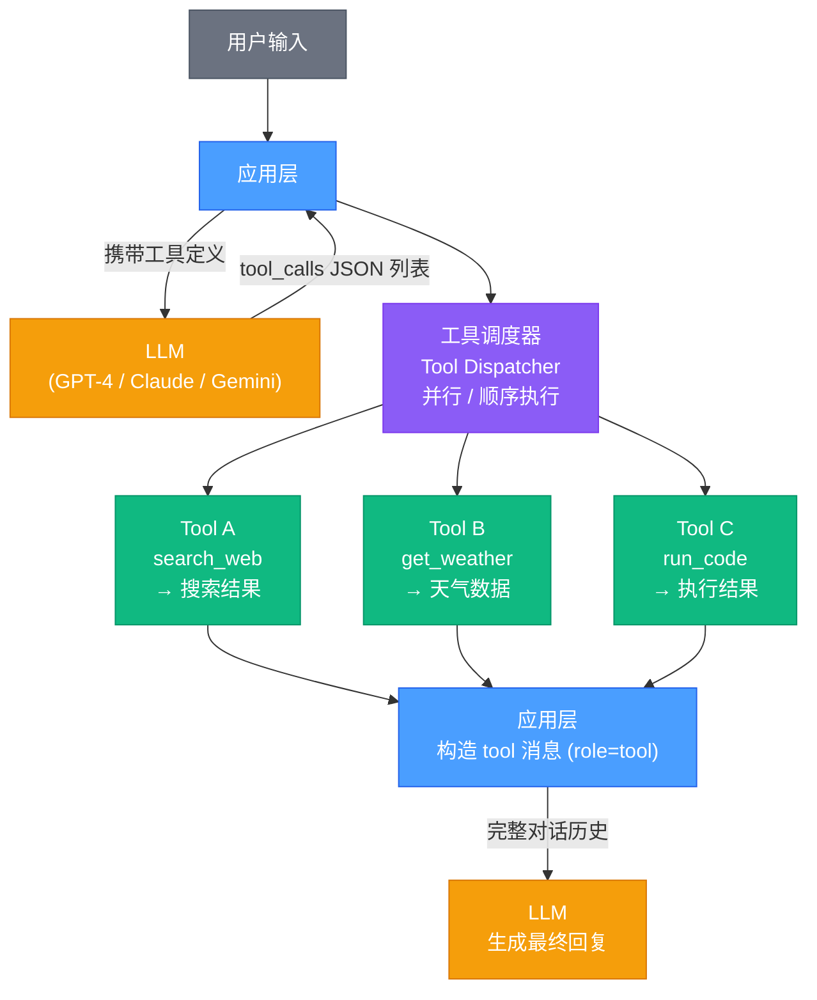

# 03-工具调用与Function-Calling — 技术资料

> 从协议格式到源码内核，系统拆解 OpenAI/Anthropic/Google 三大 Function Calling 协议差异、LangChain Tool 系统继承体系、MCP（Model Context Protocol）传输层设计、LangGraph 工具编排策略，以及 `AgentExecutor` / `create_tool_calling_agent` 的完整执行链路。

## 相关链接

- 对应面试题：[03-工具调用面试题](../../02-面试指南/07-AI-Agent全栈开发面试/03-工具调用面试题.md)

---

## 目录

1. [概述](#1-概述)
   - 1.1 为什么 LLM 需要工具调用
   - 1.2 工具调用的执行模型
2. [Function Calling 协议对比](#2-function-calling-协议对比)
   - 2.1 OpenAI Function Calling 协议
   - 2.2 Anthropic Tool Use 协议
   - 2.3 Google Gemini Function Calling 协议
   - 2.4 三大协议横向对比
3. [LangChain Tool 系统源码分析](#3-langchain-tool-系统源码分析)
   - 3.1 BaseTool 抽象类
   - 3.2 StructuredTool 与 @tool 装饰器
   - 3.3 args_schema 与 Pydantic 集成
   - 3.4 invoke() 调用链路
4. [MCP 协议详解](#4-mcp-协议详解)
   - 4.1 MCP 设计动机与架构
   - 4.2 JSON-RPC 传输层
   - 4.3 工具注册与发现
   - 4.4 资源类型系统
   - 4.5 MCP 与 LangChain 集成
5. [工具编排策略](#5-工具编排策略)
   - 5.1 并行工具调用
   - 5.2 顺序链式调用
   - 5.3 LangGraph 条件路由
6. [AgentExecutor 源码剖析](#6-agentexecutor-源码剖析)
   - 6.1 create_tool_calling_agent() 内部实现
   - 6.2 AgentExecutor 执行循环
   - 6.3 工具选择与结果注入
7. [生产实践](#7-生产实践)
   - 7.1 工具设计最佳实践
   - 7.2 错误处理与重试
   - 7.3 工具调用的可观测性
8. [Computer Use 与自主操作](#8-computer-use-与自主操作)
   - 8.1 Computer Use 的范式意义
   - 8.2 屏幕理解：从像素到语义
   - 8.3 坐标定位与操作类型
   - 8.4 浏览器自动化 Agent
   - 8.5 安全边界与人类确认
   - 8.6 Anthropic Computer Use vs 其他方案
9. [视觉工具集成](#9-视觉工具集成)
   - 9.1 多模态工具调用
   - 9.2 OCR 与文档理解
   - 9.3 图表分析
   - 9.4 UI 测试自动化
10. [工具缓存与智能路由](#10-工具缓存与智能路由)
    - 10.1 语义缓存（Semantic Cache）
    - 10.2 工具调用去重
    - 10.3 成本感知路由
    - 10.4 工具选择优化与 Tool RAG
11. [常见陷阱与最佳实践（2026 补充）](#11-常见陷阱与最佳实践2026-补充)

---

## 1. 概述

### 1.1 为什么 LLM 需要工具调用

纯文本 LLM 存在三类固有缺陷：

```
知识截止（Knowledge Cutoff）
  训练数据有时效性，无法获取实时信息（股价、天气、新闻）

计算不可靠（Unreliable Computation）
  LLM 做精确数学运算容易出错，"幻算"问题在 GPT-4 上仍存在

无副作用能力（No Side Effects）
  无法执行数据库写入、发送邮件、调用外部 API 等操作
```

Function Calling（工具调用）通过让模型输出**结构化的函数调用请求**，由外部系统执行后将结果回传，从根本上解决上述三类问题。

### 1.2 工具调用的执行模型

工具调用的核心是一个**请求-执行-回传**的闭环：



**关键设计原则**：LLM 本身不执行工具，它只负责**决策**调用哪个工具、传递什么参数。实际执行由应用层的 Tool Executor 完成。

---

## 2. Function Calling 协议对比

### 2.1 OpenAI Function Calling 协议

OpenAI 在 `gpt-3.5-turbo-0613` 中首次引入 Function Calling，之后在 GPT-4 中演进为 `tools` 参数。

**工具定义格式（请求侧）**：

```json
{
  "model": "gpt-4o",
  "messages": [
    {"role": "user", "content": "北京今天天气怎么样？"}
  ],
  "tools": [
    {
      "type": "function",
      "function": {
        "name": "get_weather",
        "description": "获取指定城市的当前天气信息",
        "parameters": {
          "type": "object",
          "properties": {
            "city": {
              "type": "string",
              "description": "城市名称，如 '北京'、'上海'"
            },
            "unit": {
              "type": "string",
              "enum": ["celsius", "fahrenheit"],
              "description": "温度单位"
            }
          },
          "required": ["city"]
        }
      }
    }
  ],
  "tool_choice": "auto"
}
```

**模型响应格式（有工具调用时）**：

```json
{
  "choices": [
    {
      "message": {
        "role": "assistant",
        "content": null,
        "tool_calls": [
          {
            "id": "call_abc123",
            "type": "function",
            "function": {
              "name": "get_weather",
              "arguments": "{\"city\": \"北京\", \"unit\": \"celsius\"}"
            }
          }
        ]
      },
      "finish_reason": "tool_calls"
    }
  ]
}
```

**工具结果回传格式**：

```json
{
  "role": "tool",
  "tool_call_id": "call_abc123",
  "content": "{\"temperature\": 22, \"condition\": \"晴\", \"humidity\": 45}"
}
```

**`tool_choice` 控制选项**：

| 值 | 行为 |
|----|------|
| `"auto"` | 模型自主决定是否调用工具（默认） |
| `"none"` | 禁止调用任何工具 |
| `"required"` | 强制调用至少一个工具 |
| `{"type":"function","function":{"name":"xxx"}}` | 强制调用指定工具 |

**并行工具调用**：GPT-4o 支持在单次响应中返回多个 `tool_calls`，`finish_reason` 为 `"tool_calls"`，应用层需并行执行所有调用后统一回传。

### 2.2 Anthropic Tool Use 协议

Anthropic 的 Claude 将工具能力称为 **Tool Use**，协议格式与 OpenAI 有明显差异。

**工具定义格式**：

```json
{
  "model": "claude-opus-4-5",
  "messages": [
    {"role": "user", "content": "北京今天天气怎么样？"}
  ],
  "tools": [
    {
      "name": "get_weather",
      "description": "获取指定城市的当前天气信息",
      "input_schema": {
        "type": "object",
        "properties": {
          "city": {
            "type": "string",
            "description": "城市名称"
          },
          "unit": {
            "type": "string",
            "enum": ["celsius", "fahrenheit"]
          }
        },
        "required": ["city"]
      }
    }
  ]
}
```

**模型响应格式（含工具调用）**：

```json
{
  "role": "assistant",
  "content": [
    {
      "type": "text",
      "text": "我来帮你查询北京的天气。"
    },
    {
      "type": "tool_use",
      "id": "toolu_01A09q90qw90lq917835lq9",
      "name": "get_weather",
      "input": {
        "city": "北京",
        "unit": "celsius"
      }
    }
  ],
  "stop_reason": "tool_use"
}
```

**关键差异**：Anthropic 的 `content` 是**数组类型**，可以同时包含文字和工具调用，而 OpenAI 的 `content` 与 `tool_calls` 是并列字段。

**工具结果回传格式**：

```json
{
  "role": "user",
  "content": [
    {
      "type": "tool_result",
      "tool_use_id": "toolu_01A09q90qw90lq917835lq9",
      "content": "{\"temperature\": 22, \"condition\": \"晴\"}"
    }
  ]
}
```

**另一个关键差异**：Anthropic 将工具结果作为 `user` 角色发送（`tool_result` 类型块），而 OpenAI 使用独立的 `role: "tool"` 消息。

### 2.3 Google Gemini Function Calling 协议

Gemini 的 Function Calling 使用 protobuf-风格的格式定义：

**工具定义格式**：

```json
{
  "tools": [
    {
      "function_declarations": [
        {
          "name": "get_weather",
          "description": "获取指定城市的当前天气信息",
          "parameters": {
            "type": "OBJECT",
            "properties": {
              "city": {
                "type": "STRING",
                "description": "城市名称"
              },
              "unit": {
                "type": "STRING",
                "enum": ["celsius", "fahrenheit"]
              }
            },
            "required": ["city"]
          }
        }
      ]
    }
  ],
  "tool_config": {
    "function_calling_config": {
      "mode": "AUTO"
    }
  }
}
```

**模型响应格式**：

```json
{
  "candidates": [
    {
      "content": {
        "parts": [
          {
            "function_call": {
              "name": "get_weather",
              "args": {
                "city": "北京",
                "unit": "celsius"
              }
            }
          }
        ],
        "role": "model"
      },
      "finish_reason": "STOP"
    }
  ]
}
```

**工具结果回传**：

```json
{
  "parts": [
    {
      "function_response": {
        "name": "get_weather",
        "response": {
          "temperature": 22,
          "condition": "晴"
        }
      }
    }
  ]
}
```

**Gemini 特性**：`args` 字段直接是 JSON 对象（非 JSON 字符串），无需额外 `json.loads()`。

### 2.4 三大协议横向对比

| 维度 | OpenAI | Anthropic | Google Gemini |
|------|--------|-----------|---------------|
| 工具定义外层键 | `tools[].function` | `tools[]`（直接） | `tools[].function_declarations[]` |
| Schema 键名 | `parameters` | `input_schema` | `parameters` |
| 类型大小写 | 小写 (`"string"`) | 小写 (`"string"`) | 大写 (`"STRING"`) |
| 响应中的工具调用位置 | `message.tool_calls[]` | `message.content[]`（混合） | `parts[].function_call` |
| arguments 格式 | JSON 字符串（需解析） | JSON 对象（直接使用） | JSON 对象（直接使用） |
| 工具结果的 role | `"tool"` | `"user"`（含 `tool_result` 块） | `"user"`（含 `function_response` 块） |
| 工具 ID 字段 | `tool_call_id` | `tool_use_id` | 无（按 name 匹配） |
| 强制指定工具 | `tool_choice: {type,function}` | `tool_choice: {type,name}` | `function_calling_config.mode` |
| 并行调用 | ✅ 支持 | ✅ 支持 | ✅ 支持 |
| 流式工具调用 | ✅ | ✅ | ✅ |

---

## 3. LangChain Tool 系统源码分析

### 3.1 BaseTool 抽象类

LangChain 所有工具的根基是 `BaseTool`，位于 `langchain_core/tools/base.py`：

```python
# langchain_core/tools/base.py（简化）
class BaseTool(RunnableSerializable[Union[str, dict, ToolCall], Any]):
    """所有工具的抽象基类"""

    name: str                    # 工具名称，LLM 调用时使用
    description: str             # 工具描述，注入到 system prompt
    args_schema: Optional[Type[BaseModel]] = None  # 参数 Pydantic Schema
    return_direct: bool = False  # 是否跳过 Agent 直接返回给用户
    verbose: bool = False
    callbacks: Callbacks = None
    handle_tool_error: Optional[Union[bool, str, Callable]] = False
    handle_validation_error: Optional[Union[bool, str, Callable]] = False

    @abstractmethod
    def _run(self, *args: Any, **kwargs: Any) -> Any:
        """子类必须实现的同步执行方法"""

    async def _arun(self, *args: Any, **kwargs: Any) -> Any:
        """异步执行方法，默认在线程池中运行 _run"""
        return await asyncio.get_event_loop().run_in_executor(
            None, partial(self._run, *args, **kwargs)
        )

    def invoke(
        self,
        input: Union[str, dict, ToolCall],
        config: Optional[RunnableConfig] = None,
        **kwargs: Any,
    ) -> Any:
        """LCEL 兼容的 invoke 入口"""
        tool_input, kwargs = self._parse_input(input, kwargs)
        return self.run(tool_input, **kwargs)

    def run(
        self,
        tool_input: Union[str, Dict],
        verbose: Optional[bool] = None,
        start_color: Optional[str] = "green",
        color: Optional[str] = "green",
        callbacks: Callbacks = None,
        **kwargs: Any,
    ) -> Any:
        """完整执行路径，含错误处理和回调"""
        parsed_input = self._parse_input(tool_input)
        # 触发 on_tool_start 回调
        run_manager = callback_manager.on_tool_start(...)
        try:
            # 调用 _run，传入解析后的参数
            tool_args, tool_kwargs = self._to_args_and_kwargs(parsed_input)
            observation = self._run(*tool_args, **tool_kwargs)
        except ValidationError as e:
            observation = self._handle_validation_error(e)
        except ToolException as e:
            observation = self._handle_tool_error(e)
        # 触发 on_tool_end 回调
        run_manager.on_tool_end(observation, ...)
        return observation
```

**继承体系**：

```
Runnable (langchain_core/runnables/base.py)
  └── RunnableSerializable
        └── BaseTool
              ├── Tool              # 简单函数包装（单字符串参数）
              ├── StructuredTool    # 多参数结构化工具（主流）
              ├── RetrieverTool     # 向量检索工具
              └── BaseSingleActionAgent（遗留）
```

### 3.2 StructuredTool 与 @tool 装饰器

`StructuredTool` 是最常用的工具类，`@tool` 装饰器是其语法糖：

```python
# langchain_core/tools/structured.py（简化）
class StructuredTool(BaseTool):
    """支持多参数结构化输入的工具"""

    args_schema: Type[BaseModel]  # 非 Optional，必须提供
    func: Optional[Callable[..., Any]] = None      # 同步函数
    coroutine: Optional[Callable[..., Awaitable[Any]]] = None  # 异步函数

    @classmethod
    def from_function(
        cls,
        func: Optional[Callable] = None,
        coroutine: Optional[Callable] = None,
        name: Optional[str] = None,
        description: Optional[str] = None,
        return_direct: bool = False,
        args_schema: Optional[Type[BaseModel]] = None,
        infer_schema: bool = True,
        **kwargs: Any,
    ) -> "StructuredTool":
        name = name or func.__name__
        description = description or func.__doc__ or ""

        # 从函数签名自动推断 Pydantic Schema
        if infer_schema and args_schema is None:
            args_schema = create_schema_from_function(
                f"{name}Schema",
                func,
                filter_args=(),
                parse_docstring=True,
                error_on_invalid_docstring=False,
            )
        return cls(
            name=name,
            func=func,
            coroutine=coroutine,
            args_schema=args_schema,
            description=description,
            return_direct=return_direct,
            **kwargs,
        )

    def _run(self, *args: Any, run_manager=None, **kwargs: Any) -> Any:
        """执行包装的函数"""
        if self.func:
            # 注入 run_manager（如果函数签名支持）
            new_argument_supported = signature(self.func).parameters.get(
                "callbacks"
            )
            if new_argument_supported:
                return self.func(
                    *args, callbacks=run_manager.get_child(), **kwargs
                )
            return self.func(*args, **kwargs)
        raise NotImplementedError("StructuredTool does not support async")
```

**`@tool` 装饰器源码**：

```python
# langchain_core/tools/convert.py（简化）
def tool(
    *args: Union[str, Callable, Runnable],
    return_direct: bool = False,
    args_schema: Optional[Type[BaseModel]] = None,
    infer_schema: bool = True,
    response_format: Literal["content", "content_and_artifact"] = "content",
    parse_docstring: bool = False,
    error_on_invalid_docstring: bool = True,
) -> Callable:
    def decorator(func: Callable) -> StructuredTool:
        return StructuredTool.from_function(
            func=func if not asyncio.iscoroutinefunction(func) else None,
            coroutine=func if asyncio.iscoroutinefunction(func) else None,
            name=tool_name,
            description=description,
            return_direct=return_direct,
            args_schema=args_schema,
            infer_schema=infer_schema,
            response_format=response_format,
        )
    # 处理 @tool 与 @tool() 两种调用形式
    if len(args) == 1 and callable(args[0]):
        return decorator(args[0])
    return decorator
```

**实际使用示例**：

```python
from langchain_core.tools import tool
from pydantic import BaseModel, Field

# 方式一：@tool 装饰器（自动推断 Schema）
@tool
def search_web(query: str, num_results: int = 5) -> str:
    """搜索网页并返回结果摘要。
    
    Args:
        query: 搜索关键词
        num_results: 返回结果数量，默认 5
    """
    # 实际搜索逻辑
    return f"搜索 '{query}' 的结果..."

# 方式二：显式定义 Schema
class WeatherInput(BaseModel):
    city: str = Field(description="城市名称，如 '北京'")
    unit: str = Field(default="celsius", description="温度单位")

@tool(args_schema=WeatherInput)
def get_weather(city: str, unit: str = "celsius") -> str:
    """获取指定城市的实时天气"""
    return f"{city} 当前温度 22{unit}"

# 方式三：StructuredTool.from_function
from langchain_core.tools import StructuredTool

def calculate(expression: str) -> str:
    """计算数学表达式"""
    return str(eval(expression))  # noqa: S307（生产中需沙箱）

calc_tool = StructuredTool.from_function(
    func=calculate,
    name="calculator",
    description="执行数学计算，支持 +,-,*,/,** 运算符",
)

# 查看生成的 JSON Schema（用于发送给 LLM）
print(search_web.args_schema.model_json_schema())
# {
#   "title": "search_webSchema",
#   "type": "object",
#   "properties": {
#     "query": {"title": "Query", "type": "string"},
#     "num_results": {"title": "Num Results", "default": 5, "type": "integer"}
#   },
#   "required": ["query"]
# }
```

### 3.3 args_schema 与 Pydantic 集成

`BaseTool.args` 属性动态生成工具的参数描述字典，是 LangChain 将工具转换为 LLM 可理解格式的关键：

```python
# BaseTool.args 属性（langchain_core/tools/base.py）
@property
def args(self) -> dict:
    """返回工具参数的 JSON Schema dict"""
    if self.args_schema is not None:
        schema = self.args_schema.model_json_schema()
        # 移除 title 字段（LLM 不需要）
        return schema.get("properties", {})
    # 无 Schema 时，从 _run 签名推断
    schema = create_schema_from_function("tool_input", self._run)
    return schema.get("properties", {})

# convert_to_openai_tool() 将 BaseTool 转换为 OpenAI 格式
def convert_to_openai_tool(tool: BaseTool) -> dict:
    """将 LangChain 工具转换为 OpenAI tools[] 格式"""
    return {
        "type": "function",
        "function": {
            "name": tool.name,
            "description": tool.description,
            "parameters": tool.args_schema.model_json_schema()
            if tool.args_schema
            else {
                "type": "object",
                "properties": tool.args,
            },
        },
    }
```

**Schema 推断机制**：`create_schema_from_function` 使用 `inspect.signature` 解析函数签名，将类型注解映射为 JSON Schema 类型：

```
Python 类型注解  →  JSON Schema 类型
str              →  "string"
int / float      →  "integer" / "number"
bool             →  "boolean"
List[str]        →  {"type": "array", "items": {"type": "string"}}
Optional[str]    →  {"anyOf": [{"type": "string"}, {"type": "null"}]}
Literal["a","b"] →  {"type": "string", "enum": ["a", "b"]}
```

### 3.4 invoke() 调用链路

```
外部调用 tool.invoke({"query": "北京天气"})
  │
  ▼
BaseTool.invoke(input, config)          # LCEL Runnable 接口
  │
  ├── _parse_input(input)               # 解析输入：str/dict/ToolCall
  │     ├── ToolCall → 提取 args dict
  │     ├── dict → 直接使用
  │     └── str → {"input": str}（单参数工具）
  │
  └── self.run(tool_input, callbacks)   # 执行入口
        │
        ├── _to_args_and_kwargs(input)  # 转为 *args/**kwargs
        │
        ├── callback_manager.on_tool_start(...)
        │
        ├── self._run(*args, **kwargs)  # 实际执行（子类实现）
        │     └── StructuredTool._run  → self.func(**kwargs)
        │
        ├── callback_manager.on_tool_end(observation)
        │
        └── return observation          # 字符串结果
```

---

## 4. MCP 协议详解

### 4.1 MCP 设计动机与架构

**Model Context Protocol（MCP）** 是 Anthropic 于 2024 年 11 月发布的开放标准，目标是解决 AI 应用与外部系统集成的"M×N 问题"：

```
没有 MCP 时（M×N 集成）：
  每个 AI 应用 × 每个工具 = 独立集成实现

  App A ──→ Tool 1 (自定义)
  App A ──→ Tool 2 (自定义)
  App B ──→ Tool 1 (重新实现)
  App B ──→ Tool 2 (重新实现)

有 MCP 时（M+N 集成）：
  每个应用只需实现 MCP Client
  每个工具只需实现 MCP Server

  App A ──┐
  App B ──┤ MCP Protocol ├──→ Tool Server 1
  App C ──┘               └──→ Tool Server 2
```

**MCP 整体架构**：

```
┌─────────────────────────────────────────────────────────┐
│                    MCP 架构层次                           │
└─────────────────────────────────────────────────────────┘

┌──────────────────┐     MCP Protocol      ┌─────────────────┐
│   MCP Host       │  ◄──────────────────► │   MCP Server    │
│  (AI 应用)       │                        │  (工具提供方)    │
│                  │                        │                 │
│  - Claude Desktop│  ┌──────────────────┐ │  - 文件系统 API  │
│  - VS Code       │  │  Transport Layer │ │  - 数据库连接    │
│  - LangChain App │  │  (传输层)         │ │  - Web 搜索     │
│                  │  │                  │ │  - GitHub API   │
│  MCP Client      │  │  - stdio         │ │                 │
│  (协议实现)      │  │  - HTTP+SSE      │ │  Resources      │
│                  │  │  - WebSocket     │ │  Tools          │
└──────────────────┘  └──────────────────┘ │  Prompts        │
                                            └─────────────────┘
```

### 4.2 JSON-RPC 传输层

MCP 基于 **JSON-RPC 2.0** 协议，支持三种传输方式：

**stdio 传输（本地进程）**：

```
MCP Host                      MCP Server
  │                               │
  │ 启动子进程（subprocess）       │
  │ stdin/stdout 通信             │
  │                               │
  │──── JSON-RPC Request ────────▶│
  │     {                         │
  │       "jsonrpc": "2.0",       │
  │       "id": 1,                │
  │       "method": "tools/list", │
  │       "params": {}            │
  │     }                         │
  │                               │
  │◀─── JSON-RPC Response ────────│
  │     {                         │
  │       "jsonrpc": "2.0",       │
  │       "id": 1,                │
  │       "result": {             │
  │         "tools": [...]        │
  │       }                       │
  │     }                         │
```

**HTTP+SSE 传输（远程服务）**：

```python
# MCP Server 使用 SSE 推送通知
# GET /sse → Server-Sent Events 流
# POST /message → JSON-RPC 请求

# 初始化握手
→ POST /message
  {"jsonrpc":"2.0","id":0,"method":"initialize","params":{
    "protocolVersion":"2024-11-05",
    "capabilities":{"tools":{},"resources":{}},
    "clientInfo":{"name":"my-app","version":"1.0"}
  }}

← {"jsonrpc":"2.0","id":0,"result":{
    "protocolVersion":"2024-11-05",
    "capabilities":{"tools":{"listChanged":true}},
    "serverInfo":{"name":"filesystem-server","version":"0.1.0"}
  }}

# 初始化完成通知
→ POST /message
  {"jsonrpc":"2.0","method":"notifications/initialized"}
```

### 4.3 工具注册与发现

MCP Server 通过标准接口暴露工具：

```python
# MCP Server 实现示例（Python SDK）
from mcp.server import Server
from mcp.server.models import InitializationOptions
from mcp.types import Tool, TextContent, CallToolResult
import mcp.types as types

app = Server("weather-server")

@app.list_tools()
async def list_tools() -> list[Tool]:
    """注册工具列表（响应 tools/list 请求）"""
    return [
        Tool(
            name="get_weather",
            description="获取指定城市的实时天气信息",
            inputSchema={
                "type": "object",
                "properties": {
                    "city": {
                        "type": "string",
                        "description": "城市名称"
                    },
                    "unit": {
                        "type": "string",
                        "enum": ["celsius", "fahrenheit"],
                        "default": "celsius"
                    }
                },
                "required": ["city"]
            }
        ),
        Tool(
            name="search_news",
            description="搜索最新新闻",
            inputSchema={
                "type": "object",
                "properties": {
                    "query": {"type": "string"},
                    "max_results": {"type": "integer", "default": 5}
                },
                "required": ["query"]
            }
        )
    ]

@app.call_tool()
async def call_tool(name: str, arguments: dict) -> list[types.ContentBlock]:
    """执行工具调用（响应 tools/call 请求）"""
    if name == "get_weather":
        city = arguments["city"]
        unit = arguments.get("unit", "celsius")
        # 实际 API 调用
        result = await fetch_weather_api(city, unit)
        return [TextContent(type="text", text=str(result))]
    elif name == "search_news":
        # ...
        pass
    else:
        raise ValueError(f"Unknown tool: {name}")
```

**工具调用 JSON-RPC 格式**：

```json
// 请求
{
  "jsonrpc": "2.0",
  "id": 5,
  "method": "tools/call",
  "params": {
    "name": "get_weather",
    "arguments": {
      "city": "北京",
      "unit": "celsius"
    }
  }
}

// 响应
{
  "jsonrpc": "2.0",
  "id": 5,
  "result": {
    "content": [
      {
        "type": "text",
        "text": "{\"temperature\": 22, \"condition\": \"晴\", \"humidity\": 45}"
      }
    ],
    "isError": false
  }
}
```

### 4.4 资源类型系统

MCP 定义了三类**原语（Primitives）**，每类对应不同的控制方（由谁决定使用）：

```
┌─────────────┬──────────────────────────────┬────────────────────┐
│   原语类型   │         描述                  │     控制方          │
├─────────────┼──────────────────────────────┼────────────────────┤
│  Resources  │ 文件、数据库记录、API 响应等    │  Host（AI 应用）    │
│             │ 由 LLM 读取的上下文数据         │  决定注入哪些资源   │
├─────────────┼──────────────────────────────┼────────────────────┤
│  Tools      │ 可执行的函数/API               │  Model（LLM）      │
│             │ 由 LLM 决定何时调用             │  自主决策调用       │
├─────────────┼──────────────────────────────┼────────────────────┤
│  Prompts    │ 预定义的提示词模板             │  User（用户）       │
│             │ 由用户选择使用哪个模板           │  明确选择           │
└─────────────┴──────────────────────────────┴────────────────────┘
```

**Resources 示例**：

```python
@app.list_resources()
async def list_resources() -> list[types.Resource]:
    return [
        types.Resource(
            uri="file:///workspace/config.json",
            name="项目配置文件",
            description="当前项目的配置信息",
            mimeType="application/json"
        )
    ]

@app.read_resource()
async def read_resource(uri: str) -> str:
    if uri == "file:///workspace/config.json":
        with open("/workspace/config.json") as f:
            return f.read()
```

### 4.5 MCP 与 LangChain 集成

`langchain-mcp-adapters` 库将 MCP 工具无缝转换为 LangChain 工具：

```python
from mcp import ClientSession, StdioServerParameters
from mcp.client.stdio import stdio_client
from langchain_mcp_adapters.tools import load_mcp_tools
from langchain_openai import ChatOpenAI
from langgraph.prebuilt import create_react_agent

# 连接 MCP Server（stdio 模式）
server_params = StdioServerParameters(
    command="python",
    args=["weather_server.py"],
    env={"WEATHER_API_KEY": "xxx"}
)

async def run_agent():
    async with stdio_client(server_params) as (read, write):
        async with ClientSession(read, write) as session:
            await session.initialize()

            # 自动加载 MCP Server 暴露的所有工具
            tools = await load_mcp_tools(session)
            # tools 是 List[BaseTool]，可直接用于 LangChain

            model = ChatOpenAI(model="gpt-4o")
            agent = create_react_agent(model, tools)

            result = await agent.ainvoke({
                "messages": [{"role": "user", "content": "北京今天天气如何？"}]
            })
```

**`load_mcp_tools` 内部实现**：调用 `session.list_tools()` 获取工具列表，然后为每个工具创建一个 `StructuredTool`，其 `_run` 方法实际调用 `session.call_tool(name, args)`。

---

## 5. 工具编排策略

### 5.1 并行工具调用

当多个工具之间没有数据依赖时，应并行执行以降低延迟：

```python
import asyncio
from langchain_core.tools import tool
from langchain_openai import ChatOpenAI

@tool
async def get_weather(city: str) -> str:
    """获取城市天气"""
    await asyncio.sleep(1)  # 模拟 API 延迟
    return f"{city}: 晴，22°C"

@tool
async def get_news(topic: str) -> str:
    """获取新闻"""
    await asyncio.sleep(1)
    return f"{topic} 最新新闻..."

# GPT-4o 在单次响应中返回多个 tool_calls
model = ChatOpenAI(model="gpt-4o").bind_tools([get_weather, get_news])

async def execute_parallel_tools(tool_calls: list) -> list:
    """并行执行所有工具调用"""
    tasks = []
    for tc in tool_calls:
        tool_map = {"get_weather": get_weather, "get_news": get_news}
        tool = tool_map[tc["name"]]
        tasks.append(tool.ainvoke(tc["args"]))

    # asyncio.gather 并行等待所有结果
    results = await asyncio.gather(*tasks)
    return [
        {"tool_call_id": tc["id"], "content": str(r)}
        for tc, r in zip(tool_calls, results)
    ]
```

**延迟对比**：

```
顺序执行（3 个工具，各 1s）：1s + 1s + 1s = 3s
并行执行（3 个工具，各 1s）：max(1s, 1s, 1s) = 1s（提速 3x）
```

### 5.2 顺序链式调用

当工具 B 需要工具 A 的输出时，使用顺序链：

```python
from langchain_core.runnables import RunnableLambda
from langchain_core.messages import HumanMessage, ToolMessage

def sequential_tool_chain():
    """
    工具调用链：搜索 → 提取 → 总结
    Tool A: search_web(query) → URLs
    Tool B: extract_content(url) → 文章内容
    Tool C: summarize(content) → 摘要
    """
    model = ChatOpenAI(model="gpt-4o").bind_tools(
        [search_web, extract_content, summarize_text]
    )

    messages = [HumanMessage("总结今天关于量子计算的最新研究")]

    # ReAct 循环：思考 → 行动 → 观察 → 思考...
    while True:
        response = model.invoke(messages)
        messages.append(response)

        if not response.tool_calls:
            break  # 模型决定停止调用工具，返回最终答案

        # 依次执行（顺序保证数据流）
        for tool_call in response.tool_calls:
            result = execute_tool(tool_call)
            messages.append(ToolMessage(
                content=str(result),
                tool_call_id=tool_call["id"]
            ))

    return messages[-1].content
```

### 5.3 LangGraph 条件路由

LangGraph 通过图结构实现复杂的工具编排逻辑：

```python
from langgraph.graph import StateGraph, END
from langgraph.prebuilt import ToolNode
from typing import TypedDict, Annotated
from langchain_core.messages import BaseMessage
import operator

class AgentState(TypedDict):
    messages: Annotated[list[BaseMessage], operator.add]

# 定义工具节点（自动并行执行所有 tool_calls）
tools = [search_web, get_weather, run_code]
tool_node = ToolNode(tools)

model = ChatOpenAI(model="gpt-4o").bind_tools(tools)

def call_model(state: AgentState) -> AgentState:
    response = model.invoke(state["messages"])
    return {"messages": [response]}

def should_continue(state: AgentState) -> str:
    """条件路由：决定下一步是调用工具还是结束"""
    last_message = state["messages"][-1]

    if last_message.tool_calls:
        # 根据工具类型路由到不同处理节点
        tool_names = [tc["name"] for tc in last_message.tool_calls]
        if any(name == "run_code" for name in tool_names):
            return "sandboxed_tool_node"   # 代码执行走沙箱
        return "tool_node"                 # 普通工具调用
    return END                             # 无工具调用，结束

# 构建图
workflow = StateGraph(AgentState)
workflow.add_node("agent", call_model)
workflow.add_node("tool_node", tool_node)
workflow.add_node("sandboxed_tool_node", sandboxed_tool_node)

workflow.set_entry_point("agent")
workflow.add_conditional_edges(
    "agent",
    should_continue,
    {
        "tool_node": "tool_node",
        "sandboxed_tool_node": "sandboxed_tool_node",
        END: END
    }
)
# 工具执行完毕后回到 agent 节点
workflow.add_edge("tool_node", "agent")
workflow.add_edge("sandboxed_tool_node", "agent")

app = workflow.compile()
```

**LangGraph 工具编排流程图**：

```
                    ┌─────────┐
               ─────│  START  │
               │    └─────────┘
               │         │
               │         ▼
               │    ┌─────────┐
               └────│  agent  │◀──────────────────┐
                    └─────────┘                    │
                         │                         │
              ┌──────────┼──────────┐              │
              │          │          │              │
        tool_calls?  sandboxed?    END             │
              │          │          │              │
              ▼          ▼          ▼              │
        ┌──────────┐ ┌──────────┐  ●              │
        │tool_node │ │sandbox   │                  │
        │(并行执行)│ │tool_node │                  │
        └──────────┘ └──────────┘                  │
              │          │                         │
              └──────────┴─────────────────────────┘
                    工具结果注入 messages
```

---

## 6. AgentExecutor 源码剖析

### 6.1 create_tool_calling_agent() 内部实现

`create_tool_calling_agent` 是 LangChain 创建工具调用 Agent 的标准函数：

```python
# langchain/agents/tool_calling_agent/base.py（简化）
def create_tool_calling_agent(
    llm: BaseLanguageModel,
    tools: Sequence[BaseTool],
    prompt: ChatPromptTemplate,
    message_formatter: Optional[Callable] = None,
) -> Runnable:
    """
    创建工具调用 Agent（LCEL 管道）

    返回的 Runnable 签名：
    Input: {"input": str, "intermediate_steps": list, "chat_history": list}
    Output: Union[AgentAction, AgentFinish]
    """
    # 1. 验证 prompt 包含必要的占位符
    missing_vars = {"agent_scratchpad"}.difference(
        prompt.input_variables + list(prompt.partial_variables)
    )
    if missing_vars:
        raise ValueError(f"Prompt missing variables: {missing_vars}")

    # 2. 将工具绑定到 LLM（注入工具定义到 API 请求）
    llm_with_tools = llm.bind_tools(tools)

    # 3. 构建 LCEL 管道
    agent = (
        RunnablePassthrough.assign(
            # 将 intermediate_steps 格式化为消息历史
            agent_scratchpad=lambda x: format_to_tool_messages(
                x["intermediate_steps"]
            ),
        )
        | prompt                    # 渲染完整 prompt（含工具结果）
        | llm_with_tools            # 调用 LLM（携带工具定义）
        | ToolsAgentOutputParser()  # 解析响应为 AgentAction/AgentFinish
    )
    return agent
```

**`format_to_tool_messages` 的作用**：将 `(AgentAction, observation)` 元组列表转换为 `AIMessage` + `ToolMessage` 消息序列，维护完整的对话上下文。

**`ToolsAgentOutputParser` 解析逻辑**：

```python
class ToolsAgentOutputParser(BaseOutputParser):
    def parse_result(
        self, result: list[Generation], *, partial: bool = False
    ) -> Union[list[AgentAction], AgentFinish]:
        if not isinstance(result[0], ChatGeneration):
            raise ValueError("Expected ChatGeneration")

        message = result[0].message

        # 有 tool_calls → AgentAction（继续执行）
        if message.tool_calls:
            return [
                ToolAgentAction(
                    tool=tool_call["name"],
                    tool_input=tool_call["args"],
                    log=f"Invoking: `{tool_call['name']}`",
                    message_log=[message],
                    tool_call_id=tool_call["id"],
                )
                for tool_call in message.tool_calls
            ]

        # 无 tool_calls → AgentFinish（返回最终答案）
        return AgentFinish(
            return_values={"output": message.content},
            log=str(message.content)
        )
```

### 6.2 AgentExecutor 执行循环

```python
# langchain/agents/agent.py（AgentExecutor._call 简化）
class AgentExecutor(Chain):
    agent: RunnableAgent
    tools: Sequence[BaseTool]
    max_iterations: int = 15
    max_execution_time: Optional[float] = None
    early_stopping_method: str = "force"
    handle_parsing_errors: Union[bool, str, Callable] = False

    def _call(self, inputs: dict) -> dict:
        """同步执行循环"""
        intermediate_steps: list[tuple[AgentAction, str]] = []
        iterations = 0
        time_elapsed = 0.0
        start_time = time.time()

        while self._should_continue(iterations, time_elapsed):
            # 1. 调用 Agent（LLM + 输出解析）
            next_step_output = self._take_next_step(
                name_to_tool_map={t.name: t for t in self.tools},
                color_mapping=...,
                inputs=inputs,
                intermediate_steps=intermediate_steps,
            )

            # 2. AgentFinish → 结束循环
            if isinstance(next_step_output, AgentFinish):
                return self._return(next_step_output, intermediate_steps)

            # 3. AgentAction → 执行工具，收集结果
            for action, observation in next_step_output:
                intermediate_steps.append((action, str(observation)))

                # return_direct=True 的工具直接返回
                tool = name_to_tool_map.get(action.tool)
                if tool and tool.return_direct:
                    return self._return(
                        AgentFinish({"output": observation}, ""),
                        intermediate_steps
                    )

            iterations += 1
            time_elapsed = time.time() - start_time

        # 超出最大迭代次数，强制停止
        return self._return(
            self.agent.return_stopped_response(
                self.early_stopping_method, intermediate_steps, **inputs
            ),
            intermediate_steps,
        )

    def _take_next_step(self, name_to_tool_map, ...) -> ...:
        """单步：调用 LLM，然后执行返回的所有工具"""
        # 调用 agent（LCEL 管道）
        output = self.agent.plan(intermediate_steps, **inputs)

        if isinstance(output, AgentFinish):
            return output

        # 并发执行所有 AgentAction（若有多个 tool_calls）
        with ThreadPoolExecutor() as executor:
            results = list(executor.map(
                lambda action: (action, self._run_tool(action, name_to_tool_map)),
                output if isinstance(output, list) else [output]
            ))
        return results
```

### 6.3 工具选择与结果注入

**工具选择**由 LLM 自主完成——LangChain 仅负责将工具的 JSON Schema 通过 `bind_tools()` 注入到 API 请求，不干预模型决策。

**LLM.bind_tools() 的内部实现**：

```python
# langchain_openai/chat_models/base.py（简化）
class ChatOpenAI(BaseChatOpenAI):
    def bind_tools(
        self,
        tools: Sequence[Union[dict, type, Callable, BaseTool]],
        *,
        tool_choice: Optional[Union[dict, str, Literal["auto","none","required"]]] = None,
        **kwargs,
    ) -> Runnable:
        # 将各种类型统一转换为 OpenAI tools 格式
        formatted_tools = [convert_to_openai_tool(t) for t in tools]
        if tool_choice is not None:
            kwargs["tool_choice"] = tool_choice
        return super().bind(tools=formatted_tools, **kwargs)

# convert_to_openai_tool 支持以下输入类型
# BaseTool → 读取 name/description/args_schema
# dict     → 验证格式后直接使用
# type     → Pydantic 模型作为工具（用于结构化输出）
# Callable → 从函数签名推断（同 @tool 装饰器）
```

**工具结果注入流程**：

```
intermediate_steps = [
    (AgentAction(tool="search_web", tool_input={"query":"北京天气"}),
     "北京当前天气：晴，22°C"),
]
                    │
                    ▼
format_to_tool_messages(intermediate_steps)
                    │
                    ▼
[
  AIMessage(
    content="",
    tool_calls=[{"id":"call_abc","name":"search_web","args":{...}}]
  ),
  ToolMessage(
    content="北京当前天气：晴，22°C",
    tool_call_id="call_abc"
  )
]
                    │
                    ▼
注入到 prompt 的 {agent_scratchpad} 占位符
模型据此继续生成下一步
```

---

## 7. 生产实践

### 7.1 工具设计最佳实践

**描述质量决定召回率**：工具的 `description` 字段直接影响 LLM 是否选择该工具，应遵循以下原则：

```python
# ❌ 描述不足（LLM 难以判断何时使用）
@tool
def query_db(sql: str) -> str:
    """执行 SQL 查询"""
    ...

# ✅ 描述充分（明确触发条件和能力边界）
@tool
def query_db(sql: str) -> str:
    """
    在 PostgreSQL 数据库中执行 SQL SELECT 查询，返回 JSON 格式的结果。
    适用场景：需要查询用户数据、订单记录、产品信息等结构化数据时使用。
    注意：仅支持 SELECT 语句，不支持 INSERT/UPDATE/DELETE。
    返回格式：[{"column": value, ...}, ...] 的 JSON 数组
    """
    ...
```

**单一职责原则**：

```python
# ❌ 功能耦合（LLM 难以精确控制）
@tool
def manage_file(action: str, path: str, content: str = "") -> str:
    """读写删文件"""
    ...

# ✅ 职责分离（每个工具专注一件事）
@tool
def read_file(path: str) -> str:
    """读取文件内容，返回字符串。支持 .txt/.md/.py/.json 格式。"""
    ...

@tool
def write_file(path: str, content: str) -> str:
    """将 content 写入指定文件路径。文件不存在时自动创建。"""
    ...
```

### 7.2 错误处理与重试

```python
from langchain_core.tools import ToolException

class RobustSearchTool(BaseTool):
    name = "search_web"
    description = "搜索网页，失败时自动重试（最多 3 次）"
    handle_tool_error = True  # 启用错误处理（返回错误信息而非抛出异常）

    def _run(self, query: str) -> str:
        import httpx
        from tenacity import retry, stop_after_attempt, wait_exponential

        @retry(
            stop=stop_after_attempt(3),
            wait=wait_exponential(multiplier=1, min=1, max=10)
        )
        def _search():
            response = httpx.get(
                "https://api.search.example.com",
                params={"q": query},
                timeout=10.0
            )
            response.raise_for_status()
            return response.json()["results"]

        try:
            results = _search()
            return "\n".join(r["snippet"] for r in results[:5])
        except httpx.HTTPStatusError as e:
            raise ToolException(f"搜索 API 返回错误：{e.response.status_code}")
        except httpx.TimeoutException:
            raise ToolException("搜索超时，请稍后重试")

# handle_tool_error=True 时，ToolException 不会终止 Agent
# 而是将错误信息作为工具结果返回给 LLM，LLM 可据此调整策略
```

**工具超时控制**：

```python
import signal
from contextlib import contextmanager

@contextmanager
def timeout(seconds: int):
    def handler(signum, frame):
        raise TimeoutError(f"工具执行超时（>{seconds}s）")
    signal.signal(signal.SIGALRM, handler)
    signal.alarm(seconds)
    try:
        yield
    finally:
        signal.alarm(0)

class TimeoutTool(BaseTool):
    name = "slow_api"
    description = "调用可能较慢的外部 API（限制 30s）"

    def _run(self, **kwargs) -> str:
        with timeout(30):
            return call_slow_api(**kwargs)
```

### 7.3 工具调用的可观测性

```python
from langchain_core.callbacks import BaseCallbackHandler
from datetime import datetime

class ToolObservabilityHandler(BaseCallbackHandler):
    """记录工具调用的完整遥测数据"""

    def on_tool_start(
        self, serialized: dict, input_str: str, **kwargs
    ) -> None:
        self.start_time = datetime.now()
        tool_name = serialized.get("name", "unknown")
        # 发送到监控系统（Prometheus/DataDog/Langfuse）
        metrics.increment("tool.invocations", tags=[f"tool:{tool_name}"])

    def on_tool_end(self, output: str, **kwargs) -> None:
        duration = (datetime.now() - self.start_time).total_seconds()
        metrics.histogram("tool.duration_seconds", duration)
        # 记录输出长度（检测工具是否返回过长内容）
        metrics.histogram("tool.output_length", len(output))

    def on_tool_error(
        self, error: BaseException, **kwargs
    ) -> None:
        metrics.increment("tool.errors", tags=[f"error:{type(error).__name__}"])

# 注入 Callback
agent_executor = AgentExecutor(
    agent=agent,
    tools=tools,
    callbacks=[ToolObservabilityHandler()],
    verbose=True,
)
```

**关键监控指标**：

| 指标 | 说明 | 告警阈值 |
|------|------|---------|
| `tool.invocations` | 工具调用总次数（按 tool name 分组） | - |
| `tool.duration_p99` | P99 调用延迟 | > 10s |
| `tool.error_rate` | 工具错误率 | > 5% |
| `agent.iterations` | 单次请求的 Agent 迭代次数 | > 10 次 |
| `tool.output_length` | 工具返回内容长度 | > 4096 tokens |
| `agent.token_cost` | 单次 Agent 调用的 Token 消耗 | 按业务设定 |

---

## 8. Computer Use 与自主操作

### 8.1 Computer Use 的范式意义

在前面的章节中，我们讨论的工具调用都遵循同一个范式：**LLM 输出结构化的 JSON 调用请求 → 应用层执行对应的 API → 将结果返回给 LLM**。这个范式有一个隐含前提——我们必须为每一个能力预先定义好工具接口。

但现实世界中，大量的操作并没有现成的 API。比如：在 ERP 系统中录入一笔采购订单、在遗留系统的 Web 界面上查询库存、在设计工具中调整图片尺寸。这些系统只暴露了"人类操作界面"，而不是程序化接口。

**Computer Use 的范式意义**就在于：从"调用预定义 API"跨越到"直接操作人类界面"。

> **类比：机器人操作员**
>
> 想象一个工厂里有两种自动化方式：
> - **传统方式**（Function Calling）：为每台机器安装专用的数字化接口，机器人通过接口协议控制机器。每新增一台机器，就需要开发新的接口驱动。
> - **Computer Use 方式**：训练一个机器人操作员，它能"看懂"任何机器的操作面板，用机械手去按按钮、拧旋钮、读仪表。无需为每台机器开发专用接口。
>
> Computer Use 就是 AI 领域的"机器人操作员"——它用"眼睛"（视觉模型）看屏幕，用"手"（鼠标键盘操作）控制界面。

这是工具调用演进中的重要里程碑：

```
工具调用的三个阶段
═══════════════════════════════════════════════════════════

阶段 1：显式 Function Calling（2023）
  ● LLM 输出 JSON → 调用预定义 API
  ● 能力范围 = 开发者注册的工具集合

阶段 2：MCP 标准化（2024）
  ● 统一工具发现与调用协议
  ● 能力范围 = 所有 MCP Server 暴露的工具

阶段 3：Computer Use（2024-2025）
  ● LLM 直接观察并操作 GUI 界面
  ● 能力范围 ≈ 人类能用电脑做的一切
```

### 8.2 屏幕理解：从像素到语义

Computer Use 的第一步是**让 AI "看懂"屏幕**。这并非简单的图像识别，而是需要从截图中理解 UI 的结构、层次和交互语义。

> **类比：盲人摸象 vs 看图说话**
>
> 传统的 UI 自动化（如 Selenium）像"盲人摸象"——它必须知道元素的精确 CSS 选择器或 XPath，才能定位操作。如果页面结构稍有变化，脚本就会失效。
>
> Computer Use 更像"看图说话"——它直接理解屏幕上显示了什么，而不依赖底层 DOM 结构。即使页面 UI 改版，只要视觉布局仍然可理解，Agent 就能继续工作。

屏幕理解的完整流程：

```
屏幕理解流程
═══════════════════════════════════════════════════════════

  ┌─────────────┐
  │  截屏捕获    │   操作系统截屏 API 获取当前屏幕图像
  └──────┬──────┘
         ▼
  ┌─────────────┐
  │  图像编码    │   将截屏转为多模态模型可处理的格式
  │  (Base64)    │   通常缩放到合适分辨率以平衡精度与成本
  └──────┬──────┘
         ▼
  ┌─────────────┐
  │  视觉理解    │   多模态 LLM 分析截屏内容：
  │  (VLM)      │   - 识别 UI 元素（按钮、输入框、菜单）
  │             │   - 理解空间关系（元素的相对位置）
  │             │   - 读取文本内容
  │             │   - 判断当前状态（加载中、报错、成功）
  └──────┬──────┘
         ▼
  ┌─────────────┐
  │  操作决策    │   结合用户目标和当前屏幕状态
  │             │   决定下一步操作（点击、输入、滚动）
  └──────┬──────┘
         ▼
  ┌─────────────┐
  │  操作执行    │   调用操作系统 API 执行具体操作
  └─────────────┘
```

**分辨率与成本的权衡**：截图分辨率越高，视觉模型识别越精确，但 Token 消耗也越大。常见策略是将截图缩放到 1280×800 左右，兼顾识别精度和成本。对需要精确定位的场景（如小按钮），可以先全局截图定位区域，再对目标区域裁剪放大。

### 8.3 坐标定位与操作类型

Computer Use 的核心能力是将视觉理解转化为具体的操作指令。模型需要输出精确的坐标和操作类型。

**基本操作类型**：

| 操作 | 参数 | 说明 | 类比 |
|------|------|------|------|
| `click` | `(x, y)`, button | 鼠标点击指定坐标 | 用手指点触屏 |
| `double_click` | `(x, y)` | 双击操作 | 快速敲两下桌面 |
| `type` | text | 键盘输入文本 | 在键盘上打字 |
| `key` | key_combo | 按键组合（如 Ctrl+C） | 按快捷键 |
| `scroll` | `(x, y)`, direction, amount | 在指定位置滚动 | 滚动鼠标滚轮 |
| `drag` | `(x1, y1)` → `(x2, y2)` | 拖拽操作 | 拖动文件到文件夹 |
| `screenshot` | — | 截取当前屏幕 | 给屏幕拍照 |
| `wait` | seconds | 等待页面加载 | 等待电梯到达 |

**坐标系统**：坐标原点 `(0, 0)` 在屏幕左上角，x 轴向右增长，y 轴向下增长，单位为像素。模型需要根据截图中元素的视觉位置估算坐标。

一个典型的 Computer Use 操作序列：

```
目标：在搜索引擎中搜索 "MCP 协议规范"

Step 1: screenshot
  → 获取当前屏幕截图

Step 2: 模型分析截图
  → 识别出浏览器地址栏在 (640, 35) 位置
  → 搜索输入框在 (640, 350) 位置

Step 3: click(x=640, y=350)
  → 点击搜索框，使其获得焦点

Step 4: type("MCP 协议规范")
  → 输入搜索内容

Step 5: key("Return")
  → 按回车执行搜索

Step 6: screenshot
  → 截图验证搜索结果是否正确加载

Step 7: 模型分析新截图
  → 确认搜索结果已显示，任务完成
```

**坐标精度挑战**：视觉模型预测坐标时存在误差。常见策略包括：
- **点击验证**：操作后截图，确认 UI 状态是否符合预期
- **重试机制**：点击失败时，微调坐标重试
- **区域点击**：对于较大的按钮，点击中心区域以增加容错

### 8.4 浏览器自动化 Agent

浏览器自动化是 Computer Use 最核心的应用场景。一个完整的浏览器自动化 Agent 遵循 **感知-规划-执行-验证** 的循环。

> **类比：导航 App 的"重新规划路线"**
>
> 用导航 App 开车时，如果你错过了一个路口，App 不会崩溃——它会根据你当前的实际位置重新规划路线。浏览器自动化 Agent 的工作方式相同：每次操作后都会"看"一下当前页面状态，根据实际情况决定下一步，而不是盲目执行预设的脚本。

```
浏览器自动化 Agent 循环
═══════════════════════════════════════════════════════════

                    ┌──────────────┐
           ┌───────▶│   页面理解    │◀──── 截图 + DOM（可选）
           │        │  (Perceive)  │
           │        └──────┬───────┘
           │               │
           │               ▼ 当前状态
           │        ┌──────────────┐
           │        │   目标分解    │◀──── 用户原始目标
           │        │   (Plan)     │      + 已完成步骤
           │        └──────┬───────┘
           │               │
           │               ▼ 下一步操作
           │        ┌──────────────┐
           │        │   操作执行    │───▶ click / type / scroll
           │        │  (Execute)   │
           │        └──────┬───────┘
           │               │
           │               ▼
           │        ┌──────────────┐
     目标未完成 ◀───│   验证结果    │───▶ 目标完成 → 返回结果
                    │  (Verify)    │
                    └──────────────┘
```

**两种技术路线对比**：

| 维度 | 纯视觉方案 | 视觉 + DOM 混合方案 |
|------|-----------|-------------------|
| 页面理解 | 仅依赖截图，视觉模型推断 | 截图 + 可访问性树 / 精简 DOM |
| 元素定位 | 模型预测像素坐标 | 可通过 DOM 选择器精确定位 |
| 鲁棒性 | 对 UI 改版适应性强 | 依赖 DOM 结构稳定 |
| 精确度 | 坐标可能有偏差 | 元素定位精确 |
| 通用性 | 可操作任何 GUI（桌面 App、远程桌面） | 仅适用于 Web 页面 |
| 代表方案 | Anthropic Computer Use | Browser Use、Playwright + LLM |

**混合方案**在实践中更受欢迎：先用可访问性树（Accessibility Tree）获取页面结构化信息，再结合截图理解视觉布局。这样既能精确定位元素，又能理解页面视觉上下文。

### 8.5 安全边界与人类确认

Computer Use 赋予 AI 极大的操作自由度，但这也带来了严重的安全风险。一个失控的 Computer Use Agent 可以发送邮件、删除文件、转账付款——这些操作一旦执行就难以撤回。

> **类比：新员工的权限管理**
>
> 公司不会给新员工所有系统的管理员权限。通常的做法是：
> - **只读权限**：可以查看报表，不能修改数据
> - **操作权限**：可以录入订单，但金额超过阈值需要主管审批
> - **管理员权限**：仅授权给少数高级员工
>
> Computer Use Agent 的安全管理应遵循同样的原则。

**安全防护的三道防线**：

```
安全防护体系
═══════════════════════════════════════════════════════════

第一道防线：沙箱隔离（Sandbox）
├── 在虚拟机或 Docker 容器中运行
├── 限制网络访问范围（白名单域名）
├── 禁止访问宿主机文件系统
└── 限制系统权限（禁止 sudo、禁止安装软件）

第二道防线：操作分级确认（Action Classification）
├── 🟢 安全操作（自动执行）
│   ├── 截屏、读取页面内容
│   ├── 滚动浏览
│   └── 在搜索框输入关键词
├── 🟡 敏感操作（需记录审计日志）
│   ├── 点击按钮提交表单
│   ├── 在输入框填写信息
│   └── 文件下载
└── 🔴 危险操作（必须人类确认）
    ├── 包含支付/转账的页面操作
    ├── 删除操作（文件、记录、账户）
    ├── 发送通信（邮件、消息、评论）
    └── 修改系统设置或权限

第三道防线：操作审计与回滚
├── 录制完整操作视频
├── 记录每步操作的截图和坐标
├── 维护操作日志用于事后审查
└── 对可逆操作提供回滚能力
```

**实际实现中的安全模式**：

```python
# Computer Use 安全策略配置（概念示例）
safety_config = {
    # 沙箱配置
    "sandbox": {
        "type": "docker",
        "network_whitelist": ["*.internal.company.com"],
        "blocked_urls": ["*.bank.com", "mail.google.com"],
    },

    # 操作分级
    "action_rules": [
        {"pattern": "click_on_delete", "level": "dangerous", "require_human": True},
        {"pattern": "type_in_payment", "level": "dangerous", "require_human": True},
        {"pattern": "submit_form", "level": "sensitive", "audit_log": True},
        {"pattern": "screenshot", "level": "safe", "auto_execute": True},
    ],

    # 全局限制
    "limits": {
        "max_actions_per_task": 50,       # 单任务最多操作次数
        "max_cost_per_task_usd": 1.0,     # 单任务最大成本
        "session_timeout_minutes": 10,     # 会话超时
    },
}
```

### 8.6 Anthropic Computer Use vs 其他方案

2024 年 10 月，Anthropic 发布了 Claude Computer Use（beta），这是首个由大型 AI 实验室官方支持的 Computer Use 能力。随后多个开源和商业方案相继出现，形成了不同的技术路线。

**架构对比**：

| 维度 | Anthropic Computer Use | Open Interpreter | Browser Use |
|------|----------------------|-----------------|-------------|
| 视觉模型 | Claude 原生多模态 | 支持多种 VLM | 支持多种 VLM |
| 操作目标 | 完整桌面环境 | 代码执行 + 桌面 | 仅浏览器 |
| 坐标计算 | 模型直接输出坐标 | 混合策略 | DOM + 视觉混合 |
| 部署方式 | API 调用 + 本地执行环境 | 本地运行 | 本地 / 云端 |
| 安全模型 | 人类确认提示 | 命令确认 | URL 白名单 |
| 核心优势 | 模型原生支持，坐标精度高 | 代码执行灵活性 | Web 场景优化 |

**Anthropic Computer Use 的技术特点**：

1. **模型原生能力**：坐标预测是 Claude 模型训练时内化的能力，而非外部模块。模型直接在 tool_use 响应中输出 `(x, y)` 坐标和操作类型。
2. **工具化设计**：Computer Use 以 Tool 的形式暴露，与其他工具（如搜索、计算器）统一调用范式。Agent 可以自主决定何时用 Computer Use、何时用 API 工具。
3. **循环截图**：每次操作后自动截图，模型在下一轮对话中看到操作结果，形成闭环反馈。

---

## 9. 视觉工具集成

### 9.1 多模态工具调用

传统工具调用的输入和输出都是**文本或 JSON**。随着多模态大模型的成熟，工具的输入和输出可以扩展到**图像、音频、视频**等模态，形成"多模态工具调用"范式。

> **类比：从电话客服到视频客服**
>
> 传统的电话客服只能通过"语音"这一个通道沟通——你必须用语言描述问题，客服也只能用语言回答。但视频客服可以说"请把屏幕转过来让我看看"，直接通过视觉理解问题，沟通效率大幅提升。
>
> 多模态工具调用就是让 AI 从"电话客服"升级到"视频客服"——工具不仅能接受文本指令，还能接收图片作为输入；不仅能返回文本结果，还能返回图片作为输出。

**多模态工具调用的典型模式**：

```
模式 1：图像作为工具输入
═══════════════════════════════════════════════════════════
用户上传发票图片
  │
  ▼
LLM 决定调用 extract_invoice 工具
  │
  ▼
工具接收图像 → OCR + 结构化提取
  │
  ▼
返回 JSON: {"vendor": "...", "amount": 1234.56, ...}
  │
  ▼
LLM 用文本回复用户


模式 2：图像作为工具输出
═══════════════════════════════════════════════════════════
用户: "帮我生成本季度销售趋势图"
  │
  ▼
LLM 决定调用 generate_chart 工具
  │
  ▼
工具执行 → 生成图表图片
  │
  ▼
LLM 收到图片 → 分析图表内容 → 附图回复用户


模式 3：图像流转（输入 → 处理 → 输出）
═══════════════════════════════════════════════════════════
用户上传设计稿截图: "把按钮颜色改成蓝色"
  │
  ▼
LLM 理解截图 → 调用 edit_image 工具
  │
  ▼
工具处理图像 → 返回修改后的图片
  │
  ▼
LLM 对比修改前后 → 回复用户并附上结果图
```

### 9.2 OCR 与文档理解

OCR（Optical Character Recognition，光学字符识别）是将图像中的文字转换为可编辑文本的技术。在 AI Agent 工具链中，OCR 是连接"纸质世界"和"数字世界"的桥梁。

> **类比：秘书的阅读与整理工作**
>
> 想象你有一位秘书，每天帮你处理大量纸质文件：扫描发票录入系统、整理手写会议纪要、从合同中提取关键条款。OCR + 文档理解就是把这位秘书数字化——AI 不仅能"读字"，还能理解文档的结构和语义。

**从传统 OCR 到智能文档理解的演进**：

```
文档理解的三个层次
═══════════════════════════════════════════════════════════

Level 1: 文字识别（OCR）
  ● 输入: 图像
  ● 输出: 纯文本
  ● 能力: 逐字识别，不理解结构
  ● 例: "总金额 ¥1,234.56" → 纯文本字符串

Level 2: 版面分析（Layout Analysis）
  ● 输入: 图像
  ● 输出: 带位置信息的文本块
  ● 能力: 识别表格、标题、段落的空间关系
  ● 例: 区分发票中的"供应商信息区"和"明细区"

Level 3: 语义理解（Document Understanding）
  ● 输入: 图像
  ● 输出: 结构化数据（JSON/表格）
  ● 能力: 理解字段含义，支持跨文档推理
  ● 例: 自动提取 {"vendor": "xxx", "total": 1234.56}
```

**典型应用场景**：

| 场景 | 输入 | 输出 | 技术要点 |
|------|------|------|---------|
| **发票识别** | 发票扫描件/照片 | 供应商、金额、税号等结构化数据 | 多模态 LLM 直接理解发票布局 |
| **表格提取** | 含表格的文档图片 | 结构化表格数据（CSV/JSON） | 需要识别单元格边界和合并单元格 |
| **手写识别** | 手写笔记/表单 | 识别后的文本 | 对潦草字迹的鲁棒性是关键挑战 |
| **合同审查** | PDF 合同文件 | 关键条款摘要、风险提示 | 需要法律知识与文档结构理解结合 |

**多模态 LLM 带来的范式变化**：传统流程需要 OCR 引擎 + 版面分析模型 + NLP 抽取模型三个独立组件串联；现在用 GPT-4o 或 Claude 等多模态模型，可以一步完成从图像到结构化数据的提取。这极大简化了流水线，但在处理大量文档时成本较高，实际生产中常采用"传统 OCR 兜底 + LLM 处理复杂文档"的混合策略。

### 9.3 图表分析

图表是数据的可视化表示，人类可以一眼看出趋势和对比关系。但对 AI Agent 来说，要从图表图片中提取精确数据并回答问题，需要将视觉信息转换为结构化数据。

> **类比：从卫星照片到地图数据**
>
> 卫星照片拍到了地面上的一切（道路、建筑、河流），但你不能用照片直接导航——你需要把照片转换成结构化的地图数据（坐标、道路名称、方向信息），才能让导航 App 使用。图表分析也是同样的过程：将"视觉上的趋势"转换为"可计算的数据"。

**图表分析工具的工作流程**：

```
图表分析流程
═══════════════════════════════════════════════════════════

输入: 图表图片 + 用户问题
  │
  ▼
┌────────────────────────────────────────┐
│ Step 1: 图表类型识别                    │
│  → 折线图? 柱状图? 饼图? 散点图?        │
└──────────────────┬─────────────────────┘
                   ▼
┌────────────────────────────────────────┐
│ Step 2: 轴与图例解析                    │
│  → X 轴: 时间（2024-Q1 到 2025-Q4）    │
│  → Y 轴: 营收（单位: 万元）             │
│  → 图例: 产品A（蓝色）, 产品B（橙色）    │
└──────────────────┬─────────────────────┘
                   ▼
┌────────────────────────────────────────┐
│ Step 3: 数据点提取                      │
│  → 从视觉位置映射到数值                  │
│  → 产品A: [120, 135, 148, 162, ...]    │
│  → 产品B: [90, 85, 110, 130, ...]     │
└──────────────────┬─────────────────────┘
                   ▼
┌────────────────────────────────────────┐
│ Step 4: 结构化输出                      │
│  → 生成 JSON / CSV / Markdown 表格      │
│  → 回答用户的具体问题                    │
└────────────────────────────────────────┘
```

**多模态 LLM 在图表分析中的优势**：不需要训练专门的图表识别模型，直接用通用多模态模型即可完成图表理解。模型不仅能提取数据，还能直接回答关于趋势、对比、异常的高层问题（如"哪个季度增长最快？"），将视觉理解和推理能力结合。

### 9.4 UI 测试自动化

传统的 E2E（端到端）测试依赖硬编码的元素选择器（CSS Selector、XPath），维护成本高——每次 UI 改版都可能导致大量测试用例失败。视觉 Agent 驱动的 UI 测试提供了一种更鲁棒的替代方案。

> **类比：背路线 vs 看路标**
>
> 传统 E2E 测试像"背路线"：左转、直行 200 米、右转……路线变了就迷路。
> 视觉 Agent 测试像"看路标"：它看到"收银台"的指示牌就走过去，不管超市内部布局怎么变，都能找到收银台。

**传统 E2E vs 视觉 Agent 测试对比**：

| 维度 | 传统 E2E (Selenium/Playwright) | 视觉 Agent 测试 |
|------|-------------------------------|----------------|
| 元素定位 | CSS Selector / XPath / test-id | 视觉识别 + 自然语言描述 |
| 测试用例编写 | 代码编写，需了解 DOM 结构 | 自然语言描述测试步骤 |
| UI 改版影响 | 选择器失效，需逐个修复 | 只要视觉可识别，通常不受影响 |
| 执行速度 | 快（直接操作 DOM） | 较慢（需截图 + 模型推理） |
| 断言方式 | 精确的元素属性检查 | 视觉比对 + 语义判断 |
| 成本 | 低（无 API 调用） | 较高（每步需调用多模态模型） |
| 适用场景 | 核心流程回归测试 | 探索性测试、跨平台测试 |

**视觉 Agent 驱动 E2E 测试的流程**：

```
视觉 Agent E2E 测试示例
═══════════════════════════════════════════════════════════

测试用例（自然语言）：
  "打开登录页面，输入用户名 test@example.com 和密码，
   点击登录，验证是否跳转到首页并显示欢迎信息"

Agent 执行过程：
  Step 1: 截屏 → 识别出登录页面
  Step 2: 找到"用户名"输入框 → 输入 test@example.com
  Step 3: 找到"密码"输入框 → 输入密码
  Step 4: 找到"登录"按钮 → 点击
  Step 5: 等待页面跳转 → 截屏
  Step 6: 视觉判断 → 是否看到"欢迎"文字？
  Step 7: 输出测试结果: ✅ PASS / ❌ FAIL + 失败截图
```

**实际应用建议**：视觉 Agent 测试当前最适合作为传统 E2E 测试的**补充**而非替代——用于探索性测试、跨浏览器 / 跨设备的视觉一致性检查、以及需要理解页面语义（而非仅检查元素存在）的测试场景。

---

## 10. 工具缓存与智能路由

### 10.1 语义缓存（Semantic Cache）

在生产环境中，Agent 会频繁调用工具。但很多工具调用是**语义等价的**——不同的措辞表达了相同的查询意图。语义缓存通过识别这种等价性，复用之前的调用结果，大幅减少成本和延迟。

> **类比：图书馆管理员的记忆力**
>
> 你去图书馆问管理员："有没有关于量子力学的入门书？"管理员翻找 5 分钟后找到了一本推荐给你。10 分钟后，另一个人来问："我想学量子力学，推荐一本入门的吧。"——好的管理员会直接回答，而不是再花 5 分钟去翻找。
>
> 语义缓存就是这位有"好记忆力"的管理员：它不是做精确的文字匹配（"有没有 = 推荐一本"），而是理解两个问题的**语义**是相同的。

**语义缓存的核心机制**：

```
语义缓存工作流程
═══════════════════════════════════════════════════════════

新的工具调用请求
  │
  ▼
┌──────────────────────┐
│  1. 语义编码          │  将工具名 + 参数转为嵌入向量
│  (Embedding)         │  embedding = encode(tool_name + args)
└──────────┬───────────┘
           │
           ▼
┌──────────────────────┐
│  2. 相似度搜索        │  在缓存中查找距离最近的向量
│  (Vector Search)     │  nearest = cache.search(embedding, top_k=1)
└──────────┬───────────┘
           │
           ▼
┌──────────────────────┐     距离 < 阈值
│  3. 阈值判断          │────────────────▶ 命中缓存 → 返回缓存结果
│  (Distance Check)    │
└──────────┬───────────┘
           │ 距离 ≥ 阈值（未命中）
           ▼
┌──────────────────────┐
│  4. 执行工具调用      │  调用实际工具
│  (Execute Tool)      │  result = tool.invoke(args)
└──────────┬───────────┘
           │
           ▼
┌──────────────────────┐
│  5. 写入缓存          │  cache.put(embedding, result, ttl=3600)
│  (Cache Write)       │
└──────────────────────┘
```

**嵌入距离阈值的选择**是语义缓存的关键：

- **阈值太低**（如 0.90）：几乎不命中，缓存形同虚设
- **阈值太高**（如 0.99）：大量误命中，返回不相关的结果
- **推荐范围**：余弦相似度 0.95-0.97 是常见的平衡点，但需根据具体工具的语义灵敏度调整

```
阈值选择示例
═══════════════════════════════════════════════════════════

工具: search_knowledge_base

查询 A: "Python 的 GIL 是什么"
查询 B: "什么是 Python GIL"
  → 相似度: 0.98 → 应该命中缓存 ✅

查询 A: "Python 的 GIL 是什么"
查询 C: "Python 如何实现多线程"
  → 相似度: 0.92 → 不应该命中（问题不同）❌

查询 A: "北京今天天气"
查询 D: "北京明天天气"
  → 相似度: 0.96 → 不应该命中（时间不同）❌
  → 此工具需要更低的阈值或将时间参数排除出缓存键
```

**缓存失效策略**：
- **TTL（Time-To-Live）**：适用于实时性工具（天气、股价），设置较短的过期时间
- **基于事件失效**：数据源发生变更时主动清除对应缓存
- **容量淘汰**：缓存满时，按 LRU（最近最少使用）策略淘汰

### 10.2 工具调用去重

在多步推理过程中，Agent 可能在不同迭代中生成**完全相同的工具调用**。这通常是因为 LLM 在上下文中"忘记"了之前已经获取过某个信息，或者在循环推理中陷入重复。

> **类比：健忘的新人反复问同一个问题**
>
> 新入职的同事可能会问你三次"Wi-Fi 密码是多少？"——不是因为密码变了，而是他忘了。工具调用去重就是在旁边放一个小本子，记录下已经问过的问题和答案。

**去重策略**：

```
去重决策逻辑
═══════════════════════════════════════════════════════════

新的工具调用: tool_name(args)
  │
  ▼
┌───────────────────────────────────────────┐
│ 计算调用指纹                                │
│ fingerprint = hash(tool_name + sorted(args))│
└─────────────────┬─────────────────────────┘
                  │
                  ▼
┌───────────────────────────────────────────┐
│ 检查调用历史                                │
│ 该指纹是否在当前会话中出现过？               │
└──────────┬──────────────┬─────────────────┘
           │              │
       未出现过         已出现过
           │              │
           ▼              ▼
     正常执行工具    ┌───────────────────────┐
     记录指纹和结果  │ 检查幂等性标记          │
                    │ 该工具是否为幂等操作？    │
                    └──────┬──────────┬──────┘
                           │          │
                        是幂等      非幂等
                           │          │
                           ▼          ▼
                     返回缓存结果  正常执行
                    （跳过调用）  （副作用操作不可跳过）
```

**幂等性标记**是去重的关键概念：

| 工具类型 | 幂等性 | 去重策略 |
|---------|--------|---------|
| 搜索/查询 | ✅ 幂等 | 安全去重，直接返回缓存结果 |
| 获取天气/股价 | ⚠️ 短时幂等 | 短时间内去重，超过 TTL 重新调用 |
| 发送邮件 | ❌ 非幂等 | 不可去重，每次都必须执行 |
| 数据库写入 | ❌ 非幂等 | 不可去重，但可以做幂等键校验 |
| 文件读取 | ✅ 幂等 | 安全去重（除非文件可能被修改） |

### 10.3 成本感知路由

不同的工具在**延迟、成本、精度**上差异巨大。成本感知路由根据查询的复杂度和用户的 SLA 要求，自动选择最优的工具组合。

> **类比：出行方式选择**
>
> 从家到公司有多种方式：步行（免费但慢）、公交（便宜但需换乘）、打车（快但贵）、自己开车（灵活但需停车费）。你每天的选择取决于时间是否充裕、是否有急事、预算多少。成本感知路由就是帮 Agent 自动做这个"出行方式选择"。

**路由策略的设计**：

```
成本感知路由示例：知识问答场景
═══════════════════════════════════════════════════════════

用户提问
  │
  ▼
┌───────────────────────────────────────────┐
│ 路由决策器（低成本 LLM 或规则引擎）          │
│                                           │
│ 评估维度：                                  │
│  ● 问题复杂度（简单事实 vs 深度分析）         │
│  ● 实时性要求（历史知识 vs 实时数据）         │
│  ● 精度要求（粗略估计 vs 精确数值）           │
│  ● 用户等级（免费用户 vs 付费用户）           │
└───────┬──────────┬──────────┬─────────────┘
        │          │          │
    简单查询    中等查询    复杂查询
        │          │          │
        ▼          ▼          ▼
┌──────────┐ ┌──────────┐ ┌──────────┐
│ 本地缓存  │ │ 向量检索  │ │ 联网搜索  │
│ 成本: $0  │ │ 成本: $  │ │ 成本: $$ │
│ 延迟: 1ms│ │ 延迟: 50ms│ │ 延迟: 2s │
└──────────┘ └──────────┘ └──────────┘
```

**级联调用策略**（Cascade）：先尝试低成本工具，如果结果不满意再升级到高成本工具：

```
级联调用（Cascade Strategy）
═══════════════════════════════════════════════════════════

  尝试 Level 1: 语义缓存
    │
    ├── 命中 → 返回结果（成本: $0）
    │
    └── 未命中 ↓

  尝试 Level 2: 本地知识库向量检索
    │
    ├── 置信度 > 0.85 → 返回结果（成本: $0.001）
    │
    └── 置信度不足 ↓

  尝试 Level 3: 调用外部搜索 API
    │
    ├── 找到结果 → 返回结果（成本: $0.01）
    │
    └── 无满意结果 ↓

  最终方案: 调用高级 LLM 综合推理
    └── 返回结果（成本: $0.05）
```

### 10.4 工具选择优化与 Tool RAG

当 Agent 可用的工具数量很少（5-10 个）时，可以在每次调用中把所有工具定义都放入 System Prompt。但当工具数量增长到数十甚至数百个时，这种做法会带来严重问题：

1. **Token 浪费**：每个工具定义占用 100-500 tokens，100 个工具就消耗数万 tokens
2. **选择困难**：工具越多，LLM 选错工具的概率越高
3. **延迟增加**：更长的 Prompt 意味着更大的推理延迟

> **类比：从小餐馆到大型自助餐**
>
> 小餐馆只有 10 道菜，服务员口头报菜名你就能选好。但如果面对 200 道菜的自助餐，你需要先看分区标识（中餐区、西餐区、甜品区），再到感兴趣的区域挑选。Tool RAG 就是给 AI 装上这种"分区导航"能力——先根据用户意图检索出最相关的少量工具，再让 LLM 从中选择。

**Tool RAG 的工作流程**：

```
Tool RAG 流程
═══════════════════════════════════════════════════════════

准备阶段（离线）：
  所有工具定义
    │
    ▼
  为每个工具生成嵌入向量
  （基于 name + description + 参数说明）
    │
    ▼
  存入向量数据库

运行阶段（在线）：
  用户输入 / LLM 当前推理上下文
    │
    ▼
  ┌────────────────────────────┐
  │ 1. 意图编码                 │
  │    query_embedding          │
  │    = encode(user_input)     │
  └──────────┬─────────────────┘
             │
             ▼
  ┌────────────────────────────┐
  │ 2. 向量检索                 │
  │    top_k_tools =            │
  │    vector_db.search(        │
  │      query_embedding,       │
  │      top_k=5                │
  │    )                        │
  └──────────┬─────────────────┘
             │
             ▼
  ┌────────────────────────────┐
  │ 3. 动态注入                 │
  │    将 top_k 工具定义         │
  │    注入 System Prompt       │
  └──────────┬─────────────────┘
             │
             ▼
  ┌────────────────────────────┐
  │ 4. LLM 正常调用             │
  │    从 5 个工具中选择         │
  │    （而非全部 100 个）       │
  └────────────────────────────┘
```

**Tool RAG 的注意事项**：

| 问题 | 说明 | 解决策略 |
|------|------|---------|
| 关键工具遗漏 | 检索未返回必要工具，导致 Agent 无法完成任务 | 设置"必选工具"白名单，始终包含在候选集中 |
| 多意图混淆 | 用户输入包含多个意图，检索偏向某一个 | 先做意图拆分，再分别检索 |
| 描述质量 | 工具描述模糊导致嵌入质量差 | 为每个工具编写详细的 description，包含使用场景示例 |
| top_k 取值 | k 太小遗漏，k 太大又回到原始问题 | 根据工具总数动态调整：总数 < 20 不用 RAG，20-50 用 top_5，50+ 用 top_10 |

**与 MCP 的结合**：在 MCP 架构中，多个 MCP Server 各自暴露一组工具。Tool RAG 可以先路由到相关的 MCP Server，再从该 Server 的工具中选择，实现两级筛选。

---

## 11. 常见陷阱与最佳实践（2026 补充）

本节汇总 Computer Use、语义缓存、Tool RAG 等 2025-2026 年主流技术实践中的常见陷阱。

> **类比：新技术的"驾驶手册"**
>
> 每种新技术就像一辆新车——性能很强，但如果不了解操作注意事项，很容易翻车。下面是这些新技术的"驾驶手册"。

### ❌ 无限制 Computer Use vs ✅ 明确允许的操作范围 + 人类确认

```
反模式：
═══════════════════════════════════════════════════════════
"帮我处理邮箱里的待办事项"
  → Agent 自行打开邮箱
  → 读取所有邮件
  → 自动回复了 3 封邮件
  → 删除了 "看起来像垃圾邮件" 的消息
  → 其中一封是老板发的紧急通知 💀

问题根因：
  没有定义操作边界，Agent 拥有无限制的操作自由度


正确做法：
═══════════════════════════════════════════════════════════
1. 定义允许的操作白名单：
   ● 允许：阅读邮件、标记已读、创建草稿
   ● 禁止：发送邮件、删除邮件、转发邮件

2. 敏感操作需人类确认：
   Agent: "我准备回复这封邮件，内容如下：..."
   Agent: "请确认是否发送？[Y/N]"

3. 设置操作上限：
   ● 单次任务最多执行 20 个操作
   ● 超限后暂停并汇报进度
```

### ❌ 每次都调用工具 vs ✅ 语义缓存 + 结果复用

```
反模式：
═══════════════════════════════════════════════════════════
用户 A（9:00）: "北京天气怎么样？"
  → Agent 调用 weather_api("北京")    $0.01

用户 B（9:01）: "今天北京天气如何？"
  → Agent 调用 weather_api("北京")    $0.01   ← 重复！

用户 C（9:02）: "北京今天会下雨吗？"
  → Agent 调用 weather_api("北京")    $0.01   ← 又重复！

问题根因：
  3 次调用查询的是同一份数据（1 分钟内天气不会变），
  浪费了 2 次 API 调用费用和延迟


正确做法：
═══════════════════════════════════════════════════════════
  设置语义缓存：
    ● 对 weather_api 设置 TTL = 10 分钟
    ● 用嵌入向量匹配语义相同的查询
    ● 命中缓存时直接返回，不调用 API

  效果：
    用户 A（9:00）: cache miss  → 调用 API → 缓存结果
    用户 B（9:01）: cache hit   → 直接返回   $0
    用户 C（9:02）: cache hit   → 直接返回   $0
    → 节省了 66% 的 API 调用成本
```

### ❌ 暴露所有工具给 LLM vs ✅ Tool RAG 动态选择相关工具

```
反模式：
═══════════════════════════════════════════════════════════
System Prompt 注入 150 个工具定义
  → 消耗 ~30,000 tokens（仅工具定义）
  → LLM 在 150 个工具中选择，经常选错
  → 调用延迟从 2s 增加到 5s
  → 每次请求多花 $0.03（工具定义的 token 费用）

问题根因：
  工具数量超过 LLM 的有效选择能力
  大量无关工具定义稀释了 LLM 的注意力


正确做法：
═══════════════════════════════════════════════════════════
  使用 Tool RAG：
    ● 根据用户输入，从 150 个工具中检索最相关的 5-8 个
    ● 仅将这 5-8 个工具定义注入 Prompt
    ● Token 消耗从 ~30,000 降低到 ~2,000

  效果：
    工具选择准确率: 72% → 95%
    Prompt Token 成本: 降低 90%+
    响应延迟: 5s → 2.5s
```

### ❌ 忽略工具调用成本 vs ✅ 每次工具调用都有成本预算

```
反模式：
═══════════════════════════════════════════════════════════
用户: "帮我对比这 10 家公司的财报"
  → Agent 循环调用 10 次搜索 API
  → 每次搜索结果又触发 3 次详情查询
  → 总共调用 40 次 API
  → LLM 推理 15 轮
  → 单次请求成本: $2.50  💸

问题根因：
  没有成本预算限制，Agent 可以无限消耗资源


正确做法：
═══════════════════════════════════════════════════════════
  设置分级成本预算：

  ┌────────────────────────────────────────┐
  │ 预算控制策略                            │
  ├────────────────────────────────────────┤
  │ 1. 单次请求预算上限: $0.50              │
  │ 2. 单个工具调用成本追踪:                │
  │    - 搜索 API: $0.01/次               │
  │    - 数据库查询: $0.001/次             │
  │    - LLM 推理: $0.03/轮               │
  │ 3. 接近预算时：                         │
  │    - 80% 预算: 切换到低成本工具         │
  │    - 95% 预算: 停止工具调用，           │
  │      用已有信息生成回答                  │
  │ 4. 超预算处理：                         │
  │    - 告知用户已达成本上限               │
  │    - 提供部分结果 + 继续操作的费用估算    │
  └────────────────────────────────────────┘

  实现要点：
    ● 在 Agent 循环中维护 cost_tracker
    ● 每次工具调用前检查剩余预算
    ● 优先使用缓存和低成本工具
    ● 定期向用户汇报已消耗成本
```

---

## 参考资料

- [OpenAI Function Calling 官方文档](https://platform.openai.com/docs/guides/function-calling)
- [Anthropic Tool Use 官方文档](https://docs.anthropic.com/en/docs/build-with-claude/tool-use)
- [Anthropic Computer Use 文档](https://docs.anthropic.com/en/docs/build-with-claude/computer-use)
- [MCP 协议规范](https://spec.modelcontextprotocol.io/)
- [LangChain Tools 源码](https://github.com/langchain-ai/langchain/tree/master/libs/core/langchain_core/tools)
- [LangGraph 条件边文档](https://langchain-ai.github.io/langgraph/how-tos/branching/)
- [Browser Use — Web Agent 框架](https://github.com/browser-use/browser-use)
- [GPTCache — 语义缓存框架](https://github.com/zilliztech/GPTCache)
