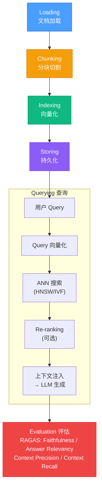

# 04-记忆系统与RAG — 技术资料

> 从四种记忆类型到 RAG 全链路，系统拆解向量嵌入、ANN 搜索（HNSW 内核）、Chunking 策略、LlamaIndex/Haystack 源码，以及 HyDE/Self-RAG/Graph RAG 等高级检索增强技术。进阶覆盖混合搜索（BM25+向量 RRF 融合）、知识图谱与 Graph RAG（Neo4j/Microsoft GraphRAG）、Cross-Encoder/ColBERT 重排序、查询优化（Query Rewriting/Routing/Contextual Retrieval）及生产级最佳实践。

## 相关链接

- 对应面试题：[04-记忆系统面试题](../../02-面试指南/07-AI-Agent全栈开发面试/04-记忆系统面试题.md)

---

## 目录

1. [四种记忆类型](#1-四种记忆类型)
   - 1.1 上下文内记忆（In-Context Memory）
   - 1.2 外部持久化记忆（External Persistent Memory）
   - 1.3 外部检索记忆（Retrieval / RAG）
   - 1.4 参数化记忆（Parametric Memory）
   - 1.5 四种类型横向对比
2. [RAG 全链路](#2-rag-全链路)
   - 2.1 全链路架构图
   - 2.2 Loading（文档加载）
   - 2.3 Chunking（分块）
   - 2.4 Indexing（索引构建）
   - 2.5 Storing（持久化存储）
   - 2.6 Querying（查询）
   - 2.7 Evaluation（评估）
3. [向量嵌入与 ANN 搜索](#3-向量嵌入与-ann-搜索)
   - 3.1 文本嵌入模型原理
   - 3.2 HNSW 算法内核
   - 3.3 Chroma 源码解析
   - 3.4 Milvus 架构解析
4. [Chunking 策略](#4-chunking-策略)
   - 4.1 Fixed-Size Chunking
   - 4.2 Recursive Chunking
   - 4.3 Semantic Chunking
   - 4.4 Agentic Chunking
   - 4.5 策略对比表
5. [LlamaIndex 源码分析](#5-llamaindex-源码分析)
   - 5.1 VectorStoreIndex 构建流程
   - 5.2 StorageContext 设计
   - 5.3 QueryEngine Pipeline
6. [Haystack Pipeline](#6-haystack-pipeline)
   - 6.1 组件模型设计
   - 6.2 pipeline.add_component 实现
   - 6.3 异步执行机制
7. [高级 RAG](#7-高级-rag)
   - 7.1 HyDE（假设文档嵌入）
   - 7.2 Self-RAG（检索决策）
   - 7.3 Corrective RAG
   - 7.4 Adaptive RAG
   - 7.5 Graph RAG
8. [RAGAS 评估框架](#8-ragas-评估框架)
   - 8.1 四大核心指标
   - 8.2 评估代码示例
9. [混合搜索与多路召回](#9-混合搜索与多路召回)
   - 9.1 为什么单路检索不够？
   - 9.2 BM25 稀疏检索原理
   - 9.3 BM25 + Dense 向量融合架构
   - 9.4 RRF（Reciprocal Rank Fusion）算法
   - 9.5 Elasticsearch/OpenSearch 混合搜索
   - 9.6 多路召回实战：三路融合架构
10. [知识图谱与 Graph RAG](#10-知识图谱与-graph-rag)
    - 10.1 为什么需要知识图谱
    - 10.2 属性图 vs RDF
    - 10.3 Neo4j 在 RAG 中的应用
    - 10.4 Graph RAG 架构详解
    - 10.5 Microsoft GraphRAG 深度解析
    - 10.6 图 + 向量混合检索
11. [高级重排序与精排策略](#11-高级重排序与精排策略)
    - 11.1 为什么需要重排序
    - 11.2 Cross-Encoder 重排原理
    - 11.3 ColBERT 晚期交互模型
    - 11.4 Cohere Rerank vs 开源方案
    - 11.5 重排序在生产中的位置
12. [查询优化技术](#12-查询优化技术)
    - 12.1 Query Rewriting 五种策略
    - 12.2 Query Routing
    - 12.3 Contextual Retrieval
13. [常见陷阱与最佳实践](#13-常见陷阱与最佳实践)

---

## 1. 四种记忆类型

### 1.1 上下文内记忆（In-Context Memory）

上下文内记忆是最直接的记忆形式——把信息放入当前请求的 prompt/messages 列表中。

```
┌────────────────────────────────────────────┐
│            Context Window (128K tokens)     │
│                                            │
│  System Prompt   │  Tool Results           │
│  ─────────────   │  ──────────────         │
│  角色/规则        │  工具调用结果             │
│                  │                         │
│  Chat History    │  Retrieved Docs         │
│  ─────────────   │  ──────────────         │
│  对话历史         │  RAG 检索结果            │
└────────────────────────────────────────────┘
```

**实现模式：滑动窗口 + 摘要压缩**

```python
from langchain.memory import ConversationSummaryBufferMemory
from langchain_openai import ChatOpenAI

llm = ChatOpenAI(model="gpt-4o")

# 超过 max_token_limit 时，旧消息自动压缩为摘要
memory = ConversationSummaryBufferMemory(
    llm=llm,
    max_token_limit=2000,
    return_messages=True,
    memory_key="chat_history",
)

# 内部实现：predict_new_summary() 调用 LLM 生成摘要
# langchain/memory/summary_buffer.py
def save_context(self, inputs, outputs):
    super().save_context(inputs, outputs)
    # 若超限则压缩
    if self.moving_summary_buffer == "":
        # 直接存储前 N 条
        pass
    else:
        # 调用 LLM 合并旧摘要 + 新消息
        self.moving_summary_buffer = self.predict_new_summary(
            self.chat_memory.messages[: -self.k * 2],
            self.moving_summary_buffer,
        )
```

**优缺点**

| 维度 | 说明 |
|------|------|
| 优点 | 零延迟、无检索误差、LLM 直接"看到"完整内容 |
| 缺点 | 受 context window 限制；长历史成本高 |
| 适用 | 短对话、单轮任务、tool result 注入 |

---

### 1.2 外部持久化记忆（External Persistent Memory）

将结构化的 key-value 数据、会话摘要或用户档案存储在外部数据库（Redis / PostgreSQL / DynamoDB），跨会话持久化。

```python
import redis
import json
from datetime import datetime

class RedisMemoryStore:
    """跨会话持久化记忆"""
    
    def __init__(self, redis_url: str, ttl: int = 86400 * 7):
        self.client = redis.from_url(redis_url)
        self.ttl = ttl  # 7天过期
    
    def save_session(self, user_id: str, session_id: str, messages: list):
        key = f"memory:{user_id}:{session_id}"
        self.client.setex(
            key,
            self.ttl,
            json.dumps({"messages": messages, "ts": datetime.utcnow().isoformat()})
        )
    
    def load_user_summary(self, user_id: str) -> str:
        key = f"summary:{user_id}"
        data = self.client.get(key)
        return json.loads(data)["summary"] if data else ""
    
    def update_user_profile(self, user_id: str, facts: dict):
        """增量更新用户画像"""
        key = f"profile:{user_id}"
        existing = self.client.hgetall(key) or {}
        existing.update(facts)
        self.client.hset(key, mapping=existing)
```

---

### 1.3 外部检索记忆（Retrieval / RAG）

通过向量相似度搜索，从大规模知识库中按需检索相关片段注入上下文。这是本文档的核心主题，详见 §2-§7。

---

### 1.4 参数化记忆（Parametric Memory）

模型权重本身就是压缩的"记忆"——通过预训练和微调将知识编码进参数。

```
预训练阶段（世界知识）          微调阶段（任务知识）
────────────────────          ────────────────────
万亿 token 语料                领域数据 / 指令对
          │                             │
          ▼                             ▼
    [Transformer 权重]  ──SFT/LoRA──▶ [专域权重]
    W_Q, W_K, W_V ...                W'_Q, W'_K ...
```

参数化记忆的局限：知识截止日期（training cutoff）、更新成本高、无法精确引用来源。这正是 RAG 存在的根本动机。

---

### 1.5 四种类型横向对比

| 维度 | In-Context | External Persistent | RAG/Retrieval | Parametric |
|------|-----------|--------------------|---------  ----|------------|
| 容量 | ~200K token | 无限（DB） | 无限（向量库） | 固定（参数量） |
| 延迟 | 0ms | ~5ms（KV读） | ~50-200ms | 0ms |
| 更新代价 | 即时 | 即时 | 索引更新（秒级） | 重训（天级） |
| 精确引用 | ✅ | ✅ | ✅ | ❌ |
| 跨会话 | ❌ | ✅ | ✅ | ✅ |
| 知识时效 | 实时 | 实时 | 近实时 | 训练截止 |

---

## 2. RAG 全链路

### 2.1 全链路架构图



---

### 2.2 Loading（文档加载）

LlamaIndex 的 `SimpleDirectoryReader` 和 `PDFReader` 是常用加载器。

```python
from llama_index.core import SimpleDirectoryReader
from llama_index.readers.file import PDFReader

# 加载本地目录（支持 PDF/DOCX/TXT/HTML/CSV）
documents = SimpleDirectoryReader(
    input_dir="./knowledge_base",
    required_exts=[".pdf", ".md", ".txt"],
    recursive=True,              # 递归子目录
    num_files_limit=100,
).load_data()

# 每个 Document 对象：
# document.text          - 原始文本
# document.metadata      - {"file_name": ..., "page_label": ...}
# document.doc_id        - UUID

# 自定义 PDFReader（含页码元数据）
pdf_reader = PDFReader()
pdf_docs = pdf_reader.load_data(file="./report.pdf")
# metadata: {"page_label": "1", "file_name": "report.pdf"}
```

**LlamaIndex SimpleDirectoryReader 内部调用链**

```
SimpleDirectoryReader.load_data()
  │
  ├── _load_data_from_paths()
  │     │
  │     └── 遍历文件 → 按扩展名选 Reader
  │           ├── .pdf  → PDFReader (uses pypdf)
  │           ├── .docx → DocxReader (uses python-docx)
  │           ├── .html → HTMLTagReader (uses bs4)
  │           └── .txt  → 直接读取
  │
  └── Document(text=..., metadata=file_metadata)
```

---

### 2.3 Chunking（分块）

详见 §4，此处展示 LlamaIndex 内置的 `SentenceSplitter`：

```python
from llama_index.core.node_parser import SentenceSplitter

splitter = SentenceSplitter(
    chunk_size=512,       # tokens
    chunk_overlap=50,     # overlap tokens
    paragraph_separator="\n\n",
)

nodes = splitter.get_nodes_from_documents(documents)
# 每个 Node:
# node.text           - 分块文本
# node.metadata       - 继承自父 Document
# node.relationships  - PREVIOUS/NEXT/SOURCE 关系图
```

---

### 2.4 Indexing（索引构建）

```python
from llama_index.core import VectorStoreIndex, Settings
from llama_index.embeddings.openai import OpenAIEmbedding

# 全局配置嵌入模型
Settings.embed_model = OpenAIEmbedding(model="text-embedding-3-small")

# 构建向量索引（内部调用 embed_model 批量编码）
index = VectorStoreIndex.from_documents(
    documents,
    show_progress=True,
)
# 内部流程：
# 1. documents → SentenceSplitter → nodes
# 2. 批量调用 embed_model.get_text_embedding_batch(texts)
# 3. 写入 SimpleVectorStore（默认 in-memory）
```

---

### 2.5 Storing（持久化存储）

```python
from llama_index.core import StorageContext
from llama_index.vector_stores.chroma import ChromaVectorStore
import chromadb

# 连接 Chroma
chroma_client = chromadb.PersistentClient(path="./chroma_db")
chroma_collection = chroma_client.get_or_create_collection("knowledge")

# 构建 StorageContext
vector_store = ChromaVectorStore(chroma_collection=chroma_collection)
storage_context = StorageContext.from_defaults(vector_store=vector_store)

# 构建并持久化索引
index = VectorStoreIndex.from_documents(
    documents,
    storage_context=storage_context,
)

# 下次直接加载（无需重新索引）
index = VectorStoreIndex.from_vector_store(
    vector_store,
    storage_context=storage_context,
)
```

---

### 2.6 Querying（查询）

```python
# 创建 QueryEngine
query_engine = index.as_query_engine(
    similarity_top_k=5,        # 检索 Top-5
    response_mode="compact",   # compact/tree_summarize/refine
)

response = query_engine.query("什么是 HNSW 算法？")
print(response.response)

# 查看检索到的源文档
for node in response.source_nodes:
    print(f"Score: {node.score:.3f} | {node.node.text[:100]}")
```

---

### 2.7 Evaluation（评估）

详见 §8。

---

## 3. 向量嵌入与 ANN 搜索

### 3.1 文本嵌入模型原理

文本嵌入将离散 token 序列映射到连续语义空间中的稠密向量：

```
输入文本: "HNSW 是一种近似最近邻搜索算法"
    │
    ▼
Tokenizer（BPE）
    │  ["HNSW", "是", "一种", "近似", "最近邻", "搜索", "算法"]
    ▼
Transformer Encoder（BERT/E5/BGE）
    │  [CLS] token 的隐藏状态 or Mean Pooling
    ▼
L2 Normalize
    │
    ▼
向量: [0.023, -0.156, 0.891, ..., 0.042]  # 1536 维（text-embedding-3-small）
```

主流嵌入模型对比：

| 模型 | 维度 | MTEB 均分 | 适用场景 |
|------|------|-----------|---------|
| text-embedding-3-small | 1536 | 62.3 | 通用、低成本 |
| text-embedding-3-large | 3072 | 64.6 | 高精度 |
| BGE-M3 | 1024 | 66.7 | 多语言、开源 |
| E5-mistral-7b | 4096 | 66.6 | 长文本 |

---

### 3.2 HNSW 算法内核

HNSW（Hierarchical Navigable Small World）是当前最主流的 ANN 索引结构。

**分层结构**

```
Layer 2 (稀疏):  1 ──── 7
                        │
Layer 1 (中密):  1 ─ 3 ─ 7 ─ 9
                     │       │
Layer 0 (稠密):  1-2-3-4-5-6-7-8-9-10  ← 所有节点
```

**插入算法（Insert）**

```python
def hnsw_insert(hnsw, new_element, M=16, ef_construction=200):
    """
    M: 每层最大出度
    ef_construction: 构建时候选集大小（影响质量 vs 速度）
    """
    # 1. 随机决定该节点的最高层
    #    level ~ floor(-ln(uniform(0,1)) * mL)，mL = 1/ln(M)
    node_level = floor(-log(random()) * (1 / log(M)))
    
    # 2. 从顶层开始贪心搜索，找到进入下层的入口点
    entry_point = hnsw.entry_point
    for layer in range(hnsw.max_layer, node_level + 1, -1):
        entry_point = greedy_search(layer, new_element, entry_point, ef=1)
    
    # 3. 从 node_level 到 layer 0，执行 ef_construction 候选集搜索并连边
    for layer in range(min(node_level, hnsw.max_layer), -1, -1):
        # 找到 ef_construction 个最近邻候选
        candidates = search_layer(new_element, entry_point, ef_construction, layer)
        # 启发式剪枝：选 M 个邻居（保证多样性）
        neighbors = select_neighbors_heuristic(new_element, candidates, M)
        # 双向建边
        for neighbor in neighbors:
            connect(new_element, neighbor, layer)
            # 若邻居出度超 M，重新剪枝
            if degree(neighbor, layer) > M:
                prune_connections(neighbor, layer, M)
        entry_point = candidates[0]  # 更新入口
```

**查询算法（Search）**

```python
def hnsw_search(hnsw, query, k, ef=50):
    """
    ef: 查询时候选集大小（ef >= k，越大越准确但越慢）
    时间复杂度: O(log N) 期望
    """
    entry = hnsw.entry_point
    
    # 从高层贪心下降到 layer 1
    for layer in range(hnsw.max_layer, 0, -1):
        entry = greedy_search(query, entry, ef=1, layer=layer)
    
    # 在 layer 0 用 ef 大小的候选集做精细搜索
    candidates = search_layer(query, entry, ef, layer=0)
    
    return candidates[:k]  # 返回 Top-k
```

**HNSW 参数影响矩阵**

| 参数 | 增大效果 | 代价 |
|------|---------|------|
| M（出度） | 召回率↑ | 内存↑、构建时间↑ |
| ef_construction | 构建质量↑ | 构建时间↑ |
| ef（查询） | 召回率↑ | 查询延迟↑ |

---

### 3.3 Chroma 源码解析

Chroma 使用 hnswlib（C++ 绑定）作为 HNSW 底层实现。

```python
# chroma-core/chroma: chromadb/segment/impl/vector/local_hnsw.py

class LocalHnswSegment(VectorReader):
    """Chroma 本地 HNSW 段"""
    
    def _init_index(self, dimensionality: int):
        index = hnswlib.Index(space=self._params.space, dim=dimensionality)
        index.init_index(
            max_elements=self._params._max_elements,
            ef_construction=self._params.ef_construction,  # 默认 100
            M=self._params.M,                               # 默认 16
            random_seed=self._params.random_seed,
        )
        index.set_ef(self._params.ef)  # 查询 ef，默认 10
        return index
    
    def upsert(self, vectors: Sequence[VectorEmbeddingRecord]):
        """批量写入向量"""
        # 1. 分配 int 类型 label（Chroma UUID → int 映射存于 _label_to_id）
        labels = self._get_or_create_labels([v.id for v in vectors])
        embeddings = np.array([v.embedding for v in vectors])
        # 2. 调用 hnswlib 批量插入
        self._index.add_items(embeddings, labels, num_threads=4)
    
    def query(self, vectors, k, allowed_ids=None):
        """ANN 查询"""
        # 1. 调用 hnswlib knn_query
        labels, distances = self._index.knn_query(vectors, k=k)
        # 2. label → UUID 反查
        ids = [[self._id_to_label[l] for l in row] for row in labels]
        return ids, distances
```

**Chroma 持久化写入路径**

```
chromadb.add(documents, embeddings, ids)
  │
  ├── EmbeddingQueue.submit()          # 异步队列
  │
  ├── LocalHnswSegment.upsert()        # HNSW 索引更新
  │     └── hnswlib.Index.add_items()  # C++ 层写入
  │
  └── SqliteMetadataSegment.upsert()   # 元数据写入 SQLite
        └── documents/metadata 存储
```

---

### 3.4 Milvus 架构解析

Milvus 是分布式向量数据库，适合亿级向量。

```
┌─────────────────────────────────────────────────────┐
│                   Milvus 架构                        │
│                                                     │
│  ┌─────────┐  ┌─────────┐  ┌─────────┐            │
│  │  Proxy  │  │  Root   │  │  Data   │  ← 协调层   │
│  │  接入层  │  │  Coord  │  │  Coord  │            │
│  └────┬────┘  └─────────┘  └─────────┘            │
│       │                                            │
│  ┌────▼─────────────────────────────────┐          │
│  │           Query Nodes                │  ← 查询层 │
│  │  内存中维护 Growing Segment（新数据）  │          │
│  │  + Sealed Segment（HNSW/IVF 索引）   │          │
│  └──────────────────────────────────────┘          │
│                                                     │
│  ┌──────────────────────────────────────┐          │
│  │           Data Nodes                 │  ← 存储层 │
│  │  WAL (Pulsar/Kafka) → S3/MinIO       │          │
│  └──────────────────────────────────────┘          │
└─────────────────────────────────────────────────────┘
```

```python
from pymilvus import MilvusClient, DataType

client = MilvusClient(uri="http://localhost:19530")

# 创建 Collection（Schema 定义）
schema = client.create_schema(auto_id=True, enable_dynamic_field=True)
schema.add_field("id", DataType.INT64, is_primary=True)
schema.add_field("embedding", DataType.FLOAT_VECTOR, dim=1536)
schema.add_field("text", DataType.VARCHAR, max_length=4096)

# HNSW 索引参数
index_params = client.prepare_index_params()
index_params.add_index(
    field_name="embedding",
    index_type="HNSW",
    metric_type="COSINE",
    params={"M": 16, "efConstruction": 200},
)

client.create_collection("knowledge", schema=schema, index_params=index_params)

# 批量插入
client.insert("knowledge", data=[
    {"embedding": emb, "text": text}
    for emb, text in zip(embeddings, texts)
])

# 查询（混合搜索：向量 + 标量过滤）
results = client.search(
    collection_name="knowledge",
    data=[query_embedding],
    limit=5,
    filter='text like "%Python%"',   # 标量过滤（Bitset 加速）
    output_fields=["text"],
    search_params={"ef": 64},
)
```

---

## 4. Chunking 策略

### 4.1 Fixed-Size Chunking

最简单的策略：按固定 token 数切分，允许重叠。

```python
from langchain.text_splitter import TokenTextSplitter

splitter = TokenTextSplitter(
    chunk_size=512,
    chunk_overlap=64,
    encoding_name="cl100k_base",  # tiktoken
)

chunks = splitter.split_text(long_text)
```

**优点**：简单、可预测；**缺点**：在语义边界中间截断，上下文破碎。

---

### 4.2 Recursive Chunking

LangChain 最常用分块器，按分隔符优先级递归切分：

```python
from langchain.text_splitter import RecursiveCharacterTextSplitter

splitter = RecursiveCharacterTextSplitter(
    chunk_size=1000,
    chunk_overlap=100,
    # 分隔符优先级（从高到低尝试）
    separators=["\n\n", "\n", "。", "！", "？", ".", "!", "?", " ", ""],
)

# 内部实现（简化版）：
# def _split_text(text, separators):
#     separator = separators[0]  # 尝试最高优先级
#     splits = text.split(separator)
#     for split in splits:
#         if len(split) <= chunk_size:
#             good_splits.append(split)
#         else:
#             # 递归用下一级分隔符
#             _split_text(split, separators[1:])
```

---

### 4.3 Semantic Chunking

基于嵌入相似度的语义分块，在语义断点处切分：

```python
from llama_index.core.node_parser import SemanticSplitterNodeParser
from llama_index.embeddings.openai import OpenAIEmbedding

semantic_splitter = SemanticSplitterNodeParser(
    buffer_size=1,               # 前后各看 1 句
    breakpoint_percentile_threshold=95,  # 余弦距离 95 分位数作为阈值
    embed_model=OpenAIEmbedding(),
)

nodes = semantic_splitter.get_nodes_from_documents(documents)

# 内部算法：
# 1. 按句子分割文本
# 2. 计算相邻句子组的嵌入向量
# 3. 计算余弦距离序列
# 4. 距离突变点（> 95 分位数）作为分块边界
```

---

### 4.4 Agentic Chunking

让 LLM 自行决定分块边界，适合结构不规则的文档：

```python
from openai import OpenAI

client = OpenAI()

AGENTIC_CHUNK_PROMPT = """
你是一个文档分析专家。请将以下文本分割成语义完整的片段。
每个片段应该：
1. 包含一个完整的主题或概念
2. 可以独立理解，无需依赖其他片段
3. 不超过 800 字

请以 JSON 格式返回：{"chunks": ["片段1", "片段2", ...]}

文本：
{text}
"""

def agentic_chunk(text: str) -> list[str]:
    response = client.chat.completions.create(
        model="gpt-4o-mini",
        response_format={"type": "json_object"},
        messages=[{"role": "user", "content": AGENTIC_CHUNK_PROMPT.format(text=text)}],
    )
    return json.loads(response.choices[0].message.content)["chunks"]
```

**适用场景**：法律合同、学术论文、技术规格书等结构复杂文档。

---

### 4.5 策略对比表

| 策略 | 语义完整性 | 速度 | 成本 | 适用场景 |
|------|-----------|------|------|---------|
| Fixed-Size | ⭐⭐ | ⚡⚡⚡ | 极低 | 结构均匀的纯文本 |
| Recursive | ⭐⭐⭐ | ⚡⚡⚡ | 极低 | 通用文档（首选） |
| Semantic | ⭐⭐⭐⭐ | ⚡⚡ | 中（需嵌入） | 学术/技术文档 |
| Agentic | ⭐⭐⭐⭐⭐ | ⚡ | 高（需 LLM） | 结构复杂/不规则文档 |

**Chunk Size 经验值**

```
问答系统:      256 ~ 512 tokens   （检索精度优先）
摘要/归纳:    512 ~ 1024 tokens   （上下文丰富度优先）
代码检索:     函数级别（100~300 tokens）
长文档分析:  Parent-Child（父: 1024, 子: 256）
```

---

## 5. LlamaIndex 源码分析

### 5.1 VectorStoreIndex 构建流程

```python
# llama-index-core/llama_index/core/indices/vector_store/base.py

class VectorStoreIndex(BaseIndex[IndexDict]):
    
    @classmethod
    def from_documents(
        cls,
        documents: Sequence[Document],
        storage_context: Optional[StorageContext] = None,
        **kwargs,
    ) -> "VectorStoreIndex":
        # 1. 初始化存储上下文
        storage_context = storage_context or StorageContext.from_defaults()
        
        # 2. 构建索引（调用 __init__ → _build_index_from_nodes）
        return cls(
            nodes=None,
            documents=documents,
            storage_context=storage_context,
            **kwargs,
        )
    
    def _build_index_from_nodes(
        self, nodes: Sequence[BaseNode]
    ) -> IndexDict:
        # 关键方法：批量嵌入 + 写入向量存储
        index_struct = IndexDict()
        
        # 批量嵌入（默认 batch_size=2048）
        nodes_with_embeddings = self._embed_nodes(
            nodes,
            show_progress=self._show_progress,
        )
        
        # 写入 VectorStore
        new_ids = self._vector_store.add(
            [NodeWithEmbedding(node=n, embedding=n.embedding) 
             for n in nodes_with_embeddings]
        )
        
        # 更新 IndexDict（node_id → doc_id 映射）
        for node, node_id in zip(nodes_with_embeddings, new_ids):
            index_struct.add_node(node, text_id=node_id)
        
        return index_struct
    
    def _embed_nodes(self, nodes, show_progress=False):
        """批量嵌入（利用 embed_model 的批处理能力）"""
        id_to_embed_map: Dict[str, List[float]] = {}
        
        texts_to_embed = [node.get_content(metadata_mode=MetadataMode.EMBED) 
                          for node in nodes]
        
        # 调用 embed_model.get_text_embedding_batch()
        new_embeddings = self._embed_model.get_text_embedding_batch(
            texts_to_embed,
            show_progress=show_progress,
        )
        
        for node, embedding in zip(nodes, new_embeddings):
            node.embedding = embedding
        
        return nodes
```

---

### 5.2 StorageContext 设计

`StorageContext` 是 LlamaIndex 的依赖注入容器，聚合所有存储后端：

```python
# llama_index/core/storage/storage_context.py

@dataclass
class StorageContext:
    """所有存储组件的聚合容器"""
    
    docstore: BaseDocumentStore          # 文档元数据存储（默认 SimpleDocumentStore）
    index_store: BaseIndexStore          # 索引结构存储（IndexDict 等）
    vector_store: VectorStore            # 向量存储（Chroma/Milvus/Pinecone...）
    graph_store: GraphStore              # 知识图谱（可选）
    image_store: VectorStore             # 多模态图像向量（可选）
    
    @classmethod
    def from_defaults(
        cls,
        vector_store: Optional[VectorStore] = None,
        persist_dir: Optional[str] = None,
        ...
    ) -> "StorageContext":
        """工厂方法：构建默认或自定义存储上下文"""
        
        vector_store = vector_store or SimpleVectorStore()
        docstore = SimpleDocumentStore()
        index_store = SimpleIndexStore()
        
        return cls(
            docstore=docstore,
            index_store=index_store,
            vector_store=vector_store,
        )
    
    def persist(self, persist_dir: str = DEFAULT_PERSIST_DIR):
        """将所有存储持久化到磁盘"""
        self.docstore.persist(os.path.join(persist_dir, DOCSTORE_FNAME))
        self.index_store.persist(os.path.join(persist_dir, INDEX_STORE_FNAME))
        self.vector_store.persist(os.path.join(persist_dir, VECTOR_STORE_FNAME))
```

---

### 5.3 QueryEngine Pipeline

```
query_engine.query("问题")
  │
  ▼
RetrieverQueryEngine.query()
  │
  ├─▶ [1] VectorIndexRetriever.retrieve()
  │         │
  │         ├── embed_model.get_query_embedding(query_str)
  │         │       → query_embedding: List[float]
  │         │
  │         └── vector_store.query(VectorStoreQuery(
  │                 query_embedding=...,
  │                 similarity_top_k=k,
  │                 mode=VectorStoreQueryMode.DEFAULT
  │             ))
  │                 → [NodeWithScore(node, score), ...]
  │
  ├─▶ [2] NodePostprocessors（可选链）
  │         ├── SimilarityPostprocessor(cutoff=0.7)  过滤低分节点
  │         ├── KeywordNodePostprocessor             关键词过滤
  │         └── SentenceTransformerRerank            Cross-Encoder 重排序
  │
  └─▶ [3] ResponseSynthesizer.synthesize()
            │
            ├── mode="compact":  合并节点文本 → 单次 LLM 调用
            ├── mode="refine":   节点逐一 refine → 多次 LLM 调用
            └── mode="tree_summarize": 树状归纳 → 适合长文档
```

```python
from llama_index.core.query_engine import RetrieverQueryEngine
from llama_index.core.retrievers import VectorIndexRetriever
from llama_index.core.response_synthesizers import get_response_synthesizer
from llama_index.core.postprocessor import SimilarityPostprocessor, SentenceTransformerRerank

# 自定义 QueryEngine 每个组件
retriever = VectorIndexRetriever(index=index, similarity_top_k=10)

reranker = SentenceTransformerRerank(
    model="cross-encoder/ms-marco-MiniLM-L-6-v2",
    top_n=3,  # 重排后保留 3 个
)

synthesizer = get_response_synthesizer(response_mode="compact")

query_engine = RetrieverQueryEngine(
    retriever=retriever,
    node_postprocessors=[
        SimilarityPostprocessor(similarity_cutoff=0.6),
        reranker,
    ],
    response_synthesizer=synthesizer,
)
```

---

## 6. Haystack Pipeline

### 6.1 组件模型设计

Haystack 2.x 采用基于**有向图**的 Pipeline 模型，每个组件是图中的一个节点。

```python
# haystack/core/component/component.py

from haystack import component

@component
class TextEmbedder:
    """Haystack 组件装饰器：自动注册 input/output socket"""
    
    def __init__(self, model: str = "sentence-transformers/all-MiniLM-L6-v2"):
        self.model = SentenceTransformer(model)
    
    # @component.output_types 声明输出类型（用于类型检查和 Pipeline 连线验证）
    @component.output_types(embedding=List[float])
    def run(self, text: str):
        embedding = self.model.encode(text).tolist()
        return {"embedding": embedding}

# 组件的核心机制：
# - run() 参数 → 自动推断为 InputSocket
# - @component.output_types → 注册 OutputSocket
# - Pipeline 连线时进行类型兼容性检查
```

---

### 6.2 pipeline.add_component 实现

```python
# haystack/core/pipeline/base.py（简化）

class PipelineBase:
    
    def __init__(self):
        self.graph = networkx.MultiDiGraph()  # 有向图
        self._components: Dict[str, Component] = {}
    
    def add_component(self, name: str, instance: Component):
        """
        注册组件到 Pipeline 图
        1. 验证 name 唯一性
        2. 将 instance 添加为图节点
        3. 存储 input/output sockets 元数据
        """
        if name in self._components:
            raise ValueError(f"Component named '{name}' already exists")
        
        self._components[name] = instance
        # 图节点携带组件元数据
        self.graph.add_node(
            name,
            instance=instance,
            input_sockets=instance.__haystack_input__._sockets_dict,
            output_sockets=instance.__haystack_output__._sockets_dict,
            visits=0,
        )
    
    def connect(self, sender: str, receiver: str):
        """
        连接两个组件的 socket
        sender:   "component_name.output_socket"
        receiver: "component_name.input_socket"
        """
        sender_component, sender_socket = sender.split(".")
        receiver_component, receiver_socket = receiver.split(".")
        
        # 类型兼容性检查
        out_type = self.graph.nodes[sender_component]["output_sockets"][sender_socket].type
        in_type  = self.graph.nodes[receiver_component]["input_sockets"][receiver_socket].type
        
        if not _types_are_compatible(out_type, in_type):
            raise PipelineConnectError(f"Type mismatch: {out_type} → {in_type}")
        
        # 添加有向边
        self.graph.add_edge(sender_component, receiver_component,
                            key=f"{sender_socket}/{receiver_socket}",
                            sender_socket=sender_socket,
                            receiver_socket=receiver_socket)
```

---

### 6.3 完整 RAG Pipeline 示例

```python
from haystack import Pipeline
from haystack.components.retrievers.in_memory import InMemoryEmbeddingRetriever
from haystack.components.builders import PromptBuilder
from haystack.components.generators import OpenAIGenerator
from haystack.components.embedders import (
    SentenceTransformersTextEmbedder,
    SentenceTransformersDocumentEmbedder,
)
from haystack.document_stores.in_memory import InMemoryDocumentStore

# 1. 构建文档库
doc_store = InMemoryDocumentStore()
doc_embedder = SentenceTransformersDocumentEmbedder(
    model="sentence-transformers/all-MiniLM-L6-v2"
)
doc_embedder.warm_up()

from haystack import Document
docs = [Document(content="HNSW 是分层可导航小世界图算法"),
        Document(content="RAG 将检索与生成结合")]
docs_with_embeddings = doc_embedder.run(docs)["documents"]
doc_store.write_documents(docs_with_embeddings)

# 2. 构建查询 Pipeline
rag_pipeline = Pipeline()
rag_pipeline.add_component("embedder", 
    SentenceTransformersTextEmbedder(model="sentence-transformers/all-MiniLM-L6-v2"))
rag_pipeline.add_component("retriever",
    InMemoryEmbeddingRetriever(document_store=doc_store, top_k=3))
rag_pipeline.add_component("prompt_builder", PromptBuilder(template="""
根据以下上下文回答问题。
上下文: {{ doc.content }}
问题: {{ question }}
"""))
rag_pipeline.add_component("llm", OpenAIGenerator(model="gpt-4o-mini"))

# 3. 连接组件（有向图连边）
rag_pipeline.connect("embedder.embedding", "retriever.query_embedding")
rag_pipeline.connect("retriever.documents", "prompt_builder.documents")
rag_pipeline.connect("prompt_builder.prompt", "llm.prompt")

# 4. 运行（同步）
result = rag_pipeline.run({
    "embedder": {"text": "什么是 HNSW？"},
    "prompt_builder": {"question": "什么是 HNSW？"},
})
print(result["llm"]["replies"][0])
```

### 6.3 异步执行机制

Haystack 2.x 的 `AsyncPipeline` 对无依赖的组件并发执行：

```python
import asyncio
from haystack import AsyncPipeline

async_pipeline = AsyncPipeline()
# 添加组件（与同步 API 相同）

# 并发执行：Haystack 分析有向图的拓扑顺序
# 同一层（无依赖关系）的组件通过 asyncio.gather() 并发执行
result = await async_pipeline.run_async({"embedder": {"text": "..."}})

# 内部实现（简化）：
# async def _run_component(name, inputs):
#     component = self._components[name]
#     if hasattr(component, "run_async"):
#         return await component.run_async(**inputs)
#     else:
#         # 同步组件在线程池中执行，避免阻塞事件循环
#         return await asyncio.get_event_loop().run_in_executor(
#             None, partial(component.run, **inputs)
#         )
```

---

## 7. 高级 RAG

### 7.1 HyDE（假设文档嵌入）

HyDE 解决的问题：**查询向量与文档向量的语义鸿沟**（query-document asymmetry）。

```
传统 RAG:
  用户 Query → embed(Query) → ANN 搜索
  问题：Query 是问题句，文档是陈述句，嵌入空间分布不同

HyDE:
  用户 Query → LLM 生成假设答案 → embed(假设答案) → ANN 搜索
  假设答案与真实文档在嵌入空间更接近
```

```python
from llama_index.core.indices.query.query_transform import HyDEQueryTransform
from llama_index.core.query_engine import TransformQueryEngine

# HyDE 变换器
hyde = HyDEQueryTransform(
    include_original=True,   # 同时保留原始 Query
    llm=Settings.llm,
)

# 包装 QueryEngine
hyde_query_engine = TransformQueryEngine(
    query_engine=base_query_engine,
    query_transform=hyde,
)

# 内部实现：
# def run(self, query_bundle):
#     # 1. 用 LLM 生成假设文档
#     hypothetical_doc = llm.predict(
#         HYDE_PROMPT.format(query=query_bundle.query_str)
#     )
#     # 2. 嵌入假设文档（而非原始 Query）
#     hypothetical_embedding = embed_model.get_text_embedding(hypothetical_doc)
#     # 3. 用假设嵌入检索
#     return QueryBundle(
#         query_str=query_bundle.query_str,
#         embedding=hypothetical_embedding,
#     )
```

---

### 7.2 Self-RAG（检索决策）

Self-RAG 让模型**自主决定是否需要检索**，以及**评估检索结果质量**。

```
┌─────────────────────────────────────────────────────┐
│                   Self-RAG 流程                      │
└─────────────────────────────────────────────────────┘

用户 Query
  │
  ▼
[Retrieve token 预测]
  ├── "Retrieve=Yes" → 触发检索 → 生成 IsRel token（是否相关）
  │                              → 生成 IsSup token（是否支撑答案）
  └── "Retrieve=No"  → 直接生成答案
                              │
                              ▼
                    [IsUse token 预测]（答案是否有用）
                              │
                    ── 选择最优生成路径 ──▶ 最终答案
```

```python
# 简化的 Self-RAG 实现（基于特殊 token 分类）
RETRIEVE_TOKEN   = "[Retrieve]"
ISREL_TOKEN_YES  = "[Relevant]"
ISREL_TOKEN_NO   = "[Irrelevant]"
ISSUP_TOKEN_FULL = "[Fully supported]"
ISSUP_TOKEN_PART = "[Partially supported]"
ISUSE_TOKEN      = "[Utility:5]"  # 1-5 分

def self_rag_generate(query: str, retriever, llm) -> str:
    # 步骤 1：判断是否需要检索
    retrieve_decision = llm.predict(f"{query}\n{RETRIEVE_TOKEN}")
    
    if "Yes" in retrieve_decision:
        # 步骤 2：检索
        docs = retriever.retrieve(query)
        
        # 步骤 3：对每个文档评估相关性
        candidates = []
        for doc in docs:
            relevance = llm.predict(f"Context: {doc.text}\nQuery: {query}\n{ISREL_TOKEN_YES}")
            if ISREL_TOKEN_YES in relevance:
                # 步骤 4：生成并评估支撑度
                answer = llm.predict(f"Context: {doc.text}\nQuery: {query}")
                support = llm.predict(f"{answer}\n{ISSUP_TOKEN_FULL}")
                utility = llm.predict(f"{answer}\n{ISUSE_TOKEN}")
                candidates.append((answer, support, utility))
        
        # 步骤 5：选择评分最高的答案
        return max(candidates, key=lambda x: score(x[1], x[2]))[0]
    else:
        return llm.predict(query)
```

---

### 7.3 Corrective RAG

CRAG 引入**检索评估器**（Retrieval Evaluator）和**知识精炼**（Knowledge Refinement）步骤：

```
Query → 检索 → [评估器]
                  │
                  ├── 置信度高  → 直接使用文档 → 生成答案
                  ├── 置信度中  → 知识精炼（去噪）→ 生成答案
                  └── 置信度低  → Web 搜索补充 → 知识精炼 → 生成答案
```

```python
from langgraph.graph import StateGraph, END
from typing import TypedDict, Annotated

class CRAGState(TypedDict):
    question: str
    documents: list
    generation: str
    web_search_needed: bool

def grade_documents(state: CRAGState):
    """评估检索文档相关性"""
    question = state["question"]
    docs = state["documents"]
    
    relevant_docs = []
    need_web_search = False
    
    for doc in docs:
        score = grader_llm.invoke({
            "document": doc.page_content,
            "question": question,
        })
        if score.binary_score == "yes":
            relevant_docs.append(doc)
        else:
            need_web_search = True
    
    return {
        "documents": relevant_docs,
        "web_search_needed": need_web_search,
    }

def web_search(state: CRAGState):
    """Tavily 搜索补充"""
    from langchain_community.tools.tavily_search import TavilySearchResults
    tool = TavilySearchResults(max_results=3)
    results = tool.invoke(state["question"])
    return {"documents": state["documents"] + results}

# 构建 LangGraph 工作流
workflow = StateGraph(CRAGState)
workflow.add_node("retrieve", retrieve)
workflow.add_node("grade_documents", grade_documents)
workflow.add_node("web_search", web_search)
workflow.add_node("generate", generate)

workflow.set_entry_point("retrieve")
workflow.add_edge("retrieve", "grade_documents")
workflow.add_conditional_edges(
    "grade_documents",
    lambda s: "web_search" if s["web_search_needed"] else "generate",
)
workflow.add_edge("web_search", "generate")
workflow.add_edge("generate", END)

app = workflow.compile()
```

---

### 7.4 Adaptive RAG

根据 Query 复杂度**动态选择检索策略**：

```
Simple Query（事实型）  → 直接 LLM 回答（无需检索）
Single-step Query      → 标准 RAG
Multi-step Query（复杂） → Iterative RAG（多轮检索）
```

```python
def route_query(state):
    """Query 分类路由"""
    question = state["question"]
    
    route = router_llm.invoke({
        "question": question,
        "options": ["direct_answer", "single_rag", "iterative_rag"],
    })
    
    return route.datasource

workflow.add_conditional_edges(
    "classify_query",
    route_query,
    {
        "direct_answer": "llm_node",
        "single_rag": "single_retrieve_node",
        "iterative_rag": "iterative_retrieve_node",
    }
)
```

---

### 7.5 Graph RAG

Graph RAG 将文档知识构建为**知识图谱**，支持多跳推理：

```
传统 RAG:   Query → 向量搜索 → 孤立文本片段
Graph RAG:  Query → 图遍历  → 关联实体网络

知识图谱结构：
  (Python) ──[用于]──▶ (机器学习)
      │                     │
  [是]                   [包括]
      │                     │
  (编程语言)          (深度学习)──[框架]──▶ (PyTorch)
```

```python
# 使用 LlamaIndex 的 KnowledgeGraphIndex
from llama_index.core import KnowledgeGraphIndex
from llama_index.core.graph_stores import SimpleGraphStore

graph_store = SimpleGraphStore()
storage_context = StorageContext.from_defaults(graph_store=graph_store)

# 构建知识图谱索引（LLM 自动抽取三元组）
kg_index = KnowledgeGraphIndex.from_documents(
    documents,
    storage_context=storage_context,
    max_triplets_per_chunk=5,        # 每块最多提取 5 个三元组
    include_embeddings=True,         # 同时支持向量搜索
    show_progress=True,
)

# 查询（结合图遍历 + 向量检索）
kg_query_engine = kg_index.as_query_engine(
    include_text=True,
    retriever_mode="hybrid",         # 图 + 向量混合检索
    similarity_top_k=5,
    graph_traversal_depth=2,         # 图遍历深度
    response_mode="tree_summarize",
)

response = kg_query_engine.query("PyTorch 与机器学习的关系？")
```

**Microsoft GraphRAG**（更完整的实现）分为两阶段：

```
离线阶段（Indexing）：
  文档 → 实体抽取 → 关系抽取 → 社区检测（Leiden算法）→ 社区摘要

在线阶段（Querying）：
  Local Search:  从查询实体出发，遍历邻域（适合具体问题）
  Global Search: 遍历社区摘要，Map-Reduce 聚合（适合全局问题）
```

---

## 8. RAGAS 评估框架

### 8.1 四大核心指标

```
┌─────────────────────────────────────────────────────────┐
│                   RAGAS 评估体系                         │
└─────────────────────────────────────────────────────────┘

                    question
                        │
          ┌─────────────┼─────────────┐
          ▼             ▼             ▼
       context       answer       ground_truth
          │             │             │
          │             ▼             │
          │   ┌─────────────────┐     │
          │   │   Faithfulness   │     │
          │   │ 答案是否由上下文  │     │
          │   │ 支撑（不幻觉）   │     │
          │   └─────────────────┘     │
          │                           │
          ▼                           ▼
┌──────────────────┐       ┌──────────────────────┐
│ Context Precision │       │   Answer Relevancy    │
│ 检索到的上下文中  │       │   答案与问题的相关性   │
│ 有多少是真正有用的│       │  （语义相似度）       │
└──────────────────┘       └──────────────────────┘
          │
          ▼
┌──────────────────┐
│  Context Recall   │
│ 标准答案中的信息  │
│ 有多少被检索到   │
└──────────────────┘
```

| 指标 | 计算方式 | 范围 | 越高越好 |
|------|---------|------|---------|
| Faithfulness | 答案中被上下文支撑的陈述数 / 总陈述数 | [0, 1] | ✅ |
| Answer Relevancy | embed(answer) 与 embed(question) 余弦相似度均值 | [0, 1] | ✅ |
| Context Precision | 相关上下文排名靠前的比例（AP@k） | [0, 1] | ✅ |
| Context Recall | 标准答案中被上下文覆盖的句子比例 | [0, 1] | ✅ |

---

### 8.2 评估代码示例

```python
from ragas import evaluate
from ragas.metrics import (
    faithfulness,
    answer_relevancy,
    context_precision,
    context_recall,
)
from datasets import Dataset

# 准备评估数据集
eval_data = {
    "question": [
        "什么是 HNSW？",
        "RAG 的全称是什么？",
    ],
    "answer": [
        "HNSW 是分层可导航小世界图，一种用于近似最近邻搜索的数据结构。",
        "RAG 全称 Retrieval-Augmented Generation，检索增强生成。",
    ],
    "contexts": [
        ["HNSW（Hierarchical Navigable Small World）是由 Malkov 等人在 2018 年提出的 ANN 索引..."],
        ["RAG（Retrieval-Augmented Generation）由 Facebook AI 在 2020 年提出..."],
    ],
    "ground_truth": [
        "HNSW 是一种分层图结构的近似最近邻搜索算法。",
        "RAG 是检索增强生成的缩写。",
    ],
}

dataset = Dataset.from_dict(eval_data)

# 执行评估（内部并发调用 LLM 判断）
result = evaluate(
    dataset=dataset,
    metrics=[faithfulness, answer_relevancy, context_precision, context_recall],
    llm=ChatOpenAI(model="gpt-4o"),        # 评估用 LLM
    embeddings=OpenAIEmbeddings(),          # 评估用嵌入模型
)

print(result)
# {'faithfulness': 0.92, 'answer_relevancy': 0.88,
#  'context_precision': 0.85, 'context_recall': 0.90}

# 转换为 DataFrame 查看每条样本
df = result.to_pandas()
print(df[["question", "faithfulness", "answer_relevancy"]].to_string())
```

**生产环境评估流水线**

```python
import mlflow

def evaluate_rag_pipeline(query_engine, test_cases: list) -> dict:
    """端到端 RAG 评估 + MLflow 追踪"""
    
    with mlflow.start_run(run_name="rag_evaluation"):
        predictions = []
        for case in test_cases:
            response = query_engine.query(case["question"])
            predictions.append({
                "question": case["question"],
                "answer": str(response),
                "contexts": [n.node.text for n in response.source_nodes],
                "ground_truth": case["ground_truth"],
            })
        
        dataset = Dataset.from_list(predictions)
        scores = evaluate(dataset, metrics=[
            faithfulness, answer_relevancy,
            context_precision, context_recall,
        ])
        
        # 记录到 MLflow
        mlflow.log_metrics({
            "faithfulness": scores["faithfulness"],
            "answer_relevancy": scores["answer_relevancy"],
            "context_precision": scores["context_precision"],
            "context_recall": scores["context_recall"],
        })
        
        return scores
```

---

## 9. 混合搜索与多路召回

> **生活类比**：想象你在找一本遗失的书。如果只派一个人去图书馆按书名查（精确匹配），他可能漏掉那些书名不完全匹配但内容正是你需要的书。如果同时派三个"侦探"——一个按书名关键词搜（BM25）、一个按内容语义搜（向量检索）、一个查阅图书馆的推荐关系网（知识图谱）——然后把三个人的线索汇总排序，找到目标的概率就大幅提升。这就是**多路召回**的核心思想。

### 9.1 为什么单路检索不够？

单一检索方式存在固有盲区：

```
❌ 只用向量检索的问题：

  用户 Query: "Python 3.12 match 语句性能基准测试"
  
  向量检索结果（语义相近但不精确）：
    1. "Python 模式匹配入门教程"          ← 语义相关，但不是性能测试
    2. "Python 3.11 新特性概览"           ← 版本不对
    3. "正则表达式性能优化"               ← 主题偏差

  问题：向量嵌入会"模糊化"关键词信息，
        "3.12" "match" "基准测试" 这些精确词项被稀释

❌ 只用关键词检索的问题：

  用户 Query: "如何让 AI 应用的回答更可靠"
  
  BM25 检索结果（关键词匹配但不理解语义）：
    1. "AI 安全合规手册"                  ← 包含"AI""可靠"但不相关
    2. 无匹配结果                         ← "可靠"的同义词"准确""忠实"未匹配
    
  问题：BM25 无法理解同义词、上下位词、语义意图

✅ 混合检索的优势：

  BM25 擅长：精确关键词、专有名词、代码标识符、版本号
  向量擅长：语义理解、同义词、跨语言、模糊意图
  两者互补 → 覆盖面更广、精度更高
```

### 9.2 BM25 稀疏检索原理

BM25（Best Matching 25）是信息检索领域使用最广泛的排序函数，从 TF-IDF 演进而来。

**从 TF-IDF 到 BM25 的演进**：

```
TF-IDF 的问题：

  TF（词频）= 词在文档中出现的次数
  IDF（逆文档频率）= log(文档总数 / 包含该词的文档数)
  
  score = TF × IDF
  
  ❌ 问题 1：TF 线性增长 — 一个词出现 100 次的得分是出现 1 次的 100 倍？
             现实中，出现 3 次和 30 次的相关性差距远没那么大
  ❌ 问题 2：不考虑文档长度 — 10000 字的文档出现 5 次和 100 字的文档出现 5 次等价？

BM25 的改进：

  ✅ 引入饱和函数：TF 增长到一定程度后边际递减（类似经济学的边际效用递减）
  ✅ 引入文档长度归一化：长文档的词频要打折扣
```

**BM25 公式拆解**：

```
BM25(q, d) = Σ IDF(qi) × [f(qi,d) × (k1 + 1)] / [f(qi,d) + k1 × (1 - b + b × |d|/avgdl)]

各部分含义：
┌────────────────────────────────────────────────────────────┐
│ IDF(qi) = log[(N - n(qi) + 0.5) / (n(qi) + 0.5) + 1]     │
│   N     = 文档总数                                         │
│   n(qi) = 包含词 qi 的文档数                               │
│   作用：罕见词得分更高（"Transformer" > "的"）              │
├────────────────────────────────────────────────────────────┤
│ f(qi,d) = 词 qi 在文档 d 中的出现次数（原始词频）           │
│ k1      = 词频饱和参数（通常 1.2~2.0）                      │
│   作用：控制 TF 饱和速度，k1 越大饱和越慢                    │
├────────────────────────────────────────────────────────────┤
│ b       = 文档长度归一化参数（通常 0.75）                    │
│ |d|     = 当前文档长度（词数）                              │
│ avgdl   = 所有文档的平均长度                                │
│   作用：b=0 不考虑长度，b=1 完全归一化                      │
└────────────────────────────────────────────────────────────┘

直觉理解：
  k1=1.5, b=0.75 时
  - 短文档（|d| < avgdl）：分母变小 → 得分偏高（短文档天然精炼）
  - 长文档（|d| > avgdl）：分母变大 → 得分偏低（词频被长度稀释）
  - 词频 f 增加时：分子增长逐渐饱和（log-like 曲线）
```

```python
import math
from collections import Counter

class BM25:
    """从零实现 BM25，理解每个步骤"""
    
    def __init__(self, corpus: list[list[str]], k1: float = 1.5, b: float = 0.75):
        self.k1 = k1
        self.b = b
        self.corpus = corpus
        self.doc_count = len(corpus)
        self.avgdl = sum(len(doc) for doc in corpus) / self.doc_count
        
        # 构建倒排索引：词 → 包含该词的文档编号集合
        self.doc_freqs: dict[str, int] = {}  # 文档频率
        self.term_freqs: list[Counter] = []  # 每个文档的词频
        
        for doc in corpus:
            tf = Counter(doc)
            self.term_freqs.append(tf)
            for term in set(doc):
                self.doc_freqs[term] = self.doc_freqs.get(term, 0) + 1
    
    def _idf(self, term: str) -> float:
        """IDF：罕见词得分更高"""
        n = self.doc_freqs.get(term, 0)
        return math.log((self.doc_count - n + 0.5) / (n + 0.5) + 1)
    
    def _score(self, query_terms: list[str], doc_idx: int) -> float:
        """计算单个文档的 BM25 分数"""
        doc_len = len(self.corpus[doc_idx])
        tf = self.term_freqs[doc_idx]
        
        score = 0.0
        for term in query_terms:
            if term not in tf:
                continue
            f = tf[term]  # 词在文档中的频率
            # BM25 核心公式
            numerator = f * (self.k1 + 1)
            denominator = f + self.k1 * (1 - self.b + self.b * doc_len / self.avgdl)
            score += self._idf(term) * numerator / denominator
        
        return score
    
    def search(self, query: list[str], top_k: int = 5) -> list[tuple[int, float]]:
        """检索并排序"""
        scores = [(i, self._score(query, i)) for i in range(self.doc_count)]
        scores.sort(key=lambda x: x[1], reverse=True)
        return scores[:top_k]

# 使用示例
corpus = [
    ["python", "match", "语句", "性能", "基准测试", "3.12"],
    ["python", "模式", "匹配", "入门", "教程"],
    ["python", "3.11", "新", "特性", "概览"],
]
bm25 = BM25(corpus)
results = bm25.search(["python", "3.12", "match", "性能"])
# 文档 0 得分最高（精确命中 "3.12" 和 "match"）
```

### 9.3 BM25 + Dense 向量融合架构

将 BM25 和向量检索的结果融合，有两种主流策略：

```
┌──────────────────────────────────────────────────────────┐
│            混合检索架构（Hybrid Search）                   │
│                                                          │
│                    用户 Query                             │
│                       │                                  │
│            ┌──────────┴──────────┐                       │
│            ▼                     ▼                       │
│    ┌──────────────┐     ┌──────────────┐                │
│    │  BM25 稀疏    │     │ Dense 向量    │                │
│    │  检索管道     │     │ 检索管道      │                │
│    │              │     │              │                │
│    │ 倒排索引      │     │ HNSW/IVF     │                │
│    │ 关键词匹配    │     │ 语义相似度    │                │
│    └──────┬───────┘     └──────┬───────┘                │
│           │ Top-K₁             │ Top-K₂                  │
│           └──────────┬─────────┘                         │
│                      ▼                                   │
│            ┌──────────────────┐                          │
│            │  Score Fusion    │                          │
│            │  (加权 / RRF)    │                          │
│            └────────┬─────────┘                          │
│                     ▼                                    │
│              Top-K 最终结果                               │
└──────────────────────────────────────────────────────────┘
```

**两种融合策略对比**：

```
策略 1：加权线性融合（Weighted Sum）

  final_score = α × normalize(bm25_score) + (1 - α) × normalize(vector_score)
  
  ⚠️ 问题：BM25 和向量的分数分布不同，归一化方式影响大
  常用归一化：Min-Max → [0, 1]
  推荐 α：0.3~0.7（需要在验证集上调参）

策略 2：RRF（Reciprocal Rank Fusion）— 推荐

  只用排名，不用分数 → 避免归一化问题
  详见下节
```

### 9.4 RRF（Reciprocal Rank Fusion）算法

RRF 是一种只基于**排名**（而非分数）的融合算法，简单、鲁棒、不需要参数调优。

> **类比**：多个评委各自给选手打分排名。RRF 不关心每个评委的打分标准（分数量纲不同），只关心排名顺序——排名越靠前的选手，贡献越大。

**公式推导**：

```
RRF(d) = Σ  1 / (k + rank_i(d))
         i∈检索管道

其中：
  d         = 某个文档
  rank_i(d) = 文档 d 在第 i 个检索管道中的排名（从 1 开始）
  k         = 平滑常数（防止排名第 1 的权重过大）

k = 60 的由来：
  Cormack et al. (2009) 实验发现 k=60 在多个数据集上表现稳定
  直觉：k=60 意味着排名第 1 的分数 = 1/61 ≈ 0.016
                     排名第 60 的分数 = 1/120 ≈ 0.008
        前 60 名的权重梯度比较平缓，不会过度偏向头部结果

数值示例：
  BM25 结果:    [文档A(rank1), 文档B(rank2), 文档C(rank3)]
  向量检索结果: [文档C(rank1), 文档A(rank2), 文档D(rank3)]
  
  RRF(A) = 1/(60+1) + 1/(60+2) = 0.0164 + 0.0161 = 0.0325 ← 最高
  RRF(B) = 1/(60+2) + 0         = 0.0161              = 0.0161
  RRF(C) = 1/(60+3) + 1/(60+1) = 0.0159 + 0.0164 = 0.0323
  RRF(D) = 0         + 1/(60+3) = 0.0159              = 0.0159
  
  最终排序：A > C > B > D
  注意：文档 A 在两路都靠前 → 融合后第一
```

```python
from collections import defaultdict

def reciprocal_rank_fusion(
    ranked_lists: list[list[str]],
    k: int = 60
) -> list[tuple[str, float]]:
    """
    RRF 融合多路检索结果
    
    Args:
        ranked_lists: 多路检索结果，每路是文档 ID 的有序列表
        k: 平滑常数，默认 60
    
    Returns:
        融合后的 (doc_id, rrf_score) 列表，按分数降序
    """
    rrf_scores: dict[str, float] = defaultdict(float)
    
    for ranked_list in ranked_lists:
        for rank, doc_id in enumerate(ranked_list, start=1):
            rrf_scores[doc_id] += 1.0 / (k + rank)
    
    sorted_results = sorted(rrf_scores.items(), key=lambda x: x[1], reverse=True)
    return sorted_results

# 使用示例
bm25_results = ["doc_a", "doc_b", "doc_c", "doc_d"]
vector_results = ["doc_c", "doc_a", "doc_e", "doc_b"]
kg_results = ["doc_e", "doc_c", "doc_a"]  # 知识图谱结果

fused = reciprocal_rank_fusion([bm25_results, vector_results, kg_results])
# [('doc_a', 0.0487), ('doc_c', 0.0484), ('doc_b', 0.0322), ...]
```

### 9.5 Elasticsearch/OpenSearch 混合搜索

Elasticsearch 8.x+ 原生支持向量检索和混合搜索，以下以其为例说明混合搜索在生产系统中的实现方式：

```python
# Elasticsearch 8.x 混合搜索配置示例
# 说明：这里展示的是混合检索的工程配置模式，非 ES 教程

# 1. 索引映射：同时包含文本字段和向量字段
index_mapping = {
    "mappings": {
        "properties": {
            "content": {
                "type": "text",
                "analyzer": "ik_max_word"  # 中文分词器
            },
            "embedding": {
                "type": "dense_vector",
                "dims": 1536,
                "index": True,
                "similarity": "cosine"     # HNSW 索引
            },
            "metadata": {
                "type": "object",
                "properties": {
                    "source": {"type": "keyword"},
                    "chunk_id": {"type": "keyword"}
                }
            }
        }
    }
}

# 2. 混合搜索查询：BM25 + kNN 向量检索
hybrid_query = {
    "query": {
        "bool": {
            "should": [
                # 路径 1：BM25 文本检索
                {
                    "match": {
                        "content": {
                            "query": "Python match 语句性能",
                            "boost": 0.3    # BM25 权重
                        }
                    }
                }
            ]
        }
    },
    # 路径 2：kNN 向量检索
    "knn": {
        "field": "embedding",
        "query_vector": query_embedding,  # 1536 维
        "k": 20,
        "num_candidates": 100,
        "boost": 0.7                      # 向量权重
    },
    "size": 10
}

# 3. ES 8.x 的 RRF 融合（原生支持）
rrf_query = {
    "retriever": {
        "rrf": {
            "retrievers": [
                {
                    "standard": {
                        "query": {
                            "match": {"content": "Python match 语句性能"}
                        }
                    }
                },
                {
                    "knn": {
                        "field": "embedding",
                        "query_vector": query_embedding,
                        "k": 20,
                        "num_candidates": 100
                    }
                }
            ],
            "rank_constant": 60,    # RRF 的 k 参数
            "rank_window_size": 100 # 融合时考虑的候选数
        }
    }
}
```

### 9.6 多路召回实战：三路融合架构

生产级 RAG 系统通常采用**向量 + BM25 + 知识图谱**三路融合：

```
┌──────────────────────────────────────────────────────────────┐
│              三路融合检索架构                                  │
│                                                              │
│                      用户 Query                              │
│                         │                                    │
│         ┌───────────────┼───────────────┐                    │
│         ▼               ▼               ▼                    │
│   ┌───────────┐  ┌───────────┐  ┌───────────────┐           │
│   │ 向量检索   │  │ BM25 检索  │  │ 知识图谱检索   │           │
│   │           │  │           │  │               │           │
│   │ Milvus/   │  │ ES/Open-  │  │ Neo4j 图遍历  │           │
│   │ Qdrant    │  │ Search    │  │ + Cypher 查询  │           │
│   │           │  │           │  │               │           │
│   │ 语义相似度 │  │ 精确关键词 │  │ 结构化关系    │           │
│   └─────┬─────┘  └─────┬─────┘  └──────┬────────┘           │
│         │ Top-50        │ Top-50        │ Top-20             │
│         └───────────────┼───────────────┘                    │
│                         ▼                                    │
│               ┌──────────────────┐                           │
│               │   RRF 融合排序    │                           │
│               └────────┬─────────┘                           │
│                        ▼                                     │
│                    Top-100 候选                               │
│                        │                                     │
│                        ▼                                     │
│               ┌──────────────────┐                           │
│               │ Cross-Encoder    │                           │
│               │ 重排序（精排）    │                           │
│               └────────┬─────────┘                           │
│                        ▼                                     │
│                    Top-10 → LLM 生成                         │
└──────────────────────────────────────────────────────────────┘
```

```python
from dataclasses import dataclass
from concurrent.futures import ThreadPoolExecutor

@dataclass
class RetrievedDoc:
    doc_id: str
    content: str
    score: float
    source: str  # "vector" | "bm25" | "graph"

class MultiPathRetriever:
    """三路融合检索器"""
    
    def __init__(self, vector_store, bm25_index, graph_store, reranker):
        self.vector_store = vector_store
        self.bm25_index = bm25_index
        self.graph_store = graph_store
        self.reranker = reranker
    
    def retrieve(self, query: str, top_k: int = 10) -> list[RetrievedDoc]:
        # 1. 并行执行三路检索
        with ThreadPoolExecutor(max_workers=3) as executor:
            vector_future = executor.submit(
                self.vector_store.search, query, top_k=50
            )
            bm25_future = executor.submit(
                self.bm25_index.search, query, top_k=50
            )
            graph_future = executor.submit(
                self.graph_store.search, query, top_k=20
            )
            
            vector_results = vector_future.result()
            bm25_results = bm25_future.result()
            graph_results = graph_future.result()
        
        # 2. RRF 融合
        ranked_lists = [
            [doc.doc_id for doc in vector_results],
            [doc.doc_id for doc in bm25_results],
            [doc.doc_id for doc in graph_results],
        ]
        fused_ranking = reciprocal_rank_fusion(ranked_lists, k=60)
        
        # 3. 取 Top-100 候选，用 Cross-Encoder 重排序
        all_docs = {d.doc_id: d for d in vector_results + bm25_results + graph_results}
        candidates = [all_docs[doc_id] for doc_id, _ in fused_ranking[:100]
                      if doc_id in all_docs]
        
        reranked = self.reranker.rerank(query, candidates, top_k=top_k)
        return reranked
```

---

## 10. 知识图谱与 Graph RAG

> 第 7.5 节介绍了 Graph RAG 的基本概念和 LlamaIndex 快速上手。本节深入展开知识图谱的底层原理、Neo4j 图数据库的核心用法，以及 Microsoft GraphRAG 的架构细节。

### 10.1 为什么需要知识图谱

> **类比**：向量检索就像出租车——告诉司机"我要去一个有好咖啡的安静地方"，他根据"语义理解"直接把你带到目的地，但他不知道沿途的道路结构。知识图谱就像城市地铁图——它明确知道"A 站连接 B 站，B 站换乘到 C 站"，你可以精确规划路线、查看多跳关系。**最强的导航系统同时使用两者**：语义理解选大方向，结构化路径保证精确性。

向量检索的三个根本局限：

```
局限 1：缺乏结构化关系

  Query: "张三的导师的研究方向是什么？"
  
  向量检索：在嵌入空间找语义相近的文本段
    → 可能找到"张三在 XX 实验室工作"
    → 可能找到"李四教授研究 NLP"
    → 但无法建立 "张三 → 导师是 → 李四 → 研究 → NLP" 的链式推理
  
  知识图谱：(张三)─[导师是]→(李四)─[研究方向]→(NLP)
    → 图遍历直接得到答案

局限 2：无法处理多跳推理

  Query: "LangChain 使用了哪些向量数据库，这些数据库各支持什么索引类型？"
  
  这需要两跳：LangChain → 支持的向量数据库 → 各数据库的索引类型
  向量检索只能找到"与 query 语义相近的段落"，无法系统遍历

局限 3：全局总结能力不足

  Query: "这个代码仓库中所有模块之间的依赖关系是什么？"
  
  向量检索只能找到局部相关片段
  知识图谱可以遍历整个依赖图，生成全局视图
```

### 10.2 属性图 vs RDF

知识图谱有两种主流数据模型：

```
┌────────────────────────────────────────────────────────────────┐
│                    属性图（Property Graph）                     │
│                                                                │
│  节点和边都可以携带属性（key-value 对）                          │
│                                                                │
│    (Person: 张三)──[WORKS_AT {since: 2020}]──▶(Company: OpenAI)│
│         │                                                      │
│    name: "张三"                                                │
│    age: 30                                                     │
│                                                                │
│  代表实现：Neo4j、Amazon Neptune、TigerGraph                    │
│  查询语言：Cypher（Neo4j）/ Gremlin（Apache TinkerPop）         │
│  特点：直观、灵活、工程友好                                      │
├────────────────────────────────────────────────────────────────┤
│                    RDF（Resource Description Framework）        │
│                                                                │
│  所有知识表达为三元组（Subject, Predicate, Object）              │
│                                                                │
│    <张三>  <worksAt>  <OpenAI>                                 │
│    <张三>  <age>      "30"^^xsd:integer                        │
│                                                                │
│  代表实现：Apache Jena、Virtuoso、Stardog                       │
│  查询语言：SPARQL                                              │
│  特点：标准化（W3C）、适合学术/开放知识库（Wikidata）             │
└────────────────────────────────────────────────────────────────┘

RAG 场景选型建议：
  ✅ 属性图（Neo4j）：大多数工程项目首选
     - Cypher 语法直观，学习曲线低
     - 属性可以直接附加在节点/边上，不需要额外三元组
     - 生态成熟，与 LangChain/LlamaIndex 集成良好
  
  ✅ RDF（SPARQL）：适合需要对接已有知识库的场景
     - 如 Wikidata、DBpedia 等公共知识图谱
     - 强类型推理能力（OWL 本体）
```

### 10.3 Neo4j 在 RAG 中的应用

**Cypher 查询语言核心语法**：

```cypher
-- 创建节点
CREATE (p:Person {name: "张三", role: "Engineer"})
CREATE (c:Company {name: "OpenAI"})

-- 创建关系
MATCH (p:Person {name: "张三"}), (c:Company {name: "OpenAI"})
CREATE (p)-[:WORKS_AT {since: 2020}]->(c)

-- 图遍历查询（RAG 检索的核心操作）
-- 一跳查询：张三在哪工作？
MATCH (p:Person {name: "张三"})-[:WORKS_AT]->(c:Company)
RETURN c.name

-- 两跳查询：张三的同事有谁？
MATCH (p:Person {name: "张三"})-[:WORKS_AT]->(c:Company)<-[:WORKS_AT]-(colleague:Person)
RETURN colleague.name

-- 变长路径查询：张三到 GPT-4 之间的所有关系路径（最多 5 跳）
MATCH path = (p:Person {name: "张三"})-[*1..5]->(t:Technology {name: "GPT-4"})
RETURN path

-- 带条件的图模式匹配
MATCH (p:Person)-[:RESEARCHES]->(topic:Topic)
WHERE topic.domain = "NLP" AND p.h_index > 20
RETURN p.name, topic.name
ORDER BY p.h_index DESC
LIMIT 10
```

**Neo4j 与 RAG 管道集成**：

```python
from neo4j import GraphDatabase

class GraphRAGRetriever:
    """基于 Neo4j 的图检索器"""
    
    def __init__(self, uri: str, auth: tuple):
        self.driver = GraphDatabase.driver(uri, auth=auth)
    
    def retrieve_by_entity(self, entity: str, depth: int = 2) -> list[dict]:
        """从实体出发进行图遍历检索"""
        query = """
        MATCH path = (start {name: $entity})-[*1..$depth]-(connected)
        WITH connected, relationships(path) AS rels, length(path) AS dist
        RETURN connected.name AS name,
               connected.description AS description,
               [r IN rels | type(r)] AS relationship_types,
               dist AS distance
        ORDER BY dist ASC
        LIMIT 20
        """
        with self.driver.session() as session:
            result = session.run(query, entity=entity, depth=depth)
            return [dict(record) for record in result]
    
    def retrieve_subgraph_context(self, entities: list[str]) -> str:
        """提取实体子图作为 LLM 上下文"""
        query = """
        MATCH (a)-[r]->(b)
        WHERE a.name IN $entities OR b.name IN $entities
        RETURN a.name AS source, type(r) AS relation, b.name AS target
        """
        with self.driver.session() as session:
            result = session.run(query, entities=entities)
            triples = [f"({r['source']})-[{r['relation']}]->({r['target']})"
                       for r in result]
            return "\n".join(triples)
```

### 10.4 Graph RAG 架构详解

Graph RAG 的完整流水线分为离线构建和在线查询两个阶段：

```
┌──────────────────────────────────────────────────────────────────┐
│                    Graph RAG 完整流水线                           │
│                                                                  │
│  ══════════════ 离线阶段（Indexing Pipeline）══════════════       │
│                                                                  │
│  原始文档                                                        │
│     │                                                            │
│     ▼                                                            │
│  ┌──────────────┐    ┌──────────────┐    ┌──────────────┐       │
│  │  文本分块     │ →  │  实体抽取     │ →  │  关系抽取     │       │
│  │  Chunking    │    │  NER/LLM     │    │  RE/LLM      │       │
│  └──────────────┘    └──────────────┘    └──────────────┘       │
│                                                │                 │
│                                                ▼                 │
│                                    ┌──────────────────┐         │
│                                    │  知识图谱构建      │         │
│                                    │  实体去重/合并     │         │
│                                    │  → Neo4j 写入     │         │
│                                    └──────────────────┘         │
│                                                │                 │
│                              ┌──────────────────┤                │
│                              ▼                  ▼                │
│                   ┌──────────────┐    ┌──────────────┐          │
│                   │ 社区检测      │    │ 向量索引构建   │          │
│                   │ (Leiden)     │    │ (嵌入实体描述)  │          │
│                   └──────┬───────┘    └──────────────┘          │
│                          ▼                                      │
│                   ┌──────────────┐                               │
│                   │ 社区摘要生成   │                               │
│                   │ (LLM 总结)   │                               │
│                   └──────────────┘                               │
│                                                                  │
│  ══════════════ 在线阶段（Query Pipeline）══════════════         │
│                                                                  │
│  用户 Query                                                      │
│     │                                                            │
│     ├── 实体识别 → 图遍历（局部搜索）                              │
│     │                                                            │
│     └── 社区摘要检索 → Map-Reduce 聚合（全局搜索）                 │
│                                                                  │
│     → 合并上下文 → LLM 生成答案                                   │
└──────────────────────────────────────────────────────────────────┘
```

**实体与关系抽取**（核心步骤）：

```python
from pydantic import BaseModel, Field

class Entity(BaseModel):
    name: str = Field(description="实体名称")
    type: str = Field(description="实体类型：Person/Organization/Technology/Concept")
    description: str = Field(description="实体的简短描述")

class Relationship(BaseModel):
    source: str = Field(description="源实体名称")
    target: str = Field(description="目标实体名称")
    relation: str = Field(description="关系类型")
    description: str = Field(description="关系描述")

class ExtractionResult(BaseModel):
    entities: list[Entity]
    relationships: list[Relationship]

EXTRACTION_PROMPT = """
从以下文本中抽取实体和关系。

实体类型：Person, Organization, Technology, Concept, Event
关系类型：USES, CREATED_BY, PART_OF, RELATED_TO, DEPENDS_ON

文本：
{text}

要求：
1. 实体名称标准化（如 "LangChain" 而非 "langchain framework"）
2. 关系必须在已抽取的实体之间建立
3. 每个实体提供简短描述
"""

def extract_knowledge(text: str, llm) -> ExtractionResult:
    """使用 LLM 抽取结构化知识"""
    response = llm.predict(
        EXTRACTION_PROMPT.format(text=text),
        response_format=ExtractionResult,  # 结构化输出
    )
    return response

def build_knowledge_graph(documents: list[str], llm, graph_db):
    """批量构建知识图谱"""
    all_entities = {}
    all_relationships = []
    
    for doc in documents:
        result = extract_knowledge(doc, llm)
        
        # 实体去重（基于名称归一化）
        for entity in result.entities:
            key = entity.name.lower().strip()
            if key not in all_entities:
                all_entities[key] = entity
            else:
                # 合并描述（保留更详细的）
                existing = all_entities[key]
                if len(entity.description) > len(existing.description):
                    all_entities[key] = entity
        
        all_relationships.extend(result.relationships)
    
    # 写入 Neo4j
    for entity in all_entities.values():
        graph_db.create_node(entity.type, entity.name, entity.description)
    
    for rel in all_relationships:
        graph_db.create_relationship(rel.source, rel.target, rel.relation)
```

### 10.5 Microsoft GraphRAG 深度解析

Microsoft GraphRAG 的核心创新在于**社区检测 + 分层摘要**，解决了传统 RAG 无法回答"全局性问题"的短板。

```
传统 RAG 的盲区（全局性问题）：

  Query: "这个代码仓库的整体架构是什么？主要模块之间如何协作？"
  
  传统 RAG：检索到几个语义相关的代码文件片段，无法给出全局视图
  GraphRAG：通过社区摘要，预先总结了"认证模块""数据层""API 层"等社区的功能和关系
            → 可以系统回答全局问题
```

**社区检测（Leiden 算法）**：

```
社区检测将知识图谱中紧密连接的节点聚类为"社区"：

  整个知识图谱（数千节点）
         │
         ▼ Leiden 算法（比 Louvain 更稳定）
  ┌──────────────────────────────────────┐
  │  社区 1: "前端技术"                   │
  │    React ─ Next.js ─ Vercel ─ SSR    │
  │                                      │
  │  社区 2: "LLM 推理"                   │
  │    Transformer ─ KV Cache ─ vLLM     │
  │                                      │
  │  社区 3: "向量存储"                   │
  │    Milvus ─ HNSW ─ Chroma ─ Qdrant  │
  └──────────────────────────────────────┘
         │
         ▼ LLM 为每个社区生成摘要
  ┌──────────────────────────────────────┐
  │  社区 1 摘要: "前端技术社区包含       │
  │    React/Next.js 等框架，主要用于     │
  │    SSR 渲染和 AI 应用的 UI 层..."     │
  └──────────────────────────────────────┘
```

**全局搜索 vs 局部搜索**：

```
┌─────────────────────────────────────────────────────────────┐
│                Microsoft GraphRAG 双模式                     │
├────────────────────────────┬────────────────────────────────┤
│      局部搜索（Local）      │      全局搜索（Global）        │
├────────────────────────────┼────────────────────────────────┤
│ 入口：查询中的实体           │ 入口：所有社区摘要             │
│                            │                                │
│ 流程：                      │ 流程：                        │
│ 1. 识别查询实体             │ 1. 将 query 发给所有社区摘要   │
│ 2. 从实体出发图遍历         │ 2. 每个社区独立评估相关性      │
│ 3. 收集邻域节点+文本块      │    并生成部分答案（Map）       │
│ 4. 拼接上下文 → LLM 生成   │ 3. 汇总所有部分答案（Reduce） │
│                            │ 4. LLM 生成最终全局答案        │
│                            │                                │
│ 适合：具体问题              │ 适合：全局/总结性问题          │
│ "React 的 SSR 如何工作？"   │ "这个项目用了哪些技术栈？"    │
│                            │                                │
│ 成本：低（只遍历局部图）     │ 成本：高（遍历所有社区摘要）   │
└────────────────────────────┴────────────────────────────────┘
```

### 10.6 图 + 向量混合检索

最强大的检索架构是将图遍历（结构化路径）和向量检索（语义相似度）结合：

```python
class HybridGraphVectorRetriever:
    """图 + 向量双重召回检索器"""
    
    def __init__(self, graph_db, vector_store, llm):
        self.graph_db = graph_db
        self.vector_store = vector_store
        self.llm = llm
    
    def retrieve(self, query: str, top_k: int = 10) -> str:
        # 路径 1：向量语义检索
        vector_results = self.vector_store.similarity_search(query, k=top_k)
        vector_context = "\n".join([doc.page_content for doc in vector_results])
        
        # 路径 2：实体提取 → 图遍历
        entities = self._extract_entities(query)
        graph_context = ""
        for entity in entities:
            # 获取实体的邻域子图
            subgraph = self.graph_db.retrieve_by_entity(entity, depth=2)
            triples = [f"({r['name']})-[{'/'.join(r['relationship_types'])}]"
                       for r in subgraph]
            graph_context += "\n".join(triples) + "\n"
        
        # 合并两路上下文
        combined_context = f"""
        === 语义检索结果 ===
        {vector_context}
        
        === 知识图谱关系 ===
        {graph_context}
        """
        return combined_context
    
    def _extract_entities(self, query: str) -> list[str]:
        """从查询中提取实体名称"""
        response = self.llm.predict(
            f"从以下查询中提取关键实体名称，用逗号分隔：\n{query}"
        )
        return [e.strip() for e in response.split(",")]
```

---

## 11. 高级重排序与精排策略

### 11.1 为什么需要重排序

> **类比**：选秀比赛分为海选、复赛、决赛三个阶段。海选（召回）用简单标准快速筛出 1000 人，追求覆盖面——宁可多选，不能遗漏好苗子。复赛（粗排）用更精细的标准筛到 100 人。决赛（精排/重排序）让评委逐一仔细评判，选出 Top 10——追求精度，每个决定都很慎重。RAG 中的重排序就是"决赛"环节。

```
为什么不直接用精排做全量检索？

  ❌ 精排模型（Cross-Encoder）逐对比较 Query 和每个文档
     对 100 万文档做 Cross-Encoder：100 万次前向传播 → 几十分钟
  
  ✅ 两阶段架构：
     第一阶段（召回）：向量 ANN / BM25 → 毫秒级筛出 Top-100
     第二阶段（精排）：Cross-Encoder 对 100 个候选精确打分 → 秒级
     
  成本对比：
     全量精排 100 万文档：~100 万次推理
     两阶段：ANN 检索（1 次）+ 精排 100 个（100 次推理）→ 节省 ~10000 倍
```

### 11.2 Cross-Encoder 重排原理

Cross-Encoder 和 Bi-Encoder 是两种根本不同的文本匹配架构：

```
┌─────────────────────────────────────────────────────────────┐
│  Bi-Encoder（用于召回阶段）                                  │
│                                                             │
│    Query ──▶ [Encoder A] ──▶ 向量 q                        │
│    Doc   ──▶ [Encoder B] ──▶ 向量 d     独立编码            │
│                                                             │
│    相似度 = cosine(q, d)                                    │
│                                                             │
│    ✅ 文档向量可离线预计算 → 检索快                           │
│    ❌ Query 和 Doc 独立编码，无法交互 → 精度有上限            │
├─────────────────────────────────────────────────────────────┤
│  Cross-Encoder（用于精排阶段）                               │
│                                                             │
│    [CLS] Query [SEP] Doc [SEP]                              │
│              │                                              │
│         [Transformer]       联合编码                        │
│              │                                              │
│         相关性分数                                           │
│                                                             │
│    ✅ Query 和 Doc 在 Attention 层充分交互 → 精度更高         │
│    ❌ 每个 (Query, Doc) 对都要完整前向传播 → 速度慢           │
│    ❌ 无法预计算文档表示 → 不适合全量检索                     │
└─────────────────────────────────────────────────────────────┘

精度差距（MS MARCO 排行榜参考）：
  Bi-Encoder (e5-large):      MRR@10 ≈ 0.38
  Cross-Encoder (deberta-v3): MRR@10 ≈ 0.44
  差距约 ~15%，在 Top-10 精度要求高的 RAG 场景中影响显著
```

```python
from sentence_transformers import CrossEncoder

# 加载 Cross-Encoder 重排模型
reranker = CrossEncoder("cross-encoder/ms-marco-MiniLM-L-12-v2")

def rerank_documents(query: str, documents: list[str], top_k: int = 10) -> list:
    """Cross-Encoder 重排序"""
    # 构建 (query, document) 对
    pairs = [(query, doc) for doc in documents]
    
    # 批量打分（内部：每对拼接后过 Transformer）
    scores = reranker.predict(pairs)
    
    # 按分数降序排列
    scored_docs = sorted(
        zip(documents, scores), key=lambda x: x[1], reverse=True
    )
    return scored_docs[:top_k]

# 使用示例
query = "HNSW 算法的时间复杂度"
candidates = [
    "HNSW 的搜索时间复杂度为 O(log N)，构建复杂度为 O(N log N)",
    "向量数据库支持多种索引类型",
    "分层可导航小世界图是一种近似最近邻搜索数据结构",
    "Milvus 支持 HNSW、IVF_FLAT、IVF_PQ 等索引",
]
reranked = rerank_documents(query, candidates, top_k=2)
# 结果：第 1 个文档（精确匹配时间复杂度）排到最前
```

### 11.3 ColBERT 晚期交互模型

ColBERT（Contextualized Late Interaction over BERT）是 Bi-Encoder 和 Cross-Encoder 的**折中方案**——兼顾速度和精度。

> **类比**：Bi-Encoder 像"只看简历照片选人"（各自独立表示），Cross-Encoder 像"面对面深度面谈"（联合分析）。ColBERT 像"先各自准备详细简历的每一条，然后逐条对比匹配"——比只看照片精确，比面谈高效。

```
ColBERT 的核心思想：晚期交互（Late Interaction）

  1. 独立编码阶段（与 Bi-Encoder 相同，可预计算）：
     Query  → [BERT] → token 级向量序列 [q₁, q₂, ..., qₘ]
     Doc    → [BERT] → token 级向量序列 [d₁, d₂, ..., dₙ]
  
  2. 晚期交互阶段（轻量级，不需要 Transformer 计算）：
     对 Query 的每个 token qᵢ，找到 Doc 中最相似的 token：
       MaxSim(qᵢ, D) = max(cosine(qᵢ, dⱼ))  for j = 1..n
     
     总分 = Σ MaxSim(qᵢ, D)  for i = 1..m

  为什么 MaxSim 有效？
     Query: "HNSW 时间复杂度"
     Doc: "分层可导航小世界图的查询时间为 O(log N)"
     
     "HNSW" 的 token 向量 → 与 "分层可导航小世界图" 的某个 token 高度匹配
     "时间" 的 token 向量 → 与 "查询时间" 的 token 高度匹配
     "复杂度" 的 token 向量 → 与 "O(log N)" 的 token 匹配
     
     每个 query token 找到最佳匹配 → 累加得到高分
```

```
三种模型对比：

┌──────────────┬─────────────┬──────────────┬───────────────┐
│              │ Bi-Encoder  │   ColBERT    │ Cross-Encoder │
├──────────────┼─────────────┼──────────────┼───────────────┤
│ 交互方式      │ 无交互      │ token 级交互  │ 全注意力交互   │
│ 文档预计算    │ ✅ 可以      │ ✅ 可以       │ ❌ 不可以     │
│ 检索速度      │ ⚡ 最快      │ 🔶 较快       │ 🐢 最慢      │
│ 精度          │ 🔶 中等     │ ✅ 较高       │ ✅ 最高       │
│ 存储开销      │ 低（1向量）  │ 高（N个向量） │ 无            │
│ 适合阶段      │ 召回        │ 精排/召回     │ 精排          │
│ 代表模型      │ e5, BGE     │ ColBERTv2    │ ms-marco      │
└──────────────┴─────────────┴──────────────┴───────────────┘
```

### 11.4 Cohere Rerank vs 开源方案

生产环境中重排序方案的选型：

```
┌─────────────────────────────────────────────────────────────┐
│                     重排序方案对比                            │
├──────────────────┬─────────────────┬────────────────────────┤
│                  │   Cohere Rerank  │   开源自部署           │
├──────────────────┼─────────────────┼────────────────────────┤
│ 部署方式          │ API 调用        │ 自托管 GPU 服务         │
│ 延迟（100 文档）  │ ~200ms          │ ~100-500ms（视 GPU）   │
│ 成本模型          │ 按调用次数计费   │ GPU 服务器固定成本      │
│ 模型              │ rerank-v3.5     │ bge-reranker-v2-m3    │
│                  │ (闭源)          │ cross-encoder/ms-marco │
│                  │                 │ ColBERTv2              │
│ 多语言支持        │ ✅ 100+ 语言    │ 取决于模型训练数据      │
│ 数据隐私          │ ⚠️ 数据经第三方  │ ✅ 数据不出本地         │
│ 调优              │ ❌ 不可微调      │ ✅ 可在领域数据上微调   │
├──────────────────┴─────────────────┴────────────────────────┤
│ 选型建议：                                                   │
│   • 原型/小规模 → Cohere API（快速上线，无需运维）            │
│   • 大规模/数据敏感 → 开源自部署（bge-reranker 推荐）        │
│   • 中文场景 → bge-reranker-v2-m3（BAAI，中英双语优化）      │
└─────────────────────────────────────────────────────────────┘
```

```python
# 方案 1：Cohere Rerank API
import cohere

co = cohere.Client("your-api-key")

def cohere_rerank(query: str, documents: list[str], top_k: int = 10):
    response = co.rerank(
        model="rerank-v3.5",
        query=query,
        documents=documents,
        top_n=top_k,
    )
    return [(r.document.text, r.relevance_score) for r in response.results]

# 方案 2：开源 bge-reranker 自部署
from sentence_transformers import CrossEncoder

reranker = CrossEncoder("BAAI/bge-reranker-v2-m3", max_length=512)

def bge_rerank(query: str, documents: list[str], top_k: int = 10):
    pairs = [(query, doc) for doc in documents]
    scores = reranker.predict(pairs, show_progress_bar=False)
    ranked = sorted(zip(documents, scores), key=lambda x: x[1], reverse=True)
    return ranked[:top_k]
```

### 11.5 重排序在生产中的位置

完整的生产级检索-排序流水线：

```
┌──────────────────────────────────────────────────────────┐
│              生产级 Retrieve-Rerank Pipeline              │
│                                                          │
│  用户 Query                                              │
│     │                                                    │
│     ▼                                                    │
│  ┌──────────────────┐                                    │
│  │  Query 预处理     │  改写 / 扩展 / HyDE                │
│  └────────┬─────────┘                                    │
│           ▼                                              │
│  ┌──────────────────┐                                    │
│  │  多路召回（粗筛）  │  向量 + BM25 → RRF                │
│  │  Top-100 候选     │  延迟: ~50ms                      │
│  └────────┬─────────┘                                    │
│           ▼                                              │
│  ┌──────────────────┐                                    │
│  │  重排序（精排）    │  Cross-Encoder / ColBERT           │
│  │  Top-100 → Top-10│  延迟: ~200ms                     │
│  └────────┬─────────┘                                    │
│           ▼                                              │
│  ┌──────────────────┐                                    │
│  │  后处理           │  去重 / 多样性过滤 / 上下文压缩      │
│  │  Top-10 → Top-5  │                                    │
│  └────────┬─────────┘                                    │
│           ▼                                              │
│  ┌──────────────────┐                                    │
│  │  LLM 生成         │  拼接上下文 → 生成最终答案           │
│  │                  │  延迟: ~1-3s                       │
│  └──────────────────┘                                    │
│                                                          │
│  端到端延迟: ~1.5-4s                                      │
└──────────────────────────────────────────────────────────┘
```

---

## 12. 查询优化技术

> 检索质量不仅取决于索引和排序算法，**查询本身的质量**同样至关重要。用户的原始查询往往模糊、不完整或表述不当，直接用原始查询检索的效果常常不理想。

> **类比**：你去图书馆找一本关于"如何让代码跑得快"的书。图书管理员不会直接用"如何让代码跑得快"去检索，而是先将其改写为更专业的关键词——"性能优化""算法复杂度""缓存策略"——再去检索。查询优化技术就是让 RAG 系统拥有这种"图书管理员"能力。

### 12.1 Query Rewriting 五种策略

```
┌──────────────────────────────────────────────────────────────┐
│              Query Rewriting 五种策略                          │
├─────────────┬────────────────────────────────────────────────┤
│ 策略         │ 说明                                          │
├─────────────┼────────────────────────────────────────────────┤
│ 1. 查询扩展  │ 添加同义词/相关术语，扩大召回面                  │
│ (Expansion) │ "React 性能" → "React 性能 优化 渲染 虚拟DOM   │
│             │ memo useMemo useCallback"                     │
├─────────────┼────────────────────────────────────────────────┤
│ 2. 查询分解  │ 将复杂查询拆解为多个子查询，分别检索后合并        │
│ (Decompose) │ "对比 React 和 Vue 的状态管理"                 │
│             │ → "React 状态管理方案" + "Vue 状态管理方案"      │
├─────────────┼────────────────────────────────────────────────┤
│ 3. 回译      │ 先生成答案，再从答案反推更好的查询                │
│ (Back-      │ Query → LLM 生成答案 → 从答案提取关键词         │
│  translate) │ → 用关键词重新检索                              │
├─────────────┼────────────────────────────────────────────────┤
│ 4. 假设文档  │ HyDE：生成假设答案文档，用其嵌入替代查询嵌入     │
│ (HyDE)      │ 详见 7.1 节                                   │
├─────────────┼────────────────────────────────────────────────┤
│ 5. Step-back│ 将具体问题抽象为更高层次的问题                   │
│ (抽象回退)   │ "Python 3.12 的 match 性能如何？"               │
│             │ → "Python 模式匹配的实现原理和性能特征是什么？"   │
└─────────────┴────────────────────────────────────────────────┘
```

```python
# Query Rewriting 实现示例

# 策略 1：查询扩展（LLM 辅助）
EXPANSION_PROMPT = """
请为以下搜索查询生成 3-5 个相关的扩展关键词或短语，用于提升检索召回率。
只返回关键词列表，用逗号分隔。

原始查询：{query}
扩展关键词：
"""

def expand_query(query: str, llm) -> str:
    expansions = llm.predict(EXPANSION_PROMPT.format(query=query))
    return f"{query} {expansions}"

# 策略 2：查询分解
DECOMPOSE_PROMPT = """
将以下复杂查询分解为 2-4 个独立的子查询，每个子查询可以独立检索。
每行一个子查询。

原始查询：{query}
子查询：
"""

def decompose_query(query: str, llm) -> list[str]:
    response = llm.predict(DECOMPOSE_PROMPT.format(query=query))
    sub_queries = [q.strip() for q in response.strip().split("\n") if q.strip()]
    return sub_queries

def decompose_and_retrieve(query: str, retriever, llm) -> list:
    """分解查询 → 分别检索 → 合并去重"""
    sub_queries = decompose_query(query, llm)
    all_docs = []
    seen_ids = set()
    
    for sub_q in sub_queries:
        docs = retriever.retrieve(sub_q, top_k=5)
        for doc in docs:
            if doc.id not in seen_ids:
                all_docs.append(doc)
                seen_ids.add(doc.id)
    
    return all_docs

# 策略 5：Step-back Prompting
STEPBACK_PROMPT = """
给定以下具体问题，请生成一个更高层次、更通用的问题，
这个通用问题的答案将有助于回答原始问题。

原始问题：{query}
抽象问题：
"""

def stepback_query(query: str, llm) -> str:
    abstract_query = llm.predict(STEPBACK_PROMPT.format(query=query))
    return abstract_query.strip()

def stepback_retrieve(query: str, retriever, llm) -> list:
    """同时检索原始查询和抽象查询，合并结果"""
    abstract_q = stepback_query(query, llm)
    
    original_docs = retriever.retrieve(query, top_k=5)
    abstract_docs = retriever.retrieve(abstract_q, top_k=5)
    
    # RRF 融合两路结果
    fused = reciprocal_rank_fusion([
        [d.id for d in original_docs],
        [d.id for d in abstract_docs],
    ])
    
    all_docs = {d.id: d for d in original_docs + abstract_docs}
    return [all_docs[doc_id] for doc_id, _ in fused if doc_id in all_docs]
```

### 12.2 Query Routing

不同类型的查询应该路由到不同的检索管道：

```
┌──────────────────────────────────────────────────────────────┐
│                  Query Routing 架构                           │
│                                                              │
│  用户 Query                                                  │
│     │                                                        │
│     ▼                                                        │
│  ┌──────────────────┐                                        │
│  │  意图分类器        │  LLM / 分类模型                        │
│  │  (Query Router)  │                                        │
│  └────────┬─────────┘                                        │
│           │                                                  │
│     ┌─────┼─────────────────────┐                            │
│     ▼     ▼                     ▼                            │
│  ┌──────┐ ┌──────────────┐ ┌──────────────┐                 │
│  │ 事实型│ │  代码/技术型  │ │  总结/分析型  │                 │
│  │      │ │              │ │              │                 │
│  │ 向量 │ │ BM25（精确   │ │ Graph RAG   │                 │
│  │ 检索 │ │ 关键词匹配） │ │ (全局搜索)   │                 │
│  └──────┘ └──────────────┘ └──────────────┘                 │
│                                                              │
│  路由规则示例：                                               │
│  • "什么是 RAG？"        → 向量检索（语义匹配）               │
│  • "BM25 公式中 k1 参数" → BM25 检索（精确术语）             │
│  • "项目整体架构概述"     → Graph RAG 全局搜索               │
│  • "最新的 LLM 论文"     → Web 搜索 + 向量检索              │
└──────────────────────────────────────────────────────────────┘
```

```python
from enum import Enum

class QueryType(Enum):
    FACTUAL = "factual"           # 事实型 → 标准向量检索
    TECHNICAL = "technical"       # 技术型 → BM25 + 向量混合
    ANALYTICAL = "analytical"     # 分析型 → Graph RAG 全局搜索
    CONVERSATIONAL = "conversational"  # 对话型 → 直接 LLM

ROUTING_PROMPT = """
将以下查询分类为以下类型之一：
- factual: 事实性问题，寻找具体信息
- technical: 技术性问题，包含代码、API、配置等精确术语
- analytical: 分析/总结性问题，需要跨文档综合
- conversational: 闲聊/不需要检索的问题

查询：{query}
类型：
"""

class QueryRouter:
    def __init__(self, retrievers: dict, llm):
        self.retrievers = retrievers
        self.llm = llm
    
    def route_and_retrieve(self, query: str) -> list:
        # LLM 分类查询意图
        query_type = self.llm.predict(
            ROUTING_PROMPT.format(query=query)
        ).strip().lower()
        
        if query_type == "conversational":
            return []  # 不需要检索
        
        retriever = self.retrievers.get(query_type, self.retrievers["factual"])
        return retriever.retrieve(query)
```

### 12.3 Contextual Retrieval

Anthropic 提出的 Contextual Retrieval 方法解决了一个常见问题：**分块后的文本缺少原始上下文**。

```
问题：分块导致上下文丢失

  原始文档（关于 React 18 的文章）：
    "... React 18 引入了并发模式 ..."
    "... 它使用了新的 Fiber 架构 ..."      ← 这里的"它"指 React 18
    "... 这种架构支持时间切片 ..."          ← "这种架构"指 Fiber

  分块后（chunk_size=100）：
    chunk_3: "它使用了新的 Fiber 架构，通过双缓冲机制..."
    
    ❌ 问题：独立的 chunk_3 中，"它"指代不明
       向量嵌入无法准确表达 "React 18 的 Fiber 架构"
       用户搜索 "React 18 架构" 时可能找不到这个 chunk

  Contextual Retrieval 的解决方案：给每个 chunk 添加上下文前缀
    
    chunk_3（增强后）:
    "[上下文：本段来自一篇关于 React 18 新特性的文章，
      前文讨论了 React 18 的并发模式]
     它使用了新的 Fiber 架构，通过双缓冲机制..."
    
    ✅ 嵌入向量现在包含了完整的语义上下文
```

```python
CONTEXT_PROMPT = """
以下是一篇文档的完整内容和其中的一个分块。
请为这个分块生成一段简短的上下文描述（2-3 句话），
说明这个分块在文档中的位置和上下文背景。

<document>
{document}
</document>

<chunk>
{chunk}
</chunk>

请只返回上下文描述，不要包含其他内容。
"""

def add_contextual_prefix(
    document: str,
    chunks: list[str],
    llm,
) -> list[str]:
    """为每个 chunk 添加上下文前缀（Anthropic Contextual Retrieval）"""
    contextualized_chunks = []
    
    for chunk in chunks:
        context = llm.predict(
            CONTEXT_PROMPT.format(document=document, chunk=chunk)
        )
        # 将上下文前缀拼接到 chunk 前面
        enhanced_chunk = f"[上下文：{context.strip()}]\n{chunk}"
        contextualized_chunks.append(enhanced_chunk)
    
    return contextualized_chunks

# 完整流水线
def contextual_retrieval_pipeline(documents: list[str], llm, splitter):
    """Contextual Retrieval 完整索引流水线"""
    all_enhanced_chunks = []
    
    for doc in documents:
        chunks = splitter.split_text(doc)
        enhanced = add_contextual_prefix(doc, chunks, llm)
        all_enhanced_chunks.extend(enhanced)
    
    # 索引增强后的 chunks（同时建立 BM25 和向量索引）
    # 增强后的 chunk 在 BM25 和向量检索中都会表现更好
    return all_enhanced_chunks
```

**Contextual Retrieval 的效果**（Anthropic 实验数据）：

```
检索失败率对比（越低越好）：

  传统 RAG（向量检索）:                    检索失败率 基准
  + Contextual Retrieval:              检索失败率 ↓ 35%
  + Contextual Retrieval + BM25 混合:  检索失败率 ↓ 49%
  + 上述 + 重排序:                      检索失败率 ↓ 67%

关键洞察：
  Contextual Retrieval 的成本 = 每个 chunk 一次 LLM 调用（离线预处理）
  使用 Claude 的 prompt caching 可大幅降低成本（文档只需传一次）
  是一种简单但高效的"以空间换精度"策略
```

---

## 13. 常见陷阱与最佳实践

### 13.1 检索策略陷阱

```
❌ 只用向量检索
   问题：精确关键词（版本号、API 名称、错误码）匹配差
   症状：搜 "ERR_CONNECTION_REFUSED" 找不到精确匹配的文档
   
✅ 混合检索（BM25 + 向量 + 图谱）
   BM25 处理精确匹配，向量处理语义理解，图谱处理关系推理
   三路 RRF 融合后 Cross-Encoder 精排
```

```
❌ 单路召回
   问题：单一检索管道的覆盖面有限，任何一种方法都有盲区
   症状：召回率始终上不去，增加 top_k 也只是增加噪声
   
✅ 多路召回 + RRF 融合
   多路并行检索 → RRF 融合排序 → 重排序精排
   不同检索管道覆盖不同场景，互补盲区
```

### 13.2 分块策略陷阱

```
❌ 固定 chunk_size=512，所有文档统一处理
   问题：代码文件、表格、长段落的最佳粒度完全不同
   症状：代码函数被截断、表格行被拆散、段落语义不完整
   
✅ 语义分块 + 按文档类型调整
   - Markdown/文档 → 按标题/段落结构分块（RecursiveCharacterTextSplitter）
   - 代码 → 按函数/类粒度分块（AST 解析）
   - 表格 → 按行组/整表保留
   - 长文本 → SemanticChunker（基于嵌入余弦距离的语义边界检测）
   - 每种类型独立调参 chunk_size 和 overlap
```

```
❌ 分块后直接索引，不添加元数据
   问题：分块后的文本丢失了原始上下文（指代消解、前文引用）
   症状：检索到的 chunk 包含"它""这个方法"等代词，LLM 无法理解
   
✅ 使用 Contextual Retrieval + 丰富元数据
   - 每个 chunk 添加上下文前缀（原文件名、章节标题、前文摘要）
   - 保留 chunk 之间的 PREVIOUS/NEXT 关系
   - 元数据中记录来源文件、页码、标题层级
```

### 13.3 排序与生成陷阱

```
❌ 忽略重排序，直接将向量检索 Top-K 结果送入 LLM
   问题：向量检索（Bi-Encoder）的精度有上限，Top-10 中可能混入噪声
   症状：LLM 生成的答案被无关上下文干扰，出现幻觉
   
✅ Cross-Encoder/ColBERT 精排
   召回 Top-100 → Cross-Encoder 重排序 → 取 Top-10 最相关文档
   精度提升约 15%（MS MARCO 基准），延迟增加约 200ms（可接受）
```

```
❌ 忽略查询质量，直接用用户原始输入检索
   问题：用户查询通常不完整、模糊、使用口语化表达
   症状：检索结果不够精准，需要用户反复重新提问
   
✅ Query Rewriting + HyDE
   - 简单查询 → 查询扩展（添加同义词/相关术语）
   - 复杂查询 → 查询分解（拆为子查询分别检索）
   - 语义鸿沟 → HyDE（生成假设文档，用假设文档的嵌入检索）
   - 具体问题 → Step-back（抽象为更通用的问题，扩大召回面）
```

### 13.4 工程实践陷阱

```
❌ 不做评估就上线
   问题：不知道 RAG 系统的检索质量和生成质量到底如何
   症状：用户反馈答案不准确，但无法定位是检索问题还是生成问题
   
✅ RAGAS 四维评估 + 持续监控
   - Faithfulness: 答案是否有上下文支撑（检测幻觉）
   - Context Precision: 检索到的内容有多少是有用的
   - Context Recall: 需要的信息是否被检索到
   - Answer Relevancy: 答案是否切题
   每次模型/索引更新后自动跑评估，用 MLflow 追踪指标趋势
```

```
❌ 所有查询走同一条检索路径
   问题：不同类型查询的最佳检索策略不同
   症状：简单问题过度检索浪费资源，复杂问题检索不足答案不完整
   
✅ Query Routing 按意图路由
   - 事实型问题 → 标准向量检索
   - 精确技术查询 → BM25 优先
   - 全局总结问题 → Graph RAG 全局搜索
   - 闲聊/简单问题 → 直接 LLM 回答（跳过检索）
```

### 13.5 最佳实践速查表

| 环节 | 推荐方案 | 关键参数 |
|------|---------|---------|
| 分块 | 语义分块 + 文档类型适配 | chunk_size: 256-1024（按类型调整） |
| 嵌入 | e5-large / bge-large-zh | dim: 1024, batch_size: 128 |
| 索引 | HNSW（Milvus/Qdrant） | M: 16, efConstruction: 200 |
| 召回 | 多路召回（向量 + BM25） | 各路 Top-50 → RRF 融合 |
| 精排 | Cross-Encoder / ColBERT | Top-100 → 重排 Top-10 |
| 查询优化 | Query Rewriting + Routing | 按查询类型路由 |
| 上下文 | Contextual Retrieval | 每个 chunk 添加上下文前缀 |
| 评估 | RAGAS 四维 + MLflow 追踪 | Faithfulness > 0.85 为合格线 |
| 生成 | 引用溯源 + 置信度标注 | 每个答案标注来源 chunk |

---

## 参考实现

| 项目 | 关键模块 | 说明 |
|------|---------|------|
| [LlamaIndex](https://github.com/run-llama/llama_index) | `llama_index/core/indices/vector_store/` | VectorStoreIndex 核心 |
| [Haystack](https://github.com/deepset-ai/haystack) | `haystack/core/pipeline/base.py` | Pipeline 有向图实现 |
| [Chroma](https://github.com/chroma-core/chroma) | `chromadb/segment/impl/vector/` | HNSW 向量段实现 |
| [Milvus](https://github.com/milvus-io/milvus) | `internal/core/src/index/` | 分布式向量索引 |
| [RAGAS](https://github.com/explodinggradients/ragas) | `ragas/metrics/` | RAG 评估指标实现 |
| [hnswlib](https://github.com/nmslib/hnswlib) | `python_bindings/` | HNSW C++ 绑定 |

---

*导航：← [03-工具调用与Function-Calling](./03-工具调用与Function-Calling.md) | [技术资料总目录](../) | ↔ [对应面试题](../../02-面试指南/07-AI-Agent全栈开发面试/04-记忆系统面试题.md)*
